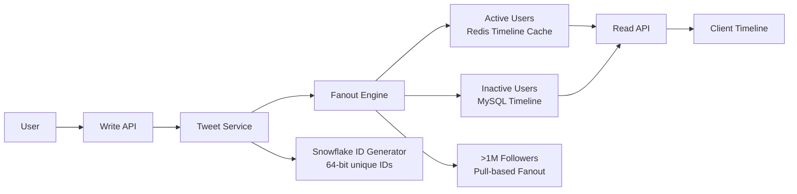

# Twitter/X Architecture

## Overview
Twitter handles 500M+ tweets/day, 6K+ tweets/second peak, with a fanout-based timeline delivery system.



## Architecture

```
Tweet ──► Write API ──► Tweet Service ──► Timeline Service
                                      │
                                 Fanout Engine
                                 │         │
                            ┌─────┘         └─────┐
                            ▼                     ▼
                     Active Users'         Inactive Users'
                     Timeline (Redis)      Timeline (MySQL)
                            │                     │
                            └──────────┬──────────┘
                                       ▼
                                  Read API
                                       │
                                       ▼
                                    Client
```

## Key Lessons

| Lesson | Detail |
|--------|--------|
| **Fanout-on-write** | Write tweet → push to followers' timelines |
| **Hybrid fanout** | Celebrities don't fanout (pull instead) |
| **Redis clusters** | Timeline cache for active users |
| **Snowflake IDs** | 64-bit unique ID generator |
| **Manhattan** | Distributed key-value store (replacing Cassandra) |

## Interview Questions
1. How does Twitter's fanout service work?
2. How does Twitter handle celebrity accounts (millions of followers)?
3. How does Twitter's trending topics algorithm work?
4. What's the Snowflake ID and why was it needed?
5. Design a simplified Twitter timeline system
