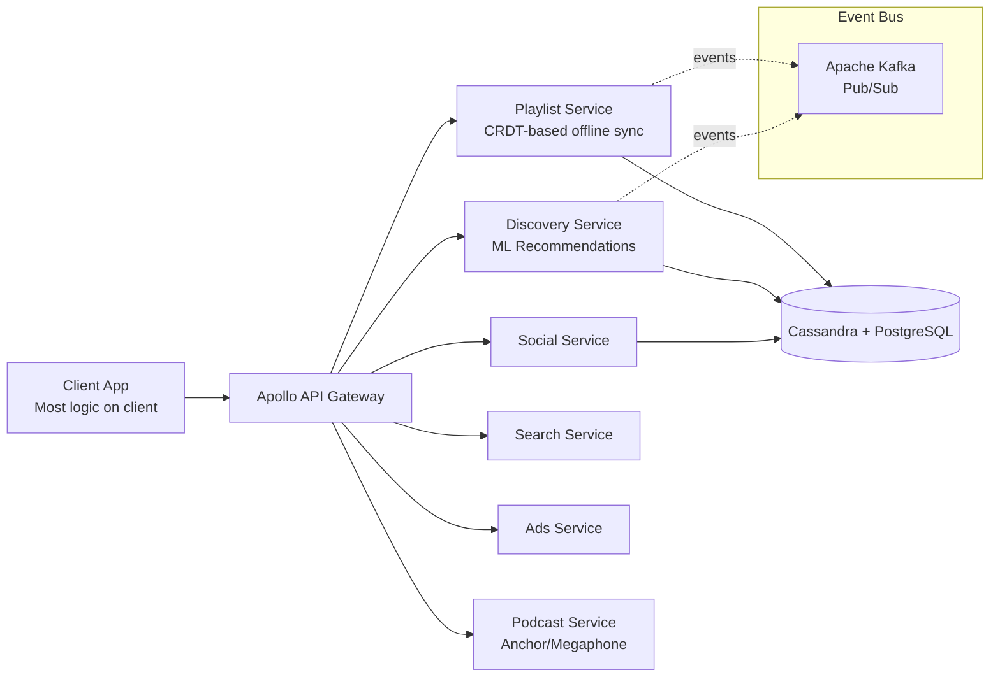

# Spotify Architecture

## Overview
Spotify serves 500M+ users with a backend composed of 1200+ microservices, emphasizing squad autonomy and event-driven communication.



## Architecture

```
Client ──► Apollo (API Gateway)
              │
         ┌────┴────┐
         │ Microservices │
         │ Playlist,      │
         │ Discovery,      │
         │ Social,         │
         │ Ads, Search    │
         └────┬────┘
              │
         ┌────┴────┐
         │ Storage  │
         │ Cassandra + │
         │ PostgreSQL  │
         └─────────┘
```

## Key Features

| Feature | Implementation |
|---------|---------------|
| **Music Discovery** | ML-based recommendations (collaborative filtering) |
| **Playlist Sync** | CRDT-based offline sync |
| **Podcast Hosting** | Anchor, Megaphone infrastructure |
| **Client-serving** | Most logic on client, backend for data |
| **Event-driven** | Apache Kafka, Pub/Sub |

## Interview Questions
1. How does Spotify's recommendation engine work?
2. How does Spotify handle offline music playback and sync?
3. How does Spotify's squad model influence architecture?
4. How does Spotify handle podcast ingestion at scale?
5. Design a simplified Spotify music streaming backend
