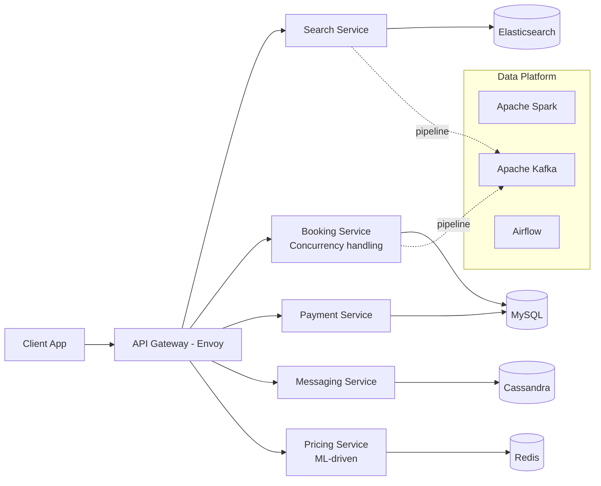

# Airbnb Architecture

## Overview
Airbnb serves millions of listings and bookings globally with a service-oriented architecture, emphasizing data infrastructure and search.



## Architecture

```
Client ──► API Gateway (Envoy)
              │
         ┌────┴────┐
         │ SOA Services │
         │ Search,       │
         │ Booking,      │
         │ Payment,      │
         │ Messaging,    │
         │ Pricing       │
         └────┬────┘
              │
         ┌────┴────┐
         │ Data     │
         │ Stores   │
         │ MySQL,    │
         │ Cassandra,│
         │ Redis,    │
         │ Spark,    │
         │ Kafka     │
         └─────────┘
```

## Key Lessons

| Lesson | Detail |
|--------|--------|
| **Search Infrastructure** | Elasticsearch for listing search |
| **Dynamic Pricing** | ML-driven pricing suggestions |
| **Microservices migration** | Monolith → SOA over years |
| **Data platform** | Spark, Airflow for data pipelines |
| **A/B testing** | Exp platform for experimentation |

## Interview Questions
1. How does Airbnb's search ranking work?
2. How does Airbnb handle booking concurrency (double-booking)?
3. How does Airbnb's dynamic pricing algorithm work?
4. How did Airbnb migrate from monolith to SOA?
5. Design a simplified Airbnb search and booking system
