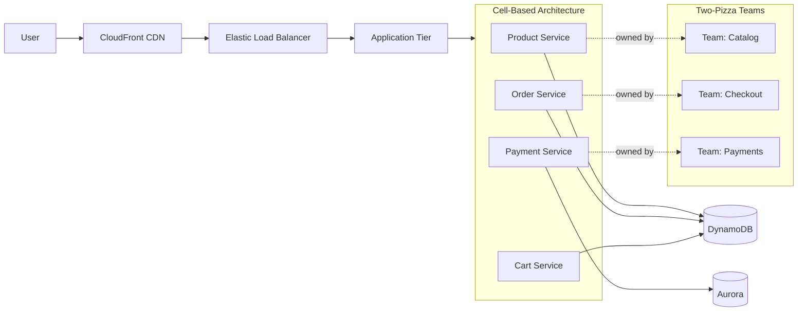

# Amazon Architecture

## Overview
Amazon's architecture is legendary for its "two-pizza team" model, API-first design, and cell-based architecture.



## Key Principles

| Principle | Impact |
|-----------|--------|
| **Two-pizza teams** | Small (<8), autonomous teams |
| **API-first** | Every team exposes APIs, no direct DB access |
| **Cell-based** | Isolated failure domains |
| **BUILDER culture** | Engineers own full lifecycle |
| **PR/FAQ** | Press release + FAQ for new features |

## Architecture

```
Client ──► CloudFront ──► ELB ──► Application Tier
                                        │
                                   ┌────┴────┐
                                   │ Service  │
                                   │ Tier     │
                                   │ ┌──────┐ │
                                   │ │Product│ │
                                   │ │Service│ │
                                   │ ├──────┤ │
                                   │ │Order  │ │
                                   │ │Service│ │
                                   │ ├──────┤ │
                                   │ │Payment│ │
                                   │ │Service│ │
                                   │ └──────┘ │
                                   └────┬────┘
                                        │
                                   ┌────┴────┐
                                   │ Database │
                                   │ (DynamoDB│
                                   │  Aurora) │
                                   └─────────┘
```

## Interview Questions
1. How did Amazon's "two-pizza team" model influence its architecture?
2. How does Amazon's cell-based architecture improve fault isolation?
3. How does Amazon handle product catalog at massive scale?
4. What is the PR/FAQ process and why does it work?
5. Design a simplified Amazon e-commerce system
