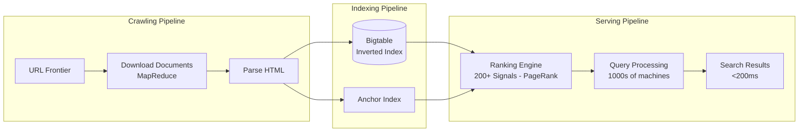

# Google Search Architecture

## Overview
Google processes 8.5B+ searches/day across billions of web pages, returning results in under 200ms.



## Architecture

```
Crawl ──► Index ──► Serving
  │          │         │
  ▼          ▼         ▼
URL Frontier  Bigtable   1000s of machines
  │          Inverted     │
  ▼          Index        ▼
Download     Doc Joint    Query
Documents    Store        Processing
  │                       │
  ▼                       ▼
Parse ---> Anchor ---> Ranking
HTML       Index       (200+ signals)
```

## Key Technologies

| Technology | Purpose |
|------------|---------|
| **MapReduce** | Distributed processing of web crawl |
| **Bigtable** | Column-oriented storage for index |
| **Pagerank** | Link analysis for ranking |
| **Spanner** | Globally consistent database |
| **Borg** | Cluster management (predecessor to K8s) |
| **Colossus** | Global file system (GFS v2) |

## Interview Questions
1. How does Google crawl and index the web?
2. How does PageRank algorithm work?
3. How does Google return search results in under 200ms?
4. How did MapReduce enable web-scale processing?
5. Design a simplified web search engine
