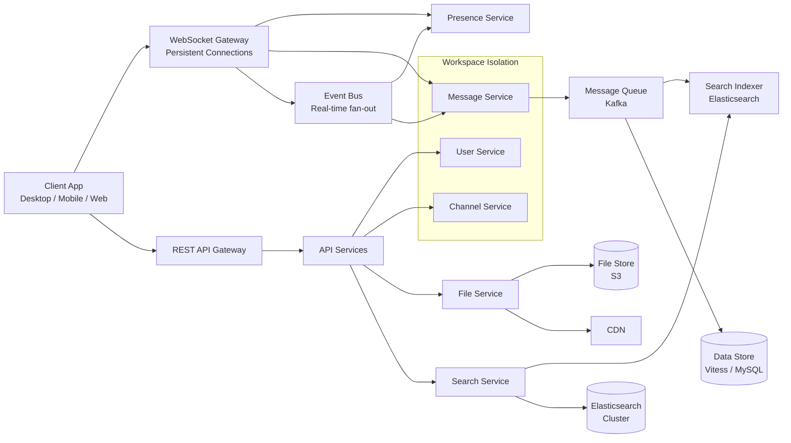

# Slack Architecture

## Overview
Slack serves 30M+ daily active users with a real-time messaging architecture rooted in its IRC heritage. It has evolved from a simple chat system to a platform supporting channels, threads, DMs, file sharing, and search across billions of messages.

## Architecture Diagram



## Tech Stack

| Component | Technology |
|-----------|------------|
| **Backend Language** | PHP (early), Java (Hack), custom C++ (client) |
| **Real-time Gateway** | Custom WebSocket Gateway (C++) |
| **Message Queue** | Apache Kafka |
| **Primary Database** | Vitess (MySQL-compatible sharding) |
| **Search** | Elasticsearch (billions of messages) |
| **File Storage** | Amazon S3 + CDN |
| **Cache** | Memcached |
| **Service Mesh** | Envoy |

## IRC Heritage and Evolution

Slack's architecture has deep roots in IRC (Internet Relay Chat):
- **Channel model**: Inspired by IRC channels, with `#channel` naming convention
- **Slack IRC Gateway**: Legacy IRC-to-Slack bridge allowed IRC clients to connect
- **Evolution from IRC**: Added message persistence (IRC was ephemeral), threading, file sharing, search, and rich embeds
- **Threads**: Introduced to reduce channel noise while maintaining context
- **Search**: IRC had no search; Slack built a search engine over billions of messages

## Channel Architecture

```
Workspace
  ├── Public Channels (#general, #random, ...)
  │   └── Threads (replies to a message)
  ├── Private Channels (invite-only)
  │   └── Threads
  ├── Multi-Party DMs (MPIMs)
  ├── Direct Messages (1:1)
  └── Slack Connect (cross-workspace channels)
```

- **Channel membership** stored in Vitess (MySQL sharded)
- **Last-read state** per user per channel for unread counts
- **Message history** partitioned by channel + time
- **Threads** modeled as parent message with replies stored separately

## Message Indexing and Search

```
Message Written
     │
     ▼
Message Service ──► Kafka (topic: messages)
                         │
                    ┌────┴────┐
                    │         │
                    ▼         ▼
               Data Store   Search Indexer
               (Vitess)     (Elasticsearch)
                               │
                               ▼
                         Search Service
                               │
                               ▼
                         Query Client
```

Search across billions of messages requires:

| Challenge | Solution |
|-----------|----------|
| **Indexing throughput** | Kafka ingestion with batch indexing into Elasticsearch |
| **Query latency** | Elasticsearch distributed query with shard routing |
| **Relevance ranking** | TF-IDF + recency boost + channel/author weighting |
| **Faceted search** | Filter by channel, date range, file type, author |
| **Cross-workspace isolation** | Index partitioned by workspace ID |

## File Storage and Sharing Infrastructure

```
File Upload
     │
     ▼
Client ──► REST API ──► File Service
                            │
                       ┌────┴────┐
                       │         │
                       ▼         ▼
                  S3 Bucket    Metadata DB
                  (objects)    (Vitess)
                       │
                       ▼
                  CDN (CloudFront)
                       │
                       ▼
                  Client Download
```

- **Previews** generated server-side (images, PDFs, videos)
- **Thumbnail pipeline** using lambda/workers
- **File types**: images, documents, code snippets, audio, video
- **Searchable text**: OCR for images, text extraction for PDFs/Docs
- **Access control**: workspace-scoped, channel-scoped permissions

## Scaling Challenges

| Challenge | Solution |
|-----------|----------|
| **Real-time fan-out** | WebSocket Gateway with event bus (pub/sub) |
| **Message persistence** | Vitess sharding by workspace + channel |
| **Search index size** | Elasticsearch with time-based indices + rollover |
| **File storage growth** | S3 lifecycle policies, CDN edge caching |
| **Workspace isolation** | Metadata and data isolation per workspace ID |
| **Network partitions** | Reconnection with idempotent message delivery |

## Workspace Isolation Model

Each workspace (Slack "team") operates in a mostly isolated environment:
- **Data isolation**: All queries filtered by `team_id`
- **Shard affinity**: Workspaces assigned to specific database shards
- **Rate limiting**: Per-workspace rate limits at the API gateway
- **Custom retention**: Per-workspace message retention policies
- **Guest accounts**: Single-workspace access vs multi-workspace users

## Lessons Learned

| Lesson | Detail |
|--------|--------|
| **IRC heritage limits** | Starting from IRC model required significant re-architecture for scale |
| **Threads add complexity** | Threads increase fan-out and indexing complexity 3x |
| **Search is hard at scale** | Searching billions of messages requires dedicated indexing infrastructure |
| **Workspace isolation is key** | Multi-tenant with strong isolation prevents noisy neighbors |
| **WebSocket reconnection** | Graceful reconnection with state reconciliation is critical |
| **Rate limiting everywhere** | Per-user, per-workspace, per-IP rate limiting prevents abuse |

## Interview Questions

1. How does Slack handle real-time message delivery across millions of concurrent connections?
2. How would you design search for a chat application with billions of messages?
3. How does Slack's channel architecture differ from IRC, and what challenges did threading introduce?
4. How does Slack manage workspace isolation in a multi-tenant architecture?
5. Design a file sharing and preview system similar to Slack's.
6. How does Slack handle presence detection and typing indicators at scale?
7. How would you implement Slack Connect (cross-workspace channels) securely?
