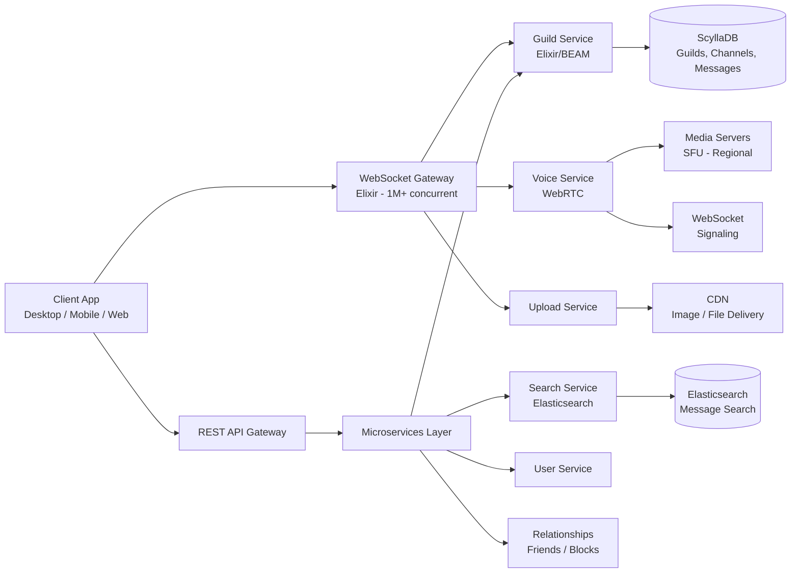

# Discord Architecture

## Overview
Discord serves 150M+ monthly active users with a real-time communication platform supporting voice, video, and text. Built on a microservices architecture with Elixir at its core for real-time guild communication and ScyllaDB for persistent storage.

## Architecture Diagram



## Tech Stack

| Component | Technology |
|-----------|------------|
| **Real-time Gateway** | Elixir (Erlang/BEAM) - custom WebSocket server |
| **Voice Engine** | WebRTC with adaptive bitrate, FEC, noise suppression |
| **Primary Database** | ScyllaDB (Cassandra-compatible) |
| **Search** | Elasticsearch |
| **Cache** | Redis |
| **Message Queue** | RabbitMQ + Kafka |
| **CDN** | Custom CDN partners |
| **Client** | React (Web), React Native (Mobile), Electron (Desktop) |

## Microservices Decomposition

```
API Gateway (REST + WebSocket)
     │
     ├── Guild Service (Elixir)
     │   ├── Channel management
     │   ├── Member management
     │   ├── Roles and permissions
     │   └── Real-time events
     │
     ├── Voice Service
     │   ├── WebRTC signaling
     │   ├── SFU media routing
     │   └── Regional media servers
     │
     ├── Upload Service
     │   ├── File validation
     │   ├── Image processing (thumbnails)
     │   └── Virus scanning
     │
     ├── API Service
     │   ├── REST endpoints
     │   ├── Rate limiting
     │   └── Authentication
     │
     ├── Gateway Service (Elixir)
     │   ├── WebSocket connection management
     │   ├── Session management
     │   └── Event routing
     │
     └── Search Service
         ├── Message indexing
         ├── Full-text search
         └── Query routing
```

## Voice / WebRTC Infrastructure

```
Sender
  │
  ├── Audio Capture
  ├── Noise Suppression (RNNoise / Krisp)
  ├── Echo Cancellation (AEC)
  ├── Opus Encoding (adaptive bitrate)
  ├── FEC (Forward Error Correction)
  └── Packetization
       │
       ▼
  SFU (Selective Forwarding Unit)
       │
       ├── Simulcast (multiple quality layers)
       ├── Adaptive Bitrate (client reports)
       └── Packet routing
            │
            ▼
      Receivers (each client receives optimal stream)
```

**Voice Architecture:**

| Component | Detail |
|-----------|--------|
| **Codec** | Opus (variable bitrate 8-128 kbps) |
| **Adaptive Bitrate** | Client reports packet loss; server instructs bitrate change |
| **FEC** | Forward Error Correction recovers lost packets (1-20% loss tolerance) |
| **Noise Suppression** | RNNoise (early), Krisp AI (current) for background noise removal |
| **Echo Cancellation** | WebRTC Acoustic Echo Canceller (AEC) |
| **SFU architecture** | Selective Forwarding Unit - each client sends one stream, SFU relays to all others |
| **Regions** | 14+ media regions globally with automatic failover |

## Elixir-Based Guild Services

Discord chose Elixir (Erlang/BEAM) for guild services because:
- **BEAM processes**: Each guild channel gets lightweight process isolation
- **Hot code reloading**: Update services without disconnecting users
- **Supervision trees**: Automatic fault recovery
- **Millions of connections**: Single server handles 1M+ WebSocket connections
- **Message ordering**: Process-per-channel guarantees message ordering

```elixir
# Conceptual guild process structure
Supervisor
  ├── GuildSupervisor
  │   ├── GuildChannel processes (one per channel)
  │   ├── GuildMember processes (one per member)
  │   └── GuildVoice processes (one per voice channel)
  ├── ConnectionSupervisor
  │   └── WebSocket processes (one per connection)
  └── PresenceSupervisor
      └── PresenceTracker (ETS-based)
```

## ScyllaDB for Data Storage

Discord migrated from Cassandra to ScyllaDB (C++ rewrite, Cassandra-compatible):

| Factor | Cassandra | ScyllaDB |
|--------|-----------|----------|
| **Garbage Collection** | Java GC pauses (up to 10s) | No GC (C++) |
| **P99 Latency** | 40-80ms | 10-20ms |
| **Node density** | 300+ nodes | ~70 nodes (4x density) |
| **Operations** | Manual repair heavy | Automatic repair |
| **Throughput** | Limited by JVM heap | Near bare-metal |

**Data model highlights:**
- **Messages** partitioned by `(channel_id, message_id)` with clustering on `message_id`
- **Guilds** stored with all metadata in a single partition
- **Voice states** ephemeral, stored in Redis
- **Presence** ephemeral, stored in Redis

## REST vs WebSocket Gateway

| Feature | REST API | WebSocket Gateway |
|---------|----------|-------------------|
| **Use case** | CRUD operations, history fetch | Real-time events, messaging |
| **Connection** | HTTP request/response | Persistent WebSocket |
| **Scaling** | Stateless, auto-scale | Stateful, session affinity |
| **Rate limiting** | Per-route, per-user | Per-connection, per-event |
| **Event delivery** | Polling | Push-based |

**Client reconnection strategy:**
1. WebSocket disconnects
2. Client sends `Resume` with session ID
3. Gateway replays missed events from buffer
4. If resume fails, full re-connect with state fetch

## Scaling Challenges

| Challenge | Solution |
|-----------|----------|
| **Real-time fan-out** | Elixir processes + Redis Pub/Sub for cross-server events |
| **Voice latency** | 14+ media regions, adaptive bitrate, FEC |
| **Database latency** | Migration Cassandra -> ScyllaDB (10x P99 improvement) |
| **Search indexing** | Elasticsearch with partitioned indices per guild |
| **File uploads** | CDN with regional upload endpoints |
| **Global presence** | Presence sharded by guild ID across Redis clusters |

## Lessons Learned

| Lesson | Detail |
|--------|--------|
| **Elixir for real-time** | BEAM's process model is ideal for chat at scale |
| **ScyllaDB over Cassandra** | Eliminated GC pauses, reduced ops overhead |
| **SFU over MCU** | Selective forwarding scales better for group calls |
| **Gateway versioning** | API versioning prevents client breakage |
| **Noise suppression matters** | Krisp AI integration dramatically improved voice quality |
| **Rate limit by design** | Rate limiting built into gateway protocol from day one |

## Interview Questions

1. Why did Discord choose Elixir for their real-time gateway and guild services?
2. How does Discord's WebRTC-based voice system work with adaptive bitrate and FEC?
3. Why did Discord migrate from Cassandra to ScyllaDB? What problems did it solve?
4. How does Discord handle REST vs WebSocket for different operations?
5. Design a voice channel system that supports 100+ participants.
6. How does Discord implement message search across millions of channels?
7. How does Discord handle presence detection and online status at scale?
