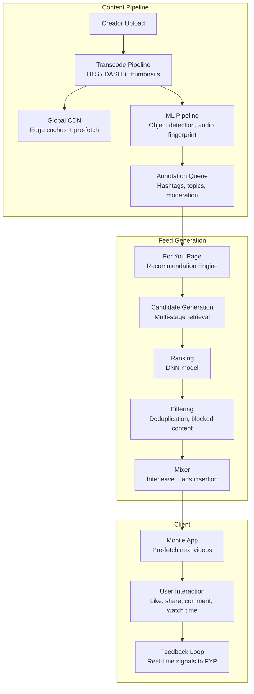

# TikTok Architecture

## Overview

TikTok serves 1B+ monthly active users with short-form vertical videos. Its success hinges on the For You recommendation algorithm, a globally distributed infrastructure, and a content pipeline optimized for viral distribution.



## For You Recommendation Algorithm

```
Multi-stage recommendation pipeline:

Stage 1: Candidate Generation (10K → 500)
  - User-based CF: "Users who liked this also liked..."
  - Item-based CF: Video co-view matrix
  - Geo-popular: Trending in region
  - Following: Creators user follows
  - Explore: Fresh content with exploration bonus

Stage 2: Ranking (500 → 50)
  - Deep neural network with features:
    * User features: watch history, likes, shares, comments
    * Video features: creator, hashtag, audio, effects
    * Context features: time of day, device, network
  - Training target: completion rate + weighted user actions
  - Real-time inference on TensorFlow Serving

Stage 3: Filtering (50 → ~20)
  - Remove seen content (watch history dedup)
  - Remove blocked/NSFW content
  - Apply diversity rules (no same creator in a row)
  - Apply freshness rules

Stage 4: Mixing
  - Interleave organic + ads + live streams
  - Apply position bias correction
```

## Feed Generation Flow

```
User opens app ──► FYP request with user_id + session_id
  │
  ├── 1. Retrieve user profile (real-time features)
  │     - Recent interactions (last 100)
  │     - Long-term preference vector
  │     - Session context (time, location)
  │
  ├── 2. Candidate retrieval (multi-index)
  │     ├── Annoy/FAISS index (embedding-based)
  │     ├── Redis sorted sets (trending)
  │     └── Cassandra (social graph)
  │
  ├── 3. DNN ranking
  │     ├── Wide & Deep model
  │     ├── Feature engineering (on-the-fly)
  │     └── 10ms inference target
  │
  ├── 4. Policy application
  │     ├── Dedup against feed history
  │     ├── Diversity constraints
  │     └── Safety filter (blocked content)
  │
  └── 5. Return top N + pre-fetch next N
```

## Content Moderation

```
Moderation Pipeline:

Upload ──► Pre-moderation (automated)
  ├── Hash matching (CSAM, known violations)
  ├── OCR text detection (hate speech, scams)
  ├── Object detection (weapons, violence)
  ├── Audio fingerprint (copyright, hate speech)
  └── Metadata analysis (location, age restrictions)

Pass ──► Human review qualification
  ├── High-risk content → priority review queue
  ├── Borderline → sampled review
  └── Clear pass → publish immediately

Fail ──► Reject / Flag for review
  └── Appeals process
```

## Global Infrastructure

```
Region            Edge CDN            Data Centers
North America     AWS + Cloudflare     Virginia, Oregon
Europe            GCP + Fastly         Frankfurt, London, Paris
Southeast Asia    Alibaba Cloud        Singapore, Jakarta, Tokyo
South Asia        AWS + Akamai         Mumbai, Chennai
Latin America     Cloudflare           São Paulo, Santiago

Storage strategy:
  - Video origin: HDFS / S3-compatible storage per region
  - Hot cache: Redis cluster per region (metadata, trending)
  - Cross-region replication: Async for catalog metadata
  - Content locality: Users see creator's region-first content

CDN optimizations:
  - Pre-fetch: Next video downloaded before current ends
  - Adaptive bitrate: Start with low-res, upgrade mid-stream
  - Edge compute: Thumbnail generation at edge
  - Connection pooling: Keep-alive to reduce handshake latency
```

## Engineering Lessons

| Lesson | Detail |
|--------|--------|
| **ML-driven feed** | The entire experience is algorithmically curated |
| **Video pre-fetch** | Pre-load next videos eliminates buffering for seamless scroll |
| **Regional isolation** | Each region operates independently for compliance + latency |
| **Content moderation** | Automated + human review at upload speed (videos/sec) |
| **Experimentation** | A/B test every algorithm change on 1% traffic |
| **ByteDance infrastructure** | Proprietary system built for global scale from day one |

## Interview Questions

1. How does TikTok's For You recommendation algorithm work end-to-end?
2. How does TikTok handle video transcoding at 1B+ users scale?
3. How does the content moderation pipeline work at TikTok's volume?
4. Design a short-form video recommendation system with personalization.
5. How does TikTok optimize video delivery across global regions?
