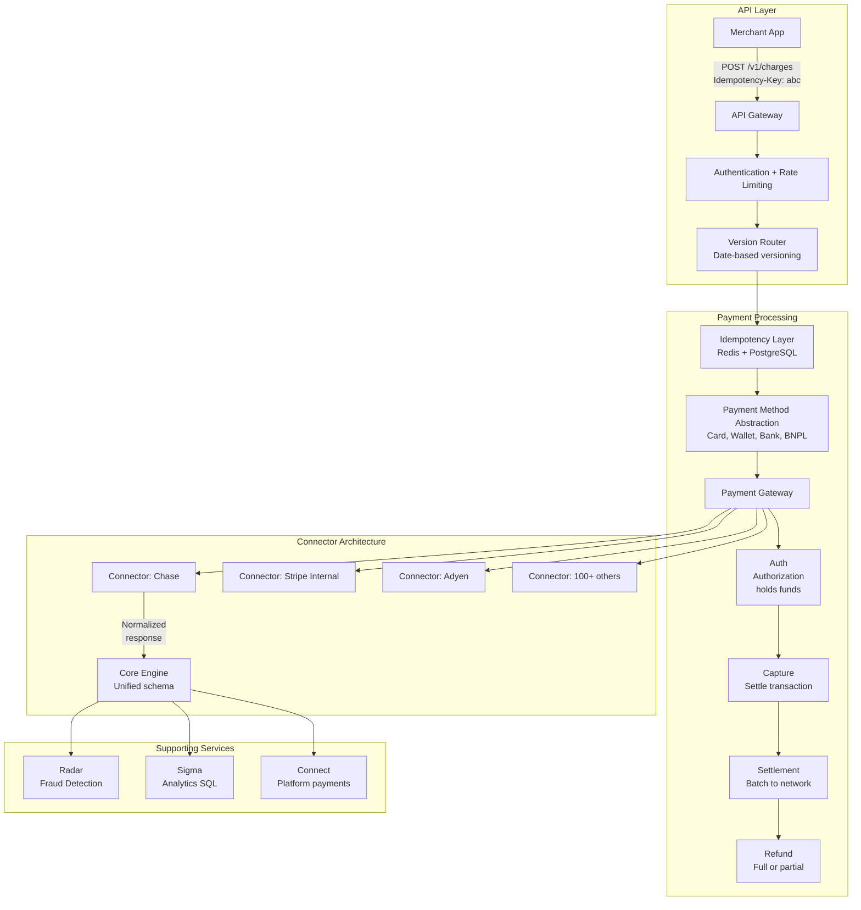

# Stripe Architecture

## Overview

Stripe provides payment infrastructure for millions of businesses globally. Its architecture is built on idempotency, API versioning, and a connector-based payment gateway that abstracts dozens of payment methods and acquiring banks.



## Idempotency Design

```
Idempotency ensures that retrying an API request doesn't create duplicate charges.

Implementation:
  Client sends:   POST /v1/charges
                  Idempotency-Key: unique_request_id_123

  Server flow:
    1. Check Redis for key "idempotent:unique_request_id_123"
    2. If exists → return cached response (same status code)
    3. If not → process, store (key → response, TTL 24h)
    4. Return response

Key properties:
  - Idempotency key must be unique per request (UUID v4)
  - Same key + different params → 422 error
  - TTL covers retry window (network timeouts, client retries)
  - Idempotency survives server restart (backed by PostgreSQL)

Storage schema:
  idempotency_keys (
    idempotency_key VARCHAR(255) PRIMARY KEY,
    request_hash TEXT,
    response_body JSONB,
    response_code INT,
    created_at TIMESTAMP DEFAULT NOW(),
    INDEX idx_created_at (created_at)
  )
  Partitioned by month, auto-expire > 30 days
```

## API Versioning (Date-Based)

```
Stripe uses date-based versioning (/v1/ + version header).

Version format: YYYY-MM-DD (e.g., 2023-10-16)

Request flow:
  1. Client sends request with Stripe-Version header
  2. API Gateway routes to version handler
  3. Stripe-Version determines which API behavior applies
  4. Response includes Stripe-Version header

Version lifecycle:
  - New version every time behavior changes (multiple/month)
  - Old versions supported indefinitely (no forced upgrade)
  - Version pinned at account level (can override per-request)
  - Version upgrade simulated in dashboard (test mode)

Why date-based over semver:
  - Linear, unambiguous ordering
  - Every change is tracked to a date
  - Easy to reason about "upgrade from 2020-01-01 to 2023-10-16"
  - No breaking change categorization debates

Upgrade workflow:
  1. Dashboard shows pending version upgrades
  2. Developer upgrades test mode, runs test suite
  3. Validates in staging with version override
  4. Upgrades account version in production
```

## Payment Gateway (Auth/Capture/Settlement/Refund)

```
┌─────────────────────────────────────────────────────────────┐
│                    Payment Flow                              │
├─────────────────────────────────────────────────────────────┤
│                                                              │
│  1. Authorization                                           │
│     - Validate card details (Luhn, expiration, CVC)        │
│     - Contact issuing bank for hold authorization          │
│     - Response: auth_code, avs_result, cvv_result          │
│     - Long-lived auth (7-30 days depending on card brand)  │
│                                                              │
│  2. Capture                                                │
│     - Settle an authorized transaction                      │
│     - Final amount may differ from auth (tips, adjustments)│
│     - Partial capture supported (e.g., ship partial order) │
│     - Must happen before auth expires                       │
│                                                              │
│  3. Settlement                                             │
│     - Batch settlement to card networks (daily)             │
│     - Reconciliation between Stripe's books and banks      │
│     - Settlement lag: 1-3 business days                     │
│                                                              │
│  4. Refund                                                 │
│     - Full or partial refund of captured charge             │
│     - Immediate reversal if not yet settled                 │
│     - Bank transfer initiated if already settled            │
│     - Refund ID idempotent to prevent duplicates            │
│                                                              │
└─────────────────────────────────────────────────────────────┘
```

## Fraud Detection (Radar)

```
Radar uses ML to score every transaction in real-time.

Features:
  - Card fingerprint (velocity, geographic mismatch)
  - Shipping address (high-risk PO boxes, mismatch)
  - Email domain (disposable domains)
  - IP geolocation (proxy/VPN detection)
  - Device fingerprint (browser, cookies)
  - Historical chargeback patterns

Scoring:
  Score 0-100 (higher = more likely fraud)
  0-50:    Pass
  51-75:   Review (3DS challenge)
  76-100:  Block

Custom rules:
  block if: card.country != ip.country
  review if: amount > $1000 AND shipping.distance > 500 miles
  block if: email.domain in @disposable_email_providers
```

## Connector Architecture

```
Each acquiring bank has different APIs, protocols, and data formats.

Connector abstraction:
  ┌──────────────────────────────────────────────────┐
  │                 Core Payment Engine               │
  │  Normalized request: amount, currency, card, id  │
  └────┬──────┬──────┬──────┬──────┬─────────────────┘
       │      │      │      │      │
  ┌────┴┐ ┌───┴──┐ ┌─┴───┐ ┌┴───┐ ┌┴──────┐
  │Chase│ │Adyen│ │BAML │ │JPM │ │100+  │
  │     │ │     │ │     │ │    │ │more  │
  └─────┘ └─────┘ └─────┘ └────┘ └──────┘

Each connector:
  - Implements standardized interface (auth, capture, refund, void)
  - Handles protocol differences (XML, JSON, ISO 8583)
  - Maps error codes to normalized errors
  - Manages bank-specific retry logic and timeouts
  - Provides health checks for circuit breaking

Connector health:
  If a connector returns > 10% errors in 5 min → circuit open
  Circuit retry after 30 seconds (half-open)
  After success → close circuit
```

## Engineering Lessons

| Lesson | Detail |
|--------|--------|
| **Idempotency-first design** | Every mutation is idempotent; retries are safe |
| **Date-based versioning** | Never break clients; support old versions indefinitely |
| **Connector pattern** | Abstract each bank behind a normalized interface |
| **Real-time ML fraud** | Score every transaction in < 50ms |
| **Idempotency at the API** | Prevents duplicate charges even on network failures |
| **Developer experience** | Clear docs, test mode, version upgrade simulations |

## Interview Questions

1. How does Stripe's idempotency layer prevent duplicate payments?
2. Why does Stripe use date-based API versioning instead of semver?
3. How does the connector architecture abstract different payment processors?
4. How does Stripe Radar detect and prevent fraud in real-time?
5. Design a payment system with auth, capture, settlement, and refund flows.
