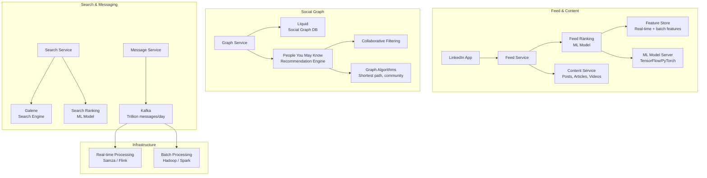

# LinkedIn Architecture

## Overview

LinkedIn serves 1B+ members with professional networking, content feeds, jobs, and messaging. Its architecture evolved from a monolithic Rails app to a federated microservices platform powered by Kafka, Espresso (its own NoSQL DB), and custom ML infrastructure.



## Feed Ranking (ML)

```
Multi-stage feed ranking pipeline:

Stage 1: Candidate Retrieval (1000+ posts)
  - Social connections (following)
  - Content affinity (liked similar content)
  - Sponsored content (ad pool)
  - Trending in network

Stage 2: Lightweight Scoring (100 posts)
  - Real-time features: recency, connection strength
  - Simple model (logistic regression) for filtering
  - 5ms per candidate

Stage 3: Deep Ranking (50 posts)
  - Dense DNN with:
    * Member features: seniority, industry, engagement history
    * Post features: type (article, video, poll), topic, length
    * Actor features: poster's network distance, posting frequency
    * Context features: time of day, device, session depth
  - Multi-objective: relevance + engagement + diversity
  - Inference: 50ms per batch of 50

Stage 4: Policy Application
  - Diversity: max 2 posts from same author
  - Deduplication: remove seen content
  - Content moderation filter

Stage 5: Ranking for UX
  - Position bias correction
  - Interleave with ads (ads every 5-7 organic posts)
  - Pre-fetch next batch
```

## Kafka at Trillion Messages/Day

```
LinkedIn runs one of the world's largest Kafka deployments.

Scale metrics:
  Messages: 7+ trillion per day (peak)
  Topics:   Thousands
  Brokers:  Thousands across multiple clusters
  Partitions: Tens of thousands
  Throughput: 100s of GB/s

Key use cases:
  - Activity feed (like, share, comment events)
  - Member profile updates
  - Search indexing
  - Graph updates (connections, follows)
  - Analytics pipeline
  - Monitoring and metrics

Kafka architecture:
  - Multiple Kafka clusters (feed, graph, search, tracking)
  - MirrorMaker for cross-datacenter replication
  - Custom partition assignment for locality
  - Tiered storage (hot on SSD, cold on HDD)
  - Kafka Connect for DB integration

Processing frameworks:
  - Apache Samza (LinkedIn-originated): Stream processing
  - Apache Flink: Event-time analytics
  - Kafka Streams: Lightweight stateful processing
```

## Graph Database (LIquid)

```
LIquid is LinkedIn's custom social graph database.

Why custom? No off-the-shelf graph DB could handle:
  - 1B+ members with 100B+ connections
  - Real-time read/write (add connection → visible in 500ms)
  - Complex traversals (2nd/3rd degree connections)
  - Consistency across datacenters

Data model:
  Vertex:  member (member_id, attributes)
  Edge:    connection (member_id_1, member_id_2, type, created_at)
  Edge:    follow (member_id_1, member_id_2, created_at)
  Edge:    follow_company (member_id, company_id, created_at)

Storage:
  - Partitioned by source member ID
  - Edges stored as adjacency lists (compressed)
  - In-memory cache for hot members (recently active)

Query patterns:
  Get 2nd degree connections:  O(avg_connections^2)
  Common connections:          Set intersect on adjacency lists
  Connection distance:         BFS/DFS with depth limit
```

## People You May Know (PYMK)

```
PYMK recommendation algorithm:

Data sources:
  - Shared connections (mutual connections count)
  - Same company (current or past)
  - Same school
  - Same industry + function
  - Same groups
  - Viewed profile (recent interactions)
  - Imported contacts (email sync)

Algorithm:
  For each member, score candidates:

  score(member_a, candidate_b) =
    w1 * mutual_connections_normalized +
    w2 * same_company_boost +
    w3 * same_school_boost +
    w4 * industry_similarity +
    w5 * recency_interaction +
    w6 * network_distance_penalty

  Weights (w1..w6) tuned via A/B testing.

Filters:
  - Already connected
  - Blocked member
  - Connection request pending
  - Privacy settings (no suggestions)

Serving:
  - Pre-computed offline (nightly batch, Spark)
  - Real-time updates (recent profile views → boost)
  - Candidate pool: 500 → top 10 via ranking model
```

## Search (Galene)

```
Galene is LinkedIn's custom search engine.

Architecture:
  - Inverted index per document type (people, jobs, companies, posts)
  - Real-time indexing within seconds
  - Sharded by document ID across search nodes

Search types:
  People:     name, title, company, school, location, skills
  Jobs:       title, company, location, description
  Companies:  name, industry, size
  Posts:      content, hashtag, author

Ranking signals:
  - Text relevance (BM25F)
  - Profile completeness score
  - Connection strength (1st degree > 2nd degree)
  - Recency (posts, jobs)
  - Premium/sponsored boost

Relevance tuning:
  - Queries with location: boost geo-relevance
  - Recruiter queries: boost seniority, active candidates
  - Member search: boost shared connections
```

## Engineering Lessons

| Lesson | Detail |
|--------|--------|
| **Custom infrastructure** | At LinkedIn's scale, off-the-shelf solutions don't work |
| **Kafka as backbone** | Streaming platform for all async data movement |
| **Multi-objective ranking** | Feed model optimizes relevance, diversity, and engagement |
| **Hybrid processing** | Batch (offline) + real-time (online) recommender systems |
| **LIquid graph DB** | Custom graph DB for 100B+ connections at low latency |
| **A/B testing culture** | Every feed, search, and recommendation change is tested |

## Interview Questions

1. How does LinkedIn rank posts in the feed using ML?
2. How does LinkedIn's social graph database (LIquid) work?
3. How does LinkedIn handle 7+ trillion Kafka messages per day?
4. Design the "People You May Know" recommendation system.
5. How does LinkedIn's search ranking differ from Google's web search?
