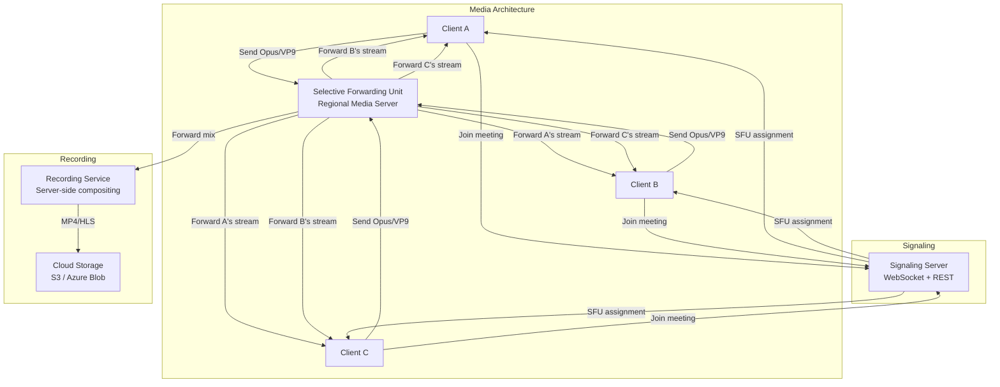

# Zoom Architecture

## Overview

Zoom provides real-time video conferencing for 300M+ daily meeting participants. Its architecture is built on a custom WebRTC media stack with Selective Forwarding Units (SFUs), supporting everything from 1:1 calls to 1000+ participant webinars with E2E encryption.



## WebRTC Media Stack

```
Zoom's WebRTC-based stack:

┌─────────────┐  ┌──────────────┐  ┌──────────────┐  ┌──────────────┐
│ Audio Codec  │  │ Video Codec  │  │ Screen Share │  │ FEC/PLC     │
│ Opus 8-128   │  │ VP9 / H.264 │  │ H.264 + H.265│  │ Forward     │
│ kbps         │  │ adaptive res │  │ lossless     │  │ Error Corr  │
└─────────────┘  └──────────────┘  └──────────────┘  └──────────────┘
┌─────────────┐  ┌──────────────┐  ┌──────────────┐  ┌──────────────┐
│ Simulcast   │  │ Scalable     │  │ Jitter       │  │ Net EQ      │
│ 3 layers:   │  │ Video Coding │  │ Buffer       │  │ Adaptive    │
│ 180p, 360p, │  │ (SVC) for    │  │ Adaptive     │  │ Bitrate     │
│ 720p        │  │ conference   │  │ size         │  │ Adjustment  │
└─────────────┘  └──────────────┘  └──────────────┘  └──────────────┘
```

## SFU Architecture

```
Zoom uses Selective Forwarding Units (SFUs) rather than MCU (Multipoint Control Unit).

SFU (Zoom):
  - Each client sends one stream
  - SFU forwards streams to meeting participants
  - Simulcast: client sends 3 quality layers, receiver picks best
  - CPU: Low (no transcoding)
  - Bandwidth: O(n) → sends to all participants

MCU (legacy, used by older solutions):
  - Clients send, MCU decodes, mixes, re-encodes
  - All clients receive one mixed stream
  - CPU: Very high (transcoding for all)
  - Bandwidth: O(1) → one stream to all participants

Why Zoom uses SFU:
  - Scales to hundreds of participants per meeting
  - Lower latency (no decode/encode cycle)
  - Simulcast adapts to each receiver's bandwidth
  - Server CPU cost is 10x less than MCU

Active Speaker Detection:
  - Client-side: Each client detects audio energy
  - Server-side: SFU selects N highest-energy speakers
  - Forward active speaker feeds only to save bandwidth
  - Screen share: automatically becomes primary feed
```

## Simulcast

```
Simulcast layers for video:

Layer 0 (Low):   180p @ 15fps,  100 kbps
Layer 1 (Medium): 360p @ 30fps,  500 kbps
Layer 2 (High):   720p @ 30fps, 1.5 mbps

Client behavior:
  - Encodes all 3 layers locally
  - Sends all 3 to SFU
  - SFU forwards selected layer based on receiver

Receiver behavior:
  - Requests quality based on:
    * Display size (thumbnail vs full screen)
    * Available bandwidth (network congestion)
    * CPU capacity (decode capability)

Dynamic adaptation:
  - Intermittent network: drop to Layer 0
  - Tile view (gallery): request Layer 0 for non-speakers
  - Speaker view: request Layer 2 for active speaker
  - Screen sharing: prioritize high res over video
```

## Recording Pipeline

```
Recording flow:

Meeting Streams
│
├── SFU → Recording Service
│   ├── Receive all participant feeds
│   ├── Composite layout (speaker + gallery)
│   ├── Mix audio channels
│   └── Output: MP4 with timed metadata (chat, polls)
│
├── Cloud Recording
│   ├── Real-time upload during meeting
│   ├── Transcode to HLS for streaming
│   ├── Generate transcript (speech-to-text)
│   └── Store in customer cloud (S3, Azure, GCS)
│
└── Local Recording
    ├── Client-side encoding
    ├── Layout determined by client
    └── Saved locally after meeting ends

Recording formats:
  - Audio only: M4A
  - Video: MP4 (H.264 + AAC)
  - Transcript: VTT (WebVTT)
  - Chat log: JSON
  - Poll/Quiz results: JSON
```

## Breakout Rooms

```
Breakout room architecture:

Primary Meeting ──► Breakout Room 1
                  │  ├── Participants A, B, C
                  │  └── Separate SFU instance
                  │
                  ├── Breakout Room 2
                  │  ├── Participants D, E, F
                  │  └── Separate SFU instance
                  │
                  └── Breakout Room N...

Join mechanism:
  1. Host creates breakout rooms (N rooms, assign participants)
  2. Participants get new SFU endpoint + room token
  3. Media flows to room-specific SFU
  4. Host can broadcast to all rooms (audio + text)
  5. Time limit warning → auto-close → return to main room

Cross-room features:
  - Host can move between rooms
  - Request help (host notified, joins room)
  - Timer broadcast (5 min remaining)
```

## E2E Encryption

```
Zoom's E2E encryption (since 2020):

Key agreement:
  - Each participant generates ECDH key pair
  - Public keys exchanged via signaling channel
  - Shared secret derived per participant pair
  - Media encryption with AES-GCM using shared secret

What's E2E encrypted:
  - Video streams
  - Audio streams
  - Screen sharing
  - Chat (in-meeting)

What's NOT E2E encrypted:
  - Phone dial-in (PSTN gateway)
  - Cloud recording (needs server access)
  - Breakout room assignment metadata
  - Non-participant joining via web client pre-E2E

Key management:
  - Each meeting generates unique key set
  - Keys derived per participant (no single point of compromise)
  - Cryptographic verification code displayed to participants
  - Security icon indicates E2EE status
```

## 300M+ Participant Scale

```
Global infrastructure:
  - 100+ points of presence (PoPs)
  - Regional SFU clusters (auto-scale with demand)
  - DNS-based routing to nearest PoP
  - Anycast for signaling endpoints

Capacity per meeting:
  1:1 calls:        Standard (no special limits)
  Group meetings:   Up to 1,000 video participants
  Webinars:         Up to 50,000 view-only + 100 panelists
  Large meetings:   Up to 500 interactive participants

Scaling strategy:
  - SFU per meeting instance (isolated failure domain)
  - Multiple SFU nodes per large meeting (sharding)
  - View-only participants use HTTP streaming (not WebRTC)
  - Active speaker detection reduces forwarded streams
```

## Engineering Lessons

| Lesson | Detail |
|--------|--------|
| **SFU over MCU** | SFU scales to hundreds of participants per meeting |
| **Simulcast** | Multiple quality layers adapt to each receiver's bandwidth |
| **WebRTC foundation** | Standard protocol with custom server-side processing |
| **E2E encryption** | Cryptographic verification codes prevent MITM |
| **Global PoP network** | DNS anycast routes to nearest media server |
| **Cloud + local recording** | Flexible recording options for compliance + convenience |

## Interview Questions

1. How does Zoom's SFU architecture differ from MCU-based video conferencing?
2. How does simulcast work and why is it critical for large calls?
3. How does Zoom implement E2E encryption while maintaining recording capability?
4. Design a breakout room system that supports 100+ simultaneous rooms.
5. How does Zoom scale to handle 300M+ daily meeting participants?
