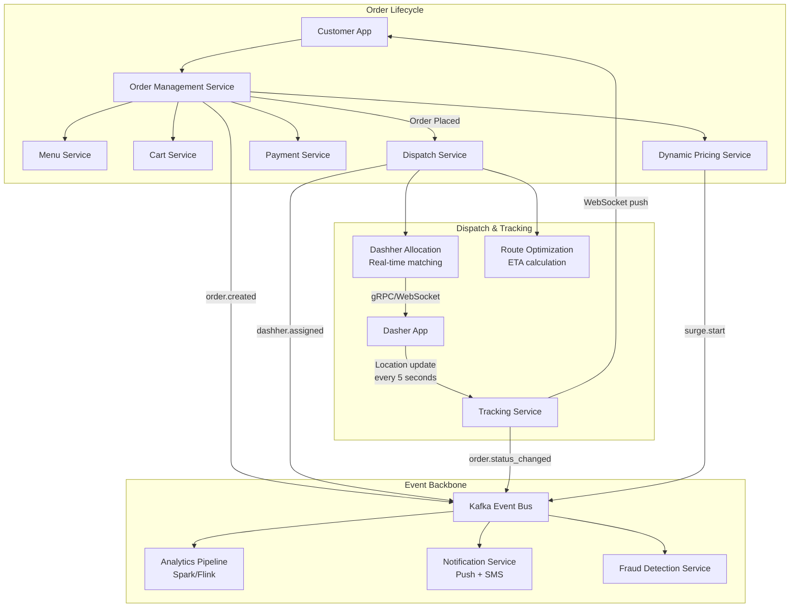

# DoorDash Architecture

## Overview

DoorDash is the largest food delivery platform in the US, processing millions of orders daily across thousands of cities. Its architecture is built around real-time order dispatch, dynamic pricing, and a Kafka event-driven backbone for order lifecycle management.



## Order Dispatch (Dasher Allocation)

```
Dispatch algorithm stages:

Stage 1: Feasibility Filter
  - Is dasher within service area of the restaurant?
  - Is dasher's current vehicle appropriate?
  - Is dasher in active/available status?
  - Remove blocked dashers, on-break, paused

Stage 2: Cost Scoring
  For each eligible dasher, compute:

  Score = w1 * dist_to_restaurant + 
          w2 * eta_to_restaurant +
          w3 * eta_to_customer +
          w4 * current_load_inverse +
          w5 * dasher_rating +
          w6 * direction_alignment +
          w7 * surge_multiplier

  w1-w7 weights tuned via ML on historical outcomes.

Stage 3: Offer Selection
  - Select top 1-3 dashers
  - Send offer via push notification (gRPC)
  - First to accept gets the order
  - Offer expires in 30 seconds
  - If all decline → re-score with remaining dashers

Stage 4: Dispatch Confirmation
  - Update order status: "dasher_assigned"
  - Push route info to dasher app
  - Notify customer with ETA
  - Emit dashher.assigned event to Kafka
```

## Real-Time Tracking (gRPC/WebSocket)

```
Tracking infrastructure:

Dasher App ──► gRPC stream (bidirectional)
  │              │
  │    ┌─────────┴─────────┐
  │    │   Tracking Service │
  │    │  - Location ingestion │
  │    │  - ETA calculation  │
  │    │  - Status broadcast  │
  │    └─────────┬─────────┘
  │              │
  │    ┌─────────┴─────────┐
  │    │  Redis Cluster    │
  │    │  - Dasher location │
  │    │  - Order status   │
  │    │  - Geohash index  │
  │    └───────────────────┘
  │
  ▼
Customer App ──► WebSocket connection
  - Receives real-time location pings
  - Receives status changes (picked up, en route, arrived)
  - ETA updated every 5 seconds

Protocol stack:
  - gRPC stream:       Dasher → Tracking Service (high throughput, low latency)
  - WebSocket:         Tracking Service → Customer (firewall-friendly)
  - Kafka:             Event persistence for analytics
```

## Dynamic Pricing

```
Surge pricing algorithm:

Demand factors:
  - Current order rate (orders per minute in zone)
  - Dasher availability (active dashers in zone)
  - Weather conditions (rain → +30% demand)
  - Time of day (lunch/dinner rush)
  - Special events (concerts, sports games)

Supply factors:
  - Active dasher count
  - Dasher distribution (are they near restaurants?)
  - Average dasher acceptance rate
  - Dasher shift start/end times

Price multiplier calculation:

  multiplier = base_price (1.0) × 
              demand_surge(demand/supply ratio) ×
              weather_multiplier ×
              event_multiplier

  surge_amount = (multiplier - 1.0) × delivery_fee
  dasher_earnings_increase = surge_amount × dasher_share_pct

Dynamic zones:
  - City partitioned into H3 hex grid (level 8, ~0.7km2)
  - Each zone independent surge multiplier
  - Recalculated every 2 minutes
  - Zones with low dasher density get higher surge

Impact:
  - 15-20% increase in dasher availability during peak
  - 10-15% reduction in delivery time during surge
```

## Kafka Event-Driven Architecture

```
Event Catalog:

Order lifecycle events:
  order.created                Order placed by customer
  order.cancelled              Customer cancelled
  order.modified               Items/address changed
  payment.authorized           Payment hold successful  
  payment.captured             Payment settled
  payment.failed               Payment declined

Dispatch events:
  dasher.eligible              Dasher matches order area
  dasher.offered               Offer sent to dasher
  dasher.accepted              Dasher accepted
  dasher.declined              Dasher declined
  dasher.arrived_at_restaurant
  dasher.picked_up
  dasher.en_route
  dasher.arrived
  dasher.delivered

Pricing events:
  surge.zone_changed            Zone multiplier updated
  promo.applied                 Promo code used
  promo.expired                 Promo ended

Processing topology:
  Event → Kafka Topic 
  → Kafka Streams (stateful processing)
  → Key-value store (RocksDB) 
  → Emit derived events
  → Elasticsearch (analytics)
```

## Data Architecture

```
┌──────────────┐     ┌──────────────┐     ┌──────────────┐
│ Transactional │     │  Analytics   │     │  Search +    │
│    DB         │     │  (read model)│     │  Reporting   │
├──────────────┤     ├──────────────┤     ├──────────────┤
│ PostgreSQL    │     │ Snowflake    │     │ Elasticsearch │
│ - Orders      │     │ - Aggregated  │     │ - Menu search │
│ - Payment     │     │   metrics    │     │ - Order lookup │
│ - Dasher Data │     │ - Business   │     │ - Dasher      │
│ - Customer    │     │   reports    │     │   performance │
└──────────────┘     └──────────────┘     └──────────────┘

┌──────────────┐     ┌──────────────┐
│   Cache      │     │  Time-Series │
├──────────────┤     ├──────────────┤
│ Redis Cluster│     │ Cassandra    │
│ - Session    │     │ - Dasher     │
│ - Menu cache │     │   location   │
│ - Dasher geo │     │   history    │
│   index      │     │ - Price      │
│ - Order      │     │   history    │
│   state      │     │ - ETA        │
└──────────────┘     │   logs       │
                     └──────────────┘
```

## Engineering Lessons

| Lesson | Detail |
|--------|--------|
| **Event-driven core** | Kafka as central nervous system for all order events |
| **Real-time dispatch** | gRPC + WebSocket for sub-second dasher coordination |
| **Dynamic pricing** | H3 grid-based surge pricing recalculates every 2 minutes |
| **H3 geospatial** | Hexagonal grid for efficient dasher-to-order matching |
| **Multi-model storage** | PostgreSQL, Redis, Cassandra, Snowflake each for their strength |
| **Progressive dispatch** | Top-3 dasher selection with 30-second offer expiry |

## Interview Questions

1. How does DoorDash match dashers to orders in real-time?
2. How does DoorDash's dynamic pricing model work at city scale?
3. How does DoorDash handle real-time order tracking with gRPC and WebSockets?
4. Design an event-driven order lifecycle using Kafka.
5. How would you optimize dasher routing for multiple concurrent orders?
