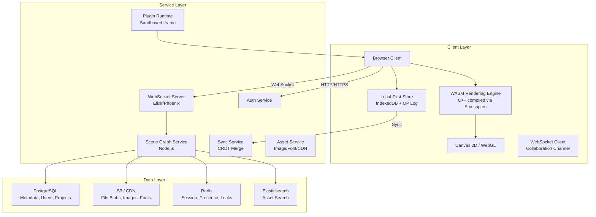
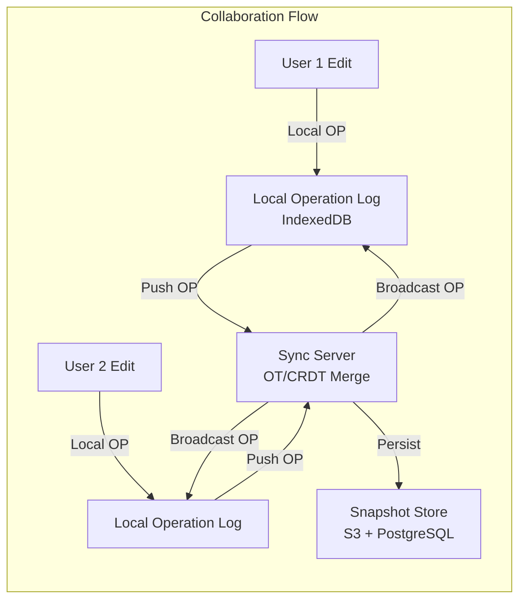
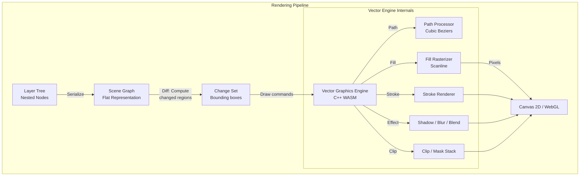
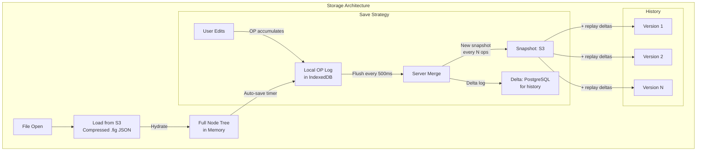

# 18-Figma Architecture

## Overview

Figma is a cloud-based collaborative interface design tool that brought real-time multi-player editing to the design world. Unlike traditional design tools (Sketch, Adobe XD) that relied on local file storage and manual sharing, Figma operates entirely in the browser with a local-first sync layer, WebSocket-based real-time collaboration, and a WebAssembly rendering engine that delivers near-native performance.



---

## What Is It

Figma is a real-time collaborative interface design tool that runs entirely in the browser. It supports vector editing, prototyping, design systems, developer handoff, and multi-user editing where dozens of designers work on the same file simultaneously. The platform serves millions of designers, developers, and product teams.

Key differentiating technical features:
- WebAssembly rendering engine (C++ compiled via Emscripten) for near-native performance
- CRDT-based collaboration that works without a central authoritative server
- Local-first architecture enabling offline edits that sync when reconnected
- A plugin system with sandboxed iframe execution
- Vector graphics pipeline with boolean operations, strokes, fills, effects

---

## Architecture Overview



---



---



---

## Deep Dives

### Real-Time Collaboration (CRDT)

Figma uses Conflict-free Replicated Data Types (CRDTs) to enable real-time multi-user editing without requiring a central server to arbitrate conflicts. This is similar to what Google Docs uses (OT) but CRDTs offer stronger guarantees for the tree-structured document model.

**Why CRDT over OT:**
- OT requires a central ordering server to sequence operations
- CRDTs are inherently decentralized — each client can merge independently
- Figma's tree structure (nodes with children, properties) maps naturally to CRDT semantics
- CRDTs handle the "fork-merge" scenario better (offline edits, reconnect)

**Figma's CRDT implementation details:**
- Each node in the document tree has a unique ID (UUID)
- Operations are idempotent — applying the same op twice produces the same result
- Operations carry vector clocks for causality tracking
- The merge function is commutative — order of merging doesn't matter
- Deleted nodes are tombstoned (marked deleted but not removed) to handle concurrent create/delete

**Collaboration protocol:**
```
1. Local edit → create operation (type, nodeId, property, value, timestamp)
2. Store operation in local IndexedDB log
3. Send operation to server via WebSocket
4. Server broadcasts to all other connected clients
5. Each client applies operation to local CRDT tree
6. Server persists operation to delta log
7. Periodic snapshot serialized and stored in S3
```

**Conflict resolution examples:**
- Two users move the same node: both moves apply; final position = last write wins (by vector clock)
- Two users edit different properties: both apply independently
- User A deletes a node while User B edits it: delete wins; edit is discarded
- User A moves node under Parent X, User B moves it under Parent Y: the operation with the later vector clock wins

**Presence and cursor sync:**
- Each user's cursor position broadcast as ephemeral messages (not persisted)
- Cursor positions include: x, y, zoom level, visible viewport
- Presence managed via Redis pub/sub with heartbeats every 5 seconds
- Online status: active, idle (no input for 30s), offline
- Selection state shared: "User A selected Layer 3" shown as colored highlight

---

### WebAssembly Rendering Engine

Figma's rendering engine is written in C++ and compiled to WebAssembly using Emscripten. This was a pivotal architectural decision that enabled near-native performance in the browser.

**Why C++ → WASM instead of JavaScript:**
- JavaScript's garbage collection causes frame drops during GC pauses
- C++ gives deterministic memory management with manual allocation
- SIMD instructions in WASM enable parallel pixel processing
- Existing C++ vector graphics libraries (Skia, Cairo) could be leveraged
- Faster path to production: 50+ person-years of C++ rendering code vs. rewriting in JS

**Rendering pipeline stages:**

1. **Scene graph construction:** The JS layer maintains a lightweight representation of the node tree. When changes occur, it serializes only the changed nodes into a compact binary format and transfers them to the WASM heap.

2. **Diff computation:** WASM compares the new scene graph with the previous frame's graph to compute the minimal set of regions that need redrawing. This is crucial — redrawing the entire canvas would be too slow for complex files.

3. **Vector path processing:**
   - Paths are represented as cubic Bezier curves
   - Boolean operations (union, subtract, intersect) computed using Greiner-Hormann algorithm
   - Path simplification via Ramer-Douglas-Peucker for performance

4. **Rasterization:**
   - Fills: scanline rasterization with anti-aliasing
   - Strokes: parallel stroke expansion + scanline fill
   - Gradients: bilinear interpolation of color stops
   - Images: bilinear/bicubic sampling with mipmaps

5. **Effects pipeline:**
   - Drop shadow: gaussian blur on alpha channel + offset + composite
   - Inner shadow: inverted blur
   - Blur: two-pass separable gaussian blur (horizontal + vertical)
   - Layer blur: blur entire layer then composite
   - Blend modes: multiply, screen, overlay, etc. via fragment shaders

6. **GPU compositing:**
   - Layers rendered to offscreen textures (WebGL)
   - Composited by GPU using fragment shaders
   - Transforms (rotate, scale) applied as matrix multiplications on GPU

**Memory management:**
- WASM heap pre-allocated at 64MB, grows as needed up to 512MB
- Object pool pattern: frequently allocated objects (paths, matrices) reuse pre-allocated slots
- Frame allocator: temporary allocations freed at end of each frame
- No garbage collection — all memory is explicitly managed

**Performance numbers:**
- 60fps rendering on 95th percentile of consumer hardware
- Frame budget: 16ms (60fps) → JS overhead ~2-3ms, WASM rendering ~8-10ms, GPU composite ~3-5ms
- Canvas repaint limited to dirty regions only (often <10% of total canvas area)

---

### Vector Graphics Pipeline

Figma's vector engine supports the full range of design operations:

**Path representation:**
```
Path {
  commands: [
    MoveTo(x, y),
    LineTo(x, y),
    CubicTo(cp1x, cp1y, cp2x, cp2y, x, y),
    ClosePath()
  ]
  winding_rule: EvenOdd | NonZero
}
```

**Boolean operations (unifying shapes):**
- Implemented via Vatti clipping algorithm
- Four operations: Union, Subtract, Intersect, Exclude
- Performance optimized by AABB (axis-aligned bounding box) early rejection
- O(n log n) average complexity where n = total path segments

**Stroke rendering:**
- Hairline strokes: 1px, rendered as scanlines
- Variable-width strokes: expanded to fill path + offset
- Dashed strokes: computed by walking path parameterization
- Stroke alignment: center, inside, outside (different path offsets)

**Fill types:**
- Solid: single color
- Linear gradient: two or more color stops along a line
- Radial gradient: color stops radiating from center
- Angular gradient: color stops around angle (conic)
- Image fill: texture mapped to path bounds
- Pattern fill: repeating image tile

**Blending and compositing:**
- Layers support CSS-level blend modes
- Group opacity: computed as post-composite alpha multiplication
- Masking: alpha mask via nested layer, clip path via SVG-style path
- Export: rasterization of selected bounds at given scale (1x, 2x, 3x)

---

### File Format (.fig)

Figma files are JSON-based documents stored compressed. The format is designed for efficient diffing, partial loading, and CRDT merging.

**File structure:**
```json
{
  "version": 124,
  "document": {
    "id": "root",
    "type": "DOCUMENT",
    "children": [{ "id": "page1", "type": "CANVAS", "children": [...] }]
  },
  "components": { "compId": { "key": "...", "name": "Button" } },
  "componentSets": { ... },
  "schemaVersion": 54,
  "mainComponentKey": null
}
```

**Node types:**
- DOCUMENT: root container
- CANVAS: a page within the document
- FRAME: named frame (like an artboard)
- GROUP: non-atomic group
- VECTOR: vector network (arbitrary paths)
- RECTANGLE, ELLIPSE, LINE, POLYGON, STAR: primitive shapes
- TEXT: rich text with OpenType features
- INSTANCE: component instance (linked to main component)
- COMPONENT: reusable component definition
- BOOLEAN_OPERATION: union/subtract/etc.

**Optimizations for performance:**
- Nodes loaded on demand — huge files don't block open
- Component instances store only overrides (diffs from main component)
- Arrays of similar objects (e.g., 1000 rectangles) packed as typed arrays in binary
- History stored as operations, not full snapshots
- Snapshot compressed via gzip/brotli; typically 80-90% smaller than raw JSON

---

### Local-First Architecture

Figma deeply embraces local-first principles for offline resilience and instant interactions.

**Local store (IndexedDB):**
- Full document tree cached locally after first load
- Operation log (append-only) captures all un-synced edits
- Asset cache (images, fonts) stored as blobs
- User preferences and workspace state

**Sync layer:**
```
Online flow:
  Local edit → log op → send via WebSocket → ack from server → mark op as synced

Offline flow:
  Local edit → log op → queue in IndexedDB → period reconnect check
  → on reconnect: send queued ops → server merges → return merged state

Conflict handling:
  - Server always has authoritative state
  - On reconnect, client sends all pending ops
  - Server applies CRDT merge for each op
  - Returns any ops client hasn't seen (from other users)
  - Client merges server ops into local tree
```

**Auto-save behavior:**
- Operations flushed to server every 500ms during active editing
- Full snapshot saved every N operations (adaptive: based on op count)
- On critical close: synchronous XHR save before allowed to close
- Recovery: on page load, replay local operation log on top of last server snapshot

---

### Plugin System Design

Figma's plugin system allows third-party developers to extend functionality. It's designed with security and performance as primary constraints.

**Architecture:**
- Plugins run in sandboxed iframes (separate origin, no DOM access)
- Communication via postMessage bridge
- Plugin API exposed as a limited set of methods
- UI rendered by plugin (HTML/CSS within sandbox), actions executed by Figma core

**Security model:**
```
┌─────────────────────┐     ┌─────────────────────┐
│   Figma Main Window │     │  Plugin Iframe       │
│                     │     │  (sandboxed origin)  │
│  ┌───────────────┐  │     │                      │
│  │  Plugin API   │◄─┼─────┼► figma.createRect()  │
│  │  (validated)  │  │     │  figma.currentPage   │
│  └───────────────┘  │     │  figma.viewport      │
│                     │     │                      │
│  ┌───────────────┐  │     │  ┌───────────────┐   │
│  │  Node Tree    │  │     │  │ Plugin UI     │   │
│  │  (protected)  │  │     │  │ (HTML/CSS/JS) │   │
│  └───────────────┘  │     │  └───────────────┘   │
└─────────────────────┘     └─────────────────────┘
```

**API surface:**
- Document: create/read/update/delete nodes
- Selection: query and observe selection changes
- Viewport: scroll, zoom, center on node
- UI: show modal, panel, notification
- Storage: plugin-scoped key-value store (100KB limit)
- Network: restricted fetch (CORS-limited)
- Export: export nodes to SVG, PNG, PDF

**Performance constraints:**
- Plugin execution limited to 30 seconds total CPU time
- Single plugin operation timeout: 5 seconds
- UI thread never blocked — all API calls return promises
- Plugins cannot access DOM, localStorage, or cookies of main window
- Network requests proxied through Figma's servers for rate limiting

**Plugin marketplace:**
- Hosted plugins distributed via Figma Community
- Automatic updates: plugins re-fetched on load if version changed
- Manual approval process for security review
- 500+ plugins available in marketplace

---

## Scaling Strategy

### Early Architecture (2012-2015)

- Monolithic Node.js server
- Single PostgreSQL database
- WebSocket via Socket.io on Node.js
- Files stored on local filesystem
- ~10K users

### Growth Phase (2015-2018)

- Frontend: React + WebGL (early WASM prototypes)
- Backend: Monolith → microservices breakdown
- WebSocket: Node.js → Elixir/Phoenix for massive concurrency
- Storage: Local FS → S3 + CloudFront CDN
- Database: PostgreSQL read replicas + connection pooling (PgBouncer)
- Cache: Redis for session, presence, document locks
- ~1M users

### Scale Phase (2018-2024)

- **WebSocket layer:** Elixir on BEAM handles 1M+ concurrent connections per cluster
- **Document service:** Horizontally scaled Node.js services, each responsible for a shard of documents
- **Asset CDN:** Images, fonts, and plugin assets served via CloudFront with edge caching
- **Database sharding:** Documents sharded across PostgreSQL instances by document ID hash
- **Snapshot storage:** S3 with intelligent prefix sharding (YYYY/MM/DD/HH/UUID)
- **CRDT at scale:** Documents auto-archive after 30 days of inactivity; cold load from S3 snapshot

### Performance Optimization

**Rendering:**
- Dirty region tracking: only repaint changed areas
- Layer culling: off-screen nodes not rendered
- Mipmapped images: smaller textures for zoomed-out views
- LOD (Level of Detail): simplified rendering at low zoom
- Text: glyph atlas for common characters; cache rasterized text tiles

**Network:**
- Binary protocol over WebSocket (MessagePack/Protocol Buffers)
- Operation batching: coalesce rapid edits into single message
- Delta compression: send only changed properties
- Asset preloading: predict which assets user will need next

**Loading:**
- Progressive loading: show low-res preview immediately, load full resolution on zoom
- Tree loading: render visible nodes first, lazy-load offscreen
- WASM binary: 2.5MB compressed; parsed once, cached via Service Worker

### Infrastructure Scale

- Documents: 100M+ stored
- Concurrent editors: 50+ on a single file
- WebSocket connections: 10M+ daily
- Operations per second: 500K+ during peak
- Plugin API calls: 100M+ per month
- Asset requests: 1B+ per month

---

## Key Metrics

| Metric | Value |
|--------|-------|
| Registered Users | 4M+ (2021), 10M+ (2024) |
| Team accounts | 100K+ enterprise teams |
| File snapshots | Billions stored in S3 |
| WASM binary size | 2.5MB compressed |
| Rendering target | 60fps on 95th percentile hardware |
| WebSocket latency | <50ms p99 for operation broadcast |
| Auto-save interval | 500ms |
| Offline queue size | Up to 10K operations |
| Document node limit | ~100K nodes practical max |
| Plugin API methods | 150+ |

---

## Lessons Learned

1. **WASM was the right bet:** The decision to write the rendering engine in C++ and compile to WASM was controversial in 2015 but proved critical. No JS-only rendering engine could match the performance. It also meant they could leverage decades of existing graphics research.

2. **CRDTs beat OT for tree structures:** Figma evaluated Operational Transformation (used by Google Docs) but found it complex for tree-structured documents. CRDTs provided simpler merge semantics and better offline support.

3. **Elixir/Phoenix for WebSocket:** Node.js hit concurrency limits with the WebSocket layer. Migrating to Elixir on the BEAM VM was a pivotal scaling decision — it handles millions of concurrent connections with predictable latency.

4. **Local-first is non-negotiable:** Users expect instant interactions. Waiting for server round-trips would make the product feel slow. The local-first architecture with optimistic updates and background sync is critical to UX.

5. **Binary protocol over JSON:** Initial JSON-based WebSocket messages caused unnecessary overhead. Switching to a compact binary format (similar to Protocol Buffers) reduced bandwidth by 60% and parse time by 80%.

6. **Snapshot + delta is better than journal-only:** Early versions stored only operation logs. Replaying from the beginning of time became impractical. The hybrid approach (periodic snapshots + recent deltas) keeps load times fast.

7. **Plugin sandboxing requires constant vigilance:** PostMessage bridges are a known attack surface. Figma maintains a strict capability-based security model and manually reviews plugins before listing.

---

## Interview Questions

1. Design a real-time collaborative document editing system like Figma. How would you handle concurrent edits from 50+ users on the same document?

2. Explain how CRDTs work in Figma's architecture. How do they differ from Operational Transformation, and why was CRDT chosen over OT?

3. Design Figma's WebAssembly rendering pipeline. How does the engine achieve 60fps rendering in the browser for complex vector designs?

4. How does Figma handle offline editing? Describe the local-first architecture: operation log, sync layer, and conflict resolution on reconnect.

5. Design the plugin system for a browser-based design tool. How would you sandbox third-party code while giving access to the document model?

6. How would you scale Figma's WebSocket infrastructure to support millions of concurrent connections? Compare Node.js vs Elixir approaches.

7. Describe the .fig file format. How would you design a serialization format that supports efficient partial loading, CRDT merging, and version history?

8. How does Figma handle vector boolean operations (union, subtract, intersect)? Design the algorithm for real-time boolean operations on complex paths.

9. Design Figma's asset delivery pipeline (images, fonts). How would you cache and preload assets for instant availability during design?

10. How does Figma's component system work? Design the data model for components, instances, overrides, and the "push changes to all instances" feature.

---

## References / Further Reading

- Figma Blog: "How We Built a Real-Time Multiplayer Engine"  
- Figma Blog: "WebAssembly at Figma: Our Rendering Engine"  
- Figma Plugin API Documentation  
- "CRDTs: The Hard Parts" — Martin Kleppmann  
- "Local-First Software: You Own Your Data" — Ink & Switch  
- Elixir/Phoenix: Real-Time Web Applications  
- Emscripten: Compiling C++ to WebAssembly  
- "Figma's Vector Network: Under the Hood" — Figma Engineering  
- "How Figma Scales to Millions of Users" — Figma Engineering (R.I.P. 2023 layoffs)  
