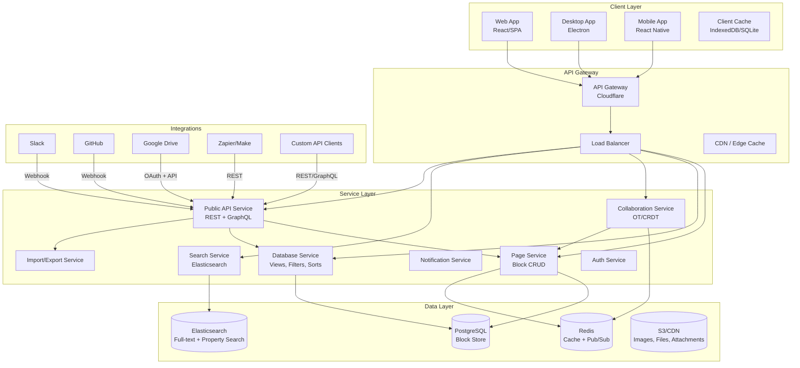
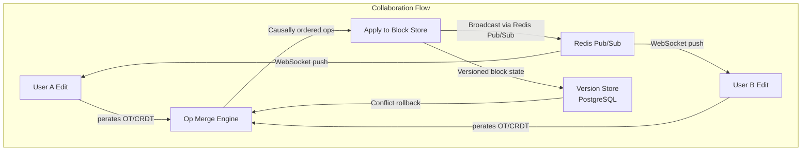
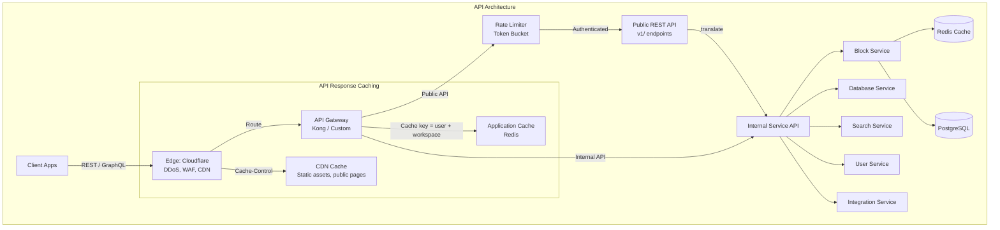

# 19-Notion Architecture

## Overview

Notion is an all-in-one workspace platform that combines notes, documents, databases, wikis, and project management into a single product. Its architecture is built around a universal block-based data model where every piece of content — text, images, databases, embeds — is represented as a block. This model enables unprecedented flexibility: any page can contain any type of content, and databases can render the same data as a table, board, calendar, or gallery.



---

## What Is It

Notion started as a document editor and evolved into a platform that replaces multiple tools: Google Docs (documents), Trello (boards), Airtable (databases), Confluence (wikis), and Asana (project management). The unifying concept is the **block** — every piece of content in Notion is a block, and blocks can nest, link, and reference each other.

As of 2024, Notion serves 100M+ users, including enterprise customers and individual users. The platform processes billions of block operations daily and maintains a complex real-time collaboration system built on a custom CRDT implementation.

---

## Architecture Overview

```mermaid
graph LR
    subgraph "Block Data Model"
        P1[Page: "Project Plan"] --> B1[Block: Heading]
        P1 --> B2[Block: Text Paragraph]
        P1 --> B3[Block: To-do List]
        P1 --> B4[Block: Database<br/>Inline]
        
        B4 --> D1[Row Block: Task 1]
        B4 --> D2[Row Block: Task 2]
        B4 --> D3[Row Block: Task 3]
        
        D1 --> P2[Linked Page:<br/>Task 1 Details]
        P2 --> B5[Block: Text]
        P2 --> B6[Block: Image]
        P2 --> B7[Block: Sub-page]
    end
```

---



---



---

## Deep Dives

### Block-Based Data Model

Everything in Notion is a block. A block is a JSON object with a type, properties, and optional children.

**Block schema:**
```json
{
  "id": "uuid",
  "type": "text | heading | to_do | bulleted_list | numbered_list | toggle | code | quote | callout | divider | image | video | file | embed | bookmark | equation | table_of_contents | breadcrumb | column_list | column | template | link_preview | synced_block | table | database | board | calendar | gallery | ...",
  "properties": {
    "title": [["Text content", [["bold", "italic"]]]],
    "checked": false
  },
  "format": {
    "block_width": 720,
    "block_color": "gray_background"
  },
  "children": ["child-block-id-1", "child-block-id-2"],
  "parent_id": "parent-block-id",
  "parent_table": "block | space | collection",
  "created_time": 1617000000,
  "last_edited_time": 1617000100,
  "created_by": "user-uuid",
  "last_edited_by": "user-uuid",
  "alive": true
}
```

**Block types by category:**
- **Text blocks:** paragraph, heading [1-3], bulleted_list, numbered_list, toggle, quote, callout, code, equation
- **Media blocks:** image, video, audio, file, pdf, bookmark, embed, link_preview
- **Structure blocks:** column_list, column, divider, table_of_contents, breadcrumb, breadcrumb_item
- **Database blocks:** collection_view (table, board, calendar, gallery, list, timeline)
- **Advanced blocks:** synced_block (reusable content block), template (template button), link_to_page, mention, inline_databases

**Block hierarchy:**
- Pages are blocks of type `page` that can contain child blocks
- Databases are blocks of type `collection_view` that reference a collection of rows
- Rows in databases are blocks of type `page` with special properties
- Blocks can be deeply nested (sub-pages within sub-pages)

**Properties system:**
- Each block has a `properties` dict keyed by property name
- Properties are typed: text, number, select, multi_select, date, person, file, checkbox, URL, email, phone, formula, relation, rollup, created_time, created_by, last_edited_time, last_edited_by
- Rich text: represented as an array of arrays — `[["bold text", ["bold"]], [" and ", []], ["italic text", ["italic"]]]`
- Mentions: inline references to pages, users, dates, or database values

**Block storage:**
- PostgreSQL stores blocks as rows in a `blocks` table
- Each block is a single row with columns for id, type, properties (JSONB), format (JSONB), parent_id, alive flag
- Children order stored as an ordered array in the parent block's `children` column
- This enables efficient subtree queries but makes reordering O(n) in the number of siblings
- Full-page snapshots cached in Redis for fast page loads

---

### Real-Time Collaboration (OT/CRDT Hybrid)

Notion uses a hybrid Operational Transformation / CRDT approach for real-time collaboration.

**Architecture:**

```
Each client maintains:
  1. Full block tree in memory (from page load)
  2. Local unacked operation queue
  3. Vector clock tracking seen operations

Server maintains:
  1. Authoritative block state (PostgreSQL)
  2. Operation log for conflict resolution
  3. WebSocket connections per connected client per page
  4. Redis Pub/Sub for cross-server broadcast
```

**Operation structure:**
```json
{
  "op_id": "uuid",
  "type": "update_block | create_block | delete_block | move_block | reorder_children | update_collection",
  "block_id": "uuid",
  "data": { "properties": { "title": [["new text", []]] } },
  "dependencies": ["prev-op-id-1", "prev-op-id-2"],
  "timestamp": 1617000100,
  "user_id": "uuid",
  "workspace_id": "uuid",
  "vector_clock": { "user_a": 5, "user_b": 3, "user_c": 7 }
}
```

**Conflict resolution strategy:**

1. **Property-level last-write-wins:** If two users edit the same property of the same block, the later timestamp wins. Timestamps are from the server's clock, not the client's (to prevent clock skew issues).

2. **Causal ordering via dependencies:** Operations declare which previous operations they depend on. If op B depends on op A, the server won't apply B until A is applied.

3. **Delete-edit conflict:** If User A deletes a block while User B edits it, the delete wins. The edit is discarded and User B receives an error that the block no longer exists.

4. **Move-move conflict:** If two users move the same block to different parents, the operation with the later server timestamp wins. The losing move is rolled back.

5. **Collection conflicts:** Database row reordering uses a fractional indexing scheme (similar to Figma's): each row has a `order` field with a big integer; concurrent inserts assign values between neighbors using midpoint computation.

**Performance optimizations:**
- Operations are batched: rapid edits within 100ms window are coalesced into a single operation
- Binary protocol: operations serialized as Protocol Buffers over WebSocket
- Presence only for active pages: if no user has a page open, no collaboration overhead
- Auto-merge for trivial conflicts: independent child edits on different subtrees apply in parallel

---

### Database Architecture (Views, Filters, Sorts)

Notion's databases are the most technically complex feature. A database is a collection of rows where each row is a page with consistent properties. The same data can be viewed as a table, board, calendar, gallery, list, or timeline.

**Data model:**
```
Collection (schema definition):
  - Name, description
  - Schema: property definitions (name, type, options)
  - Icon, cover

CollectionView (view definition):
  - Collection reference
  - View type: table | board | calendar | gallery | list | timeline
  - Query: filter rules, sort rules, grouped by property
  - Format: visible properties, column widths, board kanban stacks

Page (row block):
  - Collection reference
  - Properties matching collection schema
  - Children (sub-blocks, sub-pages)
```

**Query execution:**
```
User opens database view
  → Fetch collection schema (cached in Redis)
  → Fetch view definition (filter, sort, format)
  → Fetch all pages in collection
  → Apply filters client-side (for small collections <500 rows)
  → Apply sorts client-side
  → Render view

For large collections (>500 rows):
  → Server-side filtering and sorting via PostgreSQL JSONB queries
  → Paginated results (50 rows per page)
  → Filter conditions translated to SQL WHERE clauses on JSONB properties
  → Sort conditions translated to SQL ORDER BY on JSONB properties
  → Full-text search via Elasticsearch (for property values)
```

**Filter translation example:**
```
User filter: Status == "In Progress" AND Priority != "Low"

SQL generated:
SELECT * FROM blocks
WHERE parent_id = 'collection-uuid'
  AND alive = true
  AND properties @> '{"Status": [["In Progress", []]]}'
  AND NOT properties @> '{"Priority": [["Low", []]]}'
ORDER BY properties->>'Created' DESC
LIMIT 50 OFFSET 0;
```

**View types internally:**
- **Table:** rows × columns; each row is a page, each column is a property
- **Board (Kanban):** grouped by a "group by" property; each group rendered as a column
- **Calendar:** items grouped by a date property; placed on calendar grid
- **Gallery:** items shown as cards with cover image; filtered and sorted
- **List:** compact vertical list of items with inline property display
- **Timeline (Gantt):** items placed on a timeline based on start/end date properties

**Rollups and relations:**
- Relation: a property linking to rows in another database (many-to-many)
- Rollup: a computed property that aggregates values from related rows (count, sum, avg, min, max, formula)
- Rollups require recursive fetching across databases; heavily cached

---

### Search Architecture (Elasticsearch)

Notion's search needs to index billions of blocks across millions of workspaces and return results in under 500ms.

**Indexing pipeline:**
```
Block created/updated
  → Producer sends event to Kafka topic: block.change
  → Consumer reads event
  → Fetches full block + parent hierarchy for context
  → Extracts text content from all properties
  → Creates Elasticsearch document
  → Indexes with workspace-based routing

Elasticsearch document shape:
{
  "id": "block-uuid",
  "workspace_id": "workspace-uuid",
  "page_id": "page-uuid",          // root page containing this block
  "parent_id": "parent-block-uuid",
  "type": "text",
  "content": "the extracted text content",
  "title": "page title (for ranking)",
  "created_by": "user-uuid",
  "created_time": 1617000000,
  "last_edited_time": 1617000100,
  "path": ["page-uuid", "parent-uuid", "block-uuid"],
  "workspace_name": "My Workspace",
  "is_deleted": false,
  "// nested objects for rich queries": {}
}
```

**Search query flow:**
```
1. User types in quick find (Cmd+P / Ctrl+P)
2. After 150ms debounce, send request to /api/search
3. Request: query text, workspace_id, filters (type, date range, created by)
4. Elasticsearch multi_match query on:
   - content field (boost 1)
   - title field (boost 3 — page titles rank higher)
   - workspace_name (boost 0.5)
5. Filter by workspace_id (mandatory)
6. Apply additional filters: block type, date range, author
7. Sort by: relevancy score (BM25), then last_edited_time desc
8. Return top 20 results with snippet highlighting
9. Client renders results grouped by page
```

**Performance optimizations:**
- Workspace-based routing shards ensure queries hit only relevant shards
- Recent workspaces' indices kept hot; cold workspaces moved to slower tiers
- Query timeout: 200ms for quick find, 3s for full search
- Result caching: identical queries within 30s served from Redis cache
- Bulk indexing: blocks batched into 1000-document bulk requests every 5 seconds
- Search-as-you-type: n-gram tokenizer for partial word matching

**Scaling:**
- Multiple Elasticsearch clusters: hot (SSD, recent data), warm (HDD, older data), cold (frozen indices, infrequent access)
- Cross-cluster search for queries spanning tiers
- Reindexing: full reindex every 6 months to optimize shard distribution

---

### API Design (Public API + Integrations)

Notion's public API enables third-party integrations and automation. The API follows REST principles with a set of carefully designed endpoints that expose the block model.

**API structure:**
```
Base URL: https://api.notion.com/v1/

Authentication: Bearer token (Integration token or OAuth 2.0)

Rate limiting: 3 requests per second per integration (user-specific)

Endpoints:
  GET    /users              List users in workspace
  GET    /users/:id          Get user details
  
  GET    /pages/:id          Retrieve a page (block properties)
  PATCH  /pages/:id          Update page properties
  POST   /pages              Create a new page
  
  GET    /blocks/:id         Retrieve a block
  PATCH  /blocks/:id         Update block content
  DELETE /blocks/:id         Delete a block
  GET    /blocks/:id/children List child blocks
  PATCH  /blocks/:id/children Append new child blocks
  
  POST   /databases/:id/query Query a database (filter, sort, paginate)
  GET    /databases/:id       Retrieve database schema
  POST   /databases           Create a database
  
  POST   /search              Search across workspace
  
  GET    /comments/:id        Get comments on a block
  POST   /comments            Create a comment
```

**Key design decisions:**
- **REST over GraphQL for public API:** Even though Notion's internal API uses GraphQL, the public API is REST for simplicity and broad compatibility
- **Idempotent operations:** All write operations are idempotent; retries are safe
- **Optimistic concurrency:** PATCH operations include a `last_edited_version` header for conflict detection
- **Rate limiting by user:** Each integration gets 3 req/s per user (not per integration), preventing one integration from starving others
- **Pagination:** Cursor-based (not offset) for consistent results under write load
- **Rich text objects:** Content is always arrays of rich text objects, matching the internal model

**Integration architecture:**
```
Integration (e.g., Zapier) 
  → OAuth 2.0 / Internal Integration Token
  → API Gateway (Cloudflare)
  → Rate Limiter (Redis token bucket)
  → Authentication Check (JWT validation)
  → Permission Check (can integration read/write this page?)
  → Rate Limit Deduction
  → Execute request
  → Log for billing (requests per month)
```

**Webhook system:**
- Notion does not yet have webhooks (as of 2024, in beta)
- Poll-based integration: integrations must poll for changes using the search endpoint
- Change detection via `last_edited_time` comparison

---

### Scaling Challenges: Monolith vs Microservices

Notion famously ran on a monolith for years and faced significant scaling challenges before beginning a migration to a service-oriented architecture.

**The original monolith (2016-2020):**
- Single Python/Django monolith (Notion was originally Python-based, later partially rewritten)
- Single PostgreSQL database with growing connection pool
- No caching layer initially
- Batch operations on blocks were slow due to sequential processing
- Database queries for large pages could take seconds

**Growing pains:**
```
Problem: Page load time for large pages
  - A page with 1000 blocks required loading all blocks from DB
  - PostgreSQL query: SELECT * FROM blocks WHERE parent_id = ?
  - With N+1 queries for child pages, load times hit 5+ seconds
  - Solution: prefetch entire subtree in single query using recursive CTE

Problem: Collaborative editing bottlenecks
  - Single process handling all WebSocket connections
  - Operations serialized through the monolith's process queue
  - Solution: dedicated collaboration service with Redis Pub/Sub

Problem: Search performance
  - Early search used PostgreSQL full-text search
  - Slow on workspace with 100K+ blocks
  - Solution: Elasticsearch cluster with dedicated indexing pipeline

Problem: API rate limiting impacting internal services
  - Public API and internal services sharing the same infrastructure
  - An overactive integration could slow down the main product
  - Solution: separate API gateway with per-integration rate limiting
```

**Migration to services:**
```
Phase 1 (2020): Extract Block Service
  - Block CRUD moved to dedicated Node.js service
  - Monolith calls block service via internal RPC
  - PostgreSQL block table remains shared initially

Phase 2 (2021): Extract Search, Auth, Notifications
  - Search: Elasticsearch cluster with Kafka-based indexing
  - Auth: Dedicated auth service with JWT + session management
  - Notifications: Async worker processing email/push/webhook

Phase 3 (2022): Database Service
  - Database views (filtering, sorting, grouping) become high-traffic
  - Extracted to dedicated service with query optimization
  - Materialized views for complex rollup computations

Phase 4 (2023-2024): Caching Layer, API Gateway
  - Redis cluster for page caching, rate limiting, session storage
  - Cloudflare for edge caching, DDoS protection
  - Kong API gateway for routing, authentication, rate limiting
```

**Current architecture:**
- Hybrid monolith + services (transition still in progress)
- Core block editing still largely in the monolith
- Search, Auth, Integrations, Import/Export, Notifications as services
- PostgreSQL remains the single source of truth (no sharding yet, uses read replicas)
- Redis for caching, session storage, rate limiting, pub/sub

---

## Scaling Strategy

### Infrastructure Evolution

**Phase 1 (MVP):** Single server, SQLite → PostgreSQL, no collaboration
**Phase 2 (Growth):** Monolith + read replicas, basic collaboration via polling
**Phase 3 (Scale):** Monolith + services extraction, Redis, Elasticsearch, WebSocket collaboration
**Phase 4 (Enterprise):** API gateway, multi-region, advanced caching, compliance features

### Database Scaling

- **Read replicas:** 5+ read replicas per primary for query offloading
- **Connection pooling:** PgBouncer manages 1000+ connections per instance
- **JSONB indexing:** GIN indexes on properties column for database queries
- **Table partitioning:** By workspace ID hash for large tables
- **Materialized views:** Pre-computed rollups and aggregated metrics
- **Future: sharding by workspace** (not yet implemented as of 2024)

### Caching Strategy

```
Tier 1: Browser cache (Service Worker)
  - Previously viewed pages cached in IndexedDB
  - Offline content availability

Tier 2: CDN (Cloudflare)
  - Static assets (JS, CSS, images)
  - Public pages (shared via "Share to web")
  - API responses with Cache-Control headers

Tier 3: Application cache (Redis)
  - Page block tree (TTL: 5 minutes, invalidated on write)
  - User session (TTL: 24 hours)
  - Workspace metadata (TTL: 1 hour)
  - Database schema cache (TTL: 10 minutes)

Tier 4: Server-side computed cache
  - Complex rollup computations cached for 30 seconds
  - Search result snippets cached for 30 seconds
```

---

## Key Metrics

| Metric | Value |
|--------|-------|
| Registered Users | 100M+ (2024) |
| Paid Users | 10M+ |
| Enterprise Customers | 10,000+ |
| Blocks Stored | Trillions+ |
| Block Operations/Day | Billions |
| Elasticsearch Docs Indexed | 10B+ |
| API Requests/Day | 500M+ |
| WebSocket Connections (peak) | 5M+ |
| Page Load Time (p95) | <800ms |
| Search Response Time (p95) | <300ms |
| Integration Partners | 500+ (via Public API) |
| Workspace Shards | 50+ PostgreSQL primaries |
| Cache Hit Rate | 85%+ |

---

## Lessons Learned

1. **Monolith-first was the right call for speed:** Notion's early monolith allowed incredibly fast iteration. The team added features at a pace no microservice architecture could match. Extraction to services happened only when specific performance constraints demanded it.

2. **Block model is a superpower and a curse:** The universal block model enables incredible flexibility (databases, pages, everything), but it makes query optimization difficult. Every feature becomes a variation of "how do I efficiently query blocks?".

3. **JSONB in PostgreSQL is surprisingly capable:** Notion stores block properties as JSONB and uses GIN indexes for querying. This works well up to a point, but complex queries on nested JSONB can be slow. The tradeoff of schema flexibility vs query performance is worth understanding.

4. **Rate limiting is essential for API reliability:** Early public API had no rate limiting, leading to cascading failures when integrations went wild. The per-user token bucket rate limiter was a critical addition.

5. **Offline is hard with a block model:** Unlike document editors (Google Docs), Notion's block model with databases, relations, and rollups makes offline editing extremely difficult. Changes that seem local can have ripple effects across workspaces.

6. **Elasticsearch is necessary but complex:** PostgreSQL full-text search broke at workspace sizes above 50K blocks. Elasticsearch solved the scale problem but added operational complexity: index management, reindexing, cluster scaling, and consistency issues.

7. **CRDT vs OT should be chosen by data shape:** Notion's hybrid approach (property-level LWW for CRDT-like behavior + causal ordering for OT-like safety) reflects the reality that real-world collaboration doesn't fit neatly into either model.

8. **API-first thinking should come earlier:** Notion's public API was an afterthought, leading to internal data structures leaking into the API. Designing the API alongside the product would have produced a cleaner contract.

9. **Transparency with users about beta features:** Notion's aggressive feature rollout (AI, formulas, automations) sometimes hit reliability. Being upfront about beta status and gradually rolling out to larger workspaces reduced support load.

10. **The database-to-page link is the killer feature:** Relations + Rollups — allowing databases to reference each other and compute aggregates — creates network effects. The complexity of building this at scale was worth it for user retention.

---

## Interview Questions

1. Design the block-based data model for a workspace platform like Notion. How would you store blocks in PostgreSQL to support efficient querying of nested structures?

2. How does Notion handle real-time collaboration on the same page? Design the conflict resolution strategy for concurrent edits on the same block.

3. Design Notion's database query engine. How would you implement filtering, sorting, and grouping on JSONB properties across thousands of rows?

4. How would you implement Notion's search (Cmd+P / Ctrl+P)? Design the indexing pipeline and query flow with Elasticsearch for a workspace with 1M+ blocks.

5. Design the public REST API for Notion. How would you translate the internal block model into a clean, versioned API surface while supporting integrations?

6. How does Notion handle rollups and relations between databases? Design the execution engine for computed properties that aggregate data across database relationships.

7. Design a rate limiting strategy for Notion's public API. How do you prevent one misbehaving integration from impacting other users?

8. How would you scale Notion's infrastructure from a monolith to microservices? What services would you extract first and why?

9. Design Notion's view system (table, board, calendar, gallery, timeline). How does the same underlying data render differently based on view type and configuration?

10. How would you implement offline editing in Notion? What makes the block model more challenging for offline support compared to a traditional document editor?

---

## References / Further Reading

- Notion Blog: "How Notion's Architecture Has Evolved"  
- Notion API Documentation  
- "Building a Block-Based Editor" — Notion Engineering  
- "Notion Database Internals: Views, Filters, and Sorts"  
- "CRDT and OT in Production: Lessons from Notion and Figma"  
- Elasticsearch: The Definitive Guide  
- "Scaling PostgreSQL for Document Stores"  
- PostgreSQL JSONB Indexing Strategies  
- "REST API Design for Content Platforms"  
- "MonolithFirst" — Martin Fowler (ThoughtWorks)  
