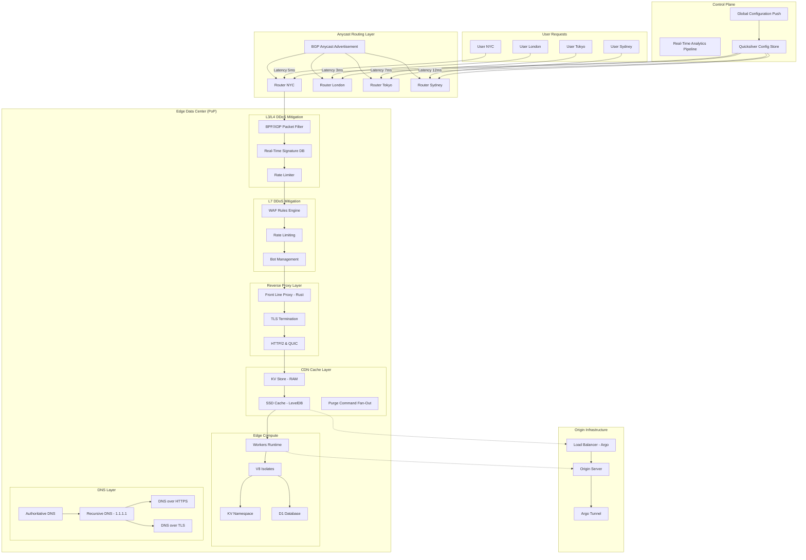
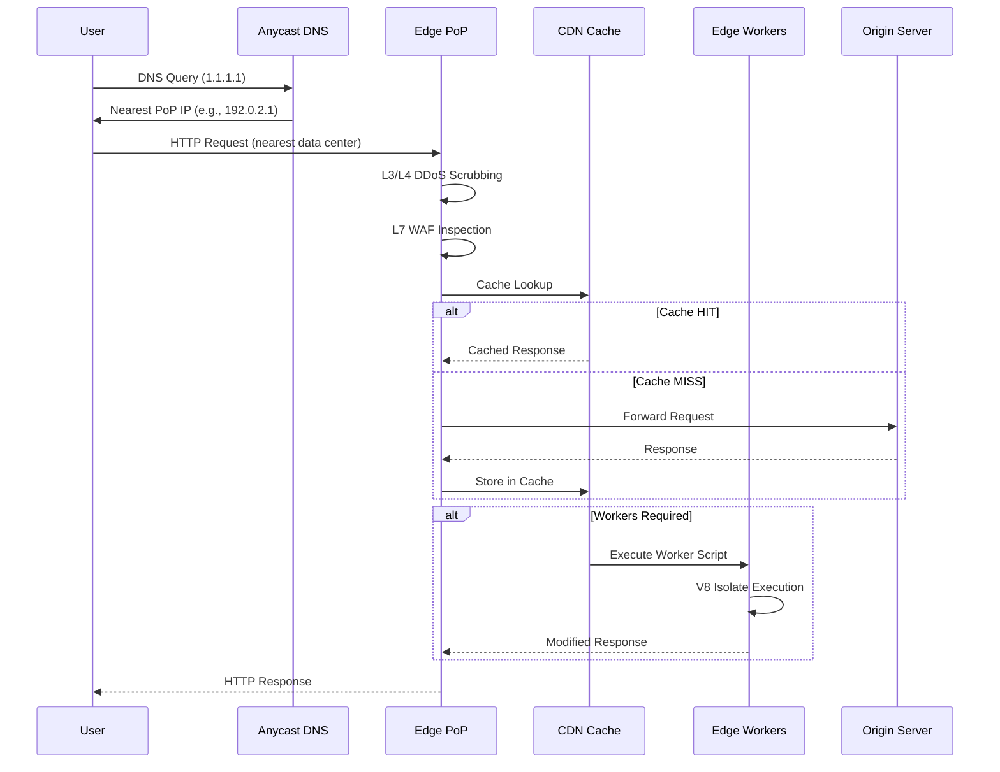
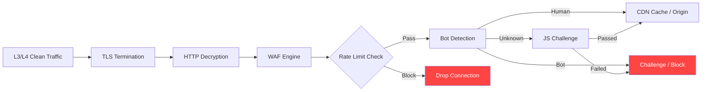
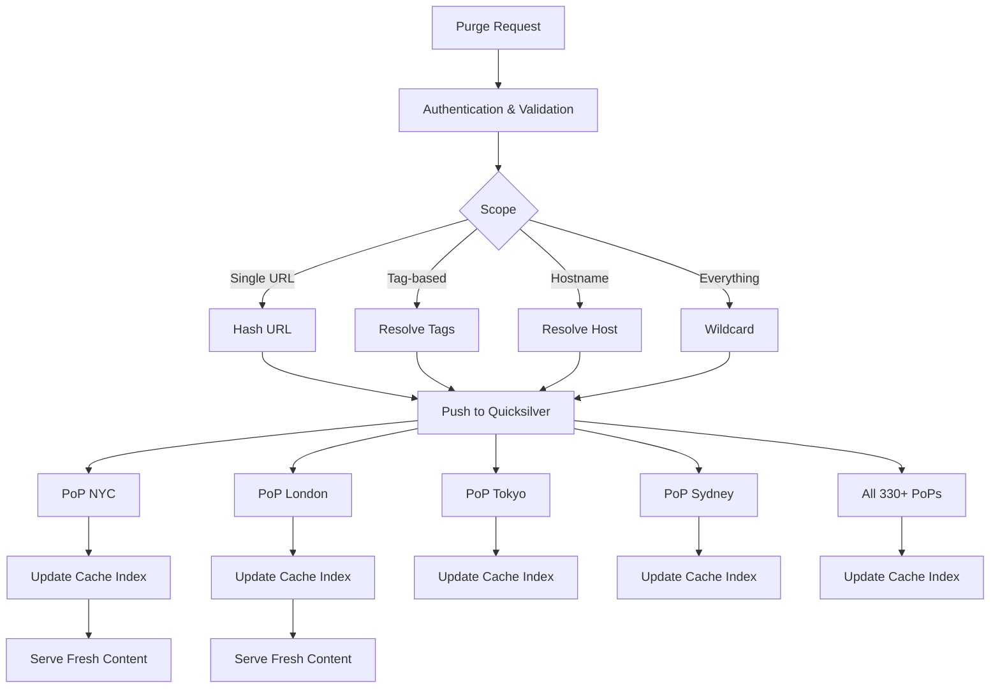
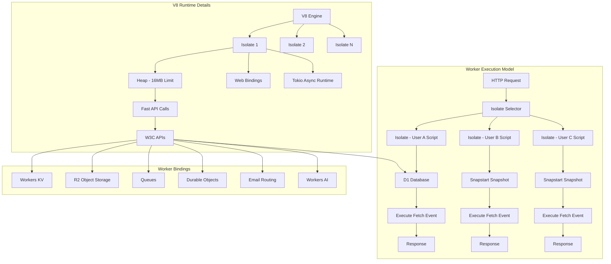

# 20. Cloudflare Global Edge Network Architecture

## Architecture Diagram





## What Is It

Cloudflare operates one of the world's largest edge networks, serving as a reverse proxy, CDN, DDoS mitigation platform, DNS provider, and serverless compute platform. The network spans 330+ cities across 120+ countries, handling roughly 20% of all internet traffic. Founded in 2009, Cloudflare has become the de-facto front-end for millions of websites and APIs.

Core philosophy: build security, performance, and reliability infrastructure at the network edge so origins remain simple, protected, and fast.

## Architecture Overview

### Global Network Topology

Cloudflare's network is a distributed Anycast architecture. Every data center (Point of Presence / PoP) advertises the same set of IP addresses via BGP Anycast. When a user connects, the internet's routing infrastructure naturally directs them to the nearest (topologically closest) PoP. This provides:

- **Automatic failover**: if a data center goes offline, BGP withdraws its routes and traffic shifts to remaining PoPs
- **Load distribution**: traffic naturally spreads across data centers based on internet topology
- **Latency minimization**: users reach ingress points 20-50ms away rather than crossing oceans
- **DDoS absorption**: attack traffic is distributed across hundreds of data centers, each absorbing a fraction

Each PoP contains:
- Juniper/Mellanox edge routers (100G/400G uplinks)
- Custom-built server hardware (Gen X servers with AMD EPYC, 128GB RAM, NVMe SSDs)
- On-site 1-10G transit peering
- Direct peering with major ISPs and IXPs

### Software Stack

The software at each PoP is purpose-built and runs on Linux (custom kernel tuning). Key components:

| Layer | Technology | Language | Role |
|-------|-----------|----------|------|
| Packet Processing | XDP/eBPF, DPDK | C, Rust | Fast packet filtering at NIC level |
| Reverse Proxy | Custom Pingora (since 2022) | Rust | HTTP proxy, TLS termination, load balancing |
| Legacy Proxy | NGINX (phased out) | C | Previously the main proxy layer |
| L7 Firewall | Custom WAF Engine | Lua, Rust | WAF rules, rate limiting, bot detection |
| CDN Cache | Custom KV+SSD store | C, Rust | Caching with RAM and SSD tiers |
| Edge Compute | Workers Runtime | Rust, JS | V8 Isolates for serverless execution |
| DNS | Custom DNS Server | Rust | Authoritative and recursive DNS |
| Config Distribution | Quicksilver | Go | Key-value config sync to all PoPs in ~5 seconds |

## Deep Dives

### 1. Anycast Network Design

Cloudflare uses BGP Anycast where every PoP advertises the same /24 IP prefix. The internet's routing protocol (BGP) ensures packets flow to the closest router in terms of AS-path length.

**Route Propagation:**
- Each PoP has a local BGP router announcing Cloudflare's IP prefixes
- Transit providers propagate these routes globally
- End users' ISPs select the shortest AS-path
- For a user in Tokyo: packets enter NTT's network, routed to Cloudflare's Tokyo PoP
- If Tokyo PoP fails: BGP withdrawal, routes propagate, traffic shifts to Seoul or Singapore PoPs

**Optimal Route Calculation (ORC):**
Cloudflare runs a real-time system that measures latency from each PoP to each customer origin. When a user connects, the system selects:
- Best egress PoP (not necessarily the same as ingress PoP)
- Routes traffic through internal backbone if egress path is faster than internet path

**Traffic Steering Modes:**
- DNS-based: different IPs for different regions, clients routed via DNS resolution
- Anycast-based: single IP, BGP handles routing
- Latency-based: real-time perf data drives route selection
- Geo-based: explicit region mapping

### 2. Reverse Proxy Architecture (Pingora)

In 2022, Cloudflare completed a multi-year migration from NGINX to their custom Rust-based proxy called Pingora. This was one of the most significant infrastructure migrations in internet history.

**Why replace NGINX:**
- Worker model (process per core) inefficient for high connection counts
- Memory overhead per request too high
- Difficult to customize security features deep in the request lifecycle
- Lua scripting (OpenResty) had performance bottlenecks

**Pingora Architecture:**

```
┌─────────────────────────────────────┐
│         Request Lifecycle           │
│                                     │
│ 1. Connection accept (TLS or plain) │
│ 2. Protocol detection (HTTP/1.1,    │
│    HTTP/2, HTTP/3/QUIC)             │
│ 3. Connection pooling (to origin)   │
│ 4. Request filtering (WAF, rate     │
│    limit, bot detection)            │
│ 5. Cache lookup                     │
│ 6. Origin selection & load balance  │
│ 7. Response buffering & filtering   │
│ 8. Response compression (Brotli/Zstd│
│ 9. Connection reuse / keep-alive    │
└─────────────────────────────────────┘
```

**Key design decisions:**
- Async I/O (tokio runtime) handles millions of concurrent connections
- Zero-copy buffer passing reduces memory pressure
- Shared-nothing architecture between worker threads
- Hot reload of configuration without connection drops
- Custom TLS implementation (built on rustls) for advanced ALPN negotiation

**Connection management:**
- Up to 10M concurrent connections per server
- Connection coalescing for HTTP/2 multiplexing
- QUIC (HTTP/3) support via custom implementation
- TCP fast open, BBR congestion control

### 3. DDoS Mitigation Pipeline

Cloudflare's DDoS mitigation operates at three layers, each catching different attack vectors.

**L3/L4 Mitigation (Network Layer):**

The first line of defense happens in the kernel and NIC:

```
┌──────────┐    ┌──────────┐    ┌──────────┐
│  NIC via │    │  XDP     │    │  eBPF    │
│  DPDK    │───▶│  Filter  │───▶│  Program │
│  Flow    │    │  (drop)  │    │  (L3/L4  │
│  Steering│    │          │    │  rules)  │
└──────────┘    └──────────┘    └──────────┘
     │               │              │
     │         ┌─────┘              │
     │         ▼                    ▼
     │    ┌──────────┐    ┌──────────────────┐
     │    │ Hardware │    │ Software         │
     │    │ Offload  │    │ BGP Flow Spec    │
     │    │ (ASIC)   │    │ RTBH Signaling   │
     │    └──────────┘    └──────────────────┘
     │
     ▼
┌──────────┐    ┌──────────┐    ┌──────────┐
│ L3/L4    │    │ Rate     │    │ Forward  │
│ Signature│───▶│ Limiting │───▶│ to L7    │
│ Matching │    │ /Spoof   │    │ Pipeline │
│          │    │ Detection│    │          │
└──────────┘    └──────────┘    └──────────┘
```

- **XDP/eBPF filters** run in kernel bypass mode, processing packets at line rate (100M pps per server)
- **BPF programs** match against distributed threat intelligence signatures updated in real-time
- **DPDK** enables userspace packet processing without kernel overhead
- **Flow steering** on Mellanox CX-6/7 NICs offloads simple drops to hardware ASIC
- **Rate limiting** per source IP, per prefix, per protocol
- **SYN flood mitigation**: SYN cookies and SYNPROXY at kernel level
- **Amplification attack mitigation**: reflection attack detection via source port/size heuristics
- **BGP Flowspec** signals malicious traffic patterns to upstream transit providers for remote blackholing

**L7 Mitigation (Application Layer):**



- **WAF Rules Engine**: processes millions of rules from Cloudflare-managed rulesets, OWASP core ruleset, and customer-custom rules
- **Rate Limiting**: token bucket algorithm per user, per path, per API endpoint
- **Bot Management**: ML-based classification using behavior analysis, browser fingerprinting, and IP reputation
- **JS Challenges**: CAPTCHA-less challenges that prove browser execution capability
- **Managed Challenge**: dynamic decision between JS challenge, CAPTCHA, or block based on risk score

**Attack Mitigation Scale:**
- Largest attack mitigated: 2.5 Tbps DDoS amplification attack
- Peak mitigation: 26M requests per second (L7)
- Auto-mitigation time: under 3 seconds from attack start
- False positive rate: <0.001% for managed rulesets

### 4. CDN Architecture (Caching Layer)

Cloudflare's cache is a multi-tier distributed system optimized for static and dynamic content.

**Cache Hierarchy:**

```
┌─────────────────┐
│   Browser Cache │  (Client side, controlled by Cache-Control headers)
└────────┬────────┘
         │
┌────────▼────────┐
│   Edge Cache    │  (PoP-level, RAM + SSD)
│   - RAM: KV     │
│   - SSD: LevelDB│
│   - Tiered      │
│     caching     │
└────────┬────────┘
         │
┌────────▼────────┐
│  Regional Cache │  (Multi-PoP, for cold content)
│  - Collos       │
│  - Dynamic      │
│    compression  │
└────────┬────────┘
         │
┌────────▼────────┐
│  Origin Cache   │  (Customer's server, optional)
│  - Argo Tunnel  │
│  - Load Balance │
│  - Cache-Control│
│    headers      │
└─────────────────┘
```

**Cache Storage:**
- **Tier 1 (RAM)**: Memory-mapped KV store for hot objects. Thousands of objects with sub-millisecond access.
- **Tier 2 (SSD)**: Custom LevelDB-based store for warm objects. Millions of objects, 1-5ms access.
- **Tiering**: LRU eviction with frequency weighting. Static content (CSS, JS, images) prioritized.

**Cache Keying:**
- Default: `{scheme}://{host}/{path}`
- Customizable: cookie, header, query-string variations
- Cache keys can include device type, language, country

**Purge System (Instant Purge):**



- Purge propagates globally in under 5 seconds (typically 1-2s)
- Uses Quicksilver, Cloudflare's global KV config sync system
- Supports tag-based, hostname, URL-prefix, and wildcard purging
- Cache-Tag header support for programmatic purging

**Compression:**
- Brotli (quality 4-6), Gzip, Zstandard
- Dynamic compression detected per content type
- Image optimization (Polish): auto-WebP/AVIF conversion, lossy compression
- Mirage: lazy loading and responsive image resizing

### 5. Workers / Edge Compute Architecture

Cloudflare Workers is a serverless compute platform that runs JavaScript/WASM at the edge using V8 Isolates.

**Architecture:**



**Why V8 Isolates instead of Containers:**

| Aspect | V8 Isolate | Docker Container |
|--------|-----------|------------------|
| Cold start | <1ms (Snapstart) | 100-500ms |
| Memory per tenant | ~1-5MB | ~50-200MB |
| Density per server | 1000s of tenants | 10-100 containers |
| Security boundary | Process-level (single process) | Kernel-level (namespaces) |
| Startup overhead | Snapshot deserialize | Image pull + init |

**Snapstart Technology:**
- Worker script is pre-compiled and the V8 heap is serialized after initialization but before running user code
- On request: deserialize snapshot (sub-millisecond), resume execution
- This allows cold starts in under 1ms, competitive with any serverless platform

**Runtime Capabilities:**
- Execute on every request: intercept, modify, or respond directly
- Fetch API for subrequests to origin or other services
- WebAssembly (WASM) support for non-JS workloads (Rust, Go, C)
- 128 concurrent subrequests per worker invocation
- Response streaming (chunked encoding, server-sent events)
- WebSocket upgrades from worker context
- Cron Triggers for scheduled execution

**Durable Objects:**
- Single-writer, strongly consistent storage per "namespace"
- Distributed across PoPs but each object lives in exactly one location
- Provides coordination primitives: transactions, locks, storage
- Use cases: real-time collaboration, multiplayer game state, rate limiting

**Smart Placement (since 2023):**
- Workers automatically execute at the PoP closest to the user's origin or database
- Reduces latency for back-end communication
- Configurable hinting (closer to user vs closer to origin)

### 6. DNS Architecture

Cloudflare runs two types of DNS services: Authoritative DNS and the public Recursive DNS (1.1.1.1).

**Authoritative DNS:**

Customers store their DNS records at Cloudflare. When a resolver queries Cloudflare's authoritative servers:

```
Recursive Resolver ──► Anycast IP  (e.g., ns1.cloudflare.com)
                         │
                         ▼
                    PoP Router
                         │
                         ▼
                 Authoritative DNS
                 (Custom Rust Server)
                         │
               ┌─────────┴──────────┐
               ▼                    ▼
          RAM Cache           Database
          (RRset)             (Quicksilver)
```

- Zone data distributed globally via Quicksilver (5s propagation)
- Custom Rust DNS server handles 10M+ queries/sec per PoP
- DNSSEC signing at the edge: zones signed per-PoP with distributed keys
- EDNS Client Subnet: passes client network info for CDN-aware responses
- Load balancing: weighted SRV/AAAA records, health check-based failover

**Recursive DNS (1.1.1.1):**

```
User ──► 1.1.1.1 (Anycast)
          │
          ▼
    PoP Recursive Resolver
          │
          ├──► Cache (RAM)
          │       │
          │       ├── HIT: Return
          │       └── MISS: Query upstream
          │
          └──► Authoritative Server
                  │ Query (DNSSEC validation)
                  ▼
              Response
```

- Privacy-focused: no logging of client IPs (purchased logs deleted within 24h)
- DNS over HTTPS (DoH) and DNS over TLS (DoT) on 1.1.1.1 and 1.0.0.1
- DNS over QUIC (DoQ) for even lower latency
- Oblivious DNS over HTTPS (ODoH): encrypts queries between client and resolver
- Cache includes negative caching (NXDOMAIN) for reduced upstream traffic
- Malware and adult content filtering via 1.1.1.2 and 1.1.1.3

### 7. Argo Smart Routing and Load Balancing

**Argo Smart Routing:**

Instead of routing traffic across the public internet (which takes unpredictable paths), Argo routes traffic through Cloudflare's private backbone:

```
Without Argo:
  User (Sydney) ──internet──► Tokyo ──internet──► Los Angeles ──internet──► Origin (NYC)
  Latency: ~250ms (unpredictable, packet loss, congestion)

With Argo:
  User (Sydney) ──► Cloudflare Sydney PoP
                        │
                        ├──► Private Backbone (fiber)
                        │       ├──► Cloudflare LA PoP
                        │       └──► Cloudflare NYC PoP
                        │
                        └──► Origin (NYC)
  Latency: ~180ms (optimized path, less hops, no congestion)
```

- Real-time telemetry between all PoPs (latency, loss, jitter)
- Route computation using Dijkstra on the PoP graph
- Traffic re-routed around congested or failed segments
- 30% average latency improvement over internet transit
- Argo Tunnel: encrypted tunnel from origin to Cloudflare (no open inbound ports on origin)

**Load Balancing:**
- Layer 4 (TCP/UDP) and Layer 7 (HTTP/HTTPS) load balancing
- Health checks: HTTP, HTTPS, TCP, ICMP, SMTP from multiple PoPs
- Origin pools with failover policies
- Connection draining during origin maintenance
- Geographic steering: direct users to specific origin regions
- Weighted pools for canary deployments
- API-based session affinity (cookie or header-based)

## Scaling Strategy

### Phase 1: Origins as CDN (2009-2012)
- Started as a security layer (Project Honeypot founder)
- Built NGINX-based reverse proxy with Lua scripting
- Anycast network with 10 data centers
- Focus on anti-spam and DDoS protection

### Phase 2: Full Reverse Proxy (2012-2016)
- Expanded to CDN caching with custom storage engine
- Built WAF engine for SQL injection/XSS protection
- Added SSL/TLS (Universal SSL, a landmark free offering)
- Grew to 50+ data centers
- Launched Workers beta (first edge compute platform)

### Phase 3: Platform Expansion (2016-2020)
- Replaced NGINX with Pingora (Rust) over 3 years
- Workers GA with Snapstart sub-millisecond cold starts
- 1.1.1.1 public DNS resolver launch
- 150+ data centers
- Argo Smart Routing, load balancing, Railgun

### Phase 4: Full-Stack Edge (2020-Present)
- Durable Objects, R2 Storage, D1 Database
- Workers AI, Queues, Email Routing
- 330+ data centers across 120+ countries
- 100Tbps+ aggregate network capacity
- 20% of all internet traffic passes through Cloudflare

### Scaling Techniques
- **Custom hardware**: designed Gen X servers (AMD EPYC, 128GB RAM, NVMe) optimized for proxy workloads
- **Network capacity**: multiple 100G/400G uplinks per PoP, diverse transit providers
- **Horizontal scaling**: adding PoPs in underserved regions (Africa, South America, Middle East)
- **Quicksilver**: global config distribution at scale (~5s to reach all PoPs)
- **Automatic failover**: Anycast BGP withdrawal on PoP failure (30s convergence)
- **Workers isolation**: V8 Isolates instead of containers for 100x density improvement
- **Memory management**: Memory-only WAF rulesets, compressible LRU caches

## Key Metrics

| Metric | Value |
|--------|-------|
| Global data centers (PoPs) | 330+ across 120+ countries |
| Internet traffic handled | ~20% of all internet traffic |
| Peak DDoS mitigation | 2.5 Tbps |
| Peak L7 request rate | 26M requests/second |
| Network capacity | 100Tbps+ |
| Cache hit ratio | ~65% average (static assets: 90%+) |
| Worker cold start | <1ms (Snapstart) |
| DNS queries per second (1.1.1.1) | 10M+ per PoP |
| Purge propagation | <5s (global) |
| SSL/TLS connections | 10M+ concurrent per server |
| Latency P50 (user to closest PoP) | ~20ms |
| Backbone latency (NYC-London) | ~65ms (private fiber) |
| Uptime SLA | 100% (no known downtime since 2010) |

## Lessons Learned

1. **Build everything in-house.**
   Cloudflare's philosophy is to not rely on off-the-shelf software for critical infrastructure. NGINX was replaced by Pingora, HAProxy by custom load balancers, Envoy by Workers. This gives full control over performance, security, and debuggability.

2. **Anycast is the foundation.**
   Anycast provides inherent DDoS protection (traffic is naturally distributed), fault tolerance (BGP failover), and performance (lowest-latency routing). Without Anycast, Cloudflare would need complex DNS-based steering with slower failover.

3. **Edge compute changes everything.**
   Workers proved that serverless at the edge is viable. By using V8 Isolates instead of containers, Cloudflare achieved 100x better density and sub-millisecond cold starts. This enabled use cases impossible on traditional serverless (every-request interception, real time transforms).

4. **Migrations are hard, but worth it.**
   The NGINX-to-Pingora migration took 3+ years. It required building a proxy that matched NGINX's feature set, then migrating traffic gradually. The result is 5x better connection density, 2x faster TLS handshakes, and full control over the request lifecycle.

5. **Configuration distribution is a hard distributed systems problem.**
   Quicksilver (the config sync system) needs to update 330+ PoPs within seconds while maintaining consistency. They built a custom gossip protocol with DDoS-safe guarantees. Config push failures are the #1 cause of edge incidents.

6. **Security must be multi-layered.**
   No single layer catches everything. L3/L4 filters drop volumetric attacks. L7 WAF catches application-level exploits. Bot management handles credential stuffing. Each layer shares intelligence via real-time threat feeds.

7. **Peering diversity matters for performance.**
   Cloudflare peers at every major IXP (AMS-IX, DE-CIX, LINX, etc.) and directly with large ISPs (Comcast, AT&T, Verizon, NTT). More peers means shorter paths and better Anycast routing.

8. **Observability at scale requires sampling.**
   At 26M requests/second, logging everything is impossible. Cloudflare uses adaptive sampling (edge-side) and statistical aggregation for analytics. Real-time dashboards use probabilistic data structures (HyperLogLog, Count-Min Sketch).

## Interview Questions

1. **Design a CDN.**
   How would you build a global content delivery network? Cover caching hierarchy, purge propagation, origin shielding, and edge compute capabilities.

2. **How does Anycast routing work for global traffic management?**
   Explain BGP Anycast, route propagation, failover behavior, and the trade-offs vs DNS-based load balancing.

3. **Design a DDoS mitigation system.**
   How would you detect and mitigate a multi-Tbps L3/L4 amplification attack plus a simultaneous L7 HTTP flood?

4. **How would you design a serverless edge compute platform?**
   Cover isolation models (containers vs V8 Isolates), cold start optimization, sandboxing, resource limits, and distributed state management.

5. **How does Cloudflare handle cache invalidation across 330+ data centers?**
   Describe the purge pipeline: how does a purge request from an API reach every PoP within 5 seconds while maintaining cache consistency?

6. **Design a global DNS system that handles 10M+ queries/second.**
   Cover authoritative vs recursive, DNSSEC at the edge, cache hierarchy, DoH/DoT, and DDoS resilience.

7. **How would you migrate from NGINX to a custom proxy without downtime?**
   Discuss canary deployments, traffic shadowing, gradual rollouts, connection draining, feature parity testing, and rollback strategies.

8. **Design a WAF rules engine.**
   How would you evaluate millions of rules against every HTTP request at 26M RPS? Discuss rule compilation, matching algorithms, and performance optimization.

9. **How does Cloudflare route traffic between PoPs?**
   Explain Argo Smart Routing: real-time telemetry, path computation, private backbone routing vs public internet, and trade-offs.

10. **Design a distributed key-value store for global configuration.**
    How would you build Quicksilver? Discuss consistency models, update propagation, gossip protocols, conflicts, and fault tolerance.

## References / Further Reading

- [Cloudflare System Design (2024)](https://blog.cloudflare.com/how-cloudflare-architected-global-network-2024/)
- [Pingora: Replacing NGINX with Rust](https://blog.cloudflare.com/pingora-open-source/)
- [How We Built a Distributed Config Store in 5 Seconds](https://blog.cloudflare.com/quicksilver-configuration-distribution/)
- [DDoS Mitigation at Cloudflare (Technical Deep Dive)](https://blog.cloudflare.com/ddos-mitigation-technical-deep-dive/)
- [Cloudflare Workers Architecture](https://blog.cloudflare.com/inside-cloudflare-workers/)
- [Snapstart: Sub-millisecond Cold Starts](https://blog.cloudflare.com/snapstart/)
- [Anycast: How We Route Traffic](https://blog.cloudflare.com/anycast-ip-routing/)
- [1.1.1.1 DNS Resolver Architecture](https://blog.cloudflare.com/dns-resolver-1-1-1-1/)
- [Argo Smart Routing Technical Details](https://blog.cloudflare.com/argo-smart-routing/)
- [Cache Purge Architecture](https://blog.cloudflare.com/purge-cache-cloudflare/)
- [V8 Isolates vs Containers at the Edge](https://blog.cloudflare.com/containers-on-the-edge/)
- [How Cloudflare Images Works](https://blog.cloudflare.com/how-cloudflare-images-architecture/)
