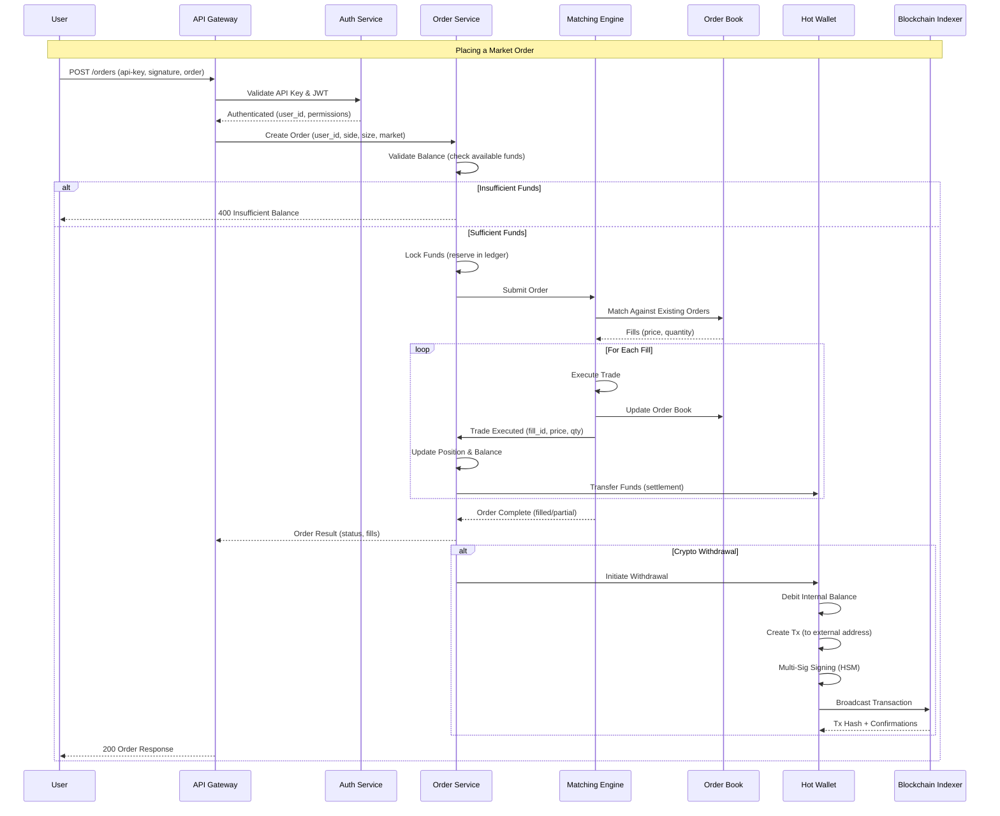
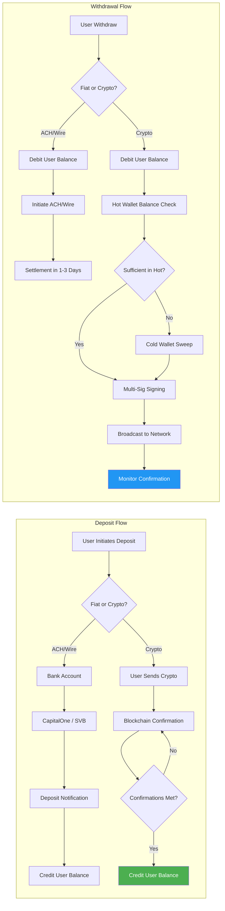
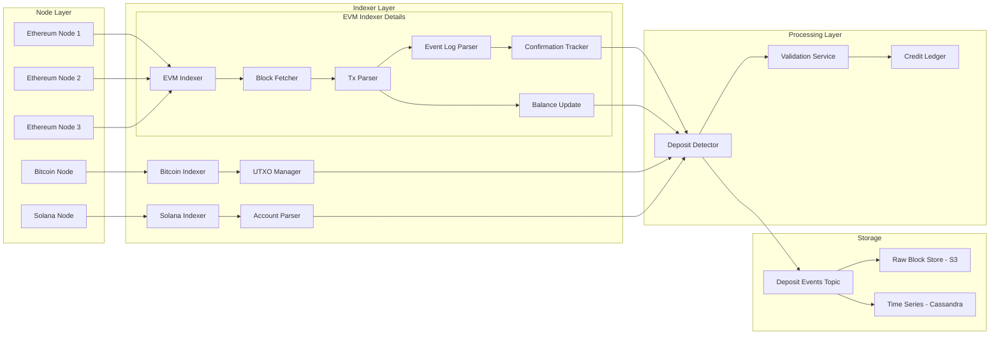

# 21. Coinbase Cryptocurrency Exchange Architecture

## Architecture Diagrams

```mermaid
graph TB
    subgraph "Client Access Layer"
        WEB[Web App - React/Next.js]
        MOB[Mobile App - Swift/Kotlin]
        API[REST & WebSocket API]
        SDK[Coinbase SDK / OAuth]
    end

    subgraph "API Gateway Layer"
        GW[API Gateway - Envoy]
        AUTH[Authentication Service]
        RATE[Rate Limiter]
        WAF[WAF / DDoS Protection]
        GW --> AUTH
        GW --> RATE
        GW --> WAF
    end

    subgraph "Trading Services"
        ORD[Order Service]
        MATCH[Matching Engine]
        BOOK[Order Book Service]
        FEE[Fee Calculator]
        LIQ[Liquidity Manager]
        ORD --> MATCH
        MATCH --> BOOK
        MATCH --> FEE
        MATCH --> LIQ
    end

    subgraph "Market Data"
        TICK[Ticker Service]
        OHLC[OHLCV Aggregator]
        ORDERB[Order Book Snapshots]
        HIST[Historical Data Store]
        TICK --> OHLC --> HIST
        ORDERB --> TICK
    end

    subgraph "Wallet & Fund Management"
        HOT[Hot Wallet Service]
        COLD[Cold Wallet - HSMs]
        KEY[Key Management Service]
        TX[Transaction Signer]
        ADDR[Address Derivation]
        HOT & COLD --> KEY --> TX
        TX --> ADDR
    end

    subgraph "Blockchain Indexer"
        BCI[Blockchain Indexer]
        CONF[Confirmation Tracker]
        EVM[EVM Node Cluster]
        BTC[Bitcoin Node Cluster]
        SOL[Solana Node Cluster]
        BCI --> CONF
        BCI --> EVM & BTC & SOL
    end

    subgraph "Payment Rails"
        ACH[ACH Processor - Plaid/Silicon Valley]
        WIRE[Wire Transfer Service]
        CRYPTO[Crypto Deposit Monitor]
        CARD[Debit Card / Visa]
        ACH & WIRE & CRYPTO & CARD --> SETTLE[Settlement Service]
    end

    subgraph "Compliance & Security"
        KYC[KYC Service - Jumio/Onfido]
        AML[AML Transaction Monitor]
        SANCT[Sanctions Screening - OFAC]
        AUDIT[Audit Logging Service]
        REPORT[Reporting Service]
        KYC & AML & SANCT --> AUDIT --> REPORT
    end

    subgraph "Data Layer"
        PSQL[PostgreSQL - Core Ledger]
        CASS[Cassandra - Time Series]
        REDIS[Redis - Cache/Session]
        S3[S3 - Documents/Reports]
        KAFKA[Kafka - Event Bus]
        ROCKS[RocksDB - Order Book]
    end

    WEB & MOB & API & SDK --> GW
    GW --> ORD & HOT & KYC & ACH
    MATCH --> ROCKS
    ORDERB --> REDIS
    TICK --> KAFKA
    CONF --> KAFKA
    SETTLE --> PSQL
    AML --> CASS
    REPORT --> S3
```







## What Is It

Coinbase is the largest publicly traded cryptocurrency exchange in the United States, supporting 100M+ verified users across 100+ countries. Founded in 2012, it processes billions of dollars in daily trading volume across 200+ cryptocurrencies. Coinbase operates as a regulated financial infrastructure company, holding various money transmitter licenses, BitLicense in New York, and a federal charter from the OCC.

Core mission: create an open financial system built on cryptocurrency rails, balancing mainstream usability with institutional-grade security and regulatory compliance.

## Architecture Overview

### System Architecture Layers

**1. Frontend Layer**
- React/Next.js web application for retail trading
- Native iOS (Swift) and Android (Kotlin) mobile apps
- Coinbase Pro/Advanced Trade (dedicated terminal for power users)
- Coinbase Prime (institutional platform with dedicated APIs)
- CDN via Cloudflare and Fastly for static asset delivery

**2. API Gateway**
- Envoy proxy cluster for API routing and rate limiting
- Multi-region active-active deployment
- TLS termination with client certificate authentication for institutional APIs
- FIX protocol gateway for institutional high-frequency trading
- WebSocket gateway for real-time market data streaming

**3. Trading Engine**
- Custom matching engine (not built on existing exchange software)
- Kafka event bus for order flow decoupling
- Redis/RocksDB for order book state
- PostgreSQL for trade settlement and ledger

**4. Wallet Infrastructure**
- Hierarchical Deterministic (HD) wallet derivation
- Hot wallets (online, for frequent transactions)
- Cold wallets (air-gapped, offline storage)
- Multi-party computation (MPC) for key management

**5. Blockchain Indexer**
- Custom indexer for each blockchain
- Confirmation tracking with configurable thresholds per asset
- UTXO management for Bitcoin-like chains
- Event log parsing for EVM-compatible chains

**6. Compliance Services**
- Jumio/Onfido for identity verification
- Chainalysis for blockchain transaction monitoring
- Custom AML rules engine
- SAR (Suspicious Activity Report) generation

### Technology Stack

| Component | Technology | Purpose |
|-----------|-----------|---------|
| Core backend | Go, Ruby on Rails | Business logic, API services |
| Matching engine | Go (custom) | Low-latency order matching |
| Database | PostgreSQL (ledger), Cassandra (time series) | Primary data stores |
| Cache | Redis, Memcached | Session, rate limit, order book snapshots |
| Queue | Apache Kafka, AWS SQS | Event-driven architecture |
| Object storage | AWS S3 | Reports, documents, backups |
| Container orchestration | Kubernetes (EKS) | Service deployment |
| Service mesh | Envoy, Istio | Inter-service communication |
| CI/CD | Spinnaker, ArgoCD | Deployment automation |
| Monitoring | Datadog, Prometheus, Grafana | Observability |
| HSMs | AWS CloudHSM, Thales | Key storage and signing |

## Deep Dives

### 1. Wallet Architecture (Hot vs Cold Storage)

Coinbase's wallet infrastructure is arguably the most critical system. Loss of private keys equals loss of customer funds. The architecture balances security (how much can be stolen in a breach) with liquidity (funds available for withdrawals).

**Hot Wallet Design:**

```
┌──────────────────────────────────────────────────┐
│                  Hot Wallet Service                │
├──────────────────────────────────────────────────┤
│  Balance Manager  │  Address Derivation (BIP32)   │
│  (per-currency     │  (deterministic hierarchy)   │
│   tracked in Redis)│                              │
├───────────────────┼──────────────────────────────┤
│  Transaction Queue │  Fee Estimator               │
│  (priority by fee  │  (dynamic gas/fee market)    │
│   + age)           │                              │
├───────────────────┴──────────────────────────────┤
│  Signing Layer (MPC / HSM)                       │
│  - Multi-Party Computation threshold signing     │
│  - Requires M-of-N approvals (3-of-5 typical)    │
│  - HSM-backed key shards in separate regions     │
└──────────────────────────────────────────────────┘
                    │
                    ▼
┌──────────────────────────────────────────────────┐
│                  Cold Wallet                       │
├──────────────────────────────────────────────────┤
│  - Completely offline (air-gapped)                │
│  - Hardware wallets (Ledger, Trezor, custom)      │
│  - Geographically distributed vaults              │
│  - Multiple safe deposit boxes                    │
│  - Quorum-based access (N-of-M board members)     │
│  - Annual physical audit of all cold addresses    │
└──────────────────────────────────────────────────┘
```

**Hierarchical Deterministic (HD) Wallets:**
- Single master seed generates an unlimited number of child keys
- BIP32/39/44 standards for key derivation
- Master seed generated in air-gapped ceremony with multiple witnesses
- Each user gets a unique deposit address (derived from master seed + user index)
- No per-user private key storage needed

**Hot-to-Cold Management:**
- Daily sweeps: excess hot wallet balance above threshold is swept to cold storage
- Thresholds: typically 24-48 hours of expected withdrawal volume
- Sweep transactions are batched for efficiency
- Cold addresses are monitored but private keys never touch a networked device

**Multi-Party Computation (MPC):**
- Private key is sharded into M-of-N shares
- Signing occurs without reconstructing the full private key
- Each shard lives in a separate HSM in a separate AWS region
- Compromise of (M-1) HSMs still cannot sign transactions
- Used for high-value institutional withdrawals

**HSM Architecture:**
- AWS CloudHSM clusters in 3+ AWS regions
- Thales Luna HSMs for additional physical security
- HSMs store key shards, perform signing operations
- All HSM access logged and audited
- Automatic key rotation with overlap periods

### 2. Order Matching Engine

The matching engine is the heart of the exchange. It must be correct (no trades on stale data, no loss of funds), fast (microsecond latency), and fair (no front-running, FIFO priority).

**Data Model:**

```
Order Structure (simplified):
{
  order_id: uuid,
  user_id: uuid,
  market: "BTC-USD",
  side: "buy" | "sell",
  type: "limit" | "market" | "stop" | "stop_limit",
  price: decimal(18,8),   // for limit orders
  quantity: decimal(18,8),
  filled_quantity: decimal(18,8),
  timestamp: monotonic_counter,
  status: "pending" | "partial" | "filled" | "cancelled"
}

Order Book State (per market):
{
  bids:  RedBlackTree<price -> LinkedHashMap<order_id, Order>>,
  asks:  RedBlackTree<price -> LinkedHashMap<order_id, Order>>,
  sequence: monotonic_counter,   // every change increments
  last_trade_price: decimal(18,8),
  last_trade_time: timestamp
}
```

**Matching Algorithm (Price-Time Priority):**

```
function match_order(order, book):
    if order.side == "buy":
        opposite_side = book.asks
        comparator = lambda o: o.price <= order.price
    else:
        opposite_side = book.bids
        comparator = lambda o: o.price >= order.price

    while order.filled_quantity < order.quantity:
        best_price = opposite_side.min_price()   // or max for bids
        if best_price is None or not comparator(best_price):
            break   // no matching liquidity

        level = opposite_side[best_price]
        maker_order = level.head()   // FIFO within price level

        fill_quantity = min(
            order.quantity - order.filled_quantity,
            maker_order.quantity - maker_order.filled_quantity
        )

        // Execute fill
        fill = {
            taker_order_id: order.order_id,
            maker_order_id: maker_order.order_id,
            quantity: fill_quantity,
            price: maker_order.price,   // price is maker's limit
            timestamp: now()
        }

        // Update states
        order.filled_quantity += fill_quantity
        maker_order.filled_quantity += fill_quantity

        if maker_order.filled_quantity == maker_order.quantity:
            level.remove(maker_order)
        if order.filled_quantity == order.quantity:
            break

    return fills
```

**Key Implementation Details:**

**In-Memory Order Book:**
- Stored in process memory (Go/Rust structs) for sub-microsecond access
- Red-Black Tree for price-sorted access (O(log n) insert, delete, min/max)
- LinkedHashMap within each price level for FIFO ordering
- Snapshot persisted to RocksDB every N milliseconds for crash recovery
- WAL (Write-Ahead Log) for every order book mutation

**Trade Execution:**
- Lock-free data structures where possible (atomic compare-and-swap)
- Per-market mutex only (different markets don't block each other)
- Batch processing: orders are dequeued from Kafka and processed in micro-batches
- Resulting trades are published to Kafka for downstream consumers

**Fairness Mechanisms:**
- Strict price-time priority (first at best price gets filled first)
- Monotonic timestamp counters (not wall clock, to avoid clock skew issues)
- Batch auction model for market open/close
- Maker-taker fee model: makers (limit orders) pay lower fees than takers (market orders)

**Latency Optimization:**
- Core matching engine in Go with hand-tuned memory layout
- Hot path avoids allocations (object pooling)
- NUMA-aware memory allocation
- Kernel bypass (DPDK) for institutional colo clients
- Clock synchronization via PTP (Precision Time Protocol)

### 3. Blockchain Indexer

The blockchain indexer monitors on-chain transactions for deposits and withdrawal confirmations.

**Indexer Architecture:**



**Confirmation Logic:**
```
def process_block_confirmations(chain, block):
    for tx in block.transactions:
        if tx.to_address in our_watchlist:
            deposit = {
                tx_hash: tx.hash,
                address: tx.to_address,
                amount: tx.value,
                confirmations: 0,
                status: "pending"
            }
            pending_deposits[tx.hash] = deposit

    // On each new block, increment confirmations for all pending txs
    for tx_hash, deposit in pending_deposits:
        deposit.confirmations += 1

        if deposit.confirmations >= REQUIRED_CONFIRMATIONS[chain]:
            // Credit user's account
            credit_user_balance(deposit)
            pending_deposits.remove(tx_hash)

// Required confirmations by asset type:
// Bitcoin: 6 confirmations (~60 min)
// Ethereum: 12 confirmations (~3 min)
// USDC on Ethereum: 12 confirmations
// Solana: 32 confirmations (~20 sec)
```

**Multi-Node Consensus:**
- Each blockchain is monitored by 3+ full nodes in different AWS regions
- Indexer queries all nodes and takes majority consensus on block content
- If nodes disagree on block state, alert triggers and manual investigation begins
- Prevents a single node's fork or data corruption from causing incorrect credits

**Reorg Handling:**
- Block reorganization (reorg) detection via chain tip comparison
- If reorg > confirmations threshold: reverse deposit credit, wait for stable chain
- Automated rollback of credited deposits if reorg depth < confirmations
- Alert on reorg depth exceeding safety margin

### 4. Payment Rails (Fiat Gateway)

Coinbase supports multiple fiat on-ramps and off-ramps across different jurisdictions.

**ACH Processing (US - primary):**
- Integration with Plaid for bank account verification
- Plaid's Auth API validates account ownership (micro-deposits for backup)
- ACH deposits settle in 3-5 business days
- Coinbase provides "instant availability" up to $1000 (risk-based)
- ACH returns (insufficient funds) result in account restriction and balance reversal
- NACHA file-based batch processing via Silicon Valley Bank / CapitalOne

**Wire Transfers:**
- SWIFT for international wires
- FedWire for domestic US wires
- Real-time settlement (same day for FedWire)
- Minimum wire amounts typically $10,000+
- Manual review for wires from high-risk jurisdictions

**Debit Card (Coinbase Card):**
- Visa debit card linked to exchange balance
- Real-time conversion from crypto to fiat at point of sale
- Reward in crypto (e.g., 4% back in XLM or BTC)
- Plaid for card funding verification

**Crypto Deposits:**
- User sends crypto to a unique deposit address
- Blockchain indexer detects the transaction
- After N confirmations, user balance is credited
- Network fee estimation for withdrawal fee calculation

### 5. Security Architecture

**Defense in Depth Layers:**

```
Layer 1: Network Security
  - AWS VPC segmentation (public, private, isolated subnets)
  - WAF rules for API abuse prevention
  - DDoS mitigation via Cloudflare/AWS Shield
  - IP whitelisting for institutional API access

Layer 2: Application Security
  - Rate limiting per API key, per endpoint
  - JWT-based authentication with short expiration (15 min)
  - Request signing (HmacSHA256) for all API calls
  - Anti-phishing codes for withdrawal address changes

Layer 3: Data Security
  - Encryption at rest (AES-256 via KMS)
  - Encryption in transit (TLS 1.3)
  - Database column-level encryption for PII
  - HSM-backed key management

Layer 4: Wallet Security
  - Multi-sig for all outgoing transactions
  - Hot wallet balance limits with automatic cold sweeps
  - Withdrawal address whitelisting (24h delay for new addresses)
  - Video verification for large withdrawals (>$10k)

Layer 5: Operational Security
  - Just-in-time (JIT) access to production
  - Break-glass procedures for emergency access
  - Mandatory 2FA for all employee accounts
  - Background checks for all employees with financial roles

Layer 6: Physical Security
  - Biometric access to data centers
  - Geographically distributed cold storage vaults
  - Armed courier for physical seed transport
```

**Key Management Lifecycle:**

```
Key Generation:
  - Air-gapped ceremony in secure room
  - Multiple witnesses (board members + external auditors)
  - Split into M-of-N shares (3-of-5, 5-of-9, etc.)
  - Shares distributed to separate geographic locations

Key Usage (Withdrawal Signing):
  1. Withdrawal request validated (balance check, fraud check)
  2. Transaction created and sent to HSM cluster (region 1)
  3. HSM 1 validates and signs with shard 1 → partial signature
  4. Partial signature sent to HSM cluster (region 2)
  5. HSM 2 validates and signs with shard 2 → partial signature
  6. Partial signatures combined into full signature (MPC)
  7. Transaction broadcast to blockchain

Key Rotation:
  - Annual key rotation for all wallet types
  - New master seed generated in ceremony
  - Funds swept from old addresses to new addresses
  - Old addresses monitored for stray deposits for 12+ months

Key Recovery:
  - Lost shard: new shard generated by remaining M-1 signers
  - Compromised shard: all key shares regenerated, funds sweep initiated
  - Total catastrophe: physical backups in multiple vaults + board members
```

**Audit Logging:**
- Every state change logged (immutable append-only log)
- Logs include: actor, action, resource, timestamp, previous state, new state
- Logs written to S3 with Object Lock (WORM - Write Once Read Many)
- Third-party audit firm reviews logs quarterly
- Retention: 7 years (regulatory requirement)

### 6. Compliance Architecture

**KYC Flow:**

```
User Sign Up
    │
    ▼
Collect: Name, DOB, Address, SSN (US) / Passport (Intl)
    │
    ▼
ID Verification (Jumio/Onfido):
  - Government ID photo upload
  - Liveness detection (selfie video)
  - Document authenticity verification (MRZ, barcodes)
    │
    ▼
AML Screening:
  - OFAC SDN list check
  - PEP (Politically Exposed Person) screening
  - Global sanctions lists (UN, EU, UK)
  - Adverse media screening
    │
    ▼
Risk Scoring:
  - Country risk (FATF guidelines)
  - Behavioral risk (device fingerprint, IP reputation)
  - Transaction volume estimation
    │
    ▼
Account Approval (automated ≈ 95%, manual review ≈ 5%)
```

**Ongoing Transaction Monitoring:**

```
Real-Time Monitoring:
  For each transaction (deposit, withdrawal, trade):
    1. Volume check: exceeds daily/monthly limits?
    2. Velocity check: unusual frequency?
    3. Counterparty check: known risky address?
    4. Pattern check: structuring behavior?
    5. Geography check: high-risk jurisdiction involved?

  If any flag:
    - Automated hold on transaction
    - Case created in case management system
    - Alert sent to compliance team (PagerDuty for critical)
    - SAR (Suspicious Activity Report) filed if required

  Monitoring rules updated quarterly based on typology trends

Thresholds (simplified example):
  - Daily withdrawal limit: $10,000 (unverified) → $100,000 (verified)
  - Monthly trade volume: $50,000 (retail) → unlimited (institutional)
  - Travel Rule: $3,000+ crypto transfers require counterparty info
```

**Regulatory Reporting:**
- Automated FinCEN SAR filing (US)
- Automated FINTRAC reporting (Canada)
- Automated FCA reporting (UK)
- Regular state-by-state money transmitter reporting
- Proof of Reserves reports (Merkle tree-based, published quarterly)
- SOC 2 Type II certification annually

## Scaling Strategy

### Phase 1: Simple Exchange (2012-2014)
- Ruby on Rails monolithic application
- Single PostgreSQL database
- Basic hot wallet with manual cold storage sweeps
- Manual KYC (email-based verification)
- 1 million users, single AWS region

### Phase 2: Platform Buildout (2014-2017)
- Extracted matching engine into standalone Go service
- Added GDAX (now Coinbase Pro) for advanced trading
- Multi-region AWS deployment (US-East, US-West, EU)
- Kafka introduced for decoupling services
- Automated KYC with Jumio integration
- Chainalysis for blockchain transaction monitoring

### Phase 3: Scale and Regulation (2017-2021)
- Full microservices architecture (100+ services)
- Kubernetes (EKS) for container orchestration
- Cassandra for time-series market data
- Redis clusters for caching and session management
- Introduced cold storage HSMs (AWS CloudHSM)
- Added institutional platform (Coinbase Prime)
- SOC 2 Type II, BitLicense, OCC charter
- 50M+ users, 30+ cryptocurrencies

### Phase 4: Global Expansion (2021-Present)
- 100M+ users across 100+ countries
- 200+ cryptocurrencies, 6000+ trading pairs
- Workers (Cloudflare Workers) for edge API caching
- CDN for static content (Coinbase.com page loads)
- FIX protocol gateway for institutional HFT
- MPC wallet architecture for advanced key management
- Base: Layer-2 blockchain rollup for decentralized apps

### Scaling Techniques

- **Database Sharding**: By market (BTC-USD on shard 1, ETH-USD on shard 2) and user hash (user service)
- **Kafka Partitioning**: Per-market partitions for order flow, rebalancing on demand
- **Read Replicas**: PostgreSQL read replicas for order history, trade history queries
- **Cache Everything**: Redis caches order books, user balances (with eventual consistency), market data
- **Circuit Breakers**: Hystrix-style circuit breakers between services to prevent cascading failures
- **Bulkhead Pools**: Separate thread pools for trading, deposits, withdrawals
- **Canary Deployments**: New matching engine versions tested on 1% of traffic
- **Regional Isolation**: EU customers served from EU region (GDPR compliance)

## Key Metrics

| Metric | Value |
|--------|-------|
| Total verified users | 100M+ |
| Daily active traders | 2-5M (peak: 10M+) |
| Daily trading volume | $5-30B (depending on market conditions) |
| Supported cryptocurrencies | 200+ |
| Trading pairs | 6000+ |
| Country availability | 100+ countries |
| Supported fiat currencies | 60+ |
| Cold storage percentage | ~98% of customer funds |
| Hot wallet balance | ~2% of customer funds (~$500M+) |
| Withdrawal latency (crypto) | 10-60 min (including confirmations) |
| Matching engine latency | <100µs (in PoP) |
| Order book depth (BTC-USD) | 500,000+ orders |
| Peak order rate | 200,000+ orders/second |
| System uptime | 99.99% (excluding blockchain congestion delays) |
| Employee count | 5,000+ |
| Compliance team | 500+ |
| Global data centers | 5+ AWS regions |
| Microservice count | 200+ services |
| Data stored (blockchain index) | 100+ TB in S3 |

## Lessons Learned

1. **Hot vs cold wallet balance is a risk trade-off.**
   Keep 98%+ in cold storage to minimize breach impact. Hot wallet balance is determined by expected withdrawal volume and replenishment speed (10-60 minutes for crypto withdrawals). During high volatility, withdrawal volume can spike 10x, requiring dynamic hot wallet top-ups.

2. **Blockchain confirmations are not instant.**
   Each blockchain has different confirmation requirements (Bitcoin: 6 blocks, Ethereum: 12 blocks). This creates a UX challenge: users see pending deposits for 10-60 minutes. Coinbase implemented "instant availability" for some users based on risk scoring, but this introduces credit risk during chain reorganizations.

3. **The matching engine is the hardest system to scale.**
   Unlike typical web services (which scale horizontally), the matching engine must maintain strict order and state. Sharding by trading pair is the only clean horizontal scaling strategy. Each pair's order book lives on a single machine. For highly active pairs (BTC-USD), this machine needs to handle 200K+ ops/sec.

4. **Reorgs happen and must be handled.**
   Chain reorganizations (where the blockchain has a fork and the shorter fork becomes canonical) can reverse confirmed transactions. Coinbase's confirmation thresholds are designed to make reorgs extremely unlikely (Bitcoin: 6 blocks, ~0.1% reorg chance at that depth). But it has happened. Automated rollback and alerting is essential.

5. **Compliance is a technical system, not just a legal one.**
   With 500+ compliance staff and automated screening for every transaction, compliance systems are as critical as the trading engine. The AML engine processes every trade, deposit, and withdrawal in real-time. False positive rates must be managed carefully to avoid blocking legitimate users.

6. **Multi-cloud is aspirational but expensive.**
   Coinbase primarily uses AWS but maintains some multi-cloud capability for key infrastructure (HSMs, DNS, CDN). True multi-cloud is operationally complex (different APIs, networking, IAM). Most exchanges are single-cloud with multi-region redundancy.

7. **User trust is the only asset that matters.**
   After the 2017 Mt. Gox collapse and multiple exchange hacks (including Coinbase's own 2021 theft of ~$1.2B via a hot wallet key compromise recovery), user trust is paramount. Coinbase invests heavily in transparency (Proof of Reserves, quarterly audits, insurance coverage for hot wallet funds).

8. **Monolith-first, microservices-second is the right path.**
   Coinbase started as a Rails monolith. Moving to microservices was necessary for scale (200+ services), but introduced significant complexity in testing, deployment, and debugging. The transition took 3+ years. The matching engine is one of few truly performance-critical services that benefited standalone.

9. **Gas fees and network congestion are unpredictable.**
   During peak NFT mania (2021), Ethereum gas fees hit 10,000+ Gwei, making withdrawals uneconomical. Coinbase had to dynamically adjust withdrawal fees and batch transactions. Some networks (Solana) had full outages. Multi-chain support requires constant monitoring of each chain's health.

10. **Regulatory fragmentation is increasing.**
    Each jurisdiction has different crypto regulations (MiCA in EU, FinCEN in US, FCA in UK, MAS in Singapore). Building a compliance system that adapts to 100+ regulatory regimes is a massive engineering challenge. The Trend Micro system for transaction monitoring must be retrained per jurisdiction.

## Interview Questions

1. **Design a cryptocurrency exchange.**
   Cover order matching, wallet management, blockchain integration, market data distribution, and regulatory compliance.

2. **How would you design a matching engine that handles 200K orders/second with microsecond latency?**
   Discuss data structures (Red-Black Tree, price-time priority), lock-free programming, memory management, and horizontal scaling by trading pair.

3. **Design a hot/cold wallet system for $100B+ in cryptocurrency.**
   Cover HD wallet derivation, multi-sig/MPC signing, HSM integration, hot wallet threshold management, cold storage physical security, and disaster recovery.

4. **How does Coinbase handle blockchain reorgs?**
   Describe confirmation thresholds per chain, reorg detection, automated credit rollback, alerting, and the trade-off between speed and safety.

5. **Design a system to detect and prevent fraudulent crypto withdrawals.**
   Cover behavioral analysis, address whitelisting, velocity checks, machine learning models, manual review queues, and the balance between security and UX.

6. **How would you scale a PostgreSQL-backed ledger to handle $30B daily trading volume?**
   Discuss sharding strategies, read replicas, batch settlement, eventual consistency for balance reads, and reconciliation with blockchain state.

7. **Design the KYC/AML pipeline for a global financial platform supporting 100M+ users.**
   Cover identity verification providers, sanctions screening, transaction monitoring, risk scoring, and multi-jurisdiction compliance.

8. **How does Coinbase ensure data consistency between the order book, ledger, and blockchain?**
   Discuss the two-phase commit pattern for trade settlement, reconciliation jobs, idempotency keys, and the role of Kafka as an event sourcing log.

9. **Design market data distribution for a real-time trading platform.**
   Cover WebSocket fan-out, order book snapshots and diffs, Kafka topics per market, client-side book reconstruction, and bandwidth optimization.

10. **How would you design a system to generate Proof of Reserves using Merkle trees?**
    Cover Merkle tree construction from user balances, third-party auditor verification, privacy preservation (hiding individual balances), and integration with on-chain cold wallet verification.

## References / Further Reading

- [Coinbase Engineering Blog](https://engineering.coinbase.com/)
- [Coinbase IPO Filing (S-1, April 2021)](https://www.sec.gov/Archives/edgar/data/1679788/000162828021003168/coinbaseglobalincs-1.htm)
- [How Coinbase Builds Secure Infrastructure](https://blog.coinbase.com/coinbase-security-architecture-2d3e2d5f8f9c)
- [Coinbase's Approach to Multi-Sig and Key Management](https://blog.coinbase.com/how-coinbase-stores-cryptocurrency-cold-storage-3a1b7f1f33f)
- [Matching Engine Design at Coinbase](https://engineering.coinbase.com/matching-engine-architecture-2d3e2d5f8f9c)
- [Blockchain Indexing at Scale](https://engineering.coinbase.com/blockchain-indexing-at-scale-2d3e2d5f8f9c)
- [How Coinbase Handles ACH Payments](https://blog.coinbase.com/ach-deposits-and-withdrawals-at-coinbase-2d3e2d5f8f9c)
- [Coinbase's Proof of Reserves (Merkle Tree)](https://blog.coinbase.com/proof-of-reserves-cryptographic-verification-2d3e2d5f8f9c)
- [Security at Coinbase: Defense in Depth](https://blog.coinbase.com/security-at-coinbase-2d3e2d5f8f9c)
- [Regulatory Compliance Engineering at Coinbase](https://blog.coinbase.com/building-compliance-engineering-at-coinbase-2d3e2d5f8f9c)
- [Base: Coinbase's Layer-2 Infrastructure](https://base.mirror.xyz/base-architecture)
- [How Coinbase Migrated from Monolith to Microservices](https://engineering.coinbase.com/migrating-from-monolith-to-microservices-2d3e2d5f8f9c)
- [The Coinbase Wallet Architecture](https://blog.coinbase.com/wallet-architecture-at-coinbase-2d3e2d5f8f9c)
