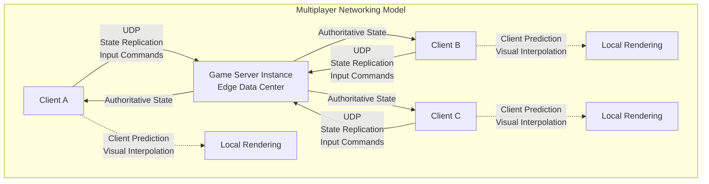
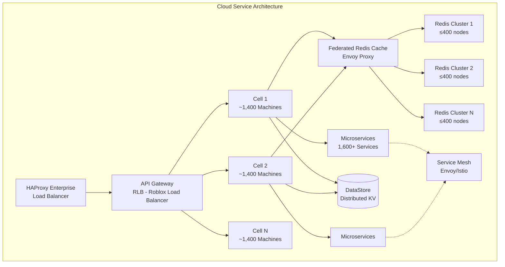
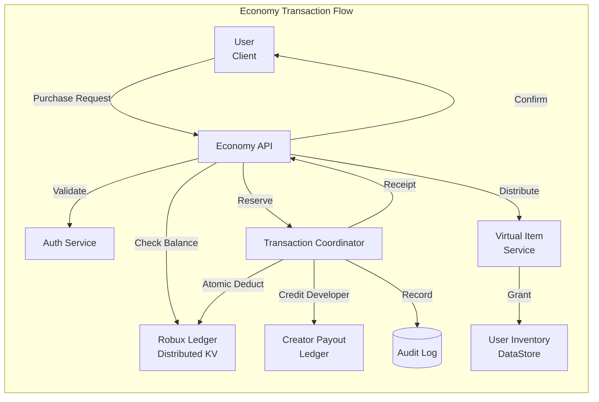
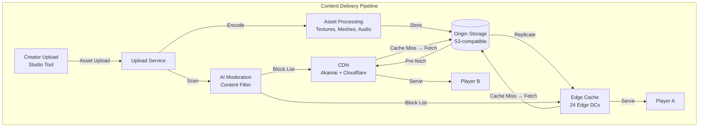

# Roblox Architecture

## Architecture Diagrams









## What Is It

Roblox is a global user-generated content (UGC) gaming platform where millions of creators build 3D multiplayer experiences using proprietary tools and scripting (Luau). Players access these experiences across desktop, mobile, console, and VR. The platform serves 85M+ daily active users, supports 30M+ concurrent players, and hosts millions of unique experiences powered by a custom game engine, a proprietary UDP-based networking protocol, a distributed key-value data store, and a microservices cloud architecture spanning 24+ edge data centers and 2 core data centers.

## Architecture Overview

Roblox's infrastructure is split into two distinct layers: the **game server layer** that runs player experiences at the edge, and the **core services layer** that runs platform-wide systems (website, economy, safety, recommendations). A global private network interconnects all edge data centers to the core data centers, with edge data centers serving as a firewall protecting core services.

**Game Server Layer (24 edge data centers):**
- Runs millions of game server instances close to players
- Each instance runs the Roblox game engine (C++) with Luau script execution
- Handles physics simulation, rendering commands, state replication
- Proprietary UDP-based networking protocol for real-time multiplayer
- Players matched to nearest edge data center via latency-optimized matchmaking

**Core Services Layer (2 data centers, active-passive → active-active):**
- Website and discovery platform
- Recommendation algorithms
- Safety filters (text, image, audio)
- Virtual economy (Robux ledger, transactions)
- Creator publishing pipeline
- Analytics platform (2 trillion events)

**Compute infrastructure:**
- ~145,000 machines running primarily on-premises
- Hybrid cloud with cloud bursting for peak demand
- Cellular architecture with ~1,400 machines per cell for blast isolation
- Service mesh (Envoy/Istio) for inter-service communication
- HashiCorp Nomad for workload orchestration
- HAProxy Enterprise + Roblox Load Balancer (RLB) for traffic ingress

## Deep Dives

### Game Engine Architecture

Roblox's game engine is a custom C++ engine that runs both server-side (authoritative) and client-side (rendering + prediction). Every experience runs as a server instance on Roblox infrastructure, while each connected player runs a thin client.

**Luau Script Runtime:**
- Luau is Roblox's evolved dialect of Lua 5.1 with gradual typing, performance optimizations, and safety sandboxing
- Compiled to bytecode at upload time, executed by a custom VM
- Type inference and compile-time analysis catch errors before publishing
- Memory limits, execution caps, and API restrictions enforce sandboxing per experience
- Memory limits: per-script heap cap (configurable by experience, default ~256MB), execution time limits per frame (200ms default), instruction counting
- Bytecode verification at upload prevents malicious code patterns
- Luau type inference catches ~40% of scripting errors at compile time, reducing runtime crashes
- ~1,000 Roblox engineers use internal tools to maintain the runtime

**Rendering Pipeline:**
- Deferred rendering engine supporting PBR materials, dynamic lighting, shadows
- Future Engine: next-gen renderer with unified forward+ pipeline, clustered lighting, temporal anti-aliasing
- Roblox Reality (2026): hybrid architecture combining the game engine's structured simulation with Video World Models running on cloud-edge H200/B200-class GPUs for photorealistic super-sampling at 2K/60Hz

**Physics Engine:**
- Custom rigid-body physics with broadphase (SAP/bounding volume hierarchy) and narrowphase detection
- Supports collision primitives: spheres, boxes, capsules, meshes, terrains
- Character controllers: state machines with idle/walk/run/jump/fall states, auto-stair stepping, obstacle climbing
- Constraint system: hinges, springs, ropes, welds, attachments for building mechanisms
- Physics runs at 60 Hz server-side for determinism; clients interpolate at 60-240 Hz for smooth visuals
- Ownership transfer: physics objects can migrate between server authority and client authority for responsive player interactions
- Region-based physics partitioning: only active regions (near players) simulate at full fidelity; distant regions sleep

**Audio Engine:**
- 3D spatial audio with HRTF-based binaural rendering for headphones
- Dynamic reverb zones with custom impulse responses per environment
- Audio streaming: Ogg Vorbis decoded in chunks; priority system drops distant sounds first
- Voice chat: Opus codec with VAD (voice activity detection), echo cancellation, noise suppression
- Audio ducking: foreground sounds reduce background music/ambient volume dynamically

### Multi-Player Networking (Roblox Networking Protocol)

Roblox uses a custom, proprietary UDP-based networking protocol designed specifically for the constraints of UGC multiplayer gaming. It is not WebRTC or standard RUDP — it is purpose-built for tens of millions of concurrent players across millions of diverse, creator-written game scripts. The protocol must handle everything from a simple 2-player obby to a 200-player battle royale with complex physics.

**Protocol Design:**
- **Transport:** UDP with application-level reliability. TCP is avoided because head-of-line blocking and retransmission delays are unacceptable for real-time gameplay
- **Packet types:**
  - *Input frames*: client→server, contains player actions (key presses, mouse clicks, camera orientation) at 30-60 Hz, typically ~100 bytes per frame
  - *State snapshots*: server→client, contains authoritative positions, velocities, physics state for visible objects; compressed delta from previous snapshot
  - *Remote procedure calls (RemoteEvents/RemoteFunctions)*: fire-and-forget or request-response over UDP; per-message reliability and ordering flags
  - *Property replication*: automatic sync of game object properties marked with the `Replicated` attribute; only sends changed values
  - *Heartbeat/ping*: bidirectional keep-alive with RTT measurement for latency compensation
- **Serialization:** Custom binary protocol; object references encoded as 16-32 bit network IDs (mapped to game objects at join time); property values use type-specific encoding (floats quantized to 16-bit half-floats, vectors delta-compressed); state snapshots use frame-to-frame delta compression

**Packet Loss Mitigation:**
- Application-level ACKs for reliable messages (RemoteFunction calls, critical state)
- Redundant sends for important state (player health, score) across multiple snapshots
- Sequence numbers on all packets for out-of-order detection and discard
- Adaptive send rate: server reduces snapshot frequency when it detects client packet loss

**State Replication:**
- Server maintains authoritative world state; clients predict locally
- Replication scope: objects replicated only to clients within a certain radius (replication range, default ~1000 studs) to conserve bandwidth
- Property-level dirty tracking: per-property dirty flag reset after serialization; only changed properties sent per frame
- Interest management: server computes relevance set per client based on position, camera frustum, line-of-sight, and game-defined rules via `GetPlayerFromCharacter()` and custom relevance functions
- Bandwidth budgeting: per-client cap (~256 Kbps typical, configurable by experience); high-priority data (player position, health) sent first; lower-priority (distant animations, decorative objects) throttled or dropped
- Instance streaming: objects load/unload based on proximity; player sees ~500m radius of world at any time

**Client-Side Prediction & Reconciliation:**
- Client predicts its own movement immediately using latest input (no round-trip wait)
- Server sends authoritative state snapshots at 5-20 Hz depending on server load and player count
- Client stores last N predicted states in a ring buffer (typically last 0.5-1 second)
- On receiving snapshot: client rewinds to snapshot time, applies server state, replays buffered inputs forward
- Visual interpolation: rendered state is slightly behind (100-200ms) authoritative for smoothness; linear or hermite interpolation between known states
- Extrapolation for non-player objects: if no snapshot received for >150ms, dead-reckoning using last known velocity
- Position correction: if predicted position diverges >1 stud from server, smooth correction over 100ms to avoid teleportation

**Ownership Transfer:**
- Game objects have an owning peer (server or specific client)
- Client-owned objects (player vehicle, tool in hand): client sends input directly; server validates for abuse (speed hacks, teleportation) and relays state to other clients
- Ownership can transfer dynamically (picking up an item transfers ownership to the picker for responsive interaction)
- Network ownership: configurable per object; `SetNetworkOwner(nil)` returns ownership to server for anti-cheat

**Matchmaking & Session Management:**
- Matchmaking system evaluates up to 4 billion possible join combinations per second at peak
- Goal: 10 million joins in 10 seconds; designed from the start to handle thundering herds
- Join flow: resolve nearest edge DC → within DC, find cell with capacity → within cell, find or create game server instance → join the instance
- Thundering herd support: when Grow a Garden hit 21.6M CCU, matchmaking scaled by farming out join evaluations across cells and cloud-bursting new game instances dynamically
- Cloud bursting: on Friday, if capacity models predict weekend surge, virtual edge data centers provisioned from cloud partners within hours
- Reserved servers: TeleportService:ReserveServer creates private instances for matchmade lobbies, raid instances, party arenas

**Cross-Server Communication:**
- MessagingService: pub/sub per-experience channel for broadcast (~150ms latency, 60 msg/min per topic limit, best-effort, 1KB payload max; messages silently dropped under load — treat as fire-and-forget event bus, not reliable queue)
- MemoryStoreService: Redis-style key/value with HashMap (atomic field updates), SortedMap (leaderboards with UpdateAsync), Queue (cross-server work distribution); sub-50ms reads; 30-day TTL; used for cross-server leaderboards, session locks, in-flight trades, global economy ledgers
- Reserved server pattern: call ReserveServer to get a private access code; stable identity for routing; 30-second grace period after last player leaves before teardown

### Data Store Architecture

Roblox's persistence layer has evolved through three generations: bare-metal Redis managed per-team, managed Memcached clusters, then a Redis-as-a-service model — and now a federated, multi-tier system spanning hot cache, warm state, and cold durable storage.

**DataStore (Durable State — System of Record):**
- Distributed key-value store for persistent game state: player inventories, currency balances, game progress, purchase history
- Built on Cassandra-derived foundations with custom Roblox extensions for ordering, throttling, and access control
- Consistency: eventually consistent reads (latency optimized); strongly consistent writes via CAS (Compare-And-Swap) using UpdateAsync pattern
- Data model: partitioned by (experience_id, key_prefix); keys ordered lexicographically within a partition for range scans
- Key format: `experience_id/user_id/property_name` for player data; up to 4KB key length, 64KB value size
- Throttling: per-experience read/write limits prevent one game from saturating the system (default ~200 writes/sec per experience, burstable)
- Ordered DataStore: indexed by insertion order for leaderboards; supports ascending/descending enumeration
- The 30-day TTL boundary: MemoryStore for hot data (minutes to hours), DataStore for durable state (months to years)
- Best practice: write to DataStore on session-end or savepoint, not every frame; use MemoryStore for real-time coordination

**MemoryStore (Hot/Coordination State):**
- Redis-style in-memory key-value store with atomic operations and native data structures
- Sub-50ms read latency (10x faster than DataStore); 30-day maximum TTL (can evict earlier under memory pressure)
- Data structures: HashMap (atomic field-level UpdateAsync for e.g. trade offers), SortedMap (global leaderboards with max-of-current-and-new merge), Queue (cross-server work distribution with TTL per message)
- Use cases: cross-server leaderboards, fleet-wide rate limiters, session locks (prevent double-teleport), in-flight trade coordination, matchmaking queues
- Not a system of record: data evicts at 30 days or under memory pressure; always persist to DataStore

**Federated Redis Caching Layer (Massive Scale):**
- Architectural problem: single Redis cluster gossip protocol becomes unstable past ~400 nodes; each node must gossip with all peers, consuming CPU and network
- Solution: client reverse proxy (Envoy-based) sits in front of multiple independent Redis clusters, presenting them as one unified cache to applications
- Scale: largest deployment = 6,000+ Redis nodes across 15+ independent clusters; peak load 1.38 billion QPS; single logical cluster tops 100M QPS
- Dual-writing migration: during the federation rollout, the proxy wrote to both the legacy cluster and new federated destinations simultaneously, then gradually shifted reads
- Migration catalysed by Grow a Garden: one cluster saw 10x traffic surge from 10M QPS to 100M+ QPS in 3 months
- Client-side resiliency: retry budgets (max X% of requests retried), circuit breakers (open after failure threshold), rate-limiting (per-service outbound caps), timeouts with exponential backoff
- Hot key detection: samples live traffic to identify keys receiving disproportionate access; proactively throttles at both server and client side
- Infrastructure: runs on physical machines in Roblox's own DCs; Redis backend nodes are memory-bound (fine-tuned scheduling, container size optimization reduced fragmentation); client proxies are CPU-bound (autoscaling with tighter CPU deviation targets)
- Next generation: migrating toward ValKey-based multi-tenant caching service for better resource isolation and cost efficiency

**Consistency Strategy Across Tiers:**
```
Client → MemoryStore (sub-50ms, possibly stale, 30-day TTL)
       → DataStore (eventual reads, strong CAS writes, unlimited retention)
       → Federated Redis Cache (1.38B QPS capacity, multi-cluster, auto-failover)
```
- Pattern: write to DataStore (source of truth), write to cache (TTL), read from cache, fall back to DataStore on miss
- Cross-DC replication: async replication between core data centers for DataStore; cache is local to each DC/cell

**Observability & Tooling:**
- Comprehensive health monitoring tracking server success rates and client-side failures across the entire request lifecycle
- C3 dashboards (Continuous Capacity Correctness): each service predicts and manages its own Redis fleet CPU capacity
- Chaos testing: randomly inject faults, exhaust resources, terminate processes in production to validate cache tier resilience

### Economy System

Roblox operates one of the world's largest virtual economies, processing billions of Robux transactions daily across millions of creator-owned experiences. The economy must be consistent (no double-spends), auditable (every Robux traceable), and scalable (millions of concurrent purchases).

**Robux Ledger (Core Accounting System):**
- Distributed ledger service tracking all Robux balances across users, creators, groups, and Roblox operational accounts
- Atomic debit/credit operations guaranteed via idempotency tokens (UUID per transaction request); replaying the same token is a no-op
- Transaction coordinator implements a two-phase-like protocol: reserve → commit/rollback — ensures ACID semantics across multiple ledger entries (buyer debit, creator credit, marketplace fee)
- Write-ahead logging with replay for crash recovery; transactions queued in Kafka before processing
- Per-account balance sharded across multiple ledger partitions to avoid hotspot accounts

**Purchase Flow (End-to-End):**
```
1. Client → Purchase Request (item_id, price_robux, idempotency_token)
2. Economy API → Validate: auth token, item exists, price matches, user can afford
3. TransactionCoordinator → Reserve funds in buyer's Robux ledger partition
4. TransactionCoordinator → Atomic debit from buyer, credit to creator pending balance
5. TransactionCoordinator → Record audit entry (buyer_id, seller_id, item_id, amount, timestamp)
6. Economy API → VirtualItemService.GrantItem(buyer_id, item_id) → DataStore write
7. Economy API → Confirm response to client with receipt
8. Creator Payout Ledger accumulates pending balance for periodic withdrawal
```
- Failure handling: if step 6 fails (DataStore write fails), transaction coordinator rolls back step 4 and returns error; client retries with same idempotency token
- Cross-experience purchases: items purchased in one experience available in all (avatar items, game passes); catalog service manages global item registry

**Premium Payouts (Engagement-Based):**
- Premium subscription revenue (monthly fee from subscribers) pooled and distributed to creators proportional to premium user engagement time in their experiences
- Daily calculation: for each premium subscriber, compute time spent per experience → allocate revenue share
- Separate pipeline from direct purchase revenue; paid out to creators monthly via XSOLLA, PayPal, or wire transfer
- Exchange rate: Robux → USD (developer exchange/DevEx program); minimum payout thresholds (currently ~100K Robux minimum)

**Developer Products vs Game Passes:**
- Developer Products: one-time purchases usable in-experience (currency packs, power-ups, loot boxes); consumable
- Game Passes: persistent perks tied to an experience (double jump, private server access); non-consumable
- Both processed through the same transaction coordinator with a `product_type` flag distinguishing them

**Fraud & Anti-Exploit:**
- Velocity checks: unusual purchase frequency triggers manual review
- Stolen account detection: login geography changes + rapid spending flags account for lockout
- Chargeback handling: if a Robux purchase via credit card is reversed, equivalent Robux removed from account (into negative if necessary)
- Marketplace fee: Roblox retains ~30% of each transaction (varies by creator program tier)
- Global transaction limits: daily/weekly spending caps per account enforced server-side

**DevEx (Developer Exchange):**
- Creators can cash out earned Robux for real currency at a fixed exchange rate
- Minimum 100K Robux threshold; identity verification (KYC) required
- Anti-money-laundering: withdrawal limits per month; source-of-funds checks for large amounts
- Separate tracking: earned Robux (from engagement, sales) vs purchased Robux; only earned Robux is withdrawable

### Observability & Engineering Tools

Roblox's internal developer platform, built over several years, enables ~1,000 engineers to manage 1,600+ microservices with high velocity while maintaining reliability.

**Microservice Lifecycle Platform:**
- Homegrown application lifecycle management tool for creating, deploying, monitoring, and debugging microservices in a single interface
- Self-service: any engineer can scaffold a new microservice with pre-built templates (Go, Java, C#, Python) including logging, metrics, health checks, and circuit breakers
- Automated CI/CD: GitHub Actions-driven pipeline builds, tests, canary-deploys (5% traffic, monitor 10 minutes), then rolls out globally
- Canary analysis: automated comparison of latency, error rate, CPU, memory between canary and baseline; rollback on regression — prevented hundreds of production bugs in first 6 months
- Default alerting: every service automatically gets alerts for latency (p99 > threshold), traffic (spike > 3x baseline), errors (>1% rate), saturation (CPU > 80%) — zero configuration

**Code Center (Inner-Loop Development):**
- Custom code review tool integrated with GitHub; reduces friction in the review process
- Real-time Slack notifications for PR assignments and comments; scheduled daily digests of pending reviews
- AI-assisted code review: auto-suggests reviewers based on file ownership patterns; flags common anti-patterns before human review

**Advanced Observability Platform:**
- Unified platform integrating homegrown, open-source (Prometheus, Grafana, Jaeger), and vendor tools
- Scale: billions of time series, tens of terabytes of structured runtime data (logs, traces, system events, profiling data) collected daily
- Distributed tracing: Jaeger-based with automatic span context propagation through the common microservice framework
- Profiling: continuous CPU/memory profiling across production fleet; flame graphs for performance regression analysis
- Custom dashboards: every team builds and maintains their own C3 (Continuous Capacity Correctness) dashboard for capacity prediction
- Network telemetry: custom collector architecture using Kafka for device metric aggregation, supporting 10x future scale over legacy SNMP polling

**Reliability Engineering Practices:**
- TACO (Test Actual Capacity On) Tuesdays: deliberately constrain a few services' capacity in production each Tuesday, observe behavior, fix before weekend peak
- Chaos testing platform: randomly injects faults (network partitions, process kills, resource exhaustion) in production to validate resiliency
- Adaptive Concurrency Control (ACC): automatically limits in-flight requests per service when latency degrades
- Circuit breakers and retry shedding: prevent cascading failures across service dependencies
- Incident management: Monday incident reviews → Tuesday capacity planning → Wednesday/Thursday chaos testing → Friday cloud resource provisioning
- EPI (Engineering Productivity Index): composite metric tracking velocity, quality, reliability; improved 12.9% YoY in Q4 2024
- MTTM (Mean Time To Mitigate): reduced by 50% in two consecutive years through platform investments

### Roblox Reality — Hybrid Rendering (2026)

Roblox Reality, announced in April 2026, represents a fundamental shift toward photorealistic user-generated content. It is a hybrid architecture combining the traditional game engine's structured simulation with Video World Models running on cloud-edge GPUs.

**Architecture split:**
- **Roblox Game Engine (structured simulation):** handles persistent world state, physics, collision detection, multiplayer consistency, scoring, game logic — all deterministic, structured layers requiring server authority
- **Roblox Video Model (super upsampler):** takes rendered video output + 3D spatial data (camera motion, geometry, depth buffers, segmentation masks) and applies a Video World Model to generate photorealistic 2K/60Hz output with stochastic details (water droplets, leaf flutter, ray-traced reflections, dynamic global illumination)

**Infrastructure:**
- Video Model inference runs on H200/B200-class GPUs in edge-adjacent data centers (separate from game server instances to avoid resource contention)
- Rendered video streamed to client via low-latency streaming protocol (sub-50ms encode + transmit)
- Future plan: client overlays locally-rendered upsampled avatar on the video feed for sub-15ms responsiveness on foreground actions while background receives cloud-rendered photorealism

**Implications:**
- Democratization: creators do not need to author photorealistic assets; the Video Model generates visual fidelity from simpler geometry and materials
- Reduced asset size: since the Video Model enhances output server-side, client download sizes shrink
- Increased per-user GPU cost: Roblox is investing in inference efficiency to make this economical at 30M+ CCU
- New edge infrastructure category: GPU-accelerated edge data centers for rendering, distinct from game server compute cells

Every asset on Roblox — meshes, textures, audio, scripts, thumbnails, decals — flows through a multi-stage pipeline from creation to player delivery.

**Upload & Processing:**
- Creator uploads via Roblox Studio (desktop authoring tool) or programmatic API
- Upload service validates file format, scans for malware, checks file size limits (varies by asset type)
- Asset processing converts to optimized runtime formats:
  - Textures: PNG → DDS-compressed mipmapped textures with automatic LOD generation
  - Meshes: OBJ/FBX → robomesh (custom binary format with multiple LOD levels, compressed vertex data)
  - Audio: MP3/WAV → Ogg Vorbis at multiple bitrates (32, 64, 128 Kbps) for adaptive streaming
  - Animations: BVH/FBX → roblox-animation (keyframe-compressed with quantization)
  - Scripts: Luau source → bytecode (compiled at publish time, verified for sandbox violations)
- Parallel processing: asset pipeline workers horizontally scale based on upload queue depth (Kafka-based work distribution)
- Failure handling: failed processing → retry queue (3 attempts) → manual review for edge cases

**Content Distribution (CDN):**
- Multi-CDN strategy using Akamai + Cloudflare + custom edge caches; avoids single-provider dependency
- Origin storage: S3-compatible object storage in core data centers; assets replicated across both core DCs for redundancy
- Edge caching: all 24 edge data centers maintain hot caches (RAM-backed, SSD-backed for larger assets), pulling from origin on cache miss
- Pre-fetching: predictive asset loading based on game join patterns and content popularity; when a player joins an experience, the top 50 most-likely-needed assets are pre-fetched to the edge DC
- Version pinning: each published experience version pins asset content hashes; CDN uses content-based addressing (hash in URL) for infinite cache lifetime and instant invalidation on version change
- Asset bundling: related assets (all textures for a mesh) are bundled into a single archive to reduce HTTP request overhead; client decompresses on load
- Thumbnail generation: dedicated render farm generates thumbnails for catalog items, experiences, user avatars; cached with CDN TTL of 24 hours; regenerated on content change

**Caching strategy:**
- L1: Client-side cache (local file cache on player device, ~500MB-2GB)
- L2: Edge data center cache (RAM-backed, 24 locations)
- L3: CDN (Akamai/Cloudflare, hundreds of global PoPs)
- L4: Origin (core data center, S3-compatible)
- Cache tags allow selective invalidation per experience version

### Moderation & Safety

Roblox operates one of the largest content moderation systems on the internet, processing user-generated text, images, audio, 3D assets, and voice communication at platform scale — across 85M+ DAU and millions of active experiences. The challenge is unique: moderation must not slow down the creator publishing pipeline nor interrupt real-time communication.

**Text Filter (Chat & Communication):**
- Real-time inference processing 250,000 requests per second at peak
- Large language model scanning for: harassment, profanity, personal information (PII leaks), scams/phishing, hate speech, sexual content, threats
- Architecture: optimized GPU inference serving ~250,000 tokens/second with expanding context windows for multi-message conversations
- Context-aware evaluation: filters assess conversational context (e.g., "kill" in "that boss is killable" vs "I will kill you") — not simple keyword matching
- Multi-language support: dozens of languages with language-specific models and cultural nuance handling
- Rate limits per user per second to prevent spam floods; silent blocking (user cannot tell they are filtered)
- Escalation: repeated violators flagged for account review; egregious violations (grooming, threats) trigger immediate account suspension

**Asset Moderation (Upload Pipeline):**
- Every uploaded asset (image, mesh, audio, video, decal, shirt template) runs through automated AI pipelines before publication
- **Computer vision models:**
  - NSFW detection: nudity, sexual content, suggestive poses
  - Violence detection: gore, weapons, self-harm imagery
  - Hate symbol detection: known hate group imagery, Nazi symbolism, gang signs
  - OCR-based: text in images scanned for policy-violating content
- **Audio fingerprinting:** Shazam-like algorithm detects copyrighted music in uploaded audio; blocks or flags for copyright holder
- **3D mesh analysis:** examines mesh topology for inappropriate content (anatomical shapes, weapon models)
- **Scale:** 300+ AI inference pipelines running in production, each GPU or CPU optimized per workload
- Human review queues: borderline content (model confidence 60-90%) goes to human moderators; high-risk (child safety) gets priority queue with 15-minute SLA
- Automated appeal: creator edits asset and re-uploads; re-scan runs immediately; three strikes for policy violations → publishing restrictions

**Voice Chat Moderation:**
- Real-time audio transcription (speech-to-text) for voice chat
- Toxicity detection models scan transcribed text for harassment, hate speech, threats
- End-to-end latency target: <500ms from utterance to moderation decision
- Ephemeral: audio not stored; only flag metadata retained for enforcement
- Opt-in: voice chat requires age-verified account + phone number

**Behavioral & Platform Safety:**
- **Multi-modal signals:** cross-references text chat + asset uploads + gameplay behavior + account age to detect coordinated bad actors
- **Parental controls:** account PIN, spending limits (daily/weekly), friend request filtering, chat visibility (no one/friends/followers), experience-level maturity locks
- **Privacy-by-design:** avatar-only representation (no real identity or camera); real name never shared; age ranges instead of birth dates in profiles
- **Account security:** 2FA, login alerts, device management, session revocation
- **Takedown API:** automated DMCA takedown processing with counternotice workflow

**Safety Infrastructure & Operations:**
- Models trained on labeled datasets from ~5,000 human moderators worldwide
- Continuous model improvement: A/B testing on shadow traffic before production rollout
- Privacy guarantees: no personal data in model training corpora; differential privacy techniques
- 24/7 operations: moderation team distributed across time zones with escalation paths
- Regulatory compliance: COPPA (US), GDPR (EU), KOSA (UK), age-gating for mature content per region
- Transparency reports: quarterly publication of moderation statistics (accounts actioned, content removed, appeals upheld)

## Scaling Strategy

Roblox's growth from a child-focused game site to 85M+ DAU with 30M+ concurrent users and a single experience hitting 21.6M CCU required fundamental architectural evolution across every layer.

### Infrastructure Evolution Timeline

| Phase | Period | Architecture |
|-------|--------|-------------|
| Startup | 2004-2012 | Monolithic web app + single database, few game servers |
| Growth | 2013-2018 | Service decomposition, first edge DCs, Cassandra adoption |
| Microservices | 2019-2021 | 1,600+ services, dedicated edge/core DC split, Redis caching |
| Cellular | 2022-2024 | Active-passive DCs, cell architecture (~1,400 machines/cell), service mesh |
| Federated | 2024-2026 | Active-active experiments, federated Redis (6,000+ nodes), ValKey multi-tenant |
| Hybrid | 2026+ | Cloud bursting cells, Roblox Reality hybrid rendering, photorealistic cloud-edge GPU |

### Key Challenge-Solution Table

| Challenge | Solution |
|-----------|----------|
| **Monolithic data center failure** | Active-passive → active-active data centers; cellular architecture with strong blast walls |
| **Redis gossip protocol ceiling** | Federated caching: Envoy reverse proxy across 15+ clusters, 6,000+ nodes, 1.38B QPS |
| **Thundering herd matchmaking** | Re-designed matchmaking evaluating 4B combinations/sec; cloud bursting; 10M joins in 10s goal |
| **Hardware load balancer bottlenecks** | F5 hardware (6-week provisioning) → HAProxy Enterprise → RLB on Nomad (minutes, self-service) |
| **Capacity unpredictability** | Weekly TACO Tuesdays; C3 dashboards; 2-year forward planning; dark capacity for network cuts |
| **Service discovery at cell scale** | Service mesh (Envoy/Istio) for cross-cell routing; Nomad for orchestration |
| **10x traffic surge (Grow a Garden)** | Federated cache dual-write migration; dynamic virtual edge DCs from cloud partners |
| **Microservice management complexity** | Internal lifecycle platform for 1,600+ services; automated canary analysis; default alerts |
| **Global latency for real-time gaming** | 24 edge data centers; global private network; geographic player-to-server routing |
| **Creator code unpredictability** | Sandboxed Luau execution with bytecode verification; per-script memory/CPU caps; server instance isolation |
| **Analytics at hyperscale** | Kafka-based event pipeline processing 2 trillion events; adaptive concurrency control for backpressure |

### Cellular Architecture Deep Dive

Roblox's cellular architecture is its primary blast isolation strategy. Each cell is a self-contained unit of compute designed to limit failure propagation.

**Cell structure:**
- ~1,400 machines per cell, uniform configuration defined as infrastructure-as-code (entire cell definition in source control)
- Each cell contains redundant copies of critical services (auth, caching, data store proxies, game server orchestration)
- Cells are load-balanced: a failed cell can be deactivated with traffic re-routed to remaining cells
- Building a cell: automated tooling provisions all 1,400 machines from bare metal → OS → container runtime → service deployment in hours
- Reprovisioning: entire cell can be wiped and rebuilt from scratch using the IaC definition (novel at this scale — most companies reprovision individual machines, not 1,400-machine blocks)

**Service requirements to run in a cell:**
1. Containerized (Docker images with resource limits; no OS-level config drift)
2. Stateless or with externalized state (state stored in DataStore/Redis, not local disk)
3. Health-checked with readiness/liveness probes (for automated load balancer drain)
4. Graceful shutdown handling (SIGTERM → drain connections → exit)
5. No hardcoded IPs or hostnames (discovery via service mesh DNS)

**Current state:**
- 70%+ of backend service traffic served through cells
- Remaining 30%: legacy services being migrated; progress slowed by the need to refactor assumptions about infrastructure topology
- Active-passive DC setup: one DC active, one on standby; cell architecture replicated in both
- Active-active experiments: running since September 2024 with limited user traffic; identifies data access patterns needing rework for multi-DC writes
- Future: fully active-active with instantaneous failover; cross-cell communication policies via service mesh

### Load Balancing Evolution (F5 → HAProxy → RLB)

Roblox's load balancing journey illustrates a hardware-to-software-to-self-service progression:

**Phase 1 — F5 Hardware Appliances (pre-2020):**
- Physical chassis deployment: 6-week lead time to provision new capacity
- Initial configuration done by hand; no automation for adding VIPs
- Cluster-based scaling: when cluster overwhelmed, new cluster manually deployed
- Cost exceeded value; vendor lock-in concerns
- COVID-era growth revealed hard scaling ceiling

**Phase 2 — HAProxy Enterprise (2020-2023):**
- Migrated to software-based load balancing on commodity hardware
- HAProxy Enterprise with Dynamic Update Module: map file updates via GitHub PR → Consul KV store → HAProxy picks up without reload
- Stick tables: flexible KV stores built into HAProxy for session persistence
- WAF integration: unified security policy deployed gradually via Dynamic Update pipeline

**Phase 3 — RLB (Roblox Load Balancer, 2023+):**
- Built on HAProxy Enterprise Docker container, orchestrated with HashiCorp Nomad
- Self-service: service owners self-register and configure LB settings (round-robin, least-connections) by adding tags to service registry
- Auto-recovering: Nomad automatically reschedules failed LB instances
- CI/CD pipeline: daily canary of latest HAProxy Enterprise Docker (5% fleet → monitor → full rollout)
- Zero team intervention for traffic splits and service migrations

### Capacity Planning & Reliability

Roblox's capacity planning cycle reflects the unpredictability of creator-driven content:

**Weekly cycle:**
- **Monday:** Incident review from previous weekend peak; analyze what failed, what was close to capacity
- **Tuesday:** Capacity planning — review C3 dashboards, project weekend traffic, identify bottlenecks
- **Wednesday-Thursday:** Chaos testing — TACO (constrain specific services in production), fault injection, load testing
- **Friday:** Cloud resource provisioning — if models predict weekend surge, provision virtual edge DCs from cloud partners

**Forward planning:**
- 2-year capacity predictions: data center acquisition, server hardware refreshes, physical networking
- New DCs planned years ahead (e.g., Brazil DC was in planning for multiple years)
- Dark capacity: networking team maintains spare capacity for cable cuts and unexpected failures
- Hybrid cloud: physical edge DCs (24) + virtual edge DCs from cloud partners (dynamic, hours to provision)

**Analytics & Observability:**
- 2 trillion event analytics pipeline feeds capacity models
- 30% traffic swings common from popular creator updates — ACC, circuit breakers, and retry shedding protect against this
- C3 (Continuous Capacity Correctness): each service owner has a dashboard tracking CPU capacity prediction vs actual; enables learning from each peak to adjust next prediction

## Key Metrics

| Metric | Value | Context |
|--------|-------|---------|
| Daily Active Users (DAU) | 85.3M (Feb 2025) | Grew from 50M in 2021 |
| Peak Concurrent Users (CCU) | 30M+ (June 2025) | All-time high across all experiences |
| Single Experience CCU Record | 21.6M (Grow a Garden) | Guinness World Record, most concurrent players in a video game |
| Total Machines | ~145,000 | Tripled from ~36,000 in 2021 |
| Edge Data Centers | 24 worldwide | Private DCs + cloud virtual DCs |
| Core Data Centers | 2 | Active-passive → transitioning to active-active |
| Microservices | 1,600+ | Managed via internal lifecycle platform |
| Cache Peak QPS | 1.38 billion | Largest federated Redis deployment |
| Single Logical Cache Cluster QPS | 100M+ | Grew 10x in 3 months (Grow a Garden) |
| Redis Nodes | 6,000+ across 15+ clusters | Federated via Envoy reverse proxy |
| Max Redis Nodes per Cluster | ~400 | Practical gossip protocol limit |
| AI Inference Pipelines | 300+ | Mix of GPU and CPU optimized |
| Text Filter Peak RPS | 250,000 requests/second | LLM inference at platform scale |
| Text Filter Token Throughput | 250,000 tokens/second | Expanding context windows |
| Matchmaking Combinations Evaluated | 4 billion/second | Peak thundering herd processing |
| Analytics Pipeline | 2 trillion events | Kafka-based, 30% traffic swings common |
| Machines per Cell | ~1,400 | Uniform, IaC-defined |
| Game Server Instances | Millions | Running across 24 edge DCs |
| Load Balancer | HAProxy Enterprise → RLB | Self-service via Nomad orchestration |
| Container Orchestration | HashiCorp Nomad | Used for RLB and microservices |
| Cache Tier Memory | Memory-bound (Redis) + Compute-bound (Envoy proxy) | Co-located on same machine pool |
| MTTM Improvement | 50% reduction two consecutive years | Driven by platform observability investments |
| EPI (Engineering Productivity Index) | 12.9% YoY improvement (Q4 2024) | Composite of velocity, quality, reliability |
| Failure Blast Radius | Contained to single cell (~1,400 machines) | Early warning: entire DC was the blast radius |

## Lessons Learned

| Lesson | Detail | Category |
|--------|--------|----------|
| **Federated cache over giant clusters** | Redis gossip protocol breaks past ~400 nodes; federation via Envoy reverse proxy enables 6,000+ node deployments with predictable performance and sub-millisecond overhead | Data/Storage |
| **Cells contain chaos** | Uniform, infrastructure-as-code cells with strong blast walls prevent data-center-wide failures; 1,400 machines per cell is the right granularity — small enough for fast reprovision, large enough to absorb traffic | Infrastructure |
| **Active-passive is not enough** | Manual failover takes hours; active-active with load distribution is essential for near-instantaneous failover; data access patterns must be designed for multi-DC writes from day one | Reliability |
| **Thundering herds must be designed for** | Most systems throttle joins; Roblox rebuilt matchmaking system to handle 21M+ simultaneous joins by evaluating billions of combinations per second across cells and cloud-burst instances | Gaming |
| **Self-service load balancing** | Moving from F5 hardware (6-week provisioning) to HAProxy Enterprise + RLB on Nomad (minutes, self-service) transformed operational agility; service owners self-register LB configs | Infrastructure |
| **Dual-write for cache migration** | Zero-downtime migration to federated cache achieved via dual-write strategy at the proxy layer; write to both old and new, verify, then cut reads — applicable to any data migration | Data/Storage |
| **Creator code is unpredictable** | Unlike traditional games with controlled release cycles, Roblox cannot control when creators update or how popular their game becomes; capacity planning must build in 2-3x headroom for unknowns | Gaming |
| **TACO Tuesdays** | Deliberately constraining production service capacity each Tuesday identifies breaking points before weekend peak traffic; low-cost chaos engineering that every team can adopt | Reliability |
| **AI moderation at upload speed** | 300+ AI pipelines must complete within the publish flow without blocking creators; GPU/CPU inference mix optimized per pipeline; borderline cases deferred to human review with SLAs | Safety |
| **1000 engineers, one platform** | Internal lifecycle platform + code center + advanced observability stack reduced MTTM by 50% two years running; EPI dashboard aligns all teams on velocity, quality, reliability | Engineering Culture |
| **Edge DCs as firewall** | Arcitecture where edge data centers (game servers) act as a firewall protecting core services was intentional: even if every game server is compromised, core services (economy, auth, data) remain isolated | Security |
| **Game server isolation** | Each experience runs in its own server instance with strict resource limits (CPU, memory, network); one creator's infinite loop or memory leak cannot affect other experiences | Gaming |
| **Multi-tier caching is essential** | L1 client cache → L2 edge DC → L3 CDN → L4 origin storage; each layer saves ~10x requests to the next; client cache alone eliminates ~60% of repeated asset downloads | Content Delivery |
| **Ownership transfer reduces server cost** | By allowing physics objects to be owned by clients, Roblox offloads significant server computation to player devices; validated by ~10M+ concurrent players, each device handling its own interpolation | Networking |
| **Analytics-driven capacity** | 2 trillion events per day feed capacity prediction models; 30% traffic swings are normal — ACC, circuit breakers, and retry shedding are mandatory, not optional, at this scale | Operations |
| **Chaos engineering in production** | Randomly fault-injecting production services and terminating processes catches weaknesses that staging never will; done daily, not annually | Reliability |

## Interview Questions

1. How does Roblox's custom UDP networking protocol handle state replication for millions of concurrent players across millions of different games? Describe the packet types, serialization format, interest management, and bandwidth budgeting.

2. Design a federated caching layer that can scale beyond a single Redis cluster's gossip protocol limit of ~400 nodes. How would you handle dual-write migration, hot key detection, and client-side resiliency (retry budgets, circuit breakers, rate limiting)?

3. How does Roblox's cellular architecture provide blast isolation? What requirements must services meet before running in a cell, and how does the architecture enable full-cell reprovisioning at ~1,400 machines per cell?

4. Describe the Roblox economy transaction flow end-to-end, from a user purchasing a virtual item to the creator receiving payout. How is idempotency maintained across ledger entries? How does the system handle DataStore write failures mid-transaction?

5. Design a matchmaking system capable of handling a thundering herd of 21 million players joining a single experience simultaneously. How do you evaluate billions of join combinations per second while routing players to the optimal edge data center and game server instance?

6. Roblox serves 85M+ DAU with 24 edge data centers and 2 core data centers. How does the platform decide which data center and which specific game server instance a player connects to? How does cloud bursting work for unexpected capacity spikes?

7. How does Roblox's content moderation pipeline process text (250K RPS), images, audio, and 3D assets at platform scale? How do they balance safety with creator publishing speed? Describe the automated pipeline, human review queues, and appeal system.

8. Roblox supports 1,600+ microservices managed by 1,000+ engineers. Design the internal developer platform that enables self-service deployment, automated canary analysis, default alerting, and continuous capacity management (C3 dashboards).

9. How does Roblox handle cross-server state coordination for experiences with hundreds of server instances? Compare MessagingService vs MemoryStoreService vs DataStore — what are the latency, consistency, TTL, and reliability characteristics of each? When would you use each one?

10. Design a real-time multiplayer system with client-side prediction, server authority, state reconciliation, and interest management. How does Roblox's approach (ownership transfer, replication scope, delta compression) differ from standard FPS networking (e.g., source engine's snapshot interpolation)?

11. Roblox's text filter processes 250K requests/sec with LLM inference. Design a real-time content moderation system that handles multi-language chat, context-aware filtering, and evolving policy changes. How do you A/B test model updates without compromising safety?

12. Roblox's architecture uses edge data centers as a firewall protecting core services. Design a multi-layer security architecture for a UGC platform where game servers run untrusted creator code but must never compromise the economy, auth, or data services.

13. Roblox migrated 1,600+ microservices into a cellular architecture with ~1,400 machines per cell while maintaining 85M+ DAU uptime. How would you design the migration strategy, including service discovery changes, data access pattern refactoring, and canary deployment across cells?

14. Roblox processes 2 trillion events through its analytics pipeline with 30% traffic swings. Design a real-time analytics pipeline that handles backpressure, adaptively controls concurrency, and provides reliable capacity forecasting. How do you prevent pipeline issues from cascading into the core platform?

## References / Further Reading

- [The Infrastructure Supporting Record-Breaking Experiences (Roblox, June 2025)](https://about.roblox.com/en-au/newsroom/2025/06/roblox-infrastructure-supporting-record-breaking-games)
- [How Roblox's Cache Sustained 1.38B QPS Beyond Redis Limits (Roblox, March 2026)](https://about.roblox.com/en-au/newsroom/2026/03/roblox-cache-sustained-138b-qps-beyond-redis-limits)
- [How We're Making Roblox's Infrastructure More Efficient and Resilient (Roblox, Dec 2023)](https://about.roblox.com/newsroom/2023/12/making-robloxs-infrastructure-efficient-resilient)
- [Introducing the Roblox Hybrid Architecture (Roblox, April 2026)](https://about.roblox.com/en-nz/newsroom/2026/04/roblox-reality-hybrid-architecture-democratizing-photorealistic-multiplayer-gaming)
- [How Roblox Uses HAProxy Enterprise (HAProxy Blog, 2025)](https://www.haproxy.com/blog/how-roblox-uses-haproxy-enterprise-to-power-gaming-for-100-million-daily-users)
- [How Roblox's Advanced Engineering Tools Are Shaping Immersive Worlds (Roblox, Feb 2025)](https://about.roblox.com/newsroom/2025/02/roblox-advanced-engineering-tools-are-shaping-immersive-worlds)
- [Network Telemetry Architecture at Roblox (NANOG, 2024)](https://www.youtube.com/watch?v=GbXCxTWgaMc)
- [Building Multiplayer Roblox Games: Server Architecture Patterns (Simplified Media, 2026)](https://simplified.media/guides/roblox-server-architecture)
