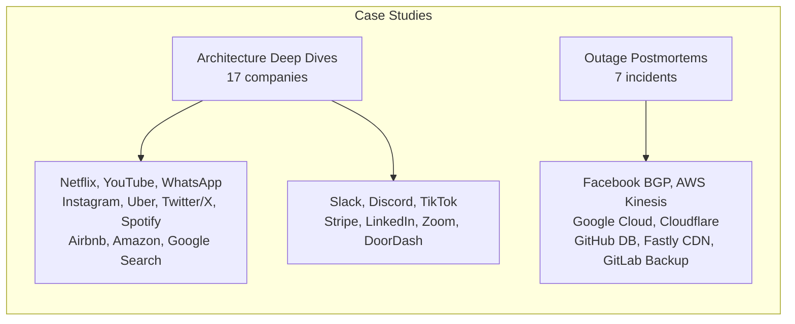

# 18 — Case Studies

> Learn from the best. Reverse-engineered architectures of the world's largest systems and real-world production incidents.

## Architecture Deep Dives

| # | Company | Key Architectural Lessons |
|---|---------|--------------------------|
| 1 | [Netflix](01-netflix.md) | Microservices, chaos engineering, CDN, Hystrix circuit breaker |
| 2 | [YouTube](02-youtube.md) | Video processing pipeline, global CDN, recommendation engine |
| 3 | [WhatsApp](03-whatsapp.md) | Erlang/OTP, extreme scale (2B users), simple protocol design |
| 4 | [Instagram](04-instagram.md) | PostgreSQL sharding, monolith→microservices, feed generation |
| 5 | [Uber](05-uber.md) | Domain-oriented microservices, CQRS, geospatial indexing |
| 6 | [Twitter/X](06-twitter-x.md) | Fanout service, timeline caching, real-time event processing |
| 7 | [Spotify](07-spotify.md) | Squad model, event-driven architecture, client-serving pattern |
| 8 | [Airbnb](08-airbnb.md) | Service-oriented architecture, data infrastructure, search |
| 9 | [Amazon](09-amazon.md) | Two-pizza teams, API-first, cell-based architecture |
| 10 | [Google Search](10-google-search.md) | MapReduce, Bigtable, Spanner, Borg cluster manager |
| 11 | [Slack](11-slack-architecture.md) | WebSocket gateway, real-time presence, 10M DAU |
| 12 | [Discord](12-discord-architecture.md) | Elixir + ScyllaDB, voice channels, 150M MAU |
| 13 | [TikTok](13-tiktok-architecture.md) | For You algorithm, ML recommendation, viral loops |
| 14 | [Stripe](14-stripe-architecture.md) | Idempotency, payment orchestration, 24/7 uptime |
| 15 | [LinkedIn](15-linkedin-architecture.md) | Feed ranking, Kafka, graph database, 1B members |
| 16 | [Zoom](16-zoom-architecture.md) | WebRTC, SFU, media routing, 300M daily participants |
| 17 | [DoorDash](17-door-dash-architecture.md) | Dispatch engine, real-time pricing, 25M orders/mo |

## Outage Postmortems

| # | Incident | Root Cause | Key Takeaway |
|---|----------|------------|--------------|
| 1 | [Facebook BGP Outage 2021](01-facebook-2021.md) | BGP configuration error took down DNS | Centralized DNS is a single point of failure |
| 2 | [AWS Kinesis Outage 2020](02-aws-kinesis.md) | Throttling cascading failure | Backpressure and rate limiting at every layer |
| 3 | [Google Cloud Outage 2019](03-google-cloud.md) | Network congestion from misconfigured LB | Global networks need multi-region isolation |
| 4 | [Cloudflare Outage 2020](04-cloudflare.md) | Router BGP leak at a single PoP | Redundant control plane at every PoP |
| 5 | [GitHub DB Failover 2020](05-github-outage.md) | MySQL replication lag during planned failover | Automated failover must handle replication lag |
| 6 | [Fastly CDN Outage 2021](06-fastly-outage.md) | Bug in CDN config parser triggered by customer config | Config validation before global rollout |
| 7 | [GitLab Backup 2017](07-gitlab-backup.md) | Replication not validated; backup not tested | Every backup must be restored and verified |

## Related Modules

- [15-SRE](../15-SRE/README.md) — Incident management, postmortem culture
- [21-Staff-Engineer](../21-Staff-Engineer/README.md) — Incident leadership during production events

---
Previous: [17 — Observability](../17-Observability/README.md)
Next: [19 — Projects](../19-Projects/README.md)
