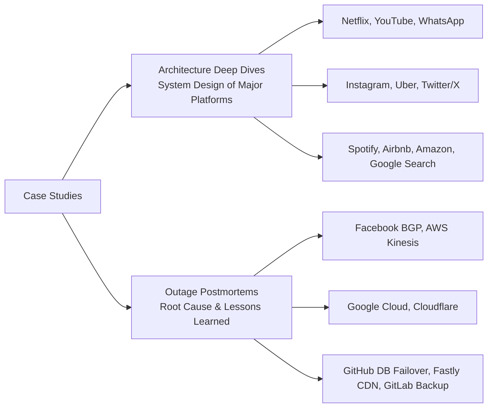

# 18 — Case Studies

> Learn from the best. Reverse-engineered architectures of the world's largest systems.

## Topics

| # | Architecture | Key Lessons |
|---|-------------|-------------|
| 1 | [Netflix](01-netflix.md) | Microservices, chaos engineering, CDN |
| 2 | [YouTube](02-youtube.md) | Video processing, global CDN, recommendations |
| 3 | [WhatsApp](03-whatsapp.md) | Erlang, extreme scale, simple protocol |
| 4 | [Instagram](04-instagram.md) | PostgreSQL sharding, monolith→microservices |
| 5 | [Uber](05-uber.md) | Domain-oriented microservices, CQRS |
| 6 | [Twitter/X](06-twitter-x.md) | Fanout service, timeline caching, real-time |
| 7 | [Spotify](07-spotify.md) | Squad model, event-driven, client-serving |
| 8 | [Airbnb](08-airbnb.md) | Service-oriented architecture, data infrastructure |
| 9 | [Amazon](09-amazon.md) | Two-pizza teams, API-first, cell-based |
| 10 | [Google Search](10-google-search.md) | MapReduce, Bigtable, Spanner, Borg |

---

Previous: [17 — Observability](../17-Observability/README.md)
Next: [19 — Projects](../19-Projects/README.md)
