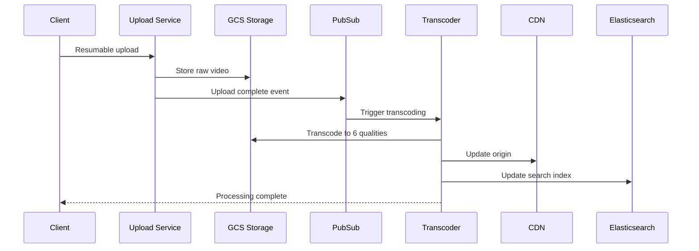

# YouTube Backend

## Requirements

- Video upload, transcoding, and streaming
- Real-time viewer counts
- Comments, likes, subscriptions
- Search and recommendations
- Live streaming support
- 2B monthly users, 500+ hrs video uploaded/min
- Global CDN delivery

## Capacity Estimation

```
Upload:      500 hrs/min → ~1TB raw video/min
Transcoded:  500 hrs × 6 qualities = ~3TB/min
Storage:     ~1.5PB/day transcoded
Views:       50B daily views
Streaming:   1B hours/day → ~3 Tbps peak egress
Comments:    50M/day
Likes:       1B/day
```

## API Design

```
POST /upload → {upload_url, video_id}
PUT /upload/{video_id}?partNumber=1..N (resumable)
POST /upload/{video_id}/complete

GET /videos/{id} → {title, description, streams, ...}
GET /videos/{id}/stream?quality=1080p&format=dash
GET /videos/{id}/comments?cursor=...&limit=20
POST /videos/{id}/comments → {text}

POST /videos/{id}/like
POST /videos/{id}/subscribe
GET /feed?page=2 → [video summaries]

GET /search?q=...&filter=...&sort=relevance
```

## Database Design

```sql
-- Videos (main entity)
CREATE TABLE videos (
    id UUID PRIMARY KEY,
    title VARCHAR(100),
    description TEXT,
    channel_id UUID,
    duration_seconds INT,
    privacy_status VARCHAR(10), -- public, unlisted, private
    uploaded_at TIMESTAMP,
    published_at TIMESTAMP,
    category_id INT,
    tags TEXT[],
    stats_views BIGINT DEFAULT 0,
    stats_likes BIGINT DEFAULT 0,
    stats_comments BIGINT DEFAULT 0,
    INDEX idx_channel_published (channel_id, published_at DESC),
    INDEX idx_category_published (category_id, published_at DESC)
);

-- Video streams (qualities)
CREATE TABLE video_streams (
    video_id UUID,
    itag INT, -- YouTube's format identifier
    quality_label VARCHAR(10), -- 1080p, 720p, etc
    content_type VARCHAR(50), -- video/mp4, audio/webm
    url TEXT,
    bitrate INT,
    width INT, height INT,
    PRIMARY KEY (video_id, itag)
);

-- Comments (partitioned by video_id)
CREATE TABLE comments (
    id BIGSERIAL,
    video_id UUID NOT NULL,
    parent_id BIGINT,
    user_id UUID NOT NULL,
    text TEXT,
    likes INT DEFAULT 0,
    created_at TIMESTAMP DEFAULT NOW(),
    PRIMARY KEY (video_id, id)
) PARTITION BY HASH (video_id);
```

## High-Level Design

```
                        ┌───────────────────┐
                        │   Google Frontend  │
                        │   (GFE)           │
                        └────────┬──────────┘
                                 │
              ┌──────────────────┼──────────────────┐
              ▼                  ▼                  ▼
       ┌────────────┐    ┌────────────┐    ┌────────────┐
       │ Upload     │    │ Watch      │    │ Search     │
       │ Service    │    │ Service    │    │ Service    │
       └─────┬──────┘    └─────┬──────┘    └─────┬──────┘
             │                 │                  │
        ┌────▼────┐      ┌────▼────┐       ┌─────▼─────┐
        │Transcoder│      │ CDN     │       │Elasticsearch│
        │(FFmpeg   │      │(Google  │       │           │
        │ parallel)│      │ Global  │       │           │
        └──────────┘      │ Cache)  │       └───────────┘
                          └─────────┘
```

## Low-Level Design: Video Processing



```
1. Client uploads via resumable upload API
2. Raw video stored in GCS (multi-region)
3. Upload complete triggers Pub/Sub → Transcoding Service
4. Transcoding:
   a. Split video into 5-second segments
   b. Transcode each segment to 6 qualities (parallel)
   c. Generate DASH MPD + HLS m3u8 manifests
   d. Generate thumbnails (key-frame extraction)
5. Transcoding complete → update metadata DB
6. CDN origin updated with new content
7. Search index updated
8. Subscribers notified
```

## Scaling Strategy

| Challenge | Solution |
|-----------|----------|
| **Upload throughput** | Resumable upload in chunks, parallel ingestion |
| **Transcoding latency** | Split video into chunks, parallel processing on spot VMs |
| **CDN cost** | Cache popular content aggressively, peer with ISPs |
| **View counts** | Approximate counters (Redis + eventual consistency to DB) |
| **Comments** | Partition by video_id, cache recent comments |
| **Search** | Sharded Elasticsearch, tiered ranking |

## Deployment

```yaml
services:
  api-gateway: # Custom GFE-like proxy
  upload-service: # Resumable upload handler
  watch-service: # Stream URL generation
  search-service: # Elasticsearch wrapper
  comment-service: # CRUD + real-time updates
  
infrastructure:
  storage: GCS multi-region
  transcoding: Cloud Tasks + GCE spot
  cdn: Cloud CDN + Google Global Cache
  db: Cloud Spanner (global) + Bigtable (analytics)
  search: Elasticsearch on GKE
  streaming: Pub/Sub
```

## Interview Questions

1. How would you design the video transcoding pipeline?
2. How does YouTube handle 500 hours of uploads per minute?
3. How does the recommendation system work?
4. How does YouTube handle real-time viewer counts?
5. Design a search system for billions of videos
