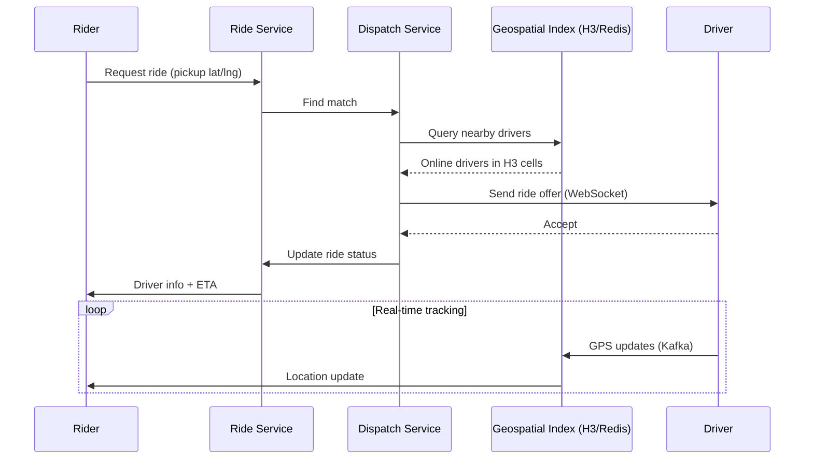

# Uber Backend

## Requirements

- Real-time rider-driver matching
- Geospatial tracking (GPS)
- Estimated fare calculation
- Ride lifecycle (request → match → pickup → dropoff → payment)
- Surge pricing
- 100M users, 25M trips/day

## Capacity Estimation

```
Trips:         25M/day ≈ 290 trips/sec peak
GPS updates:   2B locations/day ≈ 23K writes/sec
Location reads: Drivers near rider → 10K reads/sec
Ride matching:  290 matches/sec (complex geospatial)
Storage:        Trip records ~100GB/day, Location ~500GB/day
```

## API Design

```
// Rider
POST /rides/estimate → {pickup, dropoff} → {fare_estimate, duration, surge}
POST /rides/request → {pickup, dropoff, payment_method} → {ride_id, driver_info}
GET /rides/{id}/status → {status, driver_location, eta}
POST /rides/{id}/cancel

// Driver
POST /drivers/location → {lat, lng, heading, speed}
PATCH /drivers/status → {status: online/offline/en_route}
GET /drivers/trips → [pending_requests]

// Matching (internal)
GET /drivers/nearby?lat=...&lng=...&radius=2km → [driver_ids]
POST /matching/assign → {ride_id, driver_id}
```

## Database Design

```sql
-- Rides
CREATE TABLE rides (
    id UUID PRIMARY KEY,
    rider_id UUID NOT NULL,
    driver_id UUID,
    status VARCHAR(20), -- requested, matched, en_route, in_progress, completed, cancelled
    pickup_lat DOUBLE PRECISION,
    pickup_lng DOUBLE PRECISION,
    dropoff_lat DOUBLE PRECISION,
    dropoff_lng DOUBLE PRECISION,
    fare_amount DECIMAL(10,2),
    surge_multiplier DECIMAL(3,2),
    requested_at TIMESTAMP,
    started_at TIMESTAMP,
    completed_at TIMESTAMP,
    INDEX idx_rider_status (rider_id, status),
    INDEX idx_driver_status (driver_id, status)
);

-- Driver location (ephemeral, in-memory optimized)
CREATE TABLE driver_locations (
    driver_id UUID PRIMARY KEY,
    lat DOUBLE PRECISION,
    lng DOUBLE PRECISION,
    heading INT,
    speed DOUBLE PRECISION,
    status VARCHAR(10), -- online, offline, busy
    updated_at TIMESTAMP,
    INDEX idx_location USING GIST (ll_to_earth(lat, lng))
);

-- Ride events (event sourcing)
CREATE TABLE ride_events (
    ride_id UUID,
    event_type VARCHAR(30),
    data JSONB,
    created_at TIMESTAMP DEFAULT NOW(),
    PRIMARY KEY (ride_id, created_at)
);
```

## High-Level Design

```
Rider App              Driver App
    │                      │
    ▼                      ▼
┌──────────┐         ┌──────────┐
│ API       │         │ WebSocket│
│ Gateway   │         │ Gateway  │
└────┬─────┘         └────┬─────┘
     │                    │
     ▼                    ▼
┌──────────┐         ┌──────────┐
│ Ride     │         │ Dispatch │
│ Service  │────────►│ Service  │
└────┬─────┘         └────┬─────┘
     │                    │
     ▼                    ▼
┌──────────┐         ┌──────────┐
│DB (Rides)│         │ Geospatial│
│PostgreSQL│         │ Index    │
└──────────┘         │(Redis +  │
                     │ S2/H3)   │
                     └──────────┘
```

## Low-Level Design: Ride Matching



```
1. Rider requests ride (pickup lat/lng)
2. Ride Service creates ride (status=requested)
3. Dispatch Service queries geospatial index:
   - H3 hexagon at rider's location
   - Find online drivers in same + adjacent hexagons
   - Filter by driver score, proximity, direction
4. Dispatch sends ride offer to top 3 drivers:
   - Driver's app receives via WebSocket
   - First to accept gets the ride
5. Update driver status (busy)
6. Notify rider with driver info
7. Real-time tracking: driver → GPS → Kafka → rider app
```

## Scaling Strategy

| Component | Scale |
|-----------|-------|
| **Geospatial index** | H3 grid system in Redis; grid cells as partitions |
| **Dispatch** | Partitioned by H3 cell, independent workers |
| **Ride DB** | PostgreSQL + read replicas; partition by region |
| **GPS pipeline** | Kafka (high throughput ingestion), batch to long-term storage |
| **Pricing** | Real-time demand/supply analytics per region |
| **WebSocket** | Session affinity, Redis pub/sub for cross-server messages |

## Deployment

```yaml
services:
  api-gateway: # Stateless, auto-scale
  ride-service: # REST API for rides
  dispatch-service: # Matching engine
  driver-gps: # WebSocket gateway for GPS
  pricing-service: # Surge pricing calculations
  
infrastructure:
  db: PostgreSQL (Aurora) per region
  cache: Redis Cluster (geospatial indexes)
  stream: Kafka (GPS events, ride events)
  search: Elasticsearch (driver analytics)
```

## Interview Questions

1. How does Uber match a rider with the nearest driver?
2. How does surge pricing work algorithmically?
3. How does Uber handle geospatial queries at massive scale?
4. How would you design the real-time GPS tracking system?
5. How does Uber handle ride pricing estimation?
