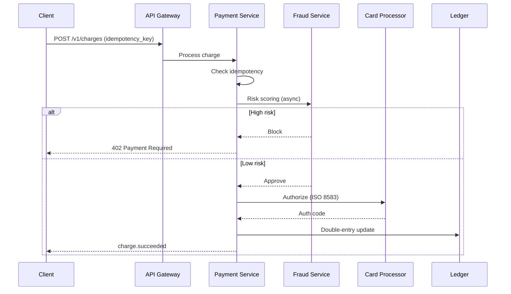

# Payment Gateway

## Requirements

- Accept payments (cards, UPI, wallets, BNPL)
- Merchant onboarding and settlement
- Fraud detection
- Idempotent transaction processing
- Refunds and chargebacks
- Payouts to merchants
- 99.999% uptime, <500ms p95 latency

## Capacity Estimation

```
Transactions:   2M/day peak → 250/sec (5M/day target)
Reads:          Balance/status queries ~5M/day
Amount volume:  $500M/day
Storage:        2M × 1KB = 2GB/day → ~730GB/year
Reconciliation: 5M records/day
```

## API Design

```
POST /v1/charges
  { amount, currency, source (card_token), description, idempotency_key }
  → { id, status, amount, captured, created }

POST /v1/charges/{id}/capture
  { amount (partial capture) }
  → updated charge

POST /v1/charges/{id}/refund
  { amount, reason }
  → refund object

POST /v1/payouts
  { amount, currency, destination, idempotency_key }
  → { id, status, expected_arrival }

GET /v1/balance → { available[], pending[] }
GET /v1/charges?created[gte]=... → [charges]

// Webhooks (sent to merchant)
charge.succeeded | charge.failed | charge.refunded
payout.paid | payout.failed
```

## Database Design

```sql
-- Core transaction table (immutable ledger)
CREATE TABLE transactions (
    id UUID PRIMARY KEY DEFAULT gen_random_uuid(),
    idempotency_key VARCHAR(64) UNIQUE NOT NULL,
    type VARCHAR(20) NOT NULL, -- charge, refund, payout, transfer
    status VARCHAR(20) NOT NULL, -- pending, succeeded, failed, requires_action
    amount BIGINT NOT NULL, -- in smallest currency unit (cents)
    currency VARCHAR(3) NOT NULL,
    merchant_id UUID NOT NULL,
    source_type VARCHAR(20), -- card, upi, wallet, etc.
    source_id VARCHAR(255),
    description TEXT,
    metadata JSONB,
    failure_code VARCHAR(50),
    failure_message TEXT,
    created_at TIMESTAMP NOT NULL DEFAULT NOW(),
    updated_at TIMESTAMP NOT NULL DEFAULT NOW(),
    INDEX idx_merchant_created (merchant_id, created_at DESC),
    INDEX idx_status_created (status, created_at)
);

-- Card tokens (PCI-compliant, vaulted)
CREATE TABLE card_tokens (
    id UUID PRIMARY KEY,
    merchant_id UUID NOT NULL,
    last_four VARCHAR(4),
    expiry_month INT, expiry_year INT,
    card_brand VARCHAR(20), -- visa, mc, amex
    fingerprint VARCHAR(64),
    token VARCHAR(255) NOT NULL, -- reference to vault
    created_at TIMESTAMP DEFAULT NOW()
);

-- Settlement records (batch)
CREATE TABLE settlements (
    id UUID PRIMARY KEY,
    merchant_id UUID NOT NULL,
    period_start DATE, period_end DATE,
    gross_amount BIGINT, fees BIGINT,
    net_amount BIGINT,
    transaction_count INT,
    status VARCHAR(20),
    payout_id UUID,
    created_at TIMESTAMP DEFAULT NOW()
);
```

## High-Level Design

```
Merchant App                                 Card Networks
    │                                             │
    ▼                                             ▼
┌──────────┐                              ┌──────────┐
│ API       │                              │ Card     │
│ Gateway   │                              │ Processor│
└────┬─────┘                              │(Stripe,  │
     │                                    │ Adyen,   │
     ▼                                    │ Chase)   │
┌──────────┐                              └──────────┘
│ Payment  │
│ Service  │
└────┬─────┘
     │
     ▼
┌──────────┐      ┌──────────┐      ┌──────────┐
│ Fraud    │      │ Ledger   │      │ Bank     │
│ Service  │      │ Service  │      │ Service  │
└──────────┘      └────┬─────┘      └──────────┘
                       │
                  ┌────▼────┐
                  │ DB      │
                  │(Ledger) │
                  └─────────┘
```

## Low-Level Design: Charge Flow



```
1. Client POST /v1/charges with idempotency_key
2. API Gateway checks rate limit (per merchant)
3. Payment Service:
   a. Check idempotency_key → return existing if duplicate
   b. Validate amount, merchant, source
   c. Enrich with fraud signals (amount history, velocity, geo)
   d. Send to Fraud Service (async risk scoring)
4. If risk_score > threshold → block
5. Else → tokenize card (vault), send to Card Processor:
   - Build ISO 8583 message
   - Route via card network (Visa/Mastercard)
   - Receive authorization response
6. Update transaction status (succeeded / failed / requires_action)
7. Double-entry ledger update:
   - Debit: customer (pending settlement)
   - Credit: merchant (pending settlement)
8. Emit event (charge.succeeded / charge.failed)
9. If 3DS required → return requires_action with redirect URL
```

## Scaling Strategy

| Component | Strategy |
|-----------|----------|
| **Idempotency** | idempotency_key UNIQUE index; check before every write |
| **Ledger** | Append-only; partitioned by merchant_id |
| **Transaction DB** | Read replicas for queries; primary for writes |
| **Fraud** | Real-time rules engine + ML model (async) |
| **Webhooks** | Queue-based delivery with retry + dead letter |
| **Settlement** | Batch cron jobs + audit reconciliation |

## Idempotency Implementation

```sql
-- Idempotency key check (pseudo-transactional)
BEGIN;
INSERT INTO idempotency_lock (key) VALUES ($1); -- unique constraint
-- or SELECT ... FOR UPDATE on idempotency record
SELECT * FROM transactions WHERE idempotency_key = $1;
IF NOT FOUND:
  INSERT INTO transactions (idempotency_key, ...) VALUES ...;
  COMMIT;
  RETURN new transaction;
ELSE:
  RETURN existing transaction;
```

## Deployment

```yaml
services:
  api: # Stateless HTTP API
  payment-service: # Core transaction processing
  fraud-service: # Machine learning + rules
  ledger-service: # Double-entry accounting
  webhook-service: # Merchant notifications
  
infrastructure:
  db: PostgreSQL (Aurora Multi-AZ, global)
  cache: Redis (rate limiting, fraud counters)
  queue: RabbitMQ / SQS (async processing)
  kafka: Event sourcing + CDC
```

## Interview Questions

1. How do you handle idempotency in payment processing?
2. How does double-entry accounting work in a payment system?
3. How do you detect and prevent fraud?
4. How would you implement multi-currency support?
5. Design settlement and reconciliation system
