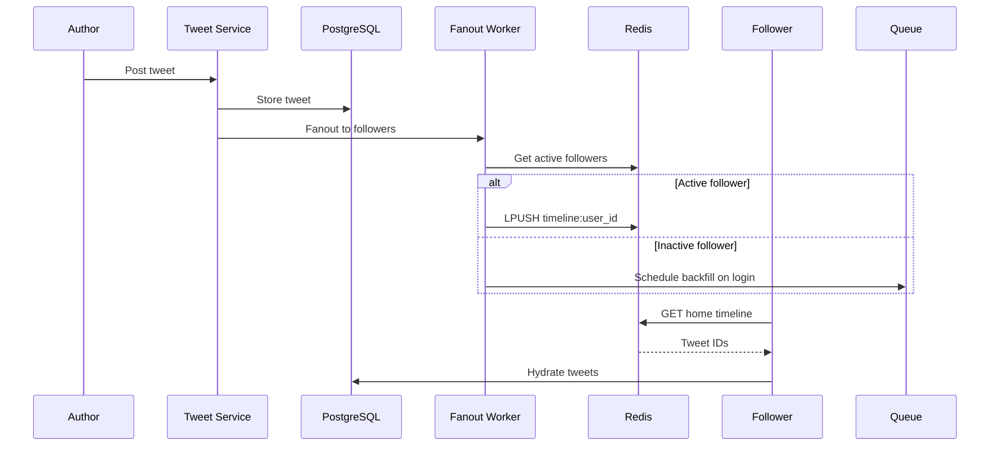

# Twitter Backend

## Requirements

- Post tweets (280 chars, media)
- Timeline generation (home + reverse-chronological)
- Follow/unfollow
- Retweets, likes, replies
- Trending topics
- Search
- 500M monthly users, 500M tweets/day

## Capacity Estimation

```
Tweets:        500M/day ≈ 5800 writes/sec peak
Timeline reads: 200B/day ≈ 2.3M reads/sec
Likes:          2B/day
Retweets:       200M/day
Trending:       ~100 topics refresh every 5 min
Storage:        500M × 500B = 250GB/day → ~90TB/year
CDN:            ~30 Gbps peak
```

## API Design

```
POST /tweets → {text, media_ids} → {tweet_id, created_at}
GET /tweets/{id} → {text, author, likes, retweets, ...}
POST /tweets/{id}/retweet
POST /tweets/{id}/like
POST /tweets/{id}/reply → {text}

GET /timeline/home?count=50 → [tweets]
GET /timeline/user/{user_id}?count=50 → [tweets]

POST /users/{id}/follow / unfollow

GET /trending → [{topic, tweet_count, region}]
GET /search?q=...&count=20 → [tweets]

GET /notifications → [likes, retweets, follows, replies]
```

## Database Design

```sql
-- Tweets
CREATE TABLE tweets (
    id BIGSERIAL PRIMARY KEY,
    user_id BIGINT NOT NULL,
    text VARCHAR(280),
    media_ids UUID[],
    retweet_of BIGINT REFERENCES tweets(id),
    reply_to BIGINT REFERENCES tweets(id),
    created_at TIMESTAMP DEFAULT NOW(),
    INDEX idx_user_created (user_id, created_at DESC),
    INDEX idx_created (created_at DESC)
);

-- Timeline (fanout-on-write)
CREATE TABLE timeline (
    user_id BIGINT NOT NULL,
    tweet_id BIGINT NOT NULL,
    author_id BIGINT NOT NULL,
    created_at TIMESTAMP DEFAULT NOW(),
    PRIMARY KEY (user_id, tweet_id DESC)
) PARTITION BY HASH (user_id);

-- Graph
CREATE TABLE follows (
    follower_id BIGINT NOT NULL,
    followee_id BIGINT NOT NULL,
    created_at TIMESTAMP DEFAULT NOW(),
    PRIMARY KEY (follower_id, followee_id),
    INDEX idx_followee (followee_id, follower_id)
);

-- Counters (eventually consistent)
CREATE TABLE tweet_counts (
    tweet_id BIGINT PRIMARY KEY,
    likes INT DEFAULT 0,
    retweets INT DEFAULT 0,
    replies INT DEFAULT 0,
    version INT DEFAULT 1
);
```

## High-Level Design

```
┌─────────────────────────────────────────────────────────┐
│                    Twitter Architecture                   │
├─────────────────────────────────────────────────────────┤
│                                                          │
│ Client ──► API Gateway ──► Tweet Service                 │
│                               │                          │
│                          ┌────┴────┐                     │
│                          │ Fanout  │                     │
│                          │ Worker  │                     │
│                          └────┬────┘                     │
│                               │                          │
│              ┌────────────────┼──────────────┐           │
│              ▼                ▼              ▼           │
│         ┌─────────┐    ┌──────────┐    ┌─────────┐      │
│         │Timeline │    │ Search   │    │Trending │      │
│         │Cache    │    │(ES)      │    │(Redis)  │      │
│         └─────────┘    └──────────┘    └─────────┘      │
│                                                          │
└──────────────────────────────────────────────────────────┘
```

## Low-Level Design: Timeline Fanout



```python
# Fanout-on-write strategy
def on_tweet(tweet, author_id):
    # 1. Store tweet
    tweet_id = db.insert_tweet(tweet)
    
    # 2. Fanout to followers
    followers = get_followers(author_id)
    batch_size = 100
    
    for batch in chunks(followers, batch_size):
        # For active users (online in last 24h)
        active = filter_active(batch)
        for user_id in active:
            redis.lpush(f"timeline:{user_id}", tweet_id)
        
        # For inactive — fanout later on login
        inactive = filter_inactive(batch)
        if inactive:
            queue.send("backfill_timeline", {
                "user_ids": inactive,
                "tweet_id": tweet_id
            })
    
    # 3. Update search index (async)
    queue.send("index_tweet", tweet)

# Timeline read
def get_home_timeline(user_id, count=50):
    tweet_ids = redis.lrange(f"timeline:{user_id}", 0, count - 1)
    if not tweet_ids:
        # Backfill from Kafka log (late joiners)
        tweet_ids = backfill_from_kafka(user_id)
    return hydrate(tweet_ids)
```

## Scaling Strategy

| Component | Strategy |
|-----------|----------|
| **Tweet ingestion** | Kafka for reliable buffering; batch writes to DB |
| **Timeline** | Redis cluster sharded by user_id; backfill from Kafka |
| **Fanout** | Workers partitioned by follower_id hash |
| **Celebrity tweets** | Skip fanout; merge on read for >100K followers |
| **Trending** | Sliding window counters in Redis; recalculate every 5 min |
| **Search** | Elasticsearch cluster; tokenized text + hashtags |
| **Counters** | Redis (approx) → async flush to PostgreSQL |

## Deployment

```yaml
services:
  api-gateway: # Load balancer + auth
  tweet-service: # Tweet CRUD + media
  timeline-service: # Fanout + timeline serving
  search-service: # Elasticsearch wrapper
  trending-service: # Trend calculation
  notification-service: # Push + in-app notifications
  
infrastructure:
  db: PostgreSQL (Aurora Multi-AZ)
  cache: Redis Cluster (timeline, counters, session)
  stream: Kafka (tweet event log)
  queue: RabbitMQ (async jobs)
  search: Elasticsearch
  storage: S3 (media)
```

## Ranked Timeline (Machine Learning)

```
Ranked timeline features:
- Recency: score ∝ 1/time_delta
- Engagement: predicted CTR (click-through rate)
- Author affinity: how often user interacts with this author
- Media richness: tweets with media get boost
- Real-time signals: breaking news boost

Serving:
- Generate 500 candidate tweets (recency-based)
- Rank with ML model (logistic regression / neural net)
- Return top 50
```

## Interview Questions

1. How does Twitter's timeline fanout work?
2. How would you handle the "celebrity problem" (Katy Perry posting)?
3. How does Twitter implement trending topics?
4. How would you design Twitter search?
5. How does the ranked timeline (algorithmic feed) work?
