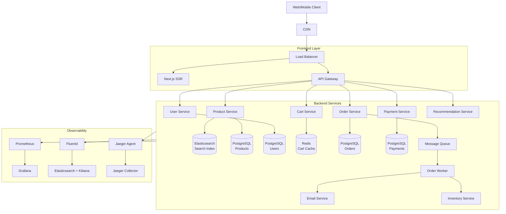

# End-to-End Implementation Guide

> How to build any real application using every module in this handbook.  
> **Running example: E-Commerce Platform** (`ShopNow`)

## Overview

This guide walks through building a production-grade application from scratch — covering requirements, system design, API contracts, database schema, authentication, caching, message queues, microservices, containerization, CI/CD, cloud deployment, monitoring, and SRE readiness.

Every step cross-references the relevant handbook module so you can dive deeper.

```
Phase 1: Requirements  ──►  Module 01 (CAP, Scalability)
Phase 2: Architecture  ──►  Modules 05, 06, 07
Phase 3: Data Layer    ──►  Modules 04, 05 (Caching)
Phase 4: API Layer     ──►  Module 02 (REST, gRPC)
Phase 5: Security      ──►  Module 16
Phase 6: DevOps        ──►  Modules 08, 09, 13, 14
Phase 7: Cloud         ──►  Modules 10, 11, 12
Phase 8: Observability ──►  Module 17
Phase 9: SRE           ──►  Module 15
Phase 10: Scale        ──►  Module 21
```

---

## Phase 1: Requirements & Capacity Planning

### Step 1.1: Define Functional Requirements

For **ShopNow** (E-Commerce Platform):

| Feature | Priority | Description |
|---------|----------|-------------|
| User Management | P0 | Register, login, profile |
| Product Catalog | P0 | Browse, search, filter products |
| Shopping Cart | P0 | Add/remove items, persist |
| Checkout | P0 | Place order, payment integration |
| Order History | P1 | View past orders |
| Recommendations | P2 | Personalized product suggestions |
| Reviews & Ratings | P1 | User reviews on products |
| Admin Dashboard | P2 | Manage products, orders, users |

### Step 1.2: Define Non-Functional Requirements

| Requirement | Target | Why |
|-------------|--------|-----|
| Availability | 99.99% (4-nines) | Revenue loss if down |
| Latency (API) | <200ms P95 | User experience |
| Latency (Search) | <500ms P95 | Product search |
| Consistency | Eventual for catalog, Strong for orders | Orders must be accurate |
| RPS (Peak) | 50,000 req/s | Black Friday traffic |
| DAU | 10 Million | Scale target |

### Step 1.3: Capacity Estimation

Reference: [01-CS-Fundamentals (Scalability, Latency, Throughput)](../01-Computer-Science-Fundamentals/)

```
Daily Active Users: 10M
Requests per user per day: 20 API calls
Total daily requests: 200M
Peak RPS (10x average): ~50,000 req/s

Storage:
- Products: 10M products × 2KB = 20GB
- Users: 10M × 500B = 5GB  
- Orders: 100M orders/year × 1KB = 100GB/year
- Images: 10M products × 3 images × 200KB = 6TB
- Total Year 1: ~7TB (mostly images → object storage)

Bandwidth:
- Average response: 50KB (including assets)
- Peak bandwidth: 50,000 × 50KB = 2.5GB/s → 20Gbps
```

### Step 1.4: Choose Technology Stack

| Layer | Technology | Why |
|-------|------------|-----|
| **Frontend** | React + Next.js | SSR for SEO, PWA for mobile |
| **API Layer** | Node.js/Express + TypeScript | Rapid development, type safety |
| **Search** | Elasticsearch | Full-text search, faceted filters |
| **Primary DB** | PostgreSQL | ACID for orders, JSONB for flexibility |
| **Cache** | Redis | Session store, cart cache, rate limiting |
| **Object Storage** | S3 (or equivalent) | Product images |
| **CDN** | CloudFront (or equivalent) | Image delivery |
| **Queue** | RabbitMQ / SQS | Order processing async |
| **Container** | Docker | Consistency across environments |
| **Orchestration** | Kubernetes | Auto-scaling, service management |
| **CI/CD** | GitHub Actions | Integrated with GitHub |
| **IaC** | Terraform | Infrastructure as code |
| **Monitoring** | Prometheus + Grafana | Metrics and dashboards |
| **Logging** | ELK Stack | Centralized logging |
| **Tracing** | Jaeger | Distributed tracing |

### ✅ Verification Checklist — Phase 1

- [ ] All P0 and P1 features documented
- [ ] Non-functional requirements have measurable targets
- [ ] Capacity estimation done for 3-year horizon
- [ ] Tech stack selected with rationale for each choice
- [ ] Cost estimate calculated (compute, storage, bandwidth)

---

## Phase 2: System Architecture Design

Reference: [05-System-Design](../05-System-Design/), [06-Distributed-Systems](../06-Distributed-Systems/), [07-Microservices](../07-Microservices/)

### Step 2.1: High-Level Architecture



### Step 2.2: Service Decomposition

Reference: [07-Microservices (Service Decomposition)](../07-Microservices/02-service-decomposition.md)

```
ShopNow/
├── frontend/              # Next.js application
├── user-service/          # Auth, profiles
├── product-service/       # Catalog, inventory
├── cart-service/          # Shopping cart
├── order-service/         # Orders, fulfillment
├── payment-service/       # Payment processing
├── search-service/        # Elasticsearch indexing
├── recommendation-service/# ML-based recommendations
├── api-gateway/           # Kong / custom gateway
└── shared/                # Protobufs, types, models
```

**Communication Patterns:**

| Pattern | Where | Why |
|---------|-------|-----|
| **REST (sync)** | Client → API Gateway | Standard request-response |
| **gRPC (sync)** | Service → Service | Low latency internal calls |
| **Events (async)** | Order → Email/Inventory | Decoupled processing |
| **Queue (async)** | Payment → Order | Reliable message delivery |

Reference: [07-Microservices (Inter-Service Communication)](../07-Microservices/03-inter-service-communication.md)

### Step 2.3: Database Design — Schema

Reference: [04-Databases (PostgreSQL, Indexing, Sharding)](../04-Databases/)

```sql
-- Users Service
CREATE TABLE users (
    id UUID PRIMARY KEY DEFAULT gen_random_uuid(),
    email VARCHAR(255) UNIQUE NOT NULL,
    password_hash VARCHAR(255) NOT NULL,
    name VARCHAR(100) NOT NULL,
    created_at TIMESTAMPTZ DEFAULT NOW(),
    updated_at TIMESTAMPTZ DEFAULT NOW()
);
CREATE INDEX idx_users_email ON users(email);

-- Product Service
CREATE TABLE products (
    id UUID PRIMARY KEY DEFAULT gen_random_uuid(),
    name VARCHAR(255) NOT NULL,
    description TEXT,
    price DECIMAL(10,2) NOT NULL,
    currency VARCHAR(3) DEFAULT 'USD',
    category_id UUID REFERENCES categories(id),
    inventory_count INT DEFAULT 0,
    status VARCHAR(20) DEFAULT 'active',
    metadata JSONB,
    created_at TIMESTAMPTZ DEFAULT NOW()
);
CREATE INDEX idx_products_category ON products(category_id);
CREATE INDEX idx_products_price ON products(price);
CREATE INDEX idx_products_metadata ON products USING GIN(metadata);

-- Cart Service (Redis for live, PostgreSQL for persistence)
-- Redis: HSET cart:user_id product_id quantity
-- PostgreSQL:
CREATE TABLE cart_items (
    id UUID PRIMARY KEY,
    user_id UUID NOT NULL,
    product_id UUID NOT NULL,
    quantity INT NOT NULL CHECK (quantity > 0),
    added_at TIMESTAMPTZ DEFAULT NOW()
);
CREATE UNIQUE INDEX idx_cart_user_product ON cart_items(user_id, product_id);

-- Order Service
CREATE TABLE orders (
    id UUID PRIMARY KEY DEFAULT gen_random_uuid(),
    user_id UUID NOT NULL,
    status VARCHAR(20) DEFAULT 'pending',
    total_amount DECIMAL(12,2) NOT NULL,
    shipping_address JSONB NOT NULL,
    payment_id UUID,
    created_at TIMESTAMPTZ DEFAULT NOW()
);
CREATE INDEX idx_orders_user ON orders(user_id);
CREATE INDEX idx_orders_status ON orders(status) WHERE status = 'pending';

CREATE TABLE order_items (
    id UUID PRIMARY KEY DEFAULT gen_random_uuid(),
    order_id UUID REFERENCES orders(id),
    product_id UUID NOT NULL,
    quantity INT NOT NULL,
    unit_price DECIMAL(10,2) NOT NULL
);
CREATE INDEX idx_order_items_order ON order_items(order_id);
```

### Step 2.4: Caching Strategy

Reference: [05-System-Design (Cache Patterns)](../05-System-Design/)

| Data | Cache Strategy | TTL | Why |
|------|---------------|-----|-----|
| Product Catalog | Cache-Aside (Redis) | 5 min | Read-heavy, stale OK |
| User Session | Write-Through (Redis) | 24 hr | Must be consistent |
| Shopping Cart | Write-Behind (Redis→PG) | 7 days | Fast reads/writes |
| Product Images | CDN (CloudFront/S3) | 24 hr | Static content |
| Search Results | Cache-Aside (Redis) | 1 min | Fast search |
| Recommendation | Refresh-Ahead (Redis) | 1 hr | Background refresh |

**Cache-Aside Implementation (Product Catalog):**

```python
def get_product(product_id):
    # Try cache first
    cached = redis.get(f"product:{product_id}")
    if cached:
        return deserialize(cached)
    
    # Cache miss — load from DB
    product = db.query("SELECT * FROM products WHERE id = $1", product_id)
    if product:
        redis.setex(f"product:{product_id}", 300, serialize(product))
    return product
```

Reference: [05-System-Design (Cache-Aside)](../05-System-Design/06-cache-aside.md)

### Step 2.5: API Design

Reference: [02-Networking (REST, GraphQL, gRPC)](../02-Networking/)

```
// User Service (REST)
POST   /api/v1/users/register          # Create account
POST   /api/v1/users/login              # Authenticate
GET    /api/v1/users/me                 # Get profile
PUT    /api/v1/users/me                 # Update profile

// Product Service (REST)
GET    /api/v1/products                 # List with filters (?category, ?min_price, ?max_price)
GET    /api/v1/products/:id             # Get product detail
GET    /api/v1/products/search          # Search (?q=wireless+headphones)

// Cart Service (REST)
GET    /api/v1/cart                     # Get cart
POST   /api/v1/cart/items              # Add item
PUT    /api/v1/cart/items/:product_id  # Update quantity
DELETE /api/v1/cart/items/:product_id  # Remove item

// Order Service (REST + Async)
POST   /api/v1/orders                  # Place order
GET    /api/v1/orders                  # List my orders
GET    /api/v1/orders/:id              # Order detail

// Internal (gRPC)
rpc GetProductDetails(ProductID) returns (Product)
rpc UpdateInventory(OrderItems) returns (Status)
rpc ValidatePayment(PaymentDetails) returns (PaymentStatus)
```

### ✅ Verification Checklist — Phase 2

- [ ] Architecture diagram exists for all services
- [ ] Service boundaries are clear (single responsibility)
- [ ] Database schema has indexes on all query paths
- [ ] Caching strategy documented for each data type
- [ ] API contracts fully specified (all endpoints, request/response shapes)
- [ ] Internal communication patterns chosen (sync vs async)
- [ ] Idempotency key strategy defined for payments
- [ ] Rate limiting plan documented

---

## Phase 3: API Implementation

### Step 3.1: Project Structure

```
shopnow-api/
├── src/
│   ├── modules/
│   │   ├── users/
│   │   │   ├── users.controller.ts    # Route handlers
│   │   │   ├── users.service.ts       # Business logic
│   │   │   ├── users.repository.ts    # Data access
│   │   │   ├── users.dto.ts           # Request/response validation
│   │   │   └── users.model.ts         # Type definitions
│   │   ├── products/
│   │   ├── cart/
│   │   ├── orders/
│   │   └── payments/
│   ├── common/
│   │   ├── middleware/                # Auth, rate-limit, logging
│   │   ├── database/                  # PostgreSQL, Redis connections
│   │   └── errors/                    # Error types and handlers
│   ├── config/
│   │   └── index.ts                   # Environment config
│   ├── app.ts                         # Express app setup
│   └── server.ts                      # Entry point
├── tests/
│   ├── unit/
│   ├── integration/
│   └── e2e/
├── Dockerfile
├── docker-compose.yml
├── package.json
└── tsconfig.json
```

### Step 3.2: API Gateway Setup

Reference: [07-Microservices (API Gateway)](../07-Microservices/05-api-gateway.md)

```javascript
// api-gateway/index.js (Kong declarative config)
{
  "services": [
    {
      "name": "user-service",
      "host": "user-service.internal",
      "port": 3001,
      "protocol": "http",
      "routes": [
        { "paths": ["/api/v1/users"], "methods": ["GET", "POST", "PUT"] }
      ]
    },
    {
      "name": "product-service",
      "host": "product-service.internal",
      "port": 3002,
      "protocol": "http",
      "routes": [
        { "paths": ["/api/v1/products"], "methods": ["GET"] }
      ]
    }
  ],
  "plugins": [
    { "name": "rate-limiting", "config": { "minute": 1000, "policy": "redis" } },
    { "name": "jwt", "config": { "uri_param_source": "authorization" } },
    { "name": "cors", "config": { "origins": ["*"], "methods": ["GET", "POST", "PUT", "DELETE"] } }
  ]
}
```

### Step 3.3: Implementing a Service (Product Service)

```javascript
// products.service.ts
class ProductService {
  constructor(
    private readonly db: Database,
    private readonly cache: Cache,
    private readonly search: SearchClient
  ) {}

  async getProduct(id: string): Promise<Product> {
    // 1. Try cache
    const cached = await this.cache.get(`product:${id}`);
    if (cached) return JSON.parse(cached);

    // 2. Try database
    const product = await this.db.query(
      'SELECT * FROM products WHERE id = $1 AND status = $2',
      [id, 'active']
    );
    if (!product) throw new NotFoundError('Product not found');

    // 3. Populate cache
    await this.cache.setex(`product:${id}`, 300, JSON.stringify(product));
    return product;
  }

  async searchProducts(query: SearchQuery): Promise<SearchResult> {
    // Use Elasticsearch for full-text search
    const result = await this.search.search('products', {
      query: {
        bool: {
          must: [
            { match: { name: query.q } },
            query.category ? { term: { category_id: query.category } } : null,
            { range: { price: { gte: query.minPrice, lte: query.maxPrice } } }
          ].filter(Boolean)
        }
      },
      from: (query.page - 1) * query.limit,
      size: query.limit,
      sort: [{ [query.sortBy]: { order: query.sortOrder } }]
    });
    
    return {
      products: result.hits.map(this.mapHitToProduct),
      total: result.total,
      page: query.page
    };
  }
}
```

### Step 3.4: Database Connection with Pooling

```javascript
// database/postgres.ts
import { Pool } from 'pg';

const pool = new Pool({
  host: process.env.DB_HOST,
  port: parseInt(process.env.DB_PORT || '5432'),
  database: process.env.DB_NAME,
  user: process.env.DB_USER,
  password: process.env.DB_PASSWORD,
  max: 20,               // Max connections in pool
  idleTimeoutMillis: 30000,
  connectionTimeoutMillis: 5000,
});

pool.on('error', (err) => {
  logger.error('Unexpected database pool error', err);
  // Alert on-call engineer
});

export async function query(text: string, params?: any[]) {
  const start = Date.now();
  const result = await pool.query(text, params);
  const duration = Date.now() - start;
  
  // Log slow queries
  if (duration > 100) {
    logger.warn('Slow query', { text: text.slice(0, 100), duration, params });
  }
  
  return result;
}
```

Reference: [04-Databases (Query Optimization)](../04-Databases/15-query-optimization.md)
Reference: [04-Databases (PostgreSQL)](../04-Databases/01-postgresql.md)

### ✅ Verification Checklist — Phase 3

- [ ] All API endpoints return correct HTTP status codes (200, 201, 400, 401, 403, 404, 500)
- [ ] Input validation on every endpoint (DTOs, Joi/Zod schemas)
- [ ] Database connection pooling configured with max limit
- [ ] Slow query logging enabled (>100ms)
- [ ] Error handling middleware catches and formats all errors
- [ ] Request ID (correlation ID) on every request
- [ ] Rate limiting enforced at API Gateway
- [ ] CORS configured for production origins

---

## Phase 4: Authentication & Authorization

Reference: [16-Security](../16-Security/)

### Step 4.1: JWT Authentication Flow

```javascript
// auth.service.ts
class AuthService {
  async register(email: string, password: string, name: string) {
    // 1. Validate input
    if (!isValidEmail(email)) throw new ValidationError('Invalid email');
    if (password.length < 8) throw new ValidationError('Password too short');
    
    // 2. Check existing user
    const existing = await this.userRepo.findByEmail(email);
    if (existing) throw new ConflictError('Email already registered');
    
    // 3. Hash password (bcrypt, cost factor 12)
    const passwordHash = await bcrypt.hash(password, 12);
    
    // 4. Create user
    const user = await this.userRepo.create({ email, passwordHash, name });
    
    // 5. Generate tokens
    const accessToken = this.generateAccessToken(user.id, user.role);
    const refreshToken = this.generateRefreshToken(user.id);
    
    // 6. Store refresh token (hashed) in DB
    await this.refreshTokenRepo.create({
      userId: user.id,
      tokenHash: crypto.createHash('sha256').update(refreshToken).digest('hex'),
      expiresAt: new Date(Date.now() + 7 * 24 * 60 * 60 * 1000) // 7 days
    });
    
    return { user, accessToken, refreshToken };
  }

  async login(email: string, password: string) {
    const user = await this.userRepo.findByEmail(email);
    if (!user) throw new UnauthorizedError('Invalid credentials');
    
    const valid = await bcrypt.compare(password, user.passwordHash);
    if (!valid) throw new UnauthorizedError('Invalid credentials');
    
    const accessToken = this.generateAccessToken(user.id, user.role);
    const refreshToken = this.generateRefreshToken(user.id);
    
    return { user: { id: user.id, email: user.email, name: user.name, role: user.role }, accessToken, refreshToken };
  }

  private generateAccessToken(userId: string, role: string): string {
    return jwt.sign(
      { sub: userId, role },
      process.env.JWT_SECRET,
      { expiresIn: '15m' }        // Short-lived access token
    );
  }

  async refreshAccessToken(refreshToken: string) {
    const tokenHash = crypto.createHash('sha256').update(refreshToken).digest('hex');
    const stored = await this.refreshTokenRepo.findByHash(tokenHash);
    if (!stored || stored.expiresAt < new Date()) {
      throw new UnauthorizedError('Invalid or expired refresh token');
    }
    
    // Rotate refresh token (prevents replay)
    const newAccessToken = this.generateAccessToken(stored.userId, stored.role);
    const newRefreshToken = this.generateRefreshToken(stored.userId);
    
    await this.refreshTokenRepo.revoke(stored.id);
    await this.refreshTokenRepo.create({
      userId: stored.userId,
      tokenHash: crypto.createHash('sha256').update(newRefreshToken).digest('hex'),
      expiresAt: new Date(Date.now() + 7 * 24 * 60 * 60 * 1000)
    });
    
    return { accessToken: newAccessToken, refreshToken: newRefreshToken };
  }
}
```

Reference: [16-Security (JWT)](../16-Security/03-jwt.md)
Reference: [16-Security (Authentication)](../16-Security/01-authentication.md)

### Step 4.2: RBAC Authorization

```javascript
// auth.middleware.ts
// Role-based access control middleware
const roles = {
  admin: ['products:write', 'products:delete', 'orders:read_all', 'users:manage'],
  seller: ['products:write', 'products:read', 'orders:read_own'],
  customer: ['products:read', 'cart:write', 'orders:create', 'orders:read_own']
};

function authorize(...permissions: string[]) {
  return (req: Request, res: Response, next: NextFunction) => {
    const userRole = req.user.role;
    const userPermissions = roles[userRole] || [];
    
    const hasAllPermissions = permissions.every(p => userPermissions.includes(p));
    if (!hasAllPermissions) {
      throw new ForbiddenError('Insufficient permissions');
    }
    
    next();
  };
}

// Usage
router.post('/products', authenticate, authorize('products:write'), createProduct);
router.delete('/products/:id', authenticate, authorize('products:delete'), deleteProduct);
router.get('/orders', authenticate, authorize('orders:read_own'), listMyOrders);
```

Reference: [16-Security (RBAC)](../16-Security/06-rbac.md)

### Step 4.3: Rate Limiting

```javascript
// rate-limiter.middleware.js (Token Bucket with Redis)
const buckets = new Map();

async function rateLimit(req, res, next) {
  const key = `rate_limit:${req.user?.id || req.ip}`;
  const maxTokens = 100;          // 100 requests
  const refillRate = 10;          // 10 per second (window)

  const bucketData = await redis.get(key);
  const now = Date.now();
  
  let tokens, lastRefill;
  if (bucketData) {
    ({ tokens, lastRefill } = JSON.parse(bucketData));
    const elapsed = (now - lastRefill) / 1000;
    tokens = Math.min(maxTokens, tokens + elapsed * refillRate);
  } else {
    tokens = maxTokens;
    lastRefill = now;
  }

  if (tokens < 1) {
    res.set('Retry-After', Math.ceil(1 / refillRate));
    throw new TooManyRequestsError('Rate limit exceeded');
  }

  tokens -= 1;
  await redis.setex(key, 60, JSON.stringify({ tokens, lastRefill: now }));
  
  res.set('X-RateLimit-Remaining', Math.floor(tokens));
  next();
}
```

Reference: [16-Security (Rate Limiting)](../16-Security/10-rate-limiting.md)

### ✅ Verification Checklist — Phase 4

- [ ] Passwords hashed with bcrypt (cost ≥ 12) or argon2
- [ ] JWT access tokens expire (15 min recommended)
- [ ] Refresh tokens are rotated on each use
- [ ] All API endpoints have authentication (except login/register)
- [ ] Authorization checks on every protected endpoint
- [ ] Rate limiting on all public endpoints
- [ ] CORS whitelist configured (no wildcard in production)
- [ ] SQL injection prevented (parameterized queries)
- [ ] XSS prevented (output encoding, CSP headers)
- [ ] Helmet.js security headers added

---

## Phase 5: Docker & Containerization

Reference: [08-Docker](../08-Docker/)

### Step 5.1: Dockerfile for Node.js Service

```dockerfile
# Multi-stage build
FROM node:20-alpine AS builder
WORKDIR /app
COPY package*.json ./
RUN npm ci --only=production
COPY . .
RUN npm run build

FROM node:20-alpine AS production
WORKDIR /app
RUN addgroup -g 1001 appuser && adduser -u 1001 -G appuser -s /bin/sh -D appuser
COPY --from=builder /app/dist ./dist
COPY --from=builder /app/node_modules ./node_modules
COPY --from=builder /app/package.json ./
USER appuser
EXPOSE 3000
HEALTHCHECK --interval=30s --timeout=3s --start-period=5s --retries=3 \
  CMD wget --no-verbose --tries=1 --spider http://localhost:3000/health || exit 1
CMD ["node", "dist/server.js"]
```

### Step 5.2: Docker Compose (Local Development)

```yaml
# docker-compose.yml
version: '3.8'
services:
  api-gateway:
    image: kong:3.5
    ports: ["8000:8000", "8001:8001"]
    environment:
      KONG_DATABASE: "off"
      KONG_DECLARATIVE_CONFIG: "/kong/declarative/kong.yml"
    volumes:
      - ./kong:/kong/declarative
    depends_on: [user-service, product-service, order-service]

  user-service:
    build: ./services/user-service
    ports: ["3001:3000"]
    environment:
      DB_HOST: postgres
      REDIS_HOST: redis
      JWT_SECRET: ${JWT_SECRET}
    depends_on: [postgres, redis]

  product-service:
    build: ./services/product-service
    ports: ["3002:3000"]
    environment:
      DB_HOST: postgres
      REDIS_HOST: redis
      ES_HOST: elasticsearch:9200
    depends_on: [postgres, redis, elasticsearch]

  order-service:
    build: ./services/order-service
    ports: ["3003:3000"]
    environment:
      DB_HOST: postgres
      RABBITMQ_HOST: rabbitmq
    depends_on: [postgres, rabbitmq]

  postgres:
    image: postgres:16-alpine
    volumes:
      - pgdata:/var/lib/postgresql/data
      - ./init-scripts:/docker-entrypoint-initdb.d
    environment:
      POSTGRES_DB: shopnow
      POSTGRES_USER: shopnow
      POSTGRES_PASSWORD: ${DB_PASSWORD}
    ports: ["5432:5432"]

  redis:
    image: redis:7-alpine
    ports: ["6379:6379"]
    volumes:
      - redisdata:/data

  rabbitmq:
    image: rabbitmq:3-management
    ports: ["5672:5672", "15672:15672"]

  elasticsearch:
    image: elasticsearch:8.11
    environment:
      - discovery.type=single-node
      - xpack.security.enabled=false
    ports: ["9200:9200"]
    volumes:
      - esdata:/usr/share/elasticsearch/data

volumes:
  pgdata:
  redisdata:
  esdata:
```

### ✅ Verification Checklist — Phase 5

- [ ] Multi-stage Docker builds (builder → production)
- [ ] Non-root user in container
- [ ] Healthcheck on every service
- [ ] `.dockerignore` excludes node_modules, .git, etc.
- [ ] Docker Compose works with single `docker compose up`
- [ ] Environment variables from `.env` file (not hardcoded)
- [ ] Container resource limits set (memory, CPU)
- [ ] Image scanning configured (Trivy, Snyk)

---

## Phase 6: Kubernetes Deployment

Reference: [09-Kubernetes](../09-Kubernetes/)

### Step 6.1: Kubernetes Manifests

```yaml
# k8s/user-service.yaml
apiVersion: apps/v1
kind: Deployment
metadata:
  name: user-service
  namespace: shopnow
spec:
  replicas: 3
  selector:
    matchLabels:
      app: user-service
  template:
    metadata:
      labels:
        app: user-service
    spec:
      containers:
      - name: user-service
        image: ${ECR_REPO}/user-service:${VERSION}
        ports:
        - containerPort: 3000
        env:
        - name: DB_HOST
          valueFrom:
            configMapKeyRef:
              name: shopnow-config
              key: DB_HOST
        - name: DB_PASSWORD
          valueFrom:
            secretKeyRef:
              name: shopnow-secrets
              key: DB_PASSWORD
        resources:
          requests:
            memory: "256Mi"
            cpu: "250m"
          limits:
            memory: "512Mi"
            cpu: "500m"
        livenessProbe:
          httpGet:
            path: /health
            port: 3000
          initialDelaySeconds: 10
          periodSeconds: 15
        readinessProbe:
          httpGet:
            path: /ready
            port: 3000
          initialDelaySeconds: 5
          periodSeconds: 10

---
apiVersion: v1
kind: Service
metadata:
  name: user-service
  namespace: shopnow
spec:
  selector:
    app: user-service
  ports:
  - port: 80
    targetPort: 3000
  type: ClusterIP
```

### Step 6.2: Horizontal Pod Autoscaler

```yaml
# k8s/hpa.yaml
apiVersion: autoscaling/v2
kind: HorizontalPodAutoscaler
metadata:
  name: user-service-hpa
  namespace: shopnow
spec:
  scaleTargetRef:
    apiVersion: apps/v1
    kind: Deployment
    name: user-service
  minReplicas: 3
  maxReplicas: 20
  metrics:
  - type: Resource
    resource:
      name: cpu
      target:
        type: Utilization
        averageUtilization: 70
  - type: Resource
    resource:
      name: memory
      target:
        type: Utilization
        averageUtilization: 80
  behavior:
    scaleUp:
      stabilizationWindowSeconds: 60
      policies:
      - type: Percent
        value: 100
        periodSeconds: 60
    scaleDown:
      stabilizationWindowSeconds: 300
      policies:
      - type: Percent
        value: 50
        periodSeconds: 60
```

Reference: [09-Kubernetes (EKS/GKE/AKS)](../09-Kubernetes/)

### ✅ Verification Checklist — Phase 6

- [ ] All Deployments have resource requests and limits
- [ ] Liveness and readiness probes configured
- [ ] Pod Disruption Budget set (minAvailable)
- [ ] HPA configured with CPU/memory targets
- [ ] Network policies restrict pod-to-pod communication
- [ ] Secrets are Kubernetes Secrets (not ConfigMaps)
- [ ] ConfigMaps for non-sensitive configuration
- [ ] Service mesh (Istio/Linkerd) considered for mTLS
- [ ] Namespaces created per environment (dev/staging/prod)
- [ ] RBAC configured for Kubernetes API access

---

## Phase 7: Terraform (Infrastructure as Code)

Reference: [13-Terraform](../13-Terraform/)

### Step 7.1: Terraform Structure

```
terraform/
├── environments/
│   ├── dev/
│   │   ├── main.tf
│   │   ├── variables.tf
│   │   └── terraform.tfvars
│   ├── staging/
│   └── prod/
├── modules/
│   ├── vpc/
│   │   ├── main.tf
│   │   ├── outputs.tf
│   │   └── variables.tf
│   ├── eks/
│   ├── rds/
│   ├── elasticache/
│   └── alb/
├── backend.tf
├── provider.tf
└── versions.tf
```

### Step 7.2: Core Infrastructure (AWS Example)

```hcl
# terraform/modules/vpc/main.tf
resource "aws_vpc" "main" {
  cidr_block           = var.cidr_block
  enable_dns_hostnames = true
  enable_dns_support   = true
  
  tags = {
    Name        = "${var.environment}-vpc"
    Environment = var.environment
  }
}

resource "aws_subnet" "public" {
  count             = length(var.public_subnets)
  vpc_id            = aws_vpc.main.id
  cidr_block        = var.public_subnets[count.index]
  availability_zone = var.availability_zones[count.index]
  map_public_ip_on_launch = true
  
  tags = {
    Name = "${var.environment}-public-${count.index}"
  }
}

resource "aws_subnet" "private" {
  count             = length(var.private_subnets)
  vpc_id            = aws_vpc.main.id
  cidr_block        = var.private_subnets[count.index]
  availability_zone = var.availability_zones[count.index]
  
  tags = {
    Name = "${var.environment}-private-${count.index}"
  }
}
```

```hcl
# terraform/environments/prod/main.tf
module "vpc" {
  source = "../../modules/vpc"
  
  environment        = "prod"
  cidr_block        = "10.0.0.0/16"
  public_subnets    = ["10.0.1.0/24", "10.0.2.0/24", "10.0.3.0/24"]
  private_subnets   = ["10.0.10.0/24", "10.0.11.0/24", "10.0.12.0/24"]
  availability_zones = ["us-east-1a", "us-east-1b", "us-east-1c"]
}

module "eks" {
  source = "../../modules/eks"
  
  environment    = "prod"
  vpc_id         = module.vpc.vpc_id
  subnet_ids     = module.vpc.private_subnet_ids
  node_groups = {
    main = {
      min_size     = 3
      max_size     = 20
      desired_size = 5
      instance_types = ["t3.medium", "t3.large"]
    }
  }
}

module "rds" {
  source = "../../modules/rds"
  
  environment        = "prod"
  vpc_id            = module.vpc.vpc_id
  subnet_ids        = module.vpc.private_subnet_ids
  instance_class    = "db.r6g.large"
  allocated_storage = 100
  engine_version    = "16"
  database_name     = "shopnow"
  master_username   = "shopnow_admin"
  # Password from AWS Secrets Manager
}

module "elasticache" {
  source = "../../modules/elasticache"
  
  environment      = "prod"
  vpc_id          = module.vpc.vpc_id
  subnet_ids      = module.vpc.private_subnet_ids
  node_type       = "cache.r6g.large"
  num_cache_nodes = 3
}
```

Reference: [13-Terraform (AWS Provisioning)](../13-Terraform/06-provisioning-aws.md)

### ✅ Verification Checklist — Phase 7

- [ ] Terraform state stored remotely (S3 + DynamoDB locking)
- [ ] No hardcoded secrets (use variables or Secrets Manager)
- [ ] Workspaces or directories for each environment
- [ ] `terraform plan` reviewed before `terraform apply`
- [ ] Resource tagging strategy defined
- [ ] Security groups restrict ingress/egress minimally
- [ ] VPC has private subnets for databases and internal services
- [ ] NAT Gateway for private subnet internet access
- [ ] `terraform validate` and `terraform fmt` in CI

---

## Phase 8: CI/CD Pipeline

Reference: [14-DevOps (GitHub Actions, ArgoCD)](../14-DevOps/)

### Step 8.1: GitHub Actions CI

```yaml
# .github/workflows/ci.yml
name: CI
on:
  push:
    branches: [main, develop]
  pull_request:
    branches: [main]

jobs:
  test:
    runs-on: ubuntu-latest
    services:
      postgres:
        image: postgres:16-alpine
        env:
          POSTGRES_DB: shopnow_test
          POSTGRES_USER: test
          POSTGRES_PASSWORD: test
        ports: ["5432:5432"]
      redis:
        image: redis:7-alpine
        ports: ["6379:6379"]

    steps:
    - uses: actions/checkout@v4
    - uses: actions/setup-node@v4
      with:
        node-version: 20
        cache: 'npm'
    
    - run: npm ci
    - run: npm run lint
    - run: npm run type-check
    - run: npm run test:unit
    - run: npm run test:integration
      env:
        DB_HOST: localhost
        DB_PORT: 5432
        REDIS_HOST: localhost
        REDIS_PORT: 6379
    
    - name: Build Docker image
      run: docker build -t ${{ github.sha }} .
    
    - name: Scan image for vulnerabilities
      uses: aquasecurity/trivy-action@master
      with:
        image-ref: ${{ github.sha }}
        format: 'sarif'
        output: 'trivy-results.sarif'
        severity: 'HIGH,CRITICAL'

  deploy:
    needs: test
    if: github.ref == 'refs/heads/main'
    runs-on: ubuntu-latest
    steps:
    - uses: actions/checkout@v4
    
    - name: Configure AWS credentials
      uses: aws-actions/configure-aws-credentials@v4
      with:
        role-to-assume: arn:aws:iam::${{ secrets.AWS_ACCOUNT_ID }}:role/github-actions-role
        aws-region: us-east-1
    
    - name: Login to Amazon ECR
      id: login-ecr
      uses: aws-actions/amazon-ecr-login@v2
    
    - name: Build and push Docker image
      env:
        ECR_REGISTRY: ${{ steps.login-ecr.outputs.registry }}
        IMAGE_TAG: ${{ github.sha }}
      run: |
        docker build -t $ECR_REGISTRY/shopnow-user-service:$IMAGE_TAG ./services/user-service
        docker push $ECR_REGISTRY/shopnow-user-service:$IMAGE_TAG
    
    - name: Update kustomize manifests
      run: |
        cd k8s/overlays/prod
        kustomize edit set image user-service=$ECR_REGISTRY/shopnow-user-service:$IMAGE_TAG
    
    - name: Commit and push updated manifests
      run: |
        git config user.name github-actions
        git config user.email github-actions@github.com
        git add .
        git commit -m "Update image tag to $IMAGE_TAG"
        git push
```

Reference: [14-DevOps (GitHub Actions)](../14-DevOps/02-github-actions.md)

### Step 8.2: GitOps with ArgoCD

```yaml
# argo-app.yaml
apiVersion: argoproj.io/v1alpha1
kind: Application
metadata:
  name: shopnow-user-service
  namespace: argocd
spec:
  project: shopnow
  source:
    repoURL: https://github.com/ajju853/shopnow-gitops.git
    targetRevision: main
    path: k8s/overlays/prod/user-service
  destination:
    server: https://kubernetes.default.svc
    namespace: shopnow
  syncPolicy:
    automated:
      prune: true
      selfHeal: true
    syncOptions:
    - CreateNamespace=true
    - PruneLast=true
```

Reference: [14-DevOps (ArgoCD)](../14-DevOps/04-argocd.md)

### ✅ Verification Checklist — Phase 8

- [ ] CI runs lint, type-check, unit tests, integration tests
- [ ] Container image scanning in CI pipeline
- [ ] Multi-stage deployment (dev → staging → prod)
- [ ] Approval gate before production deployment
- [ ] Rollback strategy documented (git revert + ArgoCD sync)
- [ ] Git-secrets scanning prevents credential leaks
- [ ] Build artifacts are immutable (image tags are commit SHAs)
- [ ] Environment-specific configuration via ConfigMaps
- [ ] Feature flags enabled for canary releases

---

## Phase 9: Observability

Reference: [17-Observability](../17-Observability/)

### Step 9.1: Structured Logging

```typescript
// logger.ts — structured JSON logging with correlation IDs
import pino from 'pino';

const logger = pino({
  level: process.env.LOG_LEVEL || 'info',
  formatters: {
    level: (label: string) => ({ level: label }),
  },
  serializers: {
    req: (req) => ({
      method: req.method,
      url: req.url,
      requestId: req.headers['x-request-id'],
      userAgent: req.headers['user-agent'],
    }),
    res: (res) => ({
      statusCode: res.statusCode,
      duration: res.duration,
    }),
    err: pino.stdSerializers.err,
  },
  redact: {
    paths: ['req.headers.authorization', 'req.body.password', 'req.body.token'],
    censor: '[REDACTED]',
  },
});

// Middleware to add request ID
app.use((req, res, next) => {
  req.id = req.headers['x-request-id'] || crypto.randomUUID();
  res.setHeader('x-request-id', req.id);
  next();
});

// Log every request
app.use((req, res, next) => {
  const start = Date.now();
  res.on('finish', () => {
    logger.info({
      req,
      res: { ...res, duration: Date.now() - start },
    }, 'request completed');
  });
  next();
});
```

Reference: [17-Observability (Logging)](../17-Observability/01-logging.md)
Reference: [17-Observability (ELK Stack)](../17-Observability/08-elk-stack.md)

### Step 9.2: Metrics (Prometheus)

```typescript
// metrics.ts
import prometheus from 'prom-client';

// Register default metrics
const collectDefaultMetrics = prometheus.collectDefaultMetrics;
collectDefaultMetrics({ timeout: 5000 });

// Custom metrics
const httpRequestDuration = new prometheus.Histogram({
  name: 'http_request_duration_seconds',
  help: 'HTTP request duration in seconds',
  labelNames: ['method', 'route', 'status_code'],
  buckets: [0.01, 0.05, 0.1, 0.2, 0.5, 1, 2, 5],
});

const httpRequestsTotal = new prometheus.Counter({
  name: 'http_requests_total',
  help: 'Total number of HTTP requests',
  labelNames: ['method', 'route', 'status_code'],
});

const activeUsers = new prometheus.Gauge({
  name: 'active_users',
  help: 'Number of active users in last 5 minutes',
});

const orderValueHistogram = new prometheus.Histogram({
  name: 'order_value_dollars',
  help: 'Distribution of order values',
  buckets: [10, 25, 50, 100, 250, 500, 1000],
});

const cacheHitRatio = new prometheus.Counter({
  name: 'cache_hits_total',
  help: 'Total cache hits vs misses',
  labelNames: ['result'], // 'hit' or 'miss'
});

// Middleware to track request duration
app.use((req, res, next) => {
  const end = httpRequestDuration.startTimer();
  res.on('finish', () => {
    const route = req.route?.path || req.path;
    end({ method: req.method, route, status_code: res.statusCode });
    httpRequestsTotal.inc({ method: req.method, route, status_code: res.statusCode });
  });
  next();
});

// Metrics endpoint for Prometheus to scrape
app.get('/metrics', async (req, res) => {
  res.set('Content-Type', prometheus.register.contentType);
  res.end(await prometheus.register.metrics());
});
```

Reference: [17-Observability (Metrics)](../17-Observability/04-metrics.md)
Reference: [17-Observability (Prometheus)](../17-Observability/06-prometheus.md)

### Step 9.3: Distributed Tracing (OpenTelemetry)

```typescript
// tracing.ts — OpenTelemetry setup
import { NodeSDK } from '@opentelemetry/sdk-node';
import { getNodeAutoInstrumentations } from '@opentelemetry/auto-instrumentations-node';
import { OTLPTraceExporter } from '@opentelemetry/exporter-trace-otlp-grpc';
import { Resource } from '@opentelemetry/resources';
import { SemanticResourceAttributes } from '@opentelemetry/semantic-conventions';

const sdk = new NodeSDK({
  resource: new Resource({
    [SemanticResourceAttributes.SERVICE_NAME]: 'shopnow-user-service',
    [SemanticResourceAttributes.DEPLOYMENT_ENVIRONMENT]: process.env.ENVIRONMENT,
  }),
  traceExporter: new OTLPTraceExporter({
    url: process.env.OTEL_EXPORTER_OTLP_ENDPOINT || 'http://jaeger-collector:4317',
  }),
  instrumentations: [
    getNodeAutoInstrumentations({
      // Only instrument specific packages
      '@opentelemetry/instrumentation-http': { enabled: true },
      '@opentelemetry/instrumentation-express': { enabled: true },
      '@opentelemetry/instrumentation-pg': { enabled: true },
      '@opentelemetry/instrumentation-redis': { enabled: true },
      '@opentelemetry/instrumentation-grpc': { enabled: true },
    }),
  ],
});

sdk.start();

// Graceful shutdown
process.on('SIGTERM', () => {
  sdk.shutdown()
    .then(() => console.log('Tracing terminated'))
    .catch((err) => console.error('Error terminating tracing', err))
    .finally(() => process.exit(0));
});
```

Reference: [17-Observability (Tracing)](../17-Observability/03-tracing.md)
Reference: [17-Observability (OpenTelemetry)](../17-Observability/10-opentelemetry.md)
Reference: [17-Observability (Jaeger)](../17-Observability/09-jaeger.md)

### Step 9.4: Grafana Dashboard

```json
{
  "dashboard": {
    "title": "ShopNow — Service Overview",
    "panels": [
      {
        "title": "Request Rate",
        "type": "graph",
        "targets": [{
          "expr": "sum(rate(http_requests_total[5m])) by (service)",
          "legendFormat": "{{ service }}"
        }]
      },
      {
        "title": "P95 Latency",
        "type": "graph",
        "targets": [{
          "expr": "histogram_quantile(0.95, sum(rate(http_request_duration_seconds_bucket[5m])) by (le, service))",
          "legendFormat": "{{ service }}"
        }]
      },
      {
        "title": "Error Rate (5xx)",
        "type": "graph",
        "targets": [{
          "expr": "sum(rate(http_requests_total{status_code=~\"5..\"}[5m])) / sum(rate(http_requests_total[5m])) * 100",
          "legendFormat": "Error Rate %"
        }]
      },
      {
        "title": "Cache Hit Ratio",
        "type": "stat",
        "targets": [{
          "expr": "increase(cache_hits_total{result=\"hit\"}[5m]) / (increase(cache_hits_total{result=\"hit\"}[5m]) + increase(cache_hits_total{result=\"miss\"}[5m])) * 100"
        }]
      }
    ],
    "refresh": "30s"
  }
}
```

Reference: [17-Observability (Grafana)](../17-Observability/07-grafana.md)

### ✅ Verification Checklist — Phase 9

- [ ] All services emit structured JSON logs with correlation IDs
- [ ] Log levels used correctly (error/warn/info/debug)
- [ ] No secrets in logs (auto-redaction)
- [ ] RED metrics (Rate, Errors, Duration) for every service
- [ ] USE metrics (Utilization, Saturation, Errors) for every resource
- [ ] Prometheus scraping endpoints on all services
- [ ] Grafana dashboards for each service + global overview
- [ ] Distributed tracing across all service boundaries
- [ ] Trace sampling configured (head-based: 10% production)
- [ ] Alerts defined for p99 latency > 500ms, error rate > 1%

---

## Phase 10: SRE & Production Readiness

Reference: [15-SRE](../15-SRE/)

### Step 10.1: SLO Definition

| SLI | SLO Target | Measurement | Burn Rate Alert |
|-----|-----------|-------------|-----------------|
| API Availability | 99.95% | Request success rate (non-5xx) | 5% error budget in 1h |
| API Latency (p95) | <200ms | Histogram of response times | 10% budget in 6h |
| Search Latency (p95) | <500ms | Histogram of search response times | 10% budget in 6h |
| Order Success Rate | 99.9% | Orders completed vs initiated | 10% budget in 1h |
| Checkout Availability | 99.99% | Checkout endpoint success | 5% budget in 30min |

Reference: [15-SRE (SLO/SLI/Error Budgets)](../15-SRE/01-slo-sli-error-budgets.md)

### Step 10.2: Multi-Window Multi-Burn-Rate Alert

```yaml
# prometheus-alerting-rules.yaml
groups:
- name: shopnow-slo
  rules:
  # 90% error budget consumed in 1h (fast burn)
  - alert: HighErrorRate
    expr: |
      (
        1 - (
          sum(rate(http_requests_total{status_code!~"5.."}[1h]))
          / sum(rate(http_requests_total[1h]))
        )
      ) > 0.001  # 0.1% error rate = 2x SLO (99.95% → 99.9%)
    for: 5m
    labels:
      severity: critical
    annotations:
      summary: "High error rate on {{ $labels.service }}"
      description: "Error rate {{ $value | humanizePercentage }} exceeded threshold"

  # 90% error budget consumed in 6h (slow burn)
  - alert: ElevatedErrorRate
    expr: |
      (
        1 - (
          sum(rate(http_requests_total{status_code!~"5.."}[6h]))
          / sum(rate(http_requests_total[6h]))
        )
      ) > 0.0005  # 0.05% error rate = 1x SLO
    for: 30m
    labels:
      severity: warning
    annotations:
      summary: "Elevated error rate on {{ $labels.service }}"
```

Reference: [15-SRE (SLO/SLI/Error Budgets)](../15-SRE/01-slo-sli-error-budgets.md)

### Step 10.3: Incident Response Runbook

```markdown
# Incident Response Runbook — Checkout Failures

## Severity: SEV-1 (Critical)
## Response Time: <5 min

### Detection Signals
- Grafana alert: "Checkout Error Rate > 1%"
- PagerDuty notification to on-call engineer

### Initial Triage (0-5 min)
1. [ ] Acknowledge the alert
2. [ ] Check Grafana dashboard for scope (all users? specific region?)
3. [ ] Check if it's a known issue (#incidents Slack channel)
4. [ ] Check recent deployments / config changes

### Diagnosis (5-15 min)
1. Check payment service logs:
   ```
   kubectl logs -n shopnow -l app=payment-service --tail=500
   ```
2. Check downstream dependencies:
   - Is the payment gateway (Stripe) reachable?
   - Is the database responding?
3. Check if rate limited:
   ```
   curl -I https://api.stripe.com/v1/charges
   ```
4. Check recent error rate spike in Jaeger traces

### Mitigation (15-30 min)
- **If Stripe is down** → Enable payment fallback (queue orders for retry)
- **If DB is slow** → Increase connection pool, scale up RDS
- **If deployment caused it** → Rollback: `kubectl rollout undo deployment/payment-service`
- **If traffic spike** → Scale out: `kubectl scale deployment/payment-service --replicas=10`

### Resolution
1. [ ] Verify fix with test order
2. [ ] Monitor error rate returning to baseline
3. [ ] Announce resolution in #incidents
4. [ ] Schedule postmortem within 48 hours

### Escalation
- Primary on-call: <engineer> (Slack @oncall)
- Secondary: <senior engineer>
- Manager: <engineering manager>
```

Reference: [15-SRE (Incident Management)](../15-SRE/02-incident-management.md)
Reference: [15-SRE (Emergency Response)](../15-SRE/08-emergency-response.md)

### Step 10.4: Postmortem Template

```markdown
# Postmortem: [INCIDENT-XXX] Checkout Failures

## Summary
**Date:** 2024-01-15
**Duration:** 34 minutes (14:23 - 14:57 UTC)
**Impact:** 12,847 failed checkout attempts (~15% of traffic), $34,200 revenue loss
**Severity:** SEV-1

## Timeline (all times UTC)
| Time | Event |
|------|-------|
| 14:23 | PagerDuty alert: "Checkout Error Rate > 1%" |
| 14:25 | On-call engineer acknowledges |
| 14:28 | Diagnosed: Payment service returning 503 |
| 14:31 | Found: Stripe API returning 429 (rate limited) |
| 14:35 | Stripe dashboard shows we hit 100 req/s limit |
| 14:38 | Contacted Stripe support to increase limit |
| 14:45 | Implemented fallback: queue payments, retry with backoff |
| 14:52 | Stripe increased rate limit to 500 req/s |
| 14:57 | Error rate returned to baseline |

## Root Cause
We exceeded Stripe's API rate limit (100 req/s) during a flash sale. The service did not handle 429 responses gracefully — no retry with backoff, no fallback queue.

## Contributing Factors
- No rate limit monitoring on Stripe API calls
- Payment service had no circuit breaker
- Flash sale traffic was 3x higher than estimated
- No load test with realistic Stripe API limits

## Action Items
| Action | Owner | Due | Fixed? |
|--------|-------|-----|--------|
| Add circuit breaker to Payment service | Alice | 2024-01-20 | ✅ |
| Implement exponential backoff on 429 | Alice | 2024-01-18 | ✅ |
| Add Stripe API rate metric to dashboard | Bob | 2024-01-17 | ✅ |
| Load test with Stripe rate limit simulation | Bob | 2024-01-25 | ❌ |
| Create runbook for Stripe-related incidents | Carol | 2024-01-22 | ✅ |

## Lessons Learned
### What went well
- Alert fired within 30 seconds of error rate spike
- On-call responded within 2 minutes
- Stripe support responded quickly

### What went wrong
- No circuit breaker pattern implemented
- No monitoring on third-party API limits
- Flash sale traffic estimates were conservative

## Blameless Conclusion
This was a capacity planning failure — we estimated for 2x traffic but got 3x. The system should have handled 429s gracefully regardless. Moving forward, all third-party API calls will have circuit breakers, and flash sales will include dependency capacity validation.

## Related Resources
- [Circuit Breaker Pattern](../../07-Microservices/06-circuit-breaker.md)
- [Resilience Patterns](../../15-SRE/06-reliability-patterns.md)
- [Capacity Planning](../../15-SRE/05-capacity-planning.md)
```

Reference: [15-SRE (Postmortem Culture)](../15-SRE/03-postmortem-culture.md)
Reference: [18-Case-Studies (Production Incidents)](../18-Case-Studies/)

### ✅ Verification Checklist — Phase 10

- [ ] SLOs/SLIs defined for every critical user journey
- [ ] Error budget policy documented
- [ ] Multi-window multi-burn-rate alerts configured
- [ ] Incident severity levels defined (SEV-0 to SEV-4)
- [ ] On-call rotation established (primary + secondary)
- [ ] Runbooks exist for top 5 failure scenarios
- [ ] Postmortem process completed after every SEV-1/2 incident
- [ ] Chaos engineering experiments scheduled quarterly
- [ ] Production readiness review completed before launch

---

## Full End-to-End Verification Checklist

### Before Launch — Must Have

- [ ] **Load Testing**: Peak traffic load test passed (k6/Locust)
- [ ] **Chaos Testing**: Single AZ failure, pod failure, DB failover
- [ ] **Security Audit**: SAST, DAST, dependency scan passed
- [ ] **Penetration Test**: OWASP Top 10 test completed
- [ ] **Disaster Recovery**: Cross-region failover tested
- [ ] **Backup & Restore**: Database backup restore tested
- [ ] **Rate Limiting**: All public endpoints rate-limited
- [ ] **DDoS Protection**: Cloud WAF + Shield enabled
- [ ] **SSL/TLS**: Valid certificate, HSTS header, HTTP→HTTPS redirect
- [ ] **CORS**: Production origins whitelisted
- [ ] **Secrets**: No hardcoded secrets (Vault / Secrets Manager)
- [ ] **Monitoring**: All dashboards show correct data
- [ ] **Alerts**: All critical alerts configured and tested
- [ ] **Runbooks**: Top failure scenarios documented
- [ ] **On-Call**: Rotation established, engineers trained

### Day 2 Operations

- [ ] **Performance Baseline**: Latency, throughput, error rate baselines recorded
- [ ] **Cost Monitoring**: Budget alerts set (80%, 100%, 120%)
- [ ] **Dependency Updates**: Automated dependency patching
- [ ] **Capacity Review**: Monthly capacity review scheduled
- [ ] **Incident Review**: Bi-weekly incident trend analysis
- [ ] **SLO Review**: Monthly SLO attainment review
- [ ] **Chaos Day**: Quarterly Game Day exercise

---

## How This Maps to the Handbook Modules

| Phase | Module | Key Topics Used |
|-------|--------|-----------------|
| 1. Requirements | 01-CS-Fundamentals | Scalability, Latency, Throughput, Availability |
| 2. Architecture | 05-System-Design, 06-Distributed-Systems, 07-Microservices | Caching, Queues, Consensus, Microservices Patterns |
| 3. API Implementation | 02-Networking, 04-Databases | REST, gRPC, PostgreSQL, Indexing, Query Optimization |
| 4. Security | 16-Security | Auth, JWT, RBAC, Rate Limiting, Encryption |
| 5. Containerization | 08-Docker | Multi-stage builds, Docker Compose, Healthchecks |
| 6. Kubernetes | 09-Kubernetes | Deployments, HPA, Probes, RBAC |
| 7. Infrastructure | 13-Terraform | IaC, Modules, State Mgmt, AWS Provisioning |
| 8. CI/CD | 14-DevOps | GitHub Actions, ArgoCD, GitOps |
| 9. Observability | 17-Observability | Logging, Metrics, Tracing, Prometheus, Grafana, ELK |
| 10. SRE | 15-SRE | SLOs, Incidents, Postmortems, Capacity Planning |
| Case Studies | 18-Case-Studies | Lessons from Netflix, Uber, Facebook outages |
| Staff+ Engineering | 21-Staff-Engineer | Tradeoffs, RFC Writing, Cost Optimization |

---

## Next Steps After Building

1. ✅ **Scale**: Implement sharding, read replicas, CDN, caching layers (Module 04, 05)
2. ✅ **Optimize Cost**: Right-size instances, reserved instances, spot instances (Module 21)
3. ✅ **Multi-Region**: Active-active deployment, global load balancing, DR (Module 21)
4. ✅ **Service Mesh**: mTLS, traffic splitting, observability with Istio (Module 07)
5. ✅ **Platform Engineering**: Internal developer platform, self-service infra (Module 14)

---

## Related Files

- [URL Shortener (Design Walkthrough)](../19-Projects/01-url-shortener.md)
- [Payment Gateway (Idempotency, Transactions)](../19-Projects/06-payment-gateway.md)
- [Netflix Architecture (Case Study)](../18-Case-Studies/01-netflix.md)
- [Facebook 2021 Outage (Postmortem)](../18-Case-Studies/01-facebook-2021.md)
- [Multi-Region Banking (Staff+ Interview)](../20-Interview-Prep/14-multi-region-banking.md)
