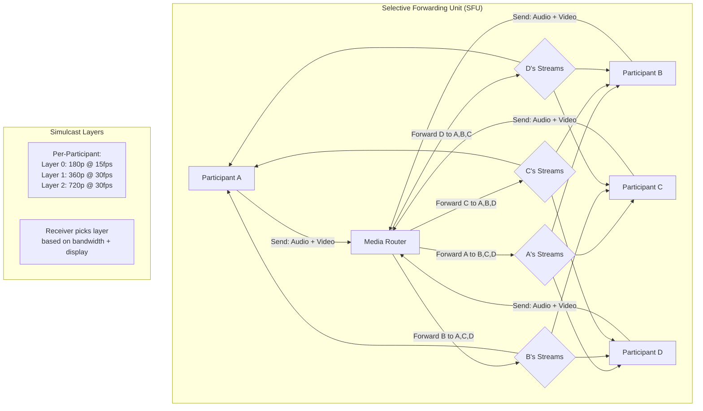

# Video Conferencing System

## Requirements

- 1:1 and group video calls (up to 50 participants)
- Screen sharing with presenter controls
- Chat messaging (in-meeting)
- Cloud recording storage and playback
- 10M daily active users, 500K concurrent meetings

## Capacity Estimation

```
Concurrent meetings: 500K peak
Participants per meeting: avg 4, max 50
Video streams: 4 avg × 500K = 2M concurrent video streams
Bandwidth per stream: 2.5 Mbps (720p) → 5 Tbps aggregate
Recording: 500K meetings × 30min avg × 200MB/min → 3PB/day
Signaling: 100M messages/sec (join, leave, mute, chat)
```

## API Design

```
REST:
POST /meetings            → {meeting_id, host_token, settings}
POST /meetings/{id}/join  → {participant_token, ice_servers}
POST /meetings/{id}/leave → {participant_id}
POST /recordings          → {meeting_id, format, storage}

WebSocket / WebRTC:
WS /signaling/{meeting_id} → Offer, Answer, ICE candidates
WS /chat/{meeting_id}      → Text messages, reactions
```

## SFU Architecture



## WebRTC Signaling (STUN/TURN/ICE)

```
Signaling flow for establishing a peer connection:

┌──────────┐                    ┌──────────┐
│ Client A │                    │ Client B │
└────┬─────┘                    └────┬─────┘
     │                              │
     │ 1. Create Offer (SDP)        │
     ├────────────────────► Signaling Server
     │                              │
     │                   2. Forward Offer to B
     │                              │◄─── received
     │                              │
     │                   3. B creates Answer (SDP)
     │◄─── Signaling Server ◄──────┤
     │ 4. Forward Answer to A       │
     │                              │
     │ 5. ICE Candidate exchange    │
     ├──────────────────────────────►
     │◄─────────────────────────────┤
     │                              │
     │ 6. Direct P2P Connection     │
     │    (or via TURN relay)       │
     ├──────────────────────────────►
     │◄─────────────────────────────┤

ICE Candidates (priority order):
  1. Host candidate       (P2P, same network)
  2. STUN candidate       (P2P, NAT traversal)
  3. TURN candidate       (Relay, highest latency)
```

## Recording Pipeline

```
Recording Architecture:

SFU Streams
    │
    ├──► Recording Service
    │      ├── Receive all participant feeds
    │      ├── Audio mixer (Opus → AAC transcoding)
    │      ├── Video compositor (gallery + speaker layout)
    │      ├── Add metadata overlay (timestamps, names)
    │      └── Output MP4 segments (5-second chunks)
    │
    ├──► Uploader
    │      ├── Chunked upload to S3-compatible storage
    │      ├── Parallel segment upload
    │      └── Manifest generation (HLS playlists)
    │
    └──► Transcoding Pipeline
           ├── Generate thumbnails (every 30 seconds)
           ├── Generate transcript (speech-to-text)
           └── Generate closed captions (VTT)

Recording storage:
  - Hot (7 days):   S3 Standard
  - Warm (30 days): S3 Infrequent Access
  - Cold (1 year):  S3 Glacier
  - Archive (permanent): Customer's own storage
```

## Chat System Integration

```
In-meeting chat:
  - Real-time via WebSocket (same connection as signaling)
  - Rich messages: text, image, file attachment
  - Reactions: emoji reactions on messages
  - Threaded replies

Storage:
  - Messages per meeting: ~100-500 (ephemeral)
  - Active meetings: Redis sorted set (by timestamp)
  - Completed meetings: MySQL/PostgreSQL (archive)
  - File attachments: S3 with signed URLs

Event flow:
  Participant sends message
    → WebSocket → Chat Service
    → Persist to Redis (active) + Kafka (async for archive)
    → Broadcast to all meeting participants via WS
```

## Scaling Strategy

| Component | Strategy |
|-----------|----------|
| **SFU nodes** | Elastigroup per region; auto-scale with meeting demand |
| **Signaling** | Stateless WebSocket servers behind ALB |
| **STUN/TURN** | Regional TURN servers; geo-DNS routing |
| **Recording** | Spot instances for transcoding farm |
| **Chat persistence** | Redis for active meetings; MySQL for archive |
| **Media storage** | S3 with lifecycle policies |
| **Global reach** | Deploy SFU nodes in 20+ regions |

## Deployment

```yaml
services:
  sfu-server:
    image: sfu:latest
    ports: [udp:10000-20000, tcp:443]
    environment:
      TURN_SECRET: ${TURN_SECRET}
      REDIS_URL: redis://redis-cluster:6379
    autoscale:
      min: 10
      max: 500
      metric: cpu > 70%
  
  signaling-server:
    image: signaling:latest
    ports: [tcp:443]
    replicas: 20
  
  recording-service:
    image: recorder:latest
    autoscale:
      min: 5
      max: 200
      metric: queue_depth > 100
```

## Interview Questions

1. How does an SFU differ from an MCU for video conferencing?
2. How does WebRTC signaling establish peer connections through NAT?
3. How does simulcast work in a multi-participant video call?
4. Design the recording pipeline for a video conferencing service.
5. How would you scale video conferencing to 1M simultaneous participants?
