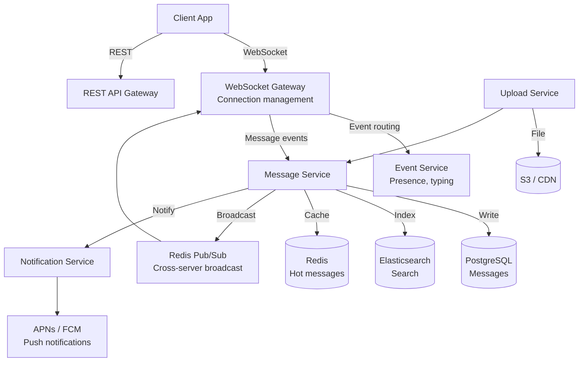

# Real-Time Chat Platform

## Requirements

- Channel-based messaging (public + private)
- Threaded replies and reactions
- File upload and media preview
- Full-text search across messages
- Presence indicators (online/offline/away)
- Push notifications for mobile
- Offline sync with message queue
- 100M users, 1B messages/day

## Capacity Estimation

```
Messages:     1B/day ≈ 11,500 writes/sec, 50K reads/sec peak
Channels:     500M total, 50M active daily
Users:        100M users, 30M daily active
Presence:     30M online × 1 update/min = 500K events/min
File uploads: 100M/day (images, docs) → 500TB/day storage
Search:       10M queries/day
Notifications: 200M push notifications/day
```

## API Design

```
REST:
POST /channels               → {name, type, members}
POST /channels/{id}/messages → {text, attachments, thread_id}
PATCH /messages/{id}/reactions → {emoji, add/remove}
GET /channels/{id}/messages?cursor=...&limit=50
POST /channels/{id}/join     → {user_id}

WebSocket:
WS /gateway → Real-time events (message, reaction, presence, typing)
  Events:
  {type: "message.created", channel_id, message}
  {type: "presence.update", user_id, status: "online"}
  {type: "typing.start", channel_id, user_id}
  {type: "reaction.added", message_id, emoji}

Search:
GET /search?q=...&channel_id=...&user_id=...&before=...&after=...
```

## Database Design

```sql
-- Messages (high-write, time-ordered)
CREATE TABLE messages (
    id UUID PRIMARY KEY DEFAULT gen_random_uuid(),
    channel_id UUID NOT NULL,
    user_id UUID NOT NULL,
    thread_id UUID REFERENCES messages(id),
    content TEXT,
    message_type VARCHAR(20) DEFAULT 'text',
    created_at TIMESTAMP DEFAULT NOW(),
    edited_at TIMESTAMP,
    INDEX idx_channel_time (channel_id, created_at DESC),
    INDEX idx_user_messages (user_id, created_at DESC)
) PARTITION BY RANGE (created_at);

-- Thread replies (parent-child relationship)
CREATE TABLE thread_replies (
    thread_id UUID NOT NULL,
    reply_id UUID NOT NULL,
    reply_order INT NOT NULL,
    PRIMARY KEY (thread_id, reply_order),
    INDEX idx_thread_replies (thread_id, reply_order)
);

-- Reactions (string-based emoji)
CREATE TABLE reactions (
    message_id UUID NOT NULL,
    user_id UUID NOT NULL,
    emoji VARCHAR(32) NOT NULL,
    created_at TIMESTAMP DEFAULT NOW(),
    PRIMARY KEY (message_id, user_id, emoji)
);

-- Channel membership (NoSQL-friendly)
CREATE TABLE channel_members (
    channel_id UUID NOT NULL,
    user_id UUID NOT NULL,
    last_read_at TIMESTAMP,
    role VARCHAR(20) DEFAULT 'member',
    joined_at TIMESTAMP DEFAULT NOW(),
    PRIMARY KEY (channel_id, user_id),
    INDEX idx_user_channels (user_id, last_read_at DESC)
);
```

## Hybrid SQL + NoSQL Architecture

```
┌─────────────────────────────────────────────────────────────┐
│                  Hybrid Storage Architecture                  │
├─────────────────────────────────────────────────────────────┤
│                                                              │
│  SQL (PostgreSQL):                                           │
│  - Messages (partitioned by date)                            │
│  - Users, Channels                                           │
│  - Threads, Reactions                                        │
│  - Strong consistency for critical reads                     │
│                                                              │
│  NoSQL (Cassandra / ScyllaDB):                               │
│  - Channel Membership (high write)                            │
│  - User Presence (ephemeral, high churn)                     │
│  - Message IDs by channel (time-ordered)                     │
│                                                              │
│  Search (Elasticsearch):                                     │
│  - Full-text message index                                   │
│  - Channel search                                            │
│  - User search                                               │
│                                                              │
│  Cache (Redis):                                              │
│  - Active message buffers (last 100 per channel)             │
│  - Presence state (sorted sets)                              │
│  - Session tokens                                            │
│  - Rate limit counters                                       │
│                                                              │
└─────────────────────────────────────────────────────────────┘
```

## High-Level Design



## WebSocket Gateway + Redis Pub/Sub

```
Gateway Architecture:

Client 1 ──► WebSocket ──► Gateway Node 1
Client 2 ──► WebSocket ──► Gateway Node 2
Client 3 ──► WebSocket ──► Gateway Node N

When Client 1 sends message:
  1. Gateway Node 1 receives message
  2. Routes to Message Service (HTTP or internal RPC)
  3. Message service persists to DB + search index
  4. Message service publishes to Redis Pub/Sub channel
  5. All Gateway nodes subscribe to channel
  6. Each Gateway node delivers to relevant connected clients

Scale:
  - Each Gateway Node: 100K+ concurrent WebSocket connections
  - Redis Pub/Sub: millions of messages/sec
  - Horizontal scaling: add Gateway nodes as needed
  - Sticky sessions not required (Pub/Sub handles broadcast)

Connection recovery:
  - Client stores last received event_id
  - On reconnect, sends resume token
  - Gateway replays missed events from Redis buffer
  - Buffer holds last 1000 events per connection
```

## Offline Sync

```
Offline message queue:

Client goes offline:
  1. Gateway node detects disconnect
  2. Marks user as offline (Redis presence)
  3. Messages queued in Gateway's buffer
  
Client reconnects:
  1. Gateway authenticates session
  2. Client sends last_known_event_id
  3. Gateway replays events since last_known_event_id
  4. Client applies events to local cache

Mobile offline:
  1. App stores messages in local SQLite DB
  2. App stores outbox (unsent messages)
  3. Connection restored → sync outbox
  4. Server deduplicates by client-generated message_id

Deduplication:
  - Client generates UUID for each message
  - Server stores message_id in dedup set (TTL 24h)
  - Duplicate message_id → 409 Conflict (not re-processed)
```

## Scaling Strategy

| Component | Strategy |
|-----------|----------|
| **Gateway nodes** | Stateless; scale horizontally; Redis Pub/Sub for cross-node broadcast |
| **Message writes** | PostgreSQL partitioned by date; batch inserts |
| **Search** | Elasticsearch with message index; refresh_interval=30s for write throughput |
| **File uploads** | S3 presigned URLs; CDN for delivery |
| **Presence** | Redis HyperLogLog or Sorted Sets; heartbeat every 60s |
| **Push notifications** | Queue to APNs/FCM workers; batch per device token |
| **Rate limiting** | Per-user token bucket in Redis; 10 messages/sec/user |

## Interview Questions

1. How does Redis Pub/Sub enable cross-server broadcast in a WebSocket gateway?
2. How would you design offline sync for a mobile chat app?
3. How do you handle message deduplication when clients resend?
4. Design a presence system that scales to 100M users.
5. How do you implement search across billions of chat messages?
