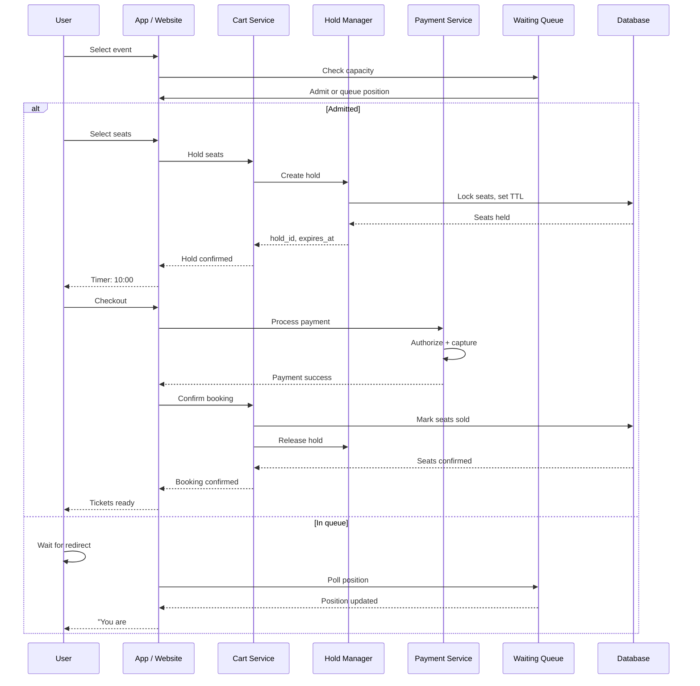

# Event Booking System

## Requirements

- Browse events and select seats (interactive seat map)
- Inventory holds with configurable timeout (5-15 minutes)
- Waiting queue for sold-out events
- Payment processing integration
- Anti-scalper measures (CAPTCHA, rate limiting, verified fan)
- 100K concurrent users during on-sale, 10K events/day

## Capacity Estimation

```
Concurrent on-sale:  100K users
Seats per event:     500-80,000 (venues vary)
Checkout rate:       ~5000 transactions/sec peak
Inventory holds:     10M active holds during on-sale
Waiting queue:       Up to 500K users for popular events
API requests:        1M/sec during ticket on-sale (seat selection polling)
```

## API Design

```
GET /events                    → {events[], filters}
GET /events/{id}/seat-map      → {sections[], seat_status[][]}
POST /cart/hold                → {event_id, section, seats[], hold_id, expires_at}
POST /cart/release             → {hold_id}
POST /cart/checkout            → {hold_id, payment_method}
GET /waiting-room/{event_id}   → {position, estimated_wait, redirect_url}
```

## Database Design

```sql
-- Events
CREATE TABLE events (
    id UUID PRIMARY KEY,
    name VARCHAR(255),
    venue_id UUID,
    event_date TIMESTAMP,
    status VARCHAR(20) CHECK (status IN ('draft', 'on_sale', 'sold_out', 'cancelled')),
    ticket_limit INT DEFAULT 4, -- max per customer
    created_at TIMESTAMP DEFAULT NOW()
);

-- Sections (price tiers)
CREATE TABLE sections (
    id UUID PRIMARY KEY,
    event_id UUID REFERENCES events(id),
    name VARCHAR(100),
    price DECIMAL(10,2),
    total_seats INT NOT NULL,
    seats_available INT NOT NULL,
    INDEX idx_event_section (event_id, id)
);

-- Individual seats
CREATE TABLE seats (
    id UUID PRIMARY KEY,
    section_id UUID REFERENCES sections(id),
    row_num VARCHAR(5),
    seat_num INT,
    status VARCHAR(20) CHECK (status IN ('available', 'held', 'sold', 'disabled')),
    INDEX idx_section_status (section_id, status)
);

-- Inventory holds
CREATE TABLE holds (
    id UUID PRIMARY KEY DEFAULT gen_random_uuid(),
    user_id UUID NOT NULL,
    seat_ids UUID[] NOT NULL,
    expires_at TIMESTAMP NOT NULL,
    created_at TIMESTAMP DEFAULT NOW(),
    INDEX idx_expires (expires_at) WHERE status = 'active',
    INDEX idx_user (user_id) WHERE status = 'active'
);

-- Orders
CREATE TABLE orders (
    id UUID PRIMARY KEY,
    user_id UUID NOT NULL,
    event_id UUID NOT NULL,
    total_amount DECIMAL(10,2),
    status VARCHAR(20) CHECK (status IN ('pending', 'confirmed', 'failed', 'refunded')),
    hold_id UUID REFERENCES holds(id),
    created_at TIMESTAMP DEFAULT NOW()
);
```

## Booking Flow



## Inventory Holds with Timeout

```
Hold lifecycle:

1. User selects seats → Hold created
   - Seats marked "held" in database
   - Hold TTL: 10 minutes (configurable per event)
   - Seats unavailable to other users
   
2. Timer runs on client (countdown) + server-side expiry

3. Expiry scenarios:
   a) User checks out → Hold converted to order → Seats marked "sold"
   b) User releases manually → Hold deleted → Seats "available"
   c) Timeout (10 min) → Background expiry job → Seats "available"
   d) User navigates away → Hold abandoned → Seats "available"

4. Hold expiration job (cron every 10 seconds):
   UPDATE seats SET status = 'available'
   WHERE id IN (
     SELECT unnest(seat_ids) FROM holds
     WHERE expires_at < NOW() AND status = 'active'
   );
   DELETE FROM holds WHERE expires_at < NOW() AND status = 'active';

Concurrency handling:
  - Seats locked via SELECT ... FOR UPDATE (row-level lock)
  - Optimistic locking with version column for high-traffic events
```

## Waiting Queue

```
Queue architecture:

On-sale start:
  ┌──────────┐     ┌──────────┐     ┌──────────┐
  │ 100K     │────►│ Waiting  │────►│ Admitted │
  │ Users    │     │ Queue    │     │ (100/sec)│
  └──────────┘     └──────────┘     └──────────┘

Implementation:
  - Redis Sorted Set: ZADD waiting_queue:{event_id} timestamp user_id
  - Score = arrival timestamp (milliseconds)
  - Batch admission: ZRANGEBYSCORE ... LIMIT 100
  - Smart polling: Exponential backoff (1s → 3s → 5s)
  - WebSocket push: "Your position: 1,234"
  - Max queue time: 30 minutes
  - After admission: JWT token valid for 2 minutes

Queue prioritization:
  - Verified Fan (presale code) → priority queue
  - Registered users before guests
  - Random order within priority tier (fairness)
  - Bot detection → rate limit or block
```

## Anti-Scalper Measures

```
Multi-layer anti-scalper strategy:

1. Rate Limiting
   - Per-IP: 100 requests/min on search
   - Per-account: 10 holds/hour
   - Per-payment: 5 transactions/hour

2. CAPTCHA
   - On checkout for high-demand events
   - Progressive: JS challenge → reCAPTCHA → SMS verification

3. Verified Fan
   - Pre-registration with phone number
   - SMS code sent at on-sale time
   - Reduces bot participation by 90%+

4. Purchase Limits
   - 4 tickets max per order
   - 8 tickets max per credit card across all events
   - Same household/address detection

5. Transfer Restrictions
   - Tickets non-transferable for 72 hours
   - Transfer only via platform (no external resale)
   - Price caps on resale (max 10% above face value)

6. Behavior Analysis
   - Browser fingerprinting
   - Mouse movement analysis (bot detection)
   - Velocity checks (same IP, multiple accounts)
```

## Scaling Strategy

| Component | Strategy |
|-----------|----------|
| **Seat map** | Read from Redis cache; write directly to DB on hold |
| **Inventory holds** | PostgreSQL SELECT FOR UPDATE + TTL cleanup job |
| **Waiting queue** | Redis sorted sets; batch admission |
| **Payment** | Idempotent; async confirmation via webhook |
| **Static assets** | CDN for seat map SVGs, event images |
| **On-sale surge** | Auto-scale cart + hold services; DB connection pooling |

## Interview Questions

1. How do you handle concurrent seat selection for high-demand events?
2. How would you design the inventory hold system with timeout?
3. How does the waiting queue work and how do you scale it?
4. Design anti-scalper protections for a ticket booking system.
5. How do you ensure ticket inventory consistency during on-sale surges?
