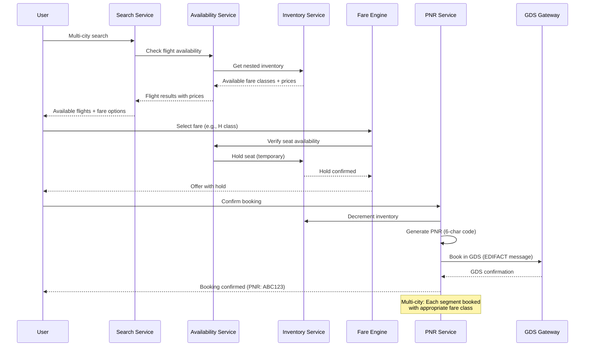

# Airline Reservation System

## Requirements

- Multi-city flight search (origin → destination → origin)
- Fare classes with nested inventory (Y, B, M, H, Q, V)
- Booking codes and fare rules
- Disruption recovery (rebooking, cancellations, IRROPS)
- GDS integration (Sabre, Amadeus, Travelport)
- 500K flights/day, 10M searches/day

## Capacity Estimation

```
Flights/day:         500K flights, 10M seats
Searches/day:        10M searches (50M segments)
Bookings/day:        1M PNRs (Passenger Name Records)
Availability checks: 100M/day (cache + real-time)
GDS messages:        5M/day (EDIFACT messages)
Disruption events:   10K/day (weather, ATC, mechanical)
```

## API Design

```
GET /flights/search?
  origin=JFK&destination=LHR&depart_date=2026-08-15
  &return_date=2026-08-22&passengers=1&cabins=Y,W,J,F

GET /flights/{id}/availability?date=...&fare_class=...
  → {seats_available, fare_rules[], booking_codes[]}

POST /bookings
  → {pnr, flights[], passengers[], total_price, booking_code}

POST /bookings/{pnr}/cancel → {pnr, status, refund_amount}

POST /disruptions/rebook
  → {original_pnr, new_flights[], compensation}
```

## Database Design

```sql
-- Flights
CREATE TABLE flights (
    id UUID PRIMARY KEY,
    flight_number VARCHAR(10) NOT NULL,
    airline VARCHAR(2) NOT NULL,
    origin VARCHAR(3) NOT NULL,
    destination VARCHAR(3) NOT NULL,
    departure_utc TIMESTAMP NOT NULL,
    arrival_utc TIMESTAMP NOT NULL,
    aircraft_type VARCHAR(10),
    INDEX idx_route_date (origin, destination, departure_utc)
);

-- Nested inventory (per fare class per flight)
CREATE TABLE fare_inventory (
    id UUID PRIMARY KEY,
    flight_id UUID REFERENCES flights(id),
    fare_class VARCHAR(1) NOT NULL, -- Y, B, M, H, Q, V, etc.
    cabin VARCHAR(20) CHECK (cabin IN ('economy', 'premium_economy', 'business', 'first')),
    total_seats INT NOT NULL,
    seats_sold INT DEFAULT 0,
    seats_available INT GENERATED ALWAYS AS (total_seats - seats_sold) STORED,
    fare_rules JSONB, -- refundable, changeable, advance purchase
    price DECIMAL(10,2),
    currency VARCHAR(3) DEFAULT 'USD',
    INDEX idx_flight_class (flight_id, fare_class)
);

-- Fare class nesting (booking codes)
CREATE TABLE fare_class_hierarchy (
    cabin VARCHAR(20),
    higher_class VARCHAR(1), -- Y > B > M > H > Q > V
    lower_class VARCHAR(1),
    upgrade_available BOOLEAN DEFAULT FALSE
);

-- Passenger Name Record
CREATE TABLE bookings (
    pnr VARCHAR(6) PRIMARY KEY, -- 6 alphanumeric
    user_id UUID,
    status VARCHAR(20) CHECK (status IN (
        'pending', 'confirmed', 'checked_in', 'boarded', 
        'cancelled', 'disrupted', 'rebooked'
    )),
    total_price DECIMAL(10,2),
    currency VARCHAR(3),
    created_at TIMESTAMP DEFAULT NOW(),
    INDEX idx_user_bookings (user_id, created_at DESC)
);

-- Booking segments
CREATE TABLE booking_segments (
    id UUID PRIMARY KEY,
    pnr VARCHAR(6) REFERENCES bookings(pnr),
    flight_id UUID REFERENCES flights(id),
    fare_class VARCHAR(1),
    booking_code VARCHAR(1),
    seat_number VARCHAR(4),
    status VARCHAR(20),
    INDEX idx_pnr_segments (pnr)
);
```

## Fare Classes (Nested Inventory)

```
Fare class hierarchy (typically):

First (F, A, P):      Full fare first class
Business (J, C, D, I): Full fare → discounted business
Premium Eco (W, S, A): Premium economy
Economy (Y, B, M, H): Full fare economy
Economy (Q, V, W, S, T, L): Discounted economy
Economy (K, N, Q, G): Deep discount / Basic economy

Nested inventory:
  Cabin capacity: 200 economy seats
  Y (full):    10 seats  ← available when Y ≤ 10
  B:           20 seats  ← available when Y+B ≤ 20 (B opens when Y ≤ 10)
  M:           40 seats  ← available when Y+B+M ≤ 40
  H:           70 seats
  Q:           100 seats
  V:           150 seats
  T:           200 seats (all seats)

Inventory control:
  Each fare class has authorization level (number of seats allocated).
  If Y is sold out but B still has seats → B is available (higher price).
  Revenue management adjusts authorization levels dynamically.
```

## Booking Flow



## Disruption Recovery (IRROPS)

```
Irregular Operations (IRROPS) flow:

Trigger: Weather, ATC, mechanical, crew timeout
  │
  ├── 1. Identify affected flights
  │     - Flight cancellation / delay
  │     - Missed connections (if delay causes misconnect)
  │
  ├── 2. Passenger impact analysis
  │     - All passengers on cancelled flight
  │     - Passengers with onward connections
  │     - VIP/status passengers (prioritize)
  │
  ├── 3. Auto-rebooking
  │     - Find alternative flights (same airline, partners)
  │     - Same cabin, same fare class or downgrade with refund
  │     - Consider passenger preferences (time, route, alliances)
  │
  ├── 4. Notification
  │     - Push notification + SMS + email
  │     - Update PNR with new flights
  │     - Instructions for self-service rebooking
  │
  └── 5. Compensation
        - Rebooking fee waiver (automatic)
        - Meal/hotel vouchers (policy-based)
        - Compensation (EU 261: $600+ for EU flights)
```

## GDS Integration

```
GDS (Global Distribution System) Gateway:

┌──────────┐     ┌──────────┐     ┌──────────┐
│ Our      │────►│ GDS      │────►│ Sabre    │
│ System   │     │ Gateway  │     │ Amadeus  │
│          │     │          │────►│ Travelport│
└──────────┘     └──────────┘     └──────────┘

EDIFACT message flow:
  AVAIL_REQ → (Check availability) → AVAIL_RSP
  FARES_REQ → (Get fare rules)     → FARES_RSP
  BOOK_REQ  → (Create booking)     → BOOK_RSP
  TICKET_REQ→ (Issue ticket)       → TICKET_RSP
  CANCEL_REQ→ (Cancel booking)     → CANCEL_RSP

Caching strategy:
  - Flight schedule cache: TTL 1 hour (rarely changes)
  - Availability cache: TTL 30 seconds (dynamic)
  - Fare rules cache: TTL 24 hours (rarely changes)
  - Booking/write: Always real-time via GDS
```

## Scaling Strategy

| Component | Strategy |
|-----------|----------|
| **Flight search** | Cached availability + real-time inventory check |
| **Availability** | Redis with fare class nesting; TTL 30s |
| **Bookings** | PNR generated in-database + GDS sync |
| **Disruption recovery** | Rule engine + queue for parallel rebooking |
| **GDS gateway** | Throttled to respect GDS rate limits; circuit breaker |
| **Multi-city search** | Graph search (BFS over date-graph of airports) |

## Interview Questions

1. How does nested fare class inventory management work?
2. Design a multi-city flight search that checks availability across segments.
3. How would you implement disruption recovery (rebooking) at scale?
4. How do you integrate with GDS systems while maintaining performance?
5. How does an airline reservation system handle inventory consistency across channels?
