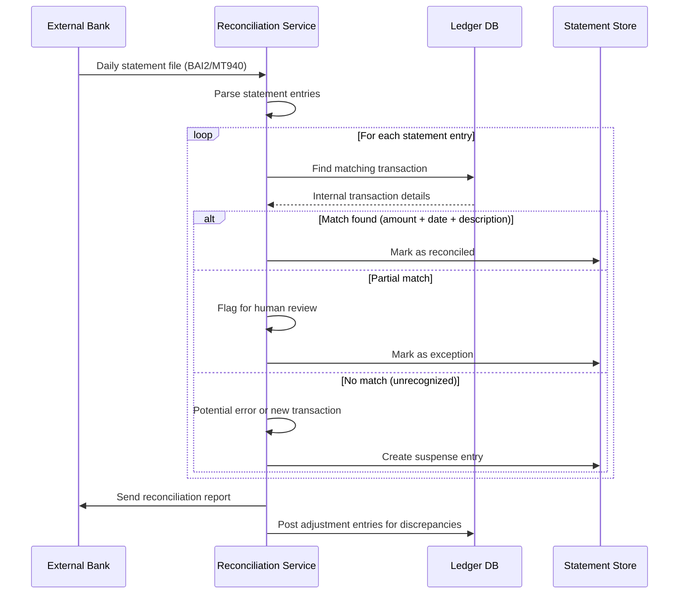

# Banking Ledger System

## Requirements

- Double-entry accounting (every debit has a corresponding credit)
- Transaction isolation with optimistic locking
- Reconciliation engine for external bank feeds
- Append-only audit trail (immutable ledger)
- Fraud detection (real-time scoring)
- 10M accounts, 100M transactions/day, $1B+ daily volume

## Capacity Estimation

```
Transactions:  100M/day ≈ 1150 TPS (peak: 5000 TPS)
Accounts:      10M active accounts
Ledger entries: 200M entries/day (debit + credit per transaction)
Audit log:     200M records/day → 20GB/day → 7TB/year
Reconciliation: 10M external entries matched daily
Fraud scoring:  100M transactions scored/day (< 50ms per score)
```

## API Design

```
POST /accounts → {owner_id, account_type, currency}
GET /accounts/{id}/balance → {balance, available, pending}
POST /transactions → {
  debits: [{account_id, amount, currency}],
  credits: [{account_id, amount, currency}],
  idempotency_key, description
}
GET /transactions/{id} → {debits[], credits[], status, created_at}
GET /accounts/{id}/ledger?from=...&to=...&cursor=...&limit=100
POST /reconciliation → {external_statement_id, entries[]}
```

## Database Design

```sql
-- Accounts (current state)
CREATE TABLE accounts (
    id UUID PRIMARY KEY,
    account_number VARCHAR(20) UNIQUE NOT NULL,
    owner_id UUID NOT NULL,
    account_type VARCHAR(20) CHECK (account_type IN (
        'checking', 'savings', 'credit', 'loan', 'investment'
    )),
    currency VARCHAR(3) DEFAULT 'USD',
    balance NUMERIC(20,2) NOT NULL DEFAULT 0.00,
    available_balance NUMERIC(20,2) NOT NULL DEFAULT 0.00,
    version INT NOT NULL DEFAULT 1, -- optimistic lock
    status VARCHAR(10) DEFAULT 'active',
    created_at TIMESTAMP DEFAULT NOW(),
    updated_at TIMESTAMP DEFAULT NOW()
);

-- Ledger (immutable, append-only)
CREATE TABLE ledger_entries (
    id BIGSERIAL PRIMARY KEY,
    transaction_id UUID NOT NULL,
    account_id UUID NOT NULL,
    entry_type VARCHAR(4) CHECK (entry_type IN ('debit', 'credit')),
    amount NUMERIC(20,2) NOT NULL,
    currency VARCHAR(3) NOT NULL,
    balance_before NUMERIC(20,2) NOT NULL,
    balance_after NUMERIC(20,2) NOT NULL,
    description TEXT,
    created_at TIMESTAMP DEFAULT NOW(),
    INDEX idx_account_time (account_id, id),
    INDEX idx_transaction (transaction_id),
    INDEX idx_created (created_at)
) PARTITION BY RANGE (created_at);

-- Transactions
CREATE TABLE transactions (
    id UUID PRIMARY KEY DEFAULT gen_random_uuid(),
    idempotency_key VARCHAR(64) UNIQUE,
    status VARCHAR(20) CHECK (status IN (
        'pending', 'posted', 'failed', 'reversed'
    )),
    total_debit NUMERIC(20,2) NOT NULL,
    total_credit NUMERIC(20,2) NOT NULL,
    created_at TIMESTAMP DEFAULT NOW(),
    posted_at TIMESTAMP,
    INDEX idx_idempotency (idempotency_key)
);

-- Fraud scores
CREATE TABLE fraud_scores (
    transaction_id UUID PRIMARY KEY,
    score NUMERIC(5,2) NOT NULL, -- 0.00 to 99.99
    rules_fired TEXT[],
    reviewed BOOLEAN DEFAULT FALSE,
    decision VARCHAR(20) CHECK (decision IN ('approve', 'review', 'block')),
    created_at TIMESTAMP DEFAULT NOW()
);
```

## Double-Entry Accounting

```
Core principle: Every transaction must balance.

Transaction = 1+ debits + 1+ credits
  SUM(debits) = SUM(credits)
  Each entry affects exactly two accounts (or more)

Example: Transfer $100 from checking to savings

  TRANSACTION:
    Debit:  Checking Account:   $100.00
    Credit: Savings Account:    $100.00
    Net:    $0.00 ✓ (balances balance)

Ledger entry for checking:
  | ID | Account     | Type   | Amount  | Balance Before | Balance After |
  |----|-------------|--------|---------|----------------|---------------|
  | 1  | Checking    | Debit  | $100.00 | $1,000.00     | $900.00      |

Ledger entry for savings:
  | ID | Account     | Type   | Amount  | Balance Before | Balance After |
  |----|-------------|--------|---------|----------------|---------------|
  | 2  | Savings     | Credit | $100.00 | $500.00       | $600.00      |

Idempotency: 
  - idempotency_key = hash(transaction_details + timestamp)
  - Double submission returns same result (no duplicate)
```

## Transaction Isolation (Optimistic Locking)

```
Optimistic locking prevents lost updates in concurrent transactions.

Flow:
  1. Read account (get current balance + version)
  2. Perform business logic (check sufficient funds)
  3. Write with condition: version = read_version

SQL:
  UPDATE accounts 
  SET balance = balance - 100.00,
      available_balance = available_balance - 100.00,
      version = version + 1
  WHERE id = 'checking-uuid' 
    AND version = 5
    AND balance >= 100.00;

  If rows_affected == 0:  // Optimistic lock failure
    Retry or return error (insufficient funds or concurrent update)

Isolation level: SERIALIZABLE for critical transactions
  Per account lock: advisory lock (pg_try_advisory_xact_lock)
  Deadlock prevention: consistent lock ordering (by account ID hash)
```

## Reconciliation



## Audit Trail (Append-Only Ledger)

```
Immutability properties:
  - Ledger entries are never updated or deleted (append only)
  - Each entry has monotonically increasing ID
  - Previous balance stored, enabling chain verification
  - Checksum/hash chain for tamper detection

Hash chain:
  entry_hash = SHA256(prev_entry_hash + account_id + amount + balance_after)

  Entry 1: hash_1 = SHA256("GENESIS" + ...)
  Entry 2: hash_2 = SHA256(hash_1 + ...)
  Entry 3: hash_3 = SHA256(hash_2 + ...)
  
  Tampering any entry breaks the chain → immediately detectable.

Audit queries:
  - All transactions for an account in date range
  - All accounts affected by a specific transaction
  - Balance at any point in time (point-in-time snapshot)
  - Fraud investigation: find all transactions for an IP/device

Retention:
  - Active ledger: partitioned by month (hot)
  - Archive: compressed Parquet to S3 (cold)
  - Regulatory: 7 years minimum
```

## Fraud Detection

```
Real-time fraud scoring pipeline:

Transaction Initiated
    │
    ├── Rule-based checks (< 1ms)
    │   ├── Amount > threshold (e.g., $10,000)
    │   ├── Velocity (5+ transactions in 1 minute)
    │   ├── Unusual location (IP differs from account region)
    │   ├── New device / new payee
    │   └── Known fraud patterns (mule accounts, structured deposits)
    │
    ├── ML model scoring (< 50ms)
    │   ├── Features: transaction amount, frequency, merchant, channel
    │   ├── Features: account age, avg balance, typical behavior
    │   ├── Features: device fingerprint, IP reputation, geolocation
    │   └── Score: 0-99 (99 = most likely fraud)
    │
    └── Decision
        ├── Score < 30:  Approve
        ├── Score 30-70: Review (3DS challenge, SMS verification)
        └── Score > 70:  Block + notify + alert fraud team
```

## Scaling Strategy

| Component | Strategy |
|----------|----------|
| **Transaction processing** | Optimistic locking; SERIALIZABLE for critical paths |
| **Ledger writes** | Batch commit every 100ms for throughput |
| **Read queries** | Read replicas for history queries; primary for balance |
| **Audit storage** | Partitioned; archive to S3 after 3 months |
| **Fraud detection** | In-memory rules + ML model (TensorFlow Serving) |
| **Reconciliation** | Daily batch processing; Spark for large statement matching |

## Interview Questions

1. How does double-entry accounting work in a banking system?
2. How do you handle concurrent transactions to the same account?
3. Design an immutable audit trail that can detect tampering.
4. How does bank reconciliation work at the system level?
5. How would you implement a real-time fraud detection pipeline?
