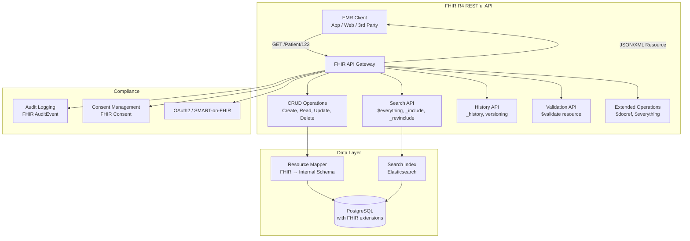
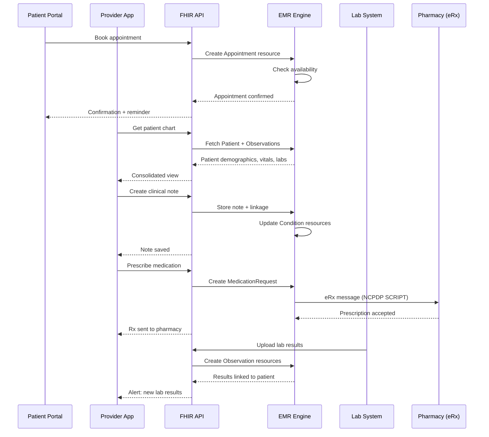

# Healthcare Electronic Medical Records (EMR) System

## Requirements

- Patient records management (demographics, history, allergies)
- FHIR R4 API compliance (HL7 international standard)
- Appointment scheduling and calendar management
- Clinical notes (SOAP format, templates)
- Lab results and diagnostic imaging
- Prescription management (eRx integration)
- HIPAA compliance (US healthcare privacy law)
- 10M patients, 500 clinics, 50K providers

## Capacity Estimation

```
Patients:       10M active patients
Providers:      50K doctors, nurses, staff
Appointments:   500K/day, 15M/month
Clinical notes: 500K/day (avg 5KB each) → 2.5GB/day
Lab results:    1M/day → 10GB/day (including PDF attachments)
Prescriptions:  200K/day (eRx messages)
FHIR API calls:  50M/day (search, read, write operations)
Image storage:  100K studies/day → 1TB/day (DICOM images)
```

## API Design (FHIR R4)

```
FHIR resource endpoints:

GET /Patient/{id}
GET /Patient?identifier=SSN|...&birthdate=...
POST /Patient → Create patient resource

GET /Observation?patient={id}&code=LOINC|...
POST /Observation → Lab result

GET /Appointment?patient={id}&date=...
POST /Appointment → Schedule appointment

GET /MedicationRequest?patient={id}&status=active
POST /MedicationRequest → Prescribe medication

GET /DocumentReference?patient={id}&type=...
POST /DocumentReference → Clinical note upload

GET /Condition?patient={id}&clinical-status=active
POST /Condition → Diagnosis entry
```

## Database Design

```sql
-- Patients (demographics)
CREATE TABLE patients (
    id UUID PRIMARY KEY,
    fhir_id VARCHAR(64) UNIQUE NOT NULL,
    mrn VARCHAR(20) UNIQUE NOT NULL, -- Medical Record Number
    first_name VARCHAR(100),
    last_name VARCHAR(100),
    dob DATE NOT NULL,
    gender VARCHAR(10),
    address JSONB,
    phone VARCHAR(20),
    email VARCHAR(255),
    primary_provider_id UUID,
    status VARCHAR(20) DEFAULT 'active',
    version INT DEFAULT 1, -- FHIR versioning
    created_at TIMESTAMP DEFAULT NOW(),
    updated_at TIMESTAMP DEFAULT NOW()
);

-- Clinical notes
CREATE TABLE clinical_notes (
    id UUID PRIMARY KEY,
    patient_id UUID REFERENCES patients(id),
    provider_id UUID NOT NULL,
    encounter_id UUID,
    note_type VARCHAR(50), -- SOAP, progress, consult, discharge
    subjective TEXT,
    objective TEXT,
    assessment TEXT,
    plan TEXT,
    diagnosis_codes TEXT[], -- ICD-10 codes
    created_at TIMESTAMP DEFAULT NOW(),
    updated_at TIMESTAMP DEFAULT NOW(),
    INDEX idx_patient_notes (patient_id, created_at DESC)
);

-- Appointments
CREATE TABLE appointments (
    id UUID PRIMARY KEY,
    patient_id UUID REFERENCES patients(id),
    provider_id UUID NOT NULL,
    clinic_id UUID NOT NULL,
    start_time TIMESTAMP NOT NULL,
    end_time TIMESTAMP NOT NULL,
    status VARCHAR(20) CHECK (status IN (
        'scheduled', 'confirmed', 'checked_in', 'in_progress',
        'completed', 'cancelled', 'no_show'
    )),
    appointment_type VARCHAR(50),
    reason TEXT,
    created_at TIMESTAMP DEFAULT NOW(),
    INDEX idx_provider_schedule (provider_id, start_time),
    INDEX idx_clinic_schedule (clinic_id, start_time),
    INDEX idx_patient_appointments (patient_id, start_time DESC)
);

-- Lab results / Observations
CREATE TABLE observations (
    id UUID PRIMARY KEY,
    patient_id UUID REFERENCES patients(id),
    encounter_id UUID,
    code VARCHAR(20) NOT NULL, -- LOINC code
    code_system VARCHAR(20) DEFAULT 'LOINC',
    value_quantity NUMERIC,
    value_string TEXT,
    value_codeable_concept VARCHAR(100),
    unit VARCHAR(20),
    reference_range_low NUMERIC,
    reference_range_high NUMERIC,
    interpretation VARCHAR(10), -- N, L, H, A, AA, etc.
    status VARCHAR(20) DEFAULT 'final',
    issued_at TIMESTAMP DEFAULT NOW(),
    INDEX idx_patient_obs (patient_id, code, issued_at DESC)
);

-- Prescriptions
CREATE TABLE medication_requests (
    id UUID PRIMARY KEY,
    patient_id UUID REFERENCES patients(id),
    prescriber_id UUID NOT NULL,
    medication_code VARCHAR(20), -- RxNorm or NDC
    medication_name VARCHAR(255),
    dosage_instruction JSONB, -- structured sig
    quantity INT,
    refills INT DEFAULT 0,
    status VARCHAR(20) CHECK (status IN (
        'active', 'completed', 'stopped', 'cancelled', 'draft'
    )),
    written_at TIMESTAMP DEFAULT NOW(),
    expires_at TIMESTAMP,
    INDEX idx_active_rx (patient_id) WHERE status = 'active'
);
```

## FHIR R4 API



## Appointments System

```
Appointment lifecycle:

┌──────────┐    ┌──────────┐    ┌──────────┐    ┌──────────┐
│ Scheduled│───►│Confirmed │───►│Checked In│───►│ Completed│
└──────────┘    └──────────┘    └──────────┘    └──────────┘
     │               │               │               │
     ▼               ▼               ▼               ▼
┌──────────┐    ┌──────────┐    ┌──────────┐    ┌──────────┐
│Cancelled │    │ Rescheduled│   │ In Progress│  │No Show  │
└──────────┘    └──────────┘    └──────────┘    └──────────┘

Scheduling rules:
  - Provider schedule: 15-60 min slots
  - Double-booking prevention (per provider)
  - Clinic capacity (rooms, equipment)
  - Appointment types (new patient, follow-up, procedure)
  - Insurance verification required before confirmation

Reminders:
  - 72h before: SMS/email reminder
  - 24h before: Push notification
  - 2h before: Final reminder + check-in instructions
  - No-show: Auto-cancel after 15 min grace period
```

## HIPAA Compliance

```
HIPAA compliance architecture:

1. Access Control
   - Role-based access (RBAC): Patient, Provider, Nurse, Admin, Lab
   - Attribute-based access (ABAC): organization, clinic, department
   - Break glass: Emergency access with audit trail
   - Patient consent: FHIR Consent resource for data sharing

2. Encryption
   - Data at rest: AES-256 (database + file storage)
   - Data in transit: TLS 1.3
   - Key management: AWS KMS / Azure Key Vault
   - PHI fields automatically encrypted at column level

3. Audit Trail
   - Every access logged (who, what, when, why)
   - FHIR AuditEvent resource for standardized auditing
   - Audit log: immutable, append-only
   - Retention: 6 years minimum (HIPAA requirement)

4. Data Segregation
   - Multi-tenant: row-level security by organization_id
   - PHI masking for non-clinical users
   - De-identified export for research (Safe Harbor method)
   - BAA (Business Associate Agreement) with all vendors

5. Breach Notification
   - Automated breach detection (unusual access patterns)
   - Notification within 60 days (HIPAA rule)
   - Incident response playbook
```

## Data Flow



## Scaling Strategy

| Component | Strategy |
|----------|----------|
| **Patient records** | PostgreSQL with partition by organization |
| **FHIR API** | Stateless; auto-scale with load balancer |
| **Search** | Elasticsearch for Patient, Observation, Condition search |
| **DICOM images** | S3 with CloudFront; PACS integration |
| **Appointments** | Redis for provider schedule cache |
| **Audit log** | Append-only; partitioned by month |
| **eRx integration** | Queue-based; guaranteed delivery |

## Interview Questions

1. How does FHIR R4 standardize healthcare data exchange between systems?
2. Design the appointment scheduling system with provider availability management.
3. How do you implement HIPAA compliance in a cloud-based EMR system?
4. How does the clinical note system integrate lab results and prescriptions?
5. Design a patient portal that provides secure access to medical records.
