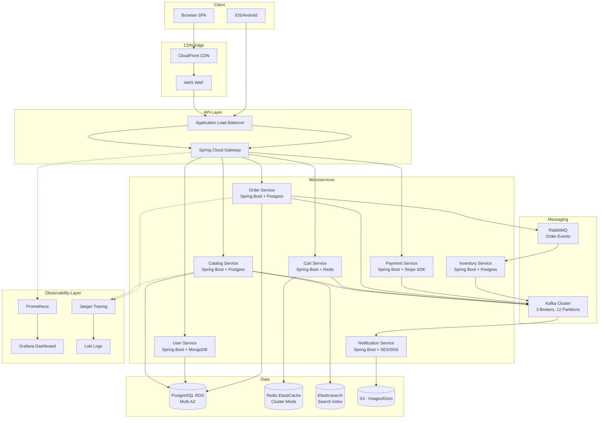
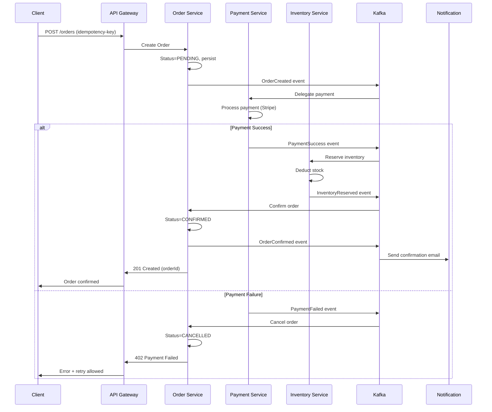
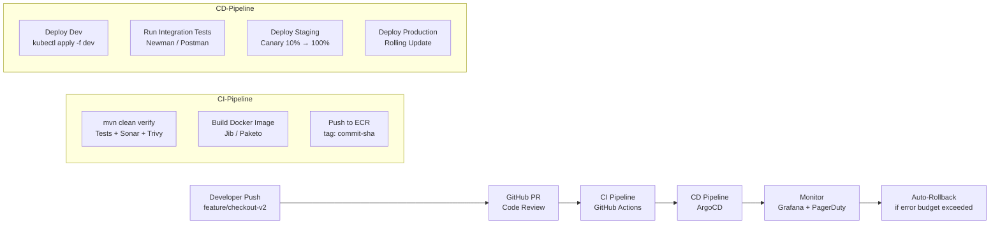
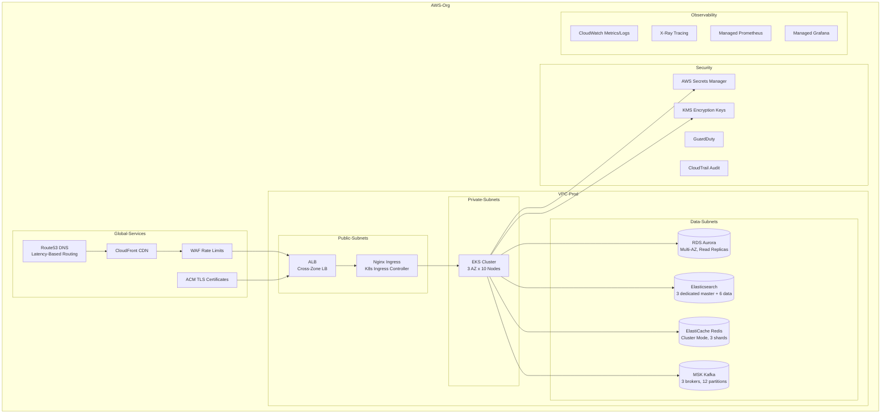
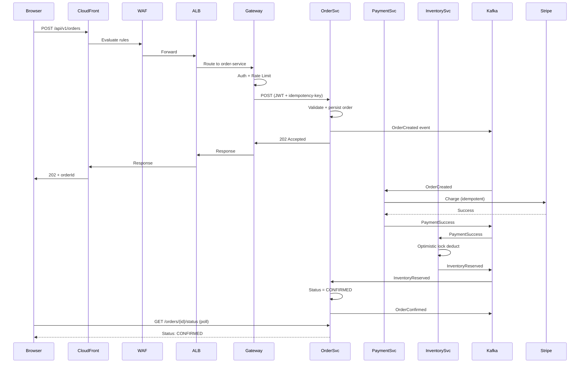

# Java Full Stack Roadmap — End-to-End Software Lifecycle

## Example Project: E-Commerce Order Management System

A real-world order management system (OMS) that handles product catalog, shopping cart, order placement, payment processing, inventory updates, and order tracking — serving 10M+ users with 99.99% availability.

---

## 1. Java Full Stack Technology Map

```
┌──────────────────────────────────────────────────────────────┐
│                   FRONTEND (Browser/Mobile)                   │
│  React / Angular / Vue  •  TypeScript  •  Tailwind / MUI     │
│  Redux / Zustand  •  React Query  •  PWA / SSR (Next.js)     │
├──────────────────────────────────────────────────────────────┤
│                    API GATEWAY / PROXY                        │
│  Spring Cloud Gateway  •  Kong / Envoy  •  Nginx             │
├──────────────────────────────────────────────────────────────┤
│                BACKEND (Java / JVM Ecosystem)                 │
│  Spring Boot 3  •  Spring Security  •  JPA / Hibernate       │
│  Spring Cloud / Netflix OSS  •  gRPC / RSocket               │
│  Axon Framework (CQRS/ES)  •  Apache Camel / Integration     │
├──────────────────────────────────────────────────────────────┤
│              MESSAGING & STREAMING                            │
│  Apache Kafka  •  RabbitMQ  •  ActiveMQ / Artemis            │
│  Debezium (CDC)  •  Spring Cloud Stream                      │
├──────────────────────────────────────────────────────────────┤
│                DATABASES & STORAGE                            │
│  PostgreSQL / MySQL  •  MongoDB  •  Redis (Cache/Session)    │
│  Elasticsearch (Search)  •  S3 / MinIO (Blob)                 │
├──────────────────────────────────────────────────────────────┤
│               CONTAINERIZATION & ORCHESTRATION                │
│  Docker  •  Kubernetes  •  Helm  •  Istio / Linkerd          │
├──────────────────────────────────────────────────────────────┤
│                  CI/CD & DEVOPS                               │
│  GitHub Actions / Jenkins  •  ArgoCD  •  SonarQube           │
│  JFrog Artifactory  •  Nexus  •  Trivy / Snyk               │
├──────────────────────────────────────────────────────────────┤
│              OBSERVABILITY                                    │
│  Prometheus + Grafana  •  ELK / Loki  •  Jaeger / Zipkin     │
│  OpenTelemetry  •  Datadog / New Relic                       │
├──────────────────────────────────────────────────────────────┤
│               CLOUD INFRASTRUCTURE                            │
│  AWS / Azure / GCP  •  Terraform  •  VPC / Subnets / LB      │
│  RDS / Aurora  •  ElastiCache  •  S3  •  CloudFront CDN      │
└──────────────────────────────────────────────────────────────┘
```

---

## 2. Project Overview: E-Commerce OMS

### Core Capabilities
- **Product Catalog**: 500K+ SKUs, faceted search, inventory visibility
- **Shopping Cart**: Add/remove, coupon/promo engine, price calc
- **Order Placement**: Create, validate, pay, confirm — async via Saga
- **Payment Processing**: Card, UPI, Wallet, BNPL — via Stripe/Razorpay
- **Inventory Service**: Real-time stock deduction, reservation, rollback
- **Order Tracking**: Status machine (PENDING → CONFIRMED → SHIPPED → DELIVERED → RETURNED)
- **Notification**: Email, SMS, push — async via Kafka + AWS SNS

### Non-Functional Requirements
| Requirement | Target | Why |
|---|---|---|
| Availability | 99.99% | 52 min downtime/year |
| Latency (p99) | <200ms for reads, <500ms for writes | User experience |
| Throughput | 10K orders/sec during peak (Black Friday) | Scale |
| Consistency | Eventual for reads, strong for payments | Business need |
| Durability | Zero data loss on acknowledged writes | Audit/compliance |

---

## 3. System Design & Architecture

### High-Level Architecture



### Key Architecture Decisions

| Decision | Choice | Rationale |
|---|---|---|
| Microservices vs Monolith | Microservices | Independent scaling, team autonomy, fault isolation |
| Sync vs Async | Async for orders (Saga), sync for reads | Orders need distributed transaction; reads need low latency |
| Database per Service | Yes | Loose coupling, independent schema evolution |
| API Communication | REST for external, gRPC for internal | REST for interop, gRPC for performance (protobuf) |
| Service Discovery | Spring Cloud Discovery + K8s DNS | Resilient routing without hardcoded endpoints |
| Circuit Breaker | Resilience4j | Prevents cascading failures downstream |
| Idempotency Key | UUID per request | Safe retries on payment/order creation |
| Event Sourcing | Axon for Order Service | Full audit trail, temporal query, event replay |

### Order Saga (Distributed Transaction)



---

## 4. Data Model (Core Services)

### Order Service

```sql
CREATE TABLE orders (
    id              UUID PRIMARY KEY DEFAULT gen_random_uuid(),
    user_id         UUID NOT NULL,
    status          VARCHAR(20) NOT NULL DEFAULT 'PENDING',
    total_amount    DECIMAL(10,2) NOT NULL,
    currency        VARCHAR(3) NOT NULL DEFAULT 'USD',
    shipping_addr   JSONB NOT NULL,
    payment_method  VARCHAR(50),
    idempotency_key VARCHAR(64) UNIQUE NOT NULL,
    created_at      TIMESTAMPTZ NOT NULL DEFAULT NOW(),
    updated_at      TIMESTAMPTZ NOT NULL DEFAULT NOW()
);

CREATE TABLE order_items (
    id          UUID PRIMARY KEY DEFAULT gen_random_uuid(),
    order_id    UUID NOT NULL REFERENCES orders(id),
    product_id  UUID NOT NULL,
    sku         VARCHAR(50) NOT NULL,
    quantity    INT NOT NULL CHECK (quantity > 0),
    unit_price  DECIMAL(10,2) NOT NULL,
    total_price DECIMAL(10,2) GENERATED ALWAYS AS (quantity * unit_price) STORED
);

CREATE INDEX idx_orders_user ON orders(user_id);
CREATE INDEX idx_orders_status ON orders(status);
CREATE INDEX idx_orders_created ON orders(created_at DESC);
```

### Inventory Service

```sql
CREATE TABLE inventory (
    product_id  UUID PRIMARY KEY,
    sku         VARCHAR(50) UNIQUE NOT NULL,
    total_qty   INT NOT NULL CHECK (total_qty >= 0),
    reserved_qty INT NOT NULL DEFAULT 0 CHECK (reserved_qty >= 0),
    available_qty INT GENERATED ALWAYS AS (total_qty - reserved_qty) STORED,
    version     INT NOT NULL DEFAULT 0
);

CREATE TABLE inventory_reservations (
    id          UUID PRIMARY KEY DEFAULT gen_random_uuid(),
    order_id    UUID NOT NULL,
    product_id  UUID NOT NULL,
    quantity    INT NOT NULL,
    status      VARCHAR(20) NOT NULL DEFAULT 'ACTIVE',
    expires_at  TIMESTAMPTZ NOT NULL,
    created_at  TIMESTAMPTZ NOT NULL DEFAULT NOW()
);

-- Optimistic lock for inventory deduction
UPDATE inventory
SET reserved_qty = reserved_qty + ?, version = version + 1
WHERE product_id = ? AND version = ? AND available_qty >= ?;
```

---

## 5. DevOps Pipeline — From Commit to Production



### Complete CI/CD Pipeline Configuration

#### 1. Developer Workflow
```bash
# Branch from main
git checkout -b feature/checkout-v2

# Code, test, commit
mvn clean verify                          # Unit + integration tests
git add -A && git commit -m "feat: add BNPL payment option"

# Push → opens PR automatically
git push origin feature/checkout-v2
```

#### 2. GitHub Actions CI (`.github/workflows/ci.yml`)
```yaml
name: Order Service CI
on:
  pull_request:
    branches: [main]
  push:
    branches: [main]

jobs:
  build:
    runs-on: ubuntu-latest
    services:
      postgres:
        image: postgres:16
        env: { POSTGRES_DB: orderdb, POSTGRES_PASSWORD: test }
      kafka:
        image: bitnami/kafka:3.6
    steps:
      - uses: actions/checkout@v4
      - uses: actions/setup-java@v4
        with: { java-version: '21', distribution: 'temurin' }

      - name: Build & Test
        run: |
          mvn clean verify -Pintegration-test
          mvn jacoco:report

      - name: Static Analysis
        run: |
          mvn sonar:sonar -Dsonar.token=${{ secrets.SONAR_TOKEN }}
          mvn owasp:aggregate           # Dependency check

      - name: Container Scan
        uses: aquasecurity/trivy-action@master
        with: { image-ref: 'order-service:latest', severity: 'CRITICAL' }

      - name: Build Docker Image
        run: |
          mvn spring-boot:build-image  # Paketo Buildpacks
          docker tag order-service:latest \
            ${{ secrets.ECR_REPO }}:order-service-${{ github.sha }}

      - name: Push to ECR
        run: |
          aws ecr get-login-password | docker login --username AWS --password-stdin
          docker push ${{ secrets.ECR_REPO }}:order-service-${{ github.sha }}
```

#### 3. ArgoCD Application (GitOps)
```yaml
# argocd/applications/order-service.yaml
apiVersion: argoproj.io/v1alpha1
kind: Application
metadata:
  name: order-service
spec:
  destination:
    namespace: production
    server: https://kubernetes.default.svc
  project: ecommerce
  source:
    repoURL: https://github.com/company/ecommerce-manifests
    path: services/order-service/overlays/production
    targetRevision: main
  syncPolicy:
    automated:
      prune: true
      selfHeal: true
```

#### 4. Kubernetes Deployment
```yaml
# k8s/overlays/production/deployment.yaml
apiVersion: apps/v1
kind: Deployment
metadata:
  name: order-service
  namespace: production
spec:
  replicas: 6
  selector:
    matchLabels: { app: order-service }
  template:
    metadata:
      labels:
        app: order-service
        version: v2.4.1
    spec:
      containers:
        - name: order-service
          image: 123456.dkr.ecr.us-east-1.amazonaws.com/order-service:abc1234
          ports:
            - containerPort: 8080
              protocol: TCP
          envFrom:
            - configMapRef: { name: order-service-config }
            - secretRef: { name: order-service-secrets }
          resources:
            requests: { cpu: "500m", memory: "1Gi" }
            limits:   { cpu: "2000m", memory: "2Gi" }
          livenessProbe:
            httpGet: { path: /actuator/health/liveness, port: 8080 }
            initialDelaySeconds: 30
          readinessProbe:
            httpGet: { path: /actuator/health/readiness, port: 8080 }
          lifecycle:
            preStop:
              exec: { command: ["sh", "-c", "sleep 30"] }  # Graceful drain
---
apiVersion: autoscaling/v2
kind: HorizontalPodAutoscaler
metadata:
  name: order-service-hpa
spec:
  scaleTargetRef: { apiVersion: apps/v1, kind: Deployment, name: order-service }
  minReplicas: 4
  maxReplicas: 40
  metrics:
    - type: Resource
      resource: { name: cpu, target: { type: Utilization, averageUtilization: 70 } }
    - type: Resource
      resource: { name: memory, target: { type: Utilization, averageUtilization: 80 } }
```

---

## 6. Cloud Infrastructure (AWS — Full Setup)



### Infrastructure as Code (Terraform)

```hcl
# terraform/environments/prod/main.tf
module "vpc" {
  source = "terraform-aws-modules/vpc/aws"
  name   = "ecommerce-prod-vpc"
  cidr   = "10.0.0.0/16"

  azs             = ["us-east-1a", "us-east-1b", "us-east-1c"]
  private_subnets = ["10.0.1.0/24", "10.0.2.0/24", "10.0.3.0/24"]
  public_subnets  = ["10.0.101.0/24", "10.0.102.0/24", "10.0.103.0/24"]

  enable_nat_gateway     = true
  enable_vpn_gateway     = false
  enable_dns_hostnames   = true
}

module "eks" {
  source  = "terraform-aws-modules/eks/aws"
  version = "~> 20.0"

  cluster_name    = "ecommerce-prod-eks"
  cluster_version = "1.30"

  vpc_id     = module.vpc.vpc_id
  subnet_ids = module.vpc.private_subnets

  node_groups = {
    main = {
      desired_size = 6
      min_size     = 3
      max_size     = 30

      instance_types = ["m6i.large", "m6i.xlarge"]
      capacity_type  = "SPOT"  # 60% cost savings

      k8s_labels = {
        Environment = "prod"
        NodeGroup   = "main"
      }
    }
    stateful = {
      desired_size = 3
      instance_types = ["m6i.large"]
      capacity_type  = "ON_DEMAND"
      k8s_labels = { NodeGroup = "stateful" }
      taints = [{
        key    = "stateful",
        value  = "true",
        effect = "NO_SCHEDULE"
      }]
    }
  }
}

module "rds_aurora" {
  source = "terraform-aws-modules/rds-aurora/aws"

  name           = "ecommerce-orders-db"
  engine         = "aurora-postgresql"
  engine_version = "16.4"

  vpc_id                = module.vpc.vpc_id
  subnets               = module.vpc.private_subnets
  create_db_subnet_group = true

  instances = {
    writer = { instance_class = "db.r6g.large" }
    reader1 = { instance_class = "db.r6g.large" }
    reader2 = { instance_class = "db.r6g.large" }
  }

  storage_encrypted   = true
  backup_retention_period = 35
  deletion_protection = true
  skip_final_snapshot = false
}
```

### Multi-Region DR Strategy

```yaml
# Disaster Recovery Plan
Primary Region:   us-east-1 (Active)
DR Region:        us-west-2 (Standby)

RPO (Recovery Point Objective): 60 seconds
RTO (Recovery Time Objective):  15 minutes

Strategy:
  1. Aurora Global Database: synchronous replication to us-west-2
  2. Kafka MirrorMaker 2: cross-region topic replication
  3. S3 CRR (Cross-Region Replication): bucket-level sync
  4. Route53: health-check based failover
  5. Terraform: replicated infrastructure in DR region
  6. EKS: standby cluster with 0 replicas → HPA scales up on failover

Failover Test: quarterly game-day exercise
```

---

## 7. Observability Strategy

### SLIs, SLOs, and Error Budgets

| Service | SLI | SLO | Budget |
|---|---|---|---|
| Order Service | p99 latency < 500ms | 99.9% | 0.1% errors/month |
| Payment Service | Success rate | 99.99% | 0.01% failures/month |
| Catalog Service | p99 latency < 200ms | 99.95% | 0.05% slow/month |
| Inventory Service | Correctness (audit) | 99.999% | 0.001% drift/month |

### Multi-Window Multi-Burn-Rate Alert

```yaml
# prometheus-rules.yaml
groups:
  - name: order-service-slo
    rules:
      - alert: HighErrorRate
        expr: |
          (rate(http_requests_total{status=~"5.."}[1m])
           / rate(http_requests_total[1m])) > 0.001
        for: 5m
        labels: { severity: page }
        annotations:
          summary: "Order service error rate > 0.1% for 5 minutes"
```

### Dashboards (Grafana)

```
Order Service Dashboard:
  ┌──────────────────┐ ┌──────────────────┐
  │ Request Rate      │ │ p50 / p95 / p99  │
  │ (RPM)            │ │ Latency (ms)     │
  ├──────────────────┤ ├──────────────────┤
  │ Error Rate by    │ │ Active Orders    │
  │ HTTP Status      │ │ (by status)      │
  ├──────────────────┤ ├──────────────────┤
  │ SLO Burn Rate    │ │ JVM Heap / GC    │
  │ (1h / 6h / 24h)  │ │ Pause (ms)       │
  ├──────────────────┤ ├──────────────────┤
  │ Kafka Lag        │ │ DB Connections   │
  │ (per partition)  │ │ Pool Usage       │
  └──────────────────┘ └──────────────────┘
```

---

## 8. End-to-End Flow: "User Places an Order"

### Step-by-step trace from browser to production

```
1. USER ACTION
   User clicks "Place Order" on React frontend
   → Frontend calls POST /api/v1/orders with idempotency-key

2. API GATEWAY (Spring Cloud Gateway)
   → Validates JWT token (retrieved from Redis session)
   → Rate-limits: 100 req/sec per user (Token Bucket)
   → Routes to order-service cluster

3. ORDER SERVICE (Spring Boot + PostgreSQL)
   → @Transactional with retry for serialization conflicts
   → Validates: user exists, products available, total matches
   → Inserts into orders + order_items table
   → Publishes OrderCreated event to Kafka
   → Returns 202 Accepted with orderId

4. KAFKA (MSK, 12 partitions, replication factor 3)
   → OrderCreated event → keyed by orderId
   → Partition: hash(orderId) % 12
   → Consumers: payment-service, inventory-service, notification-service

5. PAYMENT SERVICE (Spring Boot + Stripe SDK)
   → Consumes OrderCreated event
   → Sends idempotent payment request to Stripe
   → On success: publishes PaymentSuccess to Kafka
   → On failure: publishes PaymentFailed + schedules retry (3 attempts)

6. INVENTORY SERVICE (Spring Boot + PostgreSQL)
   → Consumes PaymentSuccess
   → Optimistic lock: UPDATE inventory SET reserved_qty += ?
   WHERE product_id = ? AND available_qty >= ?
   → If stock insufficient: publishes InventoryShort → Order Service cancels

7. ORDER SERVICE (Saga Coordinator)
   → Consumes InventoryReserved (or PaymentFailed)
   → Updates order status → CONFIRMED or CANCELLED
   → Publishes OrderConfirmed or OrderCancelled event

8. NOTIFICATION SERVICE (Spring Boot + AWS SES/SNS)
   → Consumes OrderConfirmed
   → Sends email via SES, push via SNS
   → Stores notification status in MongoDB

9. FRONTEND POLLING / WEBSOCKET
   → Frontend polls GET /api/v1/orders/{orderId}/status every 2s
   → Or: listens via WebSocket for status updates

10. OBSERVABILITY
    → Every step emits OpenTelemetry spans → Jaeger
    → Metrics: request rate, latency, error rate → Prometheus → Grafana
    → Logs: structured JSON → Loki → Grafana
    → If error budget exceeded: PagerDuty pages on-call engineer
```

### Tracing the Request



---

## 9. Java Full Stack Learning Roadmap

### Phase 1: Core Java + SQL (4 weeks)
```
Java: Collections, Streams, Lambdas, Concurrency (CompletableFuture),
      Optional, Records, Sealed Classes, Pattern Matching (Java 21)
SQL:  Joins, Indexes, CTEs, Window Functions, Query Plans, ACID
```

### Phase 2: Spring Boot + REST (4 weeks)
```
Spring Boot 3: Auto-config, Starters, Actuator, Profiles
Spring Web: REST controllers, @Valid, Exception handling, HATEOAS
Spring Data JPA: Entities, Repositories, @Query, @Lock, Auditing
Spring Security: JWT, OAuth2 resource server, Method security, CORS
Testing: JUnit 5, Mockito, Testcontainers, @WebMvcTest, @DataJpaTest
```

### Phase 3: System Design (4 weeks)
```
Fundamentals: CAP, PACELC, Consistency models, Partitioning, Replication
Patterns: CQRS, Event Sourcing, Saga, Circuit Breaker, Bulkhead
Databases: PostgreSQL vs Cassandra vs MongoDB — when and why
Caching: Redis patterns, CDN, Cache-Aside, Write-Through, Write-Behind
Messaging: Kafka (topics, partitions, consumer groups, exactly-once)
Scaling: Horizontal, Vertical, Sharding, Read Replicas, Connection Pooling
```

### Phase 4: Microservices + Cloud (6 weeks)
```
Spring Cloud: Gateway, Discovery/Eureka, Config Server, Resilience4j
Docker: Multi-stage builds, Compose, Networking, Security
Kubernetes: Pods, Deployments, Services, ConfigMaps, Secrets, HPA
AWS: VPC, EKS, RDS, ElastiCache, MSK, SQS, S3, IAM, Lambda
Terraform: Modules, State, Remote backends, Workspaces
```

### Phase 5: DevOps + Observability (3 weeks)
```
CI/CD: GitHub Actions, ArgoCD, GitOps, Helm
Observability: OpenTelemetry, Prometheus, Grafana, Loki, Jaeger
SRE: SLOs, Error Budgets, Burn Rate Alerting, Incident Management
```

### Phase 6: Staff Engineer (ongoing)
```
Architecture: Tradeoffs, RFC writing, Architecture Decision Records
Leadership: Mentorship, Technical strategy, Migration planning
Communication: Executive summaries, Incident leadership
```

---

## 10. Interview Questions for This Architecture

### System Design
1. Design the Order Service — how do you handle 10K orders/sec?
2. How would you implement the distributed Saga pattern?
3. How does the inventory service prevent overselling?
4. Design the notification service to handle 1M emails/day
5. How would you implement multi-region failover for the OMS?

### Java / Spring
6. How does `@Transactional` work with Kafka transactions?
7. How do you implement idempotency in Spring Boot?
8. How would you test the Saga orchestration?
9. How do you handle connection pool exhaustion under load?
10. How do you implement graceful shutdown in Spring Boot + Kafka?

### DevOps / Cloud
11. How do you migrate the order DB from single-AZ to Aurora Global without downtime?
12. Design the CI/CD pipeline for zero-downtime deployments
13. How do you handle secret rotation in Kubernetes?
14. How do you debug a Kafka consumer lag spike in production?
15. How do you set up canary deployments with Flagger?

### SRE / Observability
16. What SLIs/SLOs would you set for the payment service?
17. Design a Grafana dashboard for the order service
18. How do you implement distributed tracing across 5 services?
19. How do you auto-rollback a deployment that degrades p99 latency?
20. How do you run a successful game-day failover test?

---

## 11. Repository Structure Within Your System-Design-Mastery Repo

```
System-Design-Mastery/
├── 01-Computer-Science-Fundamentals/    # CAP, scalability, consistency
├── 02-Networking/                       # HTTP, gRPC, WebSocket, DNS
├── 03-Linux/                            # Processes, memory, perf tuning
├── 04-Databases/                        # PostgreSQL, Cassandra, Redis
├── 05-System-Design/                    # Caching, messaging, load balancers
├── 06-Distributed-Systems/              # Raft, Paxos, gossip, CRDTs
├── 07-Microservices/                    # DDD, Saga, Circuit Breaker
├── 08-Docker/                           # Dockerfile, Compose, Swarm
├── 09-Kubernetes/                       # Pods, Services, HPA, Operators
├── 10-AWS/                              # EKS, RDS, MSK, ElastiCache, S3
├── 11-Azure/                            # AKS, Cosmos DB, Service Bus
├── 12-GCP/                              # GKE, Cloud SQL, Pub/Sub
├── 13-Terraform/                        # IaC, Modules, State, Testing
├── 14-DevOps/                           # CI/CD, ArgoCD, Helm, Ansible
├── 15-SRE/                              # SLOs, Error Budgets, Burn Rate
├── 16-Security/                         # OAuth2, JWT, TLS, OWASP
├── 17-Observability/                    # Prometheus, Grafana, Jaeger
├── 18-Case-Studies/                     # Netflix, Uber, WhatsApp, Stripe
├── 19-Projects/
│   └── 19-java-full-stack-roadmap.md    # ← You are here
└── 20-Interview-Prep/
└── 21-Staff-Engineer/
```

Every module above connects to this Java Full Stack roadmap. When you build the E-Commerce OMS:
- **System Design** → CAP/PACELC decisions, caching strategy, load balancing
- **Distributed Systems** → Saga pattern, Kafka consensus, leader election for inventory
- **Docker/K8s** → Containerize each service, orchestrate on EKS
- **AWS** → EKS, RDS, MSK, ElastiCache, S3, CloudFront
- **Terraform** → IaC for VPC, EKS, RDS — repeatable, versioned
- **DevOps** → GitHub Actions CI, ArgoCD GitOps, Helm charts
- **SRE** → SLOs, error budgets, burn-rate alerting
- **Security** → JWT auth, TLS, secrets management, WAF
- **Observability** → Distributed tracing, metrics, structured logging
- **Case Studies** → Netflix (chaos engineering), Stripe (idempotency), Uber (CQRS)
- **Interview Prep** → Design order service, design notification system
- **Staff Engineer** → RFC for Saga design, migration from monolith, incident leadership
