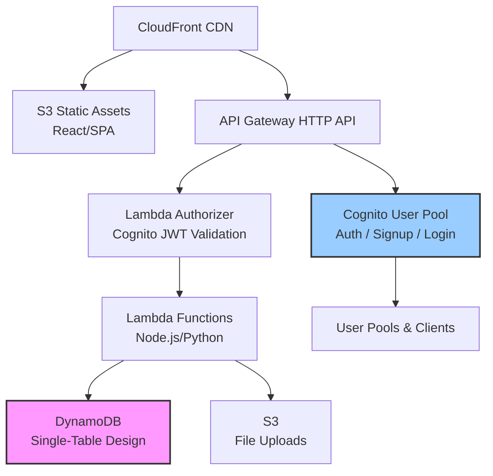

# Serverless Application — Full-Stack AWS Serverless



## Overview

A production-grade serverless application deployed on AWS using SAM (Serverless Application Model). The stack includes a single-page frontend hosted on S3 and served via CloudFront, an HTTP API Gateway backed by Lambda functions with a single-table DynamoDB design, and Cognito User Pools for authentication. The project follows infrastructure-as-code from day one, with a full CI/CD pipeline and environment-specific deployments.

## Tech Stack

| Layer | Technology |
|-------|-----------|
| Compute | AWS Lambda (Node.js 20 / Python 3.12) |
| API | API Gateway HTTP API |
| Database | DynamoDB (single-table design) |
| Auth | Cognito User Pool + Lambda authorizer |
| Storage | S3 + CloudFront CDN |
| IaC | AWS SAM + CloudFormation |
| CI/CD | GitHub Actions + SAM CLI |
| Monitoring | CloudWatch Logs + X-Ray |

## Implementation Steps

### 1. Project Initialization

```bash
# Install SAM CLI
sam --version

# Scaffold project
sam init --runtime nodejs20.x --name serverless-app --dependency-manager npm --app-template hello-world
cd serverless-app

# Structure
# .
# ├── template.yaml          # SAM template
# ├── src/
# │   ├── functions/         # Lambda handlers
# │   ├── auth/              # Lambda authorizer
# │   └── layers/            # Shared dependencies
# ├── frontend/              # React SPA
# └── samconfig.toml         # Deployment config
```

### 2. Single-Table DynamoDB Design

```yaml
# template.yaml — DynamoDB table
Globals:
  Function:
    Timeout: 10
    MemorySize: 256
    Tracing: Active

Resources:
  AppTable:
    Type: AWS::DynamoDB::Table
    Properties:
      TableName: !Sub ${AWS::StackName}-table
      BillingMode: PAY_PER_REQUEST
      AttributeDefinitions:
        - AttributeName: pk
          AttributeType: S
        - AttributeName: sk
          AttributeType: S
        - AttributeName: gsi1pk
          AttributeType: S
        - AttributeName: gsi1sk
          AttributeType: S
      KeySchema:
        - AttributeName: pk
          KeyType: HASH
        - AttributeName: sk
          KeyType: RANGE
      GlobalSecondaryIndexes:
        - IndexName: gsi1
          KeySchema:
            - AttributeName: gsi1pk
              KeyType: HASH
            - AttributeName: gsi1sk
              KeyType: RANGE
          Projection:
            ProjectionType: ALL
```

```javascript
// src/lib/db.js — Single-table access patterns
const { DynamoDBClient } = require('@aws-sdk/client-dynamodb');
const { DynamoDBDocumentClient, GetCommand, QueryCommand, PutCommand } = require('@aws-sdk/lib-dynamodb');

const client = new DynamoDBClient({});
const doc = DynamoDBDocumentClient.from(client);
const TABLE = process.env.TABLE_NAME;

// User entity: pk="USER#<id>", sk="PROFILE"
// Order entity: pk="USER#<id>", sk="ORDER#<orderId>"

async function getUserOrders(userId) {
  const cmd = new QueryCommand({
    TableName: TABLE,
    KeyConditionExpression: 'pk = :pk AND begins_with(sk, :prefix)',
    ExpressionAttributeValues: {
      ':pk': `USER#${userId}`,
      ':prefix': 'ORDER#',
    },
  });
  return (await doc.send(cmd)).Items;
}
```

### 3. Cognito User Pool & Lambda Authorizer

```yaml
# template.yaml — Cognito + Authorizer
  UserPool:
    Type: AWS::Cognito::UserPool
    Properties:
      UserPoolName: !Sub ${AWS::StackName}-users
      Policies:
        PasswordPolicy:
          MinimumLength: 8
          RequireUppercase: true
      AutoVerifiedAttributes:
        - email
      Schema:
        - Name: email
          Required: true
          Mutable: true

  UserPoolClient:
    Type: AWS::Cognito::UserPoolClient
    Properties:
      UserPoolId: !Ref UserPool
      GenerateSecret: false
      ExplicitAuthFlows:
        - ALLOW_USER_PASSWORD_AUTH
        - ALLOW_REFRESH_TOKEN_AUTH

  HttpApi:
    Type: AWS::ApiGatewayV2::Api
    Properties:
      ProtocolType: HTTP
      CorsConfiguration:
        AllowOrigins: ['*']
        AllowMethods: ['GET', 'POST', 'PUT', 'DELETE']
        AllowHeaders: ['Authorization', 'Content-Type']

  LambdaAuthorizer:
    Type: AWS::ApiGatewayV2::Authorizer
    Properties:
      ApiId: !Ref HttpApi
      AuthorizerType: JWT
      IdentitySource:
        - $request.header.Authorization
      JwtConfiguration:
        Audience:
          - !Ref UserPoolClient
        Issuer: !Sub https://cognito-idp.${AWS::Region}.amazonaws.com/${UserPool}
```

### 4. Lambda Function Handler

```javascript
// src/functions/createOrder/index.js
const { DynamoDBClient } = require('@aws-sdk/client-dynamodb');
const { DynamoDBDocumentClient, PutCommand } = require('@aws-sdk/lib-dynamodb');
const { v4: uuidv4 } = require('uuid');

const client = new DynamoDBClient({});
const doc = DynamoDBDocumentClient.from(client);
const TABLE = process.env.TABLE_NAME;

exports.handler = async (event) => {
  const userId = event.requestContext.authorizer.jwt.claims.sub;
  const body = JSON.parse(event.body);
  const orderId = uuidv4();

  const item = {
    pk: `USER#${userId}`,
    sk: `ORDER#${orderId}`,
    type: 'Order',
    orderId,
    amount: body.amount,
    status: 'CREATED',
    items: body.items,
    createdAt: new Date().toISOString(),
    gsi1pk: `STATUS#CREATED`,
    gsi1sk: `ORDER#${orderId}`,
  };

  await doc.send(new PutCommand({ TableName: TABLE, Item: item }));

  return {
    statusCode: 201,
    headers: { 'Content-Type': 'application/json' },
    body: JSON.stringify({ orderId, status: 'CREATED' }),
  };
};
```

### 5. Deploy with SAM

```bash
# Build and deploy
sam build
sam deploy --guided --capabilities CAPABILITY_IAM CAPABILITY_AUTO_EXPAND

# Deploy different environments
sam deploy --config-env staging
sam deploy --config-env prod

# Destroy
sam delete
```

### 6. CI/CD with GitHub Actions

```yaml
# .github/workflows/deploy.yml
name: Deploy
on:
  push:
    branches: [main]

jobs:
  deploy:
    runs-on: ubuntu-latest
    steps:
      - uses: actions/checkout@v4
      - uses: aws-actions/setup-sam@v2
      - uses: aws-actions/configure-aws-credentials@v4
        with:
          aws-access-key-id: ${{ secrets.AWS_ACCESS_KEY_ID }}
          aws-secret-access-key: ${{ secrets.AWS_SECRET_ACCESS_KEY }}
          aws-region: us-east-1
      - run: sam build
      - run: sam deploy --no-confirm-changeset --no-fail-on-empty-changeset
```

## Key Design Decisions

- **Single-table DynamoDB**: All entities live in one table. Access patterns drive the primary-key and GSI design, keeping query performance predictable at any scale.
- **JWT Lambda Authorizer vs. Cognito built-in**: The built-in JWT authorizer avoids cold-start auth latency and is simpler; a custom Lambda authorizer is only needed when you require custom claim validation or token enrichment.
- **Pay-per-request billing**: For unpredictable or spiky workloads, DynamoDB on-demand avoids provisioning headaches. Switch to provisioned capacity if traffic becomes steady-state.
- **S3 + CloudFront over EC2 for frontend**: Zero operational overhead, global edge caching, automatic HTTPS, and native integration with Origin Access Control (OAC) for security.

## Scalability Considerations

- Lambda concurrency limits: Set reserved concurrency per function to prevent one function from consuming the entire account burst quota. Use `ReservedConcurrentExecutions` in SAM.
- DynamoDB throttling: Implement exponential backoff with jitter in the SDK (default in AWS SDK v3). Use DynamoDB Accelerator (DAX) for read-heavy workloads.
- API Gateway throttling: Configure `ThrottlingBurstLimit` and `ThrottlingRateLimit` per route to protect downstream resources.
- CloudFront caching: Set appropriate TTLs (Cache-Control headers) and configure origin shield to reduce S3 origin load.
- X-Ray tracing: Enable active tracing on all Lambda functions for end-to-end observability of cold starts and downstream calls.

## References / Further Reading

- [AWS SAM Official Docs](https://docs.aws.amazon.com/serverless-application-model/latest/developerguide/what-is-sam.html)
- [Single-Table Design with DynamoDB (Alex DeBrie)](https://www.dynamodbguide.com/single-table-design/)
- [AWS Well-Architected Serverless Lens](https://docs.aws.amazon.com/wellarchitected/latest/serverless-applications-lens/welcome.html)
- [AWS Lambda Powertools for TypeScript](https://docs.powertools.aws.dev/lambda/typescript/latest/)
