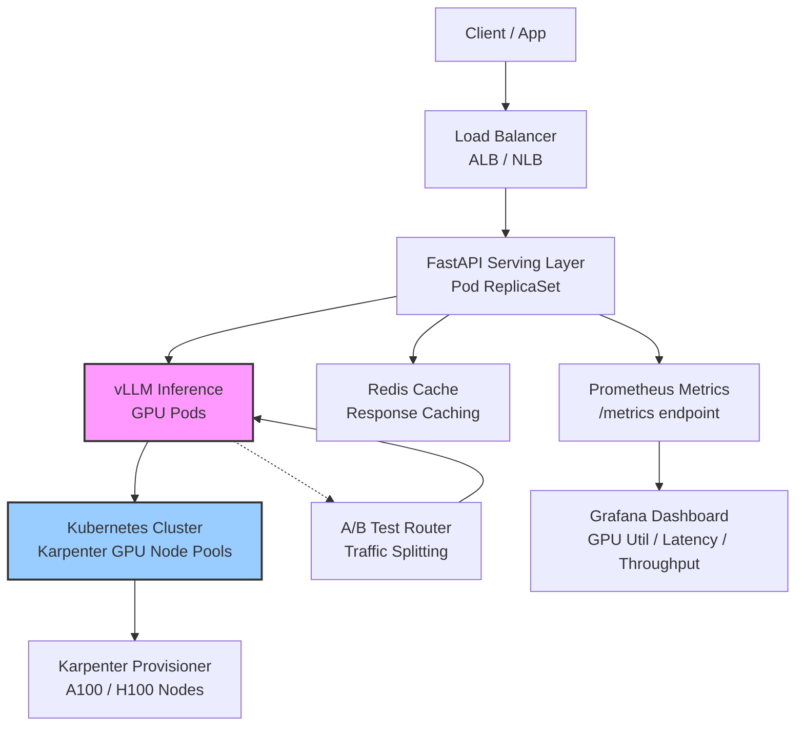

# ML Model Serving Platform



## Overview

A production ML model serving platform designed for large language model (LLM) inference at scale. The stack uses vLLM for high-throughput inference with PagedAttention, FastAPI for the HTTP serving layer, and a Kubernetes cluster with GPU node pools automatically provisioned by Karpenter. Horizontal Pod Autoscaling (HPA) drives scale based on GPU utilization metrics exposed by Prometheus. Redis provides response caching for repeated queries, while an A/B testing router enables traffic splitting between model versions.

## Tech Stack

| Layer | Technology |
|-------|-----------|
| Inference Engine | vLLM (PagedAttention, continuous batching) |
| Serving Layer | FastAPI + Uvicorn |
| Orchestration | Kubernetes (EKS / GKE) |
| GPU Autoscaling | Karpenter (node-level) + HPA (pod-level) |
| Metrics | Prometheus + GPU Metrics Exporter |
| Cache | Redis (response cache, LRU eviction) |
| A/B Testing | Envoy / Istio traffic splitting |
| Monitoring | Grafana dashboards |

## Implementation Steps

### 1. vLLM Inference Server

```python
# inference_server.py
from fastapi import FastAPI, Request
from pydantic import BaseModel
import time
from vllm import AsyncLLMEngine, SamplingParams
from vllm.engine.arg_utils import AsyncEngineArgs

app = FastAPI()

engine = AsyncLLMEngine.from_engine_args(
    AsyncEngineArgs(
        model="meta-llama/Llama-3.1-70B-Instruct",
        tensor_parallel_size=4,       # 4 GPUs
        gpu_memory_utilization=0.90,
        max_model_len=8192,
        enable_prefix_caching=True,
    )
)

class GenerateRequest(BaseModel):
    prompt: str
    max_tokens: int = 1024
    temperature: float = 0.7
    top_p: float = 0.9

@app.post("/v1/completions")
async def generate(req: GenerateRequest):
    sampling_params = SamplingParams(
        temperature=req.temperature,
        top_p=req.top_p,
        max_tokens=req.max_tokens,
    )
    request_id = f"req-{int(time.time_ns())}"
    results = await engine.add_request(request_id, req.prompt, sampling_params)
    return {"id": request_id, "choices": [{"text": r.text}]}
```

### 2. Docker Image & Kubernetes Deployment

```dockerfile
# Dockerfile
FROM nvidia/cuda:12.4.0-base-ubuntu22.04
RUN pip install vllm fastapi uvicorn prometheus-client
COPY inference_server.py /app/
WORKDIR /app
CMD ["uvicorn", "inference_server:app", "--host", "0.0.0.0", "--port", "8080"]
```

```yaml
# deployment.yaml
apiVersion: apps/v1
kind: Deployment
metadata:
  name: vllm-inference
spec:
  replicas: 2
  selector:
    matchLabels:
      app: vllm
  template:
    metadata:
      labels:
        app: vllm
    spec:
      containers:
      - name: vllm
        image: myrepo/vllm:latest
        ports:
        - containerPort: 8080
        resources:
          limits:
            nvidia.com/gpu: 4
            memory: "256Gi"
            cpu: "32"
        env:
        - name: HF_TOKEN
          valueFrom:
            secretKeyRef:
              name: hf-secret
              key: token
---
apiVersion: autoscaling/v2
kind: HorizontalPodAutoscaler
metadata:
  name: vllm-hpa
spec:
  scaleTargetRef:
    apiVersion: apps/v1
    kind: Deployment
    name: vllm-inference
  minReplicas: 1
  maxReplicas: 10
  metrics:
  - type: Pods
    pods:
      metric:
        name: gpu_utilization
      target:
        type: AverageValue
        averageValue: 70
```

### 3. Karpenter GPU Node Pool

```yaml
# karpenter-provisioner.yaml
apiVersion: karpenter.sh/v1beta1
kind: NodePool
metadata:
  name: gpu-default
spec:
  template:
    spec:
      requirements:
        - key: karpenter.k8s.aws/instance-family
          operator: In
          values: [p4d, p5, g5]
        - key: karpenter.k8s.aws/instance-size
          operator: In
          values: [24xlarge, 48xlarge]
        - key: kubernetes.io/arch
          operator: In
          values: [amd64]
        - key: karpenter.sh/capacity-type
          operator: In
          values: [on-demand]
      nodeClassRef:
        group: karpenter.k8s.aws
        kind: EC2NodeClass
        name: gpu-default
  limits:
    cpu: 1000
    memory: 8000Gi
  disruption:
    consolidationPolicy: WhenUnderutilized
    expireAfter: 720h
```

### 4. Redis Response Cache Layer

```python
# cache.py
import aioredis
from hashlib import sha256

redis = aioredis.from_url("redis://redis-service:6379", decode_responses=True)
CACHE_TTL = 3600  # 1 hour

def cache_key(prompt: str, max_tokens: int, temperature: float) -> str:
    raw = f"{prompt}:{max_tokens}:{temperature}"
    return sha256(raw.encode()).hexdigest()

async def get_cached(prompt: str, **params):
    key = cache_key(prompt, **params)
    if cached := await redis.get(key):
        return cached
    return None

async def set_cache(prompt: str, response: str, **params):
    key = cache_key(prompt, **params)
    await redis.setex(key, CACHE_TTL, response)
```

### 5. A/B Testing with Traffic Splitting

```yaml
# istio-virtualservice.yaml
apiVersion: networking.istio.io/v1beta1
kind: VirtualService
metadata:
  name: model-router
spec:
  hosts:
  - model.internal
  http:
  - match:
    - headers:
        x-model-version:
          exact: v2
    route:
    - destination:
        host: vllm-v2
        port:
          number: 8080
      weight: 100
  - route:
    - destination:
        host: vllm-v1
        port:
          number: 8080
      weight: 90
    - destination:
        host: vllm-v2
        port:
          number: 8080
      weight: 10
```

### 6. Prometheus & Grafana Integration

```yaml
# servicemonitor.yaml
apiVersion: monitoring.coreos.com/v1
kind: ServiceMonitor
metadata:
  name: vllm-monitor
spec:
  selector:
    matchLabels:
      app: vllm
  endpoints:
  - port: metrics
    interval: 15s
    relabelings:
    - sourceLabels: [__meta_kubernetes_pod_node_name]
      action: replace
      targetLabel: node
```

```python
# inference_server.py (add metrics)
from prometheus_client import Histogram, Counter, Gauge, start_http_server

REQUESTS = Counter('vllm_requests_total', 'Total requests', ['model'])
LATENCY = Histogram('vllm_request_duration_seconds', 'Request latency',
                     buckets=[0.1, 0.5, 1.0, 2.0, 5.0, 10.0, 30.0, 60.0])
GPU_UTIL = Gauge('gpu_utilization', 'Current GPU utilization', ['gpu_id'])
TOKENS_PER_SEC = Histogram('vllm_tokens_per_second', 'Generation throughput')
```

## Key Design Decisions

- **vLLM over TGI/Triton**: vLLM's PagedAttention eliminates memory fragmentation, enabling ~2x higher throughput than baseline Hugging Face TGI. Continuous batching maximizes GPU utilization under variable load.
- **Karpenter over Cluster Autoscaler**: Karpenter launches instances in seconds (vs minutes) and directly provisions the optimal GPU instance type based on pending pod resource requests, reducing cold-start latency during scale-up events.
- **Prefix caching**: Enabled in vLLM — when serving chat-based models, system prompts are cached across requests, cutting TTFT (time-to-first-token) by 50-80% for common prefixes.
- **Response caching with Redis**: Identical prompts (with same params) skip inference entirely. For chat apps with frequent repeated queries, this reduces GPU load by 30-60%.

## Scalability Considerations

- GPU utilization-based HPA: GPU metrics are more responsive than CPU/memory for ML workloads. When average GPU utilization exceeds 70%, the HPA spins up additional pods (and Karpenter provisions new GPU nodes).
- Tensor parallelism: For models >7B parameters, distribute across multiple GPUs using tensor parallelism. Each vLLM instance handles 4-8 GPUs; beyond that, shard across pods using pipeline parallelism.
- Request batching: vLLM automatically batches concurrent requests in a continuous batching loop. Tune `max_num_seqs` (default 256) — higher values improve throughput but increase latency.
- Connection pooling: FastAPI behind an ALB with keep-alive reduces connection overhead. Set uvicorn `--workers` to `$((NUM_GPUS * 2))` for best GPU utilization.
- Warm-up: Pre-load model weights into GPU memory on pod startup with a warm-up request to avoid cold-start inference latency spikes.

## References / Further Reading

- [vLLM Documentation](https://docs.vllm.ai/en/latest/)
- [Karpenter — GPU Provisioning](https://karpenter.sh/v1beta1/concepts/nodeclasses/)
- [FastAPI + Prometheus Integration](https://fastapi.tiangolo.com/how-to/deployment/#prometheus)
- [A/B Testing ML Models on Kubernetes](https://istio.io/latest/docs/tasks/traffic-management/request-routing/)
