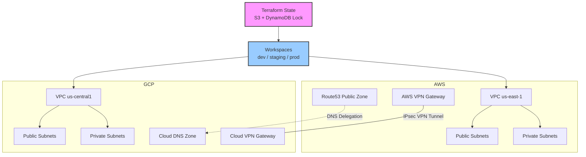

# Multi-Cloud Infrastructure with Terraform



## Overview

A multi-cloud infrastructure spanning AWS and GCP, managed entirely with Terraform. The project provisions VPCs with overlapping CIDR-aware peering via Cloud VPN tunnels, shared state locking with S3 and DynamoDB, environment segregation using Terraform workspaces, and cross-cloud DNS resolution between Route53 and Cloud DNS. The design enables workload portability, disaster recovery across clouds, and a single workflow for infrastructure changes.

## Tech Stack

| Layer | Technology |
|-------|-----------|
| IaC | Terraform (1.9+) |
| State | S3 (AWS) + DynamoDB (state locking) |
| Cloud Providers | AWS, GCP |
| Networking | AWS VPC, GCP VPC, Cloud VPN (IPsec) |
| DNS | Route53 (AWS), Cloud DNS (GCP) |
| Auth | AWS IAM, GCP Service Accounts |
| Workspaces | Terraform workspaces (dev, staging, prod) |

## Implementation Steps

### 1. Provider Configuration & Remote State

```hcl
# versions.tf
terraform {
  required_version = ">= 1.9"
  required_providers {
    aws = {
      source  = "hashicorp/aws"
      version = "~> 5.0"
    }
    google = {
      source  = "hashicorp/google"
      version = "~> 6.0"
    }
  }
  backend "s3" {
    bucket         = "my-multi-cloud-terraform-state"
    key            = "infra/terraform.tfstate"
    region         = "us-east-1"
    dynamodb_table = "terraform-state-lock"
    encrypt        = true
  }
}
```

```hcl
# providers.tf
provider "aws" {
  region = var.aws_region
  assume_role {
    role_arn = "arn:aws:iam::${var.aws_account_id}:role/TerraformRole"
  }
  default_tags {
    tags = {
      Environment = terraform.workspace
      ManagedBy   = "Terraform"
    }
  }
}

provider "google" {
  project = var.gcp_project_id
  region  = var.gcp_region
  impersonate_service_account {
    target_service_account = "terraform-sa@${var.gcp_project_id}.iam.gserviceaccount.com"
  }
}
```

### 2. VPC Setup (AWS Side)

```hcl
# modules/aws-vpc/main.tf
resource "aws_vpc" "main" {
  cidr_block           = var.cidr_block
  enable_dns_hostnames = true
  enable_dns_support   = true

  tags = { Name = "${terraform.workspace}-aws-vpc" }
}

resource "aws_subnet" "private" {
  count             = length(var.private_subnets)
  vpc_id            = aws_vpc.main.id
  cidr_block        = var.private_subnets[count.index]
  availability_zone = var.azs[count.index]

  tags = { Name = "${terraform.workspace}-private-${count.index}" }
}

resource "aws_vpn_gateway" "gw" {
  vpc_id = aws_vpc.main.id

  tags = { Name = "${terraform.workspace}-vpn-gw" }
}
```

```hcl
# modules/aws-vpc/outputs.tf
output "vpc_id"     { value = aws_vpc.main.id }
output "vpn_gw_id"  { value = aws_vpn_gateway.gw.id }
output "cidr_block" { value = aws_vpc.main.cidr_block }
```

### 3. VPC Setup (GCP Side) & Cloud VPN

```hcl
# modules/gcp-vpc/main.tf
resource "google_compute_network" "main" {
  name                    = "${terraform.workspace}-gcp-vpc"
  auto_create_subnetworks = false
}

resource "google_compute_subnetwork" "private" {
  name          = "${terraform.workspace}-gcp-private"
  network       = google_compute_network.main.id
  region        = var.gcp_region
  ip_cidr_range = var.cidr_block
  private_ip_google_access = true
}

resource "google_compute_vpn_gateway" "gw" {
  name    = "${terraform.workspace}-vpn-gw"
  network = google_compute_network.main.id
  region  = var.gcp_region
}

resource "google_compute_vpn_tunnel" "tunnel" {
  name               = "${terraform.workspace}-to-aws"
  peer_ip            = var.aws_vpn_gw_public_ip
  shared_secret      = var.vpn_shared_secret
  ike_version        = 2
  target_vpn_gateway = google_compute_vpn_gateway.gw.self_link
  local_traffic_selector  = [var.cidr_block]
  remote_traffic_selector = [var.aws_vpc_cidr]
}
```

### 4. Cross-Cloud DNS

```hcl
# dns.tf (AWS Route53 — public zone)
resource "aws_route53_zone" "public" {
  name = var.domain_name
}

resource "aws_route53_record" "gcp_ns" {
  zone_id = aws_route53_zone.public.zone_id
  name    = "gcp.${var.domain_name}"
  type    = "NS"
  ttl     = 300
  records = google_dns_managed_zone.public.name_servers
}
```

```hcl
# dns.tf (GCP Cloud DNS)
resource "google_dns_managed_zone" "public" {
  name        = "${terraform.workspace}-public-zone"
  dns_name    = "gcp.${var.domain_name}"
  description = "GCP managed DNS for multi-cloud"
}

resource "google_dns_record_set" "gcp_service_a" {
  name         = "api.${google_dns_managed_zone.public.dns_name}"
  type         = "A"
  ttl          = 60
  managed_zone = google_dns_managed_zone.public.name
  rrdatas      = [google_compute_subnetwork.private.gateway_address]
}
```

### 5. Workspace Configuration

```bash
# Create workspaces
terraform workspace new dev
terraform workspace new staging
terraform workspace new prod

# Workspace-specific variables
echo 'aws_region = "us-east-1"' > terraform.dev.tfvars
echo 'aws_region = "us-east-2"' > terraform.staging.tfvars
echo 'aws_region = "us-west-2"' > terraform.prod.tfvars
echo 'cidr_block = "10.0.0.0/16"' >> terraform.dev.tfvars

# Apply with workspace
terraform workspace select dev
terraform apply -var-file=terraform.dev.tfvars
```

```hcl
# variables.tf
variable "aws_region" {
  description = "AWS region per workspace"
  type        = string
}

variable "cidr_block" {
  description = "VPC CIDR per workspace (must not overlap)"
  type        = string

  validation {
    condition     = can(cidrnetmask(var.cidr_block))
    error_message = "CIDR block must be valid."
  }
}
```

### 6. State Locking (DynamoDB)

```hcl
# backend-setup/main.tf — run once to create state infrastructure
resource "aws_s3_bucket" "tfstate" {
  bucket = "my-multi-cloud-terraform-state"
  versioning {
    enabled = true
  }
  server_side_encryption_configuration {
    rule {
      apply_server_side_encryption_by_default {
        sse_algorithm = "AES256"
      }
    }
  }
}

resource "aws_dynamodb_table" "lock" {
  name         = "terraform-state-lock"
  billing_mode = "PAY_PER_REQUEST"
  hash_key     = "LockID"
  attribute {
    name = "LockID"
    type = "S"
  }
}
```

## Key Design Decisions

- **S3 backend + DynamoDB locking**: Essential for team collaboration. Without locking, concurrent `terraform apply` runs can corrupt state. DynamoDB provides strong consistency and automatic TTL-based lock expiry.
- **Workspaces vs. directory per env**: Workspaces avoid duplication of backend configuration and provider setup. For large teams, a directory-per-environment structure with separate backends may be preferred for stronger isolation.
- **IPsec VPN over Private Service Connect / Transit Gateway**: Cloud VPN with IPsec is provider-agnostic and avoids vendor lock-in. For higher throughput (>10 Gbps), consider dedicated interconnect (GCP) or Direct Connect (AWS).
- **DNS delegation between Route53 and Cloud DNS**: Each cloud owns its subdomain. GCP zones are authoritative for `gcp.example.com`, AWS for the apex `example.com`. This avoids split-brain DNS and simplifies failover.

## Scalability Considerations

- CIDR planning: Allocate non-overlapping CIDRs per workspace and cloud (e.g., dev=10.0.0.0/16, staging=10.1.0.0/16, prod=10.2.0.0/16). Use `cidrsubnet()` to generate subnets dynamically from a single base CIDR.
- VPN throughput: A single Cloud VPN tunnel supports up to 3 Gbps. For higher throughput, use multiple tunnels with equal-cost multipath (ECMP) routing or switch to Dedicated Interconnect.
- Terraform state size: As infrastructure grows, split state into multiple workspaces or use `terraform_remote_state` data sources to reference shared outputs (e.g., network, IAM) without importing.
- Module composition: Package reusable components (vpc, dns, iam, k8s) into a `modules/` directory. Publish shared modules to a private registry for cross-team use.

## References / Further Reading

- [Terraform AWS Provider Docs](https://registry.terraform.io/providers/hashicorp/aws/latest/docs)
- [Terraform GCP Provider Docs](https://registry.terraform.io/providers/hashicorp/google/latest/docs)
- [Multi-Cloud VPN with HA (Google Cloud)](https://cloud.google.com/network-connectivity/docs/vpn/concepts/overview)
- [Terraform Workspaces](https://developer.hashicorp.com/terraform/language/state/workspaces)
- [Terraform Best Practices (Gruntwork)](https://docs.gruntwork.io/guides/)
