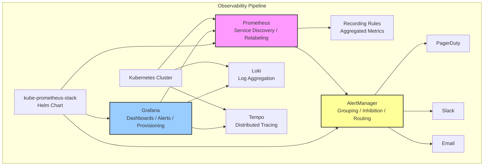

# Comprehensive Monitoring Stack (Prometheus + Grafana + Loki + Tempo + AlertManager)



## Overview

A full-stack monitoring platform deployed via the kube-prometheus-stack Helm chart on Kubernetes. Prometheus handles metric collection with Kubernetes service discovery and custom relabeling rules. Grafana provides dashboards and alerting with provisioning-as-code. Loki aggregates and queries logs using LogQL with structured metadata extraction. Tempo ingests distributed traces and correlates them with logs and metrics. AlertManager handles grouping, inhibition, and multi-channel routing (PagerDuty, Slack, email).

## Tech Stack

| Layer | Technology |
|-------|-----------|
| Metrics | Prometheus (v2.53+) |
| Dashboards | Grafana (v11+) |
| Logs | Loki (v3.x) + Promtail / Alloy |
| Tracing | Tempo (v2.x) |
| Alerting | AlertManager |
| Deployment | kube-prometheus-stack (Helm) |
| Storage | PersistentVolume (Metrics) + S3/GCS (Loki/Tempo) |

## Implementation Steps

### 1. Deploy kube-prometheus-stack

```bash
# Add helm repo
helm repo add prometheus-community https://prometheus-community.github.io/helm-charts
helm repo update

# Install the stack
helm upgrade --install monitoring prometheus-community/kube-prometheus-stack \
  --namespace monitoring --create-namespace \
  -f values.yaml \
  --version 62.0.0
```

```yaml
# values.yaml — custom configuration
prometheus:
  prometheusSpec:
    retention: 30d
    retentionSize: 50GB
    scrapeInterval: 15s
    evaluationInterval: 30s
    serviceMonitorSelectorNilUsesHelmValues: false
    serviceMonitorSelector: {}
    additionalScrapeConfigs:
      - job_name: 'custom-app'
        kubernetes_sd_configs:
          - role: pod
        relabel_configs:
          - source_labels: [__meta_kubernetes_pod_label_app]
            regex: my-app
            action: keep
          - source_labels: [__meta_kubernetes_pod_container_port_number]
            regex: "8080"
            action: keep

alertmanager:
  enabled: true
  config:
    global:
      resolve_timeout: 5m
      pagerduty_url: https://events.pagerduty.com/v2/enqueue
    route:
      group_by: ['alertname', 'cluster']
      group_wait: 30s
      group_interval: 5m
      repeat_interval: 4h
      receiver: 'pagerduty'
      routes:
        - match:
            severity: warning
          receiver: 'slack-warning'
        - match:
            severity: critical
          receiver: 'pagerduty-critical'
    receivers:
      - name: 'pagerduty-critical'
        pagerduty_configs:
          - routing_key: 'PAGERDUTY_KEY'
            severity: critical
      - name: 'slack-warning'
        slack_configs:
          - api_url: 'SLACK_WEBHOOK_URL'
            channel: '#alerts'
            title: '{{ .GroupLabels.alertname }}'
```

### 2. Prometheus Recording Rules

```yaml
# recording-rules.yaml
groups:
  - name: kubernetes_resources
    interval: 30s
    rules:
      - record: namespace:pod_cpu_usage:avg_5m
        expr: |
          avg by (namespace) (
            rate(container_cpu_usage_seconds_total{container!=""}[5m])
          )
      - record: namespace:pod_memory_usage:avg_5m
        expr: |
          avg by (namespace) (
            container_memory_working_set_bytes{container!=""}
          )

  - name: http_slo
    interval: 60s
    rules:
      - record: service:http_request_duration_seconds:p99_5m
        expr: |
          histogram_quantile(0.99,
            sum(rate(http_request_duration_seconds_bucket[5m])) by (le, service)
          )
      - record: service:error_budget_remaining_30d
        expr: |
          1 - (
            sum(rate(http_requests_total{status=~"5.."}[30d]))
            / sum(rate(http_requests_total[30d]))
          )
```

### 3. Grafana Provisioning (Dashboards & Datasources)

```yaml
# grafana-dashboards.yaml — datasource provisioning
apiVersion: 1

datasources:
  - name: Prometheus
    type: prometheus
    url: http://prometheus-operated.monitoring:9090
    access: proxy
    isDefault: true
    jsonData:
      timeInterval: 15s
      prometheusType: Prometheus

  - name: Loki
    type: loki
    url: http://loki-gateway.monitoring:80
    access: proxy
    jsonData:
      derivedFields:
        - datasourceName: Tempo
          matcherRegex: trace_id=(\w+)
          name: traceID
          url: $${__value.raw}
          datasourceUid: tempo

  - name: Tempo
    type: tempo
    url: http://tempo-query-frontend.monitoring:3100
    access: proxy
    jsonData:
      nodeGraph:
        enabled: true
      tracesToLogsV2:
        datasourceUid: loki
        tags:
          - key: service.name
            value: service
```

```json
// dashboard-panels.json — example panel in kubernetes/views format
{
  "title": "Node CPU Utilisation",
  "type": "timeseries",
  "targets": [{
    "expr": "100 - (avg by (instance) (rate(node_cpu_seconds_total{mode=\"idle\"}[5m])) * 100)",
    "legendFormat": "{{ instance }}"
  }],
  "gridPos": { "h": 8, "w": 12, "x": 0, "y": 0 }
}
```

### 4. Loki Log Aggregation (LogQL)

```yaml
# loki-values.yaml
loki:
  auth_enabled: false
  commonConfig:
    replication_factor: 1
  storage:
    type: s3
    s3:
      endpoint: s3.amazonaws.com
      region: us-east-1
      bucketnames: my-logs-bucket
      access_key_id: ${AWS_ACCESS_KEY_ID}
      secret_access_key: ${AWS_SECRET_ACCESS_KEY}
  schemaConfig:
    configs:
      - from: "2024-01-01"
        store: tsdb
        object_store: s3
        schema: v13
        index:
          prefix: index_
          period: 24h
  ingester:
    chunk_encoding: snappy
    chunk_idle_period: 30m
    chunk_retain_period: 1m
```

```logql
# LogQL examples

# Error rate by service (last 1h)
sum by (service) (
  count_over_time({job="my-app"} |= "ERROR" [1h])
) / sum by (service) (
  count_over_time({job="my-app"} [1h])
) > 0.01

# Extract status code from JSON log
sum by (status_code) (
  rate({job="api-gateway"} | json | status_code=~"5[0-9][0-9]" [5m])
)

# Correlate with traces
{job="payment-service"} |= "trace_id=abc123"
```

### 5. Tempo Distributed Tracing

```yaml
# tempo-values.yaml
tempo:
  structure:
    backend: s3
    s3:
      bucket: tempo-traces-bucket
      endpoint: s3.amazonaws.com
      region: us-east-1
  metricsGenerator:
    enabled: true
    processors:
      - service-graphs
      - span-metrics
  querier:
    max_concurrent_queries: 10
  ingester:
    trace_idle_period: 10s
    max_block_duration: 30m
```

```python
# instrument.py — OpenTelemetry auto-instrumentation
from opentelemetry import trace
from opentelemetry.exporter.otlp.proto.grpc.trace_exporter import OTLPSpanExporter
from opentelemetry.instrumentation.flask import FlaskInstrumentor
from opentelemetry.sdk.trace import TracerProvider
from opentelemetry.sdk.trace.export import BatchSpanProcessor

provider = TracerProvider()
provider.add_span_processor(
    BatchSpanProcessor(OTLPSpanExporter(endpoint="tempo-distributor.monitoring:4317"))
)
trace.set_tracer_provider(provider)

FlaskInstrumentor().instrument_app(app)
```

### 6. AlertManager Routing & Inhibition

```yaml
# alertmanager-config.yaml — inhibition rules
inhibit_rules:
  - source_match:
      severity: critical
    target_match:
      severity: warning
    equal: ['alertname', 'cluster', 'service']

  - source_match:
      alertname: 'KubeNodeUnreachable'
    target_match:
      severity: warning
    equal: ['node']

route:
  group_by: ['alertname', 'cluster', 'service']
  group_wait: 30s
  group_interval: 5m
  repeat_interval: 4h
  receiver: 'default'
  routes:
    - match:
        alertname: 'KubeJobFailed|KubePodCrashLooping'
      receiver: 'slack-dev'
      continue: true
    - match_re:
        severity: critical
      receiver: 'pagerduty'
    - match:
        alertname: 'Watchdog'
      receiver: 'null'
```

## Key Design Decisions

- **kube-prometheus-stack over manual components**: Single Helm chart deploys Prometheus, AlertManager, Grafana, node-exporter, kube-state-metrics, and prometheus-operator with sane defaults. Reduces integration effort by 80%.
- **Loki over Elasticsearch**: Loki is cheaper (log content is not indexed, only metadata labels) and natively integrates with Prometheus service discovery. LogQL is designed for the Prometheus ecosystem (same syntax philosophy).
- **Tempo + OTLP over Jaeger**: Tempo supports OpenTelemetry natively (no sidecar needed), integrates with Grafana Explore, and stores traces in object storage (S3/GCS) without a custom index, making it more cost-effective at scale.
- **Recording rules for SLOs**: Pre-compute expensive histogram quantiles and error budgets every 30-60s. Dashboards query recording rules instead of raw metrics, reducing Prometheus CPU usage during dashboard rendering.

## Scalability Considerations

- Prometheus: Use `--shard` with `thanos sidecar` for multi-tenant or cross-cluster setups. For retention beyond 30 days, Thanos Receive with object storage is preferred.
- Loki: Use `schema: v13` with TSDB index for better write throughput. For very high cardinality labels, increase ingester replication factor and use `legacy_read` config.
- Tempo: Set `max_bytes_per_trace` (default 5MB) to prevent single large traces from consuming all ingester memory. Use `SPAN_METRICS` to derive RED metrics from traces without full storage.
- Grafana: Use caching (Redis or memcached) for dashboard queries against large Loki/Tempo datasources. Set `query_timeout` to avoid long-running queries blocking the Grafana API.

## References / Further Reading

- [kube-prometheus-stack Helm Chart](https://github.com/prometheus-community/helm-charts/tree/main/charts/kube-prometheus-stack)
- [Loki LogQL Documentation](https://grafana.com/docs/loki/latest/logql/)
- [Tempo — OpenTelemetry Setup](https://grafana.com/docs/tempo/latest/setup/linux/)
- [Prometheus Recording Rules Best Practices](https://prometheus.io/docs/practices/rules/)
- [AlertManager Inhibition](https://prometheus.io/docs/alerting/latest/inhibition/)
