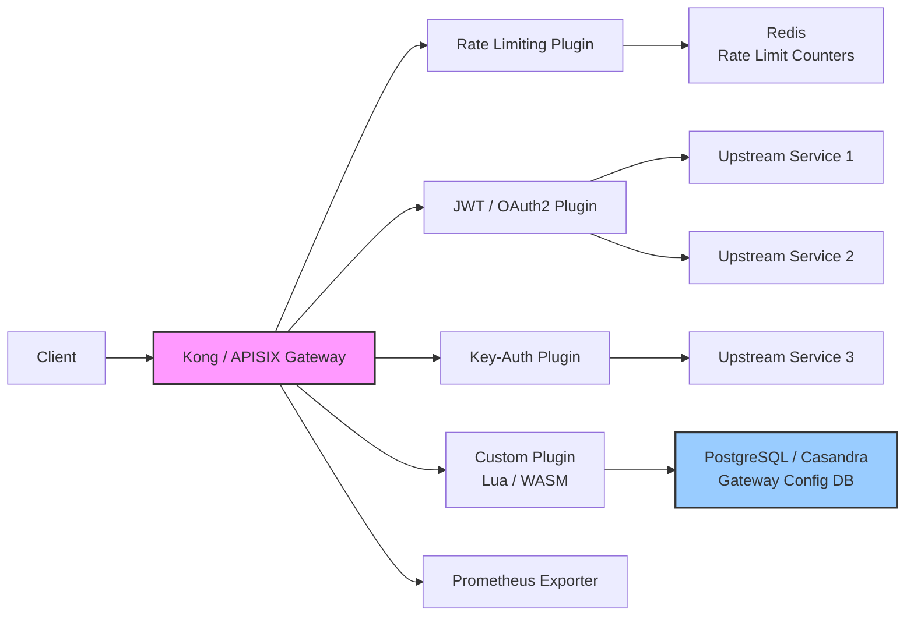

# API Gateway with Kong/APISIX



## Overview

A production API Gateway setup using Kong (or Apache APISIX) sitting in front of multiple upstream microservices. The gateway handles authentication via JWT, OAuth2, and key-auth plugins, enforces rate limiting backed by Redis, exposes Prometheus metrics for observability, and supports custom plugin development (Lua for Kong, WASM for APISIX). Configuration is stored in PostgreSQL (Kong) or etcd (APISIX). Plugin chaining demonstrates how multiple plugins compose a request pipeline.

## Tech Stack

| Layer | Technology |
|-------|-----------|
| Gateway | Kong (3.8+) or Apache APISIX (3.9+) |
| Database | PostgreSQL 16 (Kong) / etcd (APISIX) |
| Cache | Redis 7 (rate limiting, session) |
| Auth | OAuth2, JWT, key-auth |
| Metrics | Prometheus plugin + Grafana |
| Plugins | Lua (Kong), WASM (APISIX) |
| Deployment | Docker Compose / Kubernetes |

## Implementation Steps

### 1. Gateway Setup (API Gateway with Kong)

```yaml
# docker-compose.yml — Kong with PostgreSQL
version: '3.9'
services:
  kong-database:
    image: postgres:16-alpine
    environment:
      POSTGRES_DB: kong
      POSTGRES_USER: kong
      POSTGRES_PASSWORD: kongpass
    healthcheck:
      test: ["CMD-SHELL", "pg_isready -U kong"]
      interval: 5s
      timeout: 5s
      retries: 5

  kong-migration:
    image: kong:3.8
    depends_on:
      kong-database:
        condition: service_healthy
    environment:
      KONG_DATABASE: postgres
      KONG_PG_HOST: kong-database
      KONG_PG_PASSWORD: kongpass
    command: "kong migrations bootstrap"
    restart: on-failure

  kong:
    image: kong:3.8
    depends_on:
      kong-migration:
        condition: service_completed_successfully
    ports:
      - "8000:8000"   # Proxy
      - "8001:8001"   # Admin API
      - "8443:8443"   # Proxy SSL
      - "8444:8444"   # Admin SSL
    environment:
      KONG_DATABASE: postgres
      KONG_PG_HOST: kong-database
      KONG_PG_PASSWORD: kongpass
      KONG_PROXY_ACCESS_LOG: /dev/stdout
      KONG_ADMIN_ACCESS_LOG: /dev/stdout
      KONG_PROXY_ERROR_LOG: /dev/stderr
      KONG_ADMIN_ERROR_LOG: /dev/stderr
      KONG_PLUGINS: bundled,jwt,oauth2,key-auth,rate-limiting,prometheus

  redis:
    image: redis:7-alpine
    ports:
      - "6379:6379"
```

### 2. Service, Route & Upstream Configuration

```bash
# Admin API — create upstream service
curl -s -X POST http://localhost:8001/services \
  --data "name=order-service" \
  --data "url=http://order-api:8080"

# Add health check to upstream
curl -s -X PATCH http://localhost:8001/services/order-service \
  --data "healthcheck.active.type=http" \
  --data "healthcheck.active.http_path=/health" \
  --data "healthcheck.active.healthy.interval=5" \
  --data "healthcheck.active.unhealthy.interval=5"

# Create route
curl -s -X POST http://localhost:8001/services/order-service/routes \
  --data "paths[]=/api/v1/orders" \
  --data "methods[]=GET" \
  --data "methods[]=POST" \
  --data "protocols[]=http" \
  --data "strip_path=false"

# Declarative config (kong.yml)
# format: declarative
services:
  - name: order-service
    url: http://order-api:8080
    routes:
      - name: orders-route
        paths:
          - /api/v1/orders
        methods:
          - GET
          - POST
        strip_path: false
    plugins:
      - name: jwt
      - name: rate-limiting
        config:
          minute: 60
          policy: redis
          redis_host: redis
```

### 3. Authentication Plugins

```bash
# JWT — create consumer and issue JWT credentials
curl -s -X POST http://localhost:8001/consumers \
  --data "username=myapp"

curl -s -X POST http://localhost:8001/consumers/myapp/jwt \
  --data "algorithm=RS256" \
  --data "rsa_public_key=-----BEGIN PUBLIC KEY-----..."

# Configure JWT plugin on the route
curl -s -X POST http://localhost:8001/routes/orders-route/plugins \
  --data "name=jwt" \
  --data "config.claims_to_verify[]=exp" \
  --data "config.secret_is_base64=false"
```

```bash
# OAuth2 — create OAuth2 application
curl -s -X POST http://localhost:8001/consumers/myapp/oauth2 \
  --data "name=MyApp" \
  --data "client_id=client123" \
  --data "client_secret=secret456" \
  --data "redirect_uris[]=https://myapp.com/callback" \
  --data "grant_types[]=authorization_code" \
  --data "grant_types[]=refresh_token"
```

```bash
# Key-Auth — simple API key authentication
curl -s -X POST http://localhost:8001/consumers/thirdparty/key-auth \
  --data "key=tp_key_abc123"

curl -s -X POST http://localhost:8001/routes/orders-route/plugins \
  --data "name=key-auth" \
  --data "config.key_in_header=true" \
  --data "config.hide_credentials=true"
```

### 4. Rate Limiting Plugin with Redis

```bash
# Configure rate limiting on a service
curl -s -X POST http://localhost:8001/services/order-service/plugins \
  --data "name=rate-limiting" \
  --data "config.second=10" \
  --data "config.minute=100" \
  --data "config.hour=1000" \
  --data "config.policy=redis" \
  --data "config.redis_host=redis" \
  --data "config.redis_port=6379" \
  --data "config.redis_database=0" \
  --data "config.fault_tolerant=true" \
  --data "config.hide_client_headers=false"
```

### 5. Custom Plugin Development

```lua
-- kong/plugins/my-header-rewrite/handler.lua — Kong Lua plugin
local BasePlugin = require "kong.plugins.base_plugin"
local MyHeaderRewrite = BasePlugin:extend()

MyHeaderRewrite.PRIORITY = 1000
MyHeaderRewrite.VERSION = "1.0.0"

function MyHeaderRewrite:new()
  MyHeaderRewrite.super.new(self, "my-header-rewrite")
end

function MyHeaderRewrite:access(conf)
  MyHeaderRewrite.super.access(self)
  ngx.req.set_header("X-Custom-Header", conf.header_value)
  ngx.req.set_header("X-Request-ID", ngx.var.request_id)
end

function MyHeaderRewrite:header_filter(conf)
  ngx.header["X-Processed-By"] = "Kong-Custom-Plugin"
end

return MyHeaderRewrite
```

```lua
-- kong/plugins/my-header-rewrite/schema.lua
local typedefs = require "kong.db.schema.typedefs"
return {
  name = "my-header-rewrite",
  fields = {
    { protocols = typedefs.protocols({ default = { "http", "https" } }) },
    { config = {
        type = "record",
        fields = {
          { header_value = { type = "string", required = true, default = "custom" } },
        },
      },
    },
  },
}
```

```bash
# Load custom plugin
# 1. Copy plugin to kong/plugins/ directory
# 2. Update KONG_PLUGINS: bundled,my-header-rewrite
# 3. Restart Kong
curl -s -X POST http://localhost:8001/plugins \
  --data "name=my-header-rewrite" \
  --data "config.header_value=production"
```

### 6. Plugin Chaining & Observability

```yaml
# Plugin execution order (Kong):
# 1. rate-limiting (top-priority — limit before auth)
# 2. key-auth / jwt / oauth2
# 3. custom plugins (my-header-rewrite)
# 4. prometheus (last — record metrics after all transforms)

services:
  - name: payment-service
    url: http://payment-api:8081
    routes:
      - name: payments-route
        paths:
          - /api/v1/payments
    plugins:
      - name: rate-limiting          # 1st
        config: { minute: 30, policy: redis, redis_host: redis }
      - name: jwt                     # 2nd
        config: { claims_to_verify: ["exp"] }
      - name: my-header-rewrite       # 3rd
        config: { header_value: "payments" }
      - name: prometheus              # 4th
        config: { status_code_metrics: true, latency_metrics: true, bandwidth_metrics: true }
```

```bash
# Prometheus metrics endpoint
curl http://localhost:8001/metrics
# HELP kong_http_requests_total Total HTTP requests
# TYPE kong_http_requests_total counter
# kong_http_requests_total{service="order-service",route="orders-route",code="200"} 1523
```

### 7. APISIX Equivalent (WASM Plugin)

```yaml
# apisix/config.yaml
apisix:
  node_listen: 9080
  enable_admin: true

deployment:
  role: traditional
  role_traditional:
    config_provider: etcd

plugin_attr:
  prometheus:
    export_uri: /apisix/prometheus/metrics
    metrics:
      - http_status
      - http_latency
      - bandwidth

plugins:
  - jwt-auth
  - key-auth
  - limit-count
  - prometheus
  - wasm
```

```bash
# APISIX — configure route with plugin chain
curl -s http://127.0.0.1:9180/apisix/admin/routes/1 \
  -H "X-API-KEY: admin-key" -X PUT -d '{
    "uri": "/api/v1/orders/*",
    "upstream": {
      "type": "roundrobin",
      "nodes": {
        "order-api:8080": 1
      }
    },
    "plugins": {
      "limit-count": {
        "count": 100,
        "time_window": 60,
        "key": "remote_addr",
        "redis_host": "redis"
      },
      "jwt-auth": {},
      "wasm": {
        "func": "rewrite_headers",
        "wasm_file": "/opt/apisix/wasm/header_rewrite.wasm"
      },
      "prometheus": {}
    }
  }'
```

## Key Design Decisions

- **PostgreSQL over Cassandra (Kong DB)**: For most deployments, a single PostgreSQL instance with replicas is simpler and sufficient. Cassandra is only needed when global multi-datacenter replication is required with no single point of failure.
- **Plugin chaining order**: Rate limiting runs before authentication to abort abusive clients early without spending CPU on JWT verification. Observability plugins run last to capture the final request state after all transforms.
- **Lua vs. WASM for custom plugins**: Kong's Lua plugin model is mature and simple for header manipulation, logging, and request transformation. APISIX's WASM support enables plugins written in Rust/Go/C++, which are sandboxed and safer for multi-tenant environments.
- **Redis-backed rate limiting**: Local (memory) rate limiting is fast but resets on gateway restart. Redis provides distributed counters across gateway nodes and survives restarts.

## Scalability Considerations

- Gateway clustering: Scale Kong horizontally behind an ALB/NLB. All nodes share the same database. Use `KONG_CLUSTER_*` settings for broadcast events (cache invalidation, plugin changes).
- Database connection pooling: Kong's `pg_pool_size` (default 10) should be tuned per node. With 5 Kong nodes, ensure PostgreSQL max_connections >= `nodes × pool_size`.
- Rate limiting with Redis: Use a Redis Cluster or Redis Sentinel for HA. The `limit-count` plugin is the most I/O-intensive plugin under high traffic — monitor Redis connection saturation.
- Admin API security: Bind Admin API to localhost/private subnet only. Use RBAC (`KONG_ADMIN_GUI_AUTH`) and network policies to restrict access. In production, never expose Admin API port 8001 publicly.

## References / Further Reading

- [Kong Gateway Documentation](https://docs.konghq.com/gateway/latest/)
- [Apache APISIX Documentation](https://apisix.apache.org/docs/apisix/getting-started/)
- [Kong Custom Plugin Development (Lua)](https://docs.konghq.com/gateway/latest/plugin-development/)
- [APISIX WASM Plugin Guide](https://apisix.apache.org/docs/apisix/wasm/)
- [Kong Rate Limiting Best Practices](https://docs.konghq.com/hub/kong-inc/rate-limiting/)
