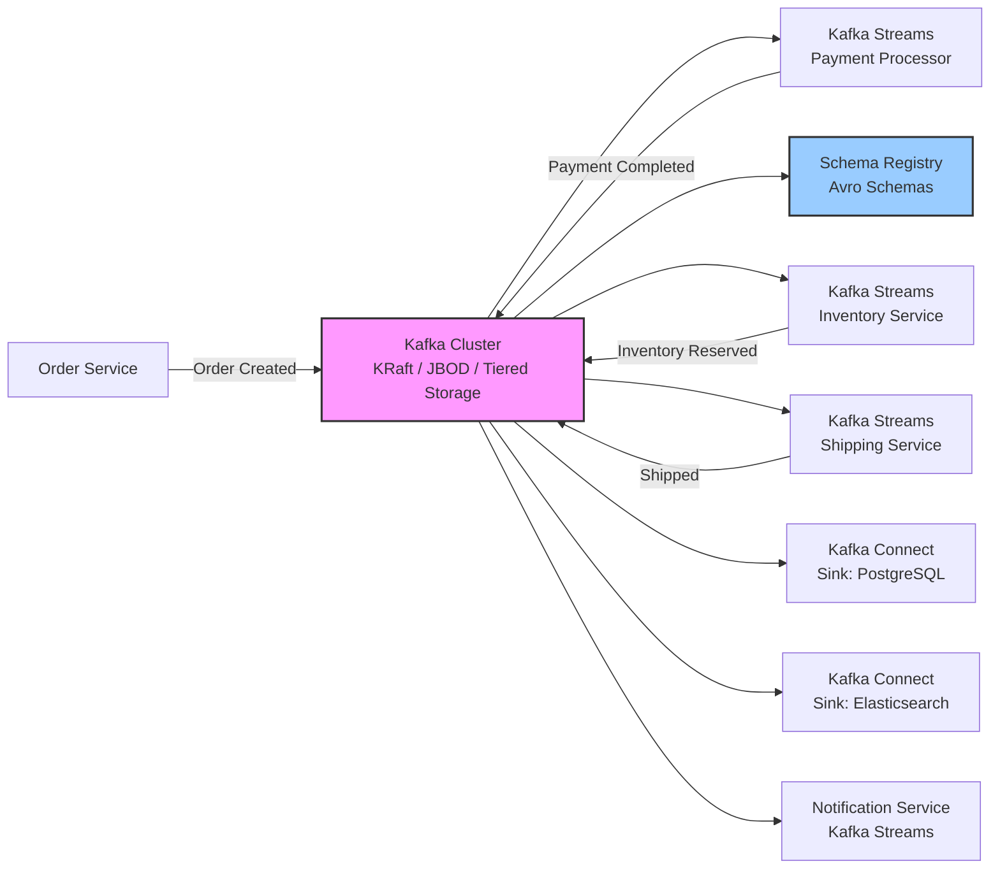

# Event-Driven Microservices with Kafka



## Overview

An event-driven order processing pipeline built on Apache Kafka with KRaft (no ZooKeeper), JBOD storage, and tiered storage for cost-efficient data retention. Kafka Streams handles the processing logic for payment, inventory, shipping, and notification services. Avro schemas with Schema Registry enforce data contract compatibility. Kafka Connect sources and sinks integrate with external systems (PostgreSQL, Elasticsearch). The pipeline provides exactly-once semantics from order creation through final notification.

## Tech Stack

| Layer | Technology |
|-------|-----------|
| Event Broker | Apache Kafka (3.7+, KRaft mode) |
| Stream Processing | Kafka Streams DSL |
| Schema | Apache Avro + Schema Registry |
| Connectors | Kafka Connect (Debezium, JDBC Sink, Elasticsearch Sink) |
| Storage | JBOD + Tiered Storage (S3/GCS) |
| Semantics | Exactly-once (EOS) + idempotent producers |
| Deployment | Kubernetes (Strimzi Operator) / Docker Compose |

## Implementation Steps

### 1. Kafka Cluster (KRaft Mode)

```yaml
# docker-compose.yml — KRaft cluster (no ZooKeeper)
version: '3.9'
services:
  kafka-1:
    image: confluentinc/cp-kafka:7.7.0
    hostname: kafka-1
    container_name: kafka-1
    ports:
      - "9092:9092"
      - "9101:9101"
    environment:
      KAFKA_NODE_ID: 1
      KAFKA_PROCESS_ROLES: broker,controller
      KAFKA_CONTROLLER_QUORUM_VOTERS: 1@kafka-1:9093,2@kafka-2:9093,3@kafka-3:9093
      KAFKA_LISTENERS: PLAINTEXT://0.0.0.0:9092,CONTROLLER://0.0.0.0:9093
      KAFKA_ADVERTISED_LISTENERS: PLAINTEXT://localhost:9092
      KAFKA_LISTENER_SECURITY_PROTOCOL_MAP: PLAINTEXT:PLAINTEXT,CONTROLLER:PLAINTEXT
      KAFKA_CONTROLLER_LISTENER_NAMES: CONTROLLER
      KAFKA_LOG_DIRS: /var/lib/kafka/data-1/data,/var/lib/kafka/data-2/data
      KAFKA_LOG_SEGMENT_BYTES: 1073741824
      KAFKA_LOG_RETENTION_HOURS: 168
      KAFKA_CONFLUENT_TIERED_STORAGE_ENABLE: "true"
      KAFKA_CONFLUENT_TIERED_STORAGE_S3_BUCKET: my-kafka-tiered-storage

  schema-registry:
    image: confluentinc/cp-schema-registry:7.7.0
    depends_on:
      - kafka-1
    ports:
      - "8081:8081"
    environment:
      SCHEMA_REGISTRY_HOST_NAME: schema-registry
      SCHEMA_REGISTRY_KAFKASTORE_BOOTSTRAP_SERVERS: PLAINTEXT://kafka-1:9092
      SCHEMA_REGISTRY_COMPATIBILITY_LEVEL: BACKWARD

  kafka-connect:
    image: confluentinc/cp-kafka-connect:7.7.0
    depends_on:
      - kafka-1
      - schema-registry
    ports:
      - "8083:8083"
    environment:
      CONNECT_BOOTSTRAP_SERVERS: kafka-1:9092
      CONNECT_REST_PORT: 8083
      CONNECT_GROUP_ID: connect-cluster
      CONNECT_CONFIG_STORAGE_TOPIC: connect-configs
      CONNECT_OFFSET_STORAGE_TOPIC: connect-offsets
      CONNECT_STATUS_STORAGE_TOPIC: connect-status
      CONNECT_KEY_CONVERTER: io.confluent.connect.avro.AvroConverter
      CONNECT_VALUE_CONVERTER: io.confluent.connect.avro.AvroConverter
      CONNECT_KEY_CONVERTER_SCHEMA_REGISTRY_URL: http://schema-registry:8081
      CONNECT_VALUE_CONVERTER_SCHEMA_REGISTRY_URL: http://schema-registry:8081
      CONNECT_PLUGIN_PATH: /usr/share/java,/usr/share/confluent-hub-components
```

### 2. Avro Schema & Schema Registry

```avro
{
  "namespace": "com.example.orders",
  "type": "record",
  "name": "OrderCreated",
  "fields": [
    { "name": "orderId",    "type": "string" },
    { "name": "customerId", "type": "string" },
    { "name": "items",      "type": { "type": "array", "items": {
      "type": "record",
      "name": "OrderItem",
      "fields": [
        { "name": "productId", "type": "string" },
        { "name": "quantity",  "type": "int" },
        { "name": "price",     "type": "double" }
      ]
    }}},
    { "name": "totalAmount", "type": "double" },
    { "name": "timestamp",   "type": "long", "logicalType": "timestamp-millis" }
  ]
}
```

```bash
# Register schema
curl -X POST http://localhost:8081/subjects/orders-order-created-value/versions \
  -H "Content-Type: application/vnd.schemaregistry.v1+json" \
  -d '{
    "schemaType": "AVRO",
    "schema": "{\"namespace\":\"com.example.orders\",\"type\":\"record\",\"name\":\"OrderCreated\",...}"
  }'

# Verify compatibility
curl -X POST http://localhost:8081/compatibility/subjects/orders-order-created-value/versions/latest \
  -H "Content-Type: application/vnd.schemaregistry.v1+json" \
  -d '{"schema": "..."}'
```

### 3. Order Service — Produce Event

```kotlin
// OrderService.kt — Spring Boot producer
@Service
class OrderService(
    private val kafkaTemplate: KafkaTemplate<String, Any>
) {
    fun createOrder(request: CreateOrderRequest): Order {
        val order = orderRepository.save(request.toEntity())

        val event = OrderCreated(
            orderId = order.id.toString(),
            customerId = order.customerId,
            items = order.items.map {
                OrderItem(it.productId, it.quantity, it.price.toDouble())
            },
            totalAmount = order.totalAmount.toDouble(),
            timestamp = Instant.now().toEpochMilli()
        )

        // Exactly-once: transactional idempotent produce
        kafkaTemplate.executeInTransaction { ops ->
            ops.send("orders.order-created", order.customerId, event)
            ops.send("orders.payment-pending", order.customerId, PaymentPending(order.id.toString()))
            null
        }

        return order
    }
}
```

```yaml
# application.yml — producer config
spring:
  kafka:
    bootstrap-servers: localhost:9092
    producer:
      key-serializer: org.apache.kafka.common.serialization.StringSerializer
      value-serializer: io.confluent.kafka.serializers.KafkaAvroSerializer
      properties:
        schema.registry.url: http://localhost:8081
        enable.idempotence: true
        acks: all
        retries: 2147483647
        max.in.flight.requests.per.connection: 5
        transactional.id: orders-producer-${random.uuid}
```

### 4. Kafka Streams — Payment Processor

```kotlin
// PaymentProcessor.kt — Kafka Streams DSL
@Configuration
class PaymentProcessor {

    @Bean
    fun paymentTopology(streamsBuilder: StreamsBuilder): KStream<String, PaymentCompleted> {
        val orderCreated = streamsBuilder
            .stream<String, OrderCreated>("orders.order-created",
                Consumed.with(Serdes.String(), orderCreatedAvroSerde()))

        val paymentCompleted = orderCreated
            .peek { key, order -> log.info("Processing payment for order ${order.orderId}") }
            .mapValues { order ->
                val transactionId = UUID.randomUUID().toString()
                paymentGateway.charge(order.customerId, order.totalAmount)
                PaymentCompleted(
                    orderId = order.orderId,
                    transactionId = transactionId,
                    status = PaymentStatus.SUCCEEDED,
                    processedAt = Instant.now().toEpochMilli()
                )
            }
            .through("orders.payment-completed",
                Produced.with(Serdes.String(), paymentCompletedAvroSerde()))

        // Branch to inventory
        paymentCompleted
            .filter { _, payment -> payment.status == PaymentStatus.SUCCEEDED }
            .to("orders.inventory-reserve",
                Produced.with(Serdes.String(), inventoryReserveAvroSerde()))

        return paymentCompleted
    }
}
```

```yaml
# application.yml — Kafka Streams config
spring:
  kafka:
    streams:
      properties:
        application.id: payment-processor
        bootstrap.servers: localhost:9092
        schema.registry.url: http://localhost:8081
        processing.guarantee: exactly_once_v2
        num.stream.threads: 4
        commit.interval.ms: 100
        state.dir: /tmp/kafka-streams/payment
        topology.optimization: all
```

### 5. Kafka Connect (Source & Sink)

```bash
# Debezium PostgreSQL source connector
curl -X POST http://localhost:8083/connectors \
  -H "Content-Type: application/json" -d '{
    "name": "orders-pg-source",
    "config": {
      "connector.class": "io.debezium.connector.postgresql.PostgresConnector",
      "database.hostname": "postgres",
      "database.port": "5432",
      "database.user": "debezium",
      "database.password": "dbz",
      "database.dbname": "orders",
      "database.server.name": "orders-pg",
      "plugin.name": "pgoutput",
      "table.include.list": "public.orders",
      "key.converter": "io.confluent.connect.avro.AvroConverter",
      "value.converter": "io.confluent.connect.avro.AvroConverter",
      "key.converter.schema.registry.url": "http://schema-registry:8081",
      "value.converter.schema.registry.url": "http://schema-registry:8081",
      "transforms": "unwrap",
      "transforms.unwrap.type": "io.debezium.transforms.ExtractNewRecordState",
      "slot.name": "debezium_orders"
    }
  }'
```

```bash
# Elasticsearch sink connector
curl -X POST http://localhost:8083/connectors \
  -H "Content-Type: application/json" -d '{
    "name": "orders-es-sink",
    "config": {
      "connector.class": "io.confluent.connect.elasticsearch.ElasticsearchSinkConnector",
      "topics": "orders.order-created",
      "connection.url": "http://elasticsearch:9200",
      "type.name": "_doc",
      "key.ignore": "true",
      "key.converter": "org.apache.kafka.connect.storage.StringConverter",
      "value.converter": "io.confluent.connect.avro.AvroConverter",
      "value.converter.schema.registry.url": "http://schema-registry:8081",
      "transforms": "ExtractOrder",
      "transforms.ExtractOrder.type": "org.apache.kafka.connect.transforms.ExtractField$Value",
      "transforms.ExtractOrder.field": "orderId"
    }
  }'
```

### 6. Exactly-Once Semantics End-to-End

```kotlin
// Exactly-once configuration (producer + streams)
// Producer:
//   enable.idempotence=true
//   acks=all
//   transactional.id=<unique-per-app>
//
// Streams:
//   processing.guarantee=exactly_once_v2
//
// Idempotent consumer (manual commit after processing)

@Service
class ShippingService {

    @KafkaListener(topics = ["orders.inventory-reserved"],
                   groupId = "shipping-group",
                   containerFactory = "kafkaListenerContainerFactory")
    fun ship(event: InventoryReserved, acknowledgment: Acknowledgment) {
        try {
            val shippingLabel = shippingApi.createLabel(event.orderId, event.address)
            val shippedEvent = OrderShipped(event.orderId, shippingLabel.trackingNumber)

            kafkaTemplate.send("orders.order-shipped", event.customerId, shippedEvent).get()
            acknowledgment.acknowledge()  // commit offset only after success
        } catch (e: Exception) {
            // Backoff and retry — do NOT ack, consumer will re-read
            log.error("Shipping failed for order ${event.orderId}", e)
            throw e
        }
    }
}
```

### 7. Full Pipeline Topics & Flow

```bash
# Topics for the order pipeline
kafka-topics --create --topic orders.order-created     --partitions 6 --replication-factor 3 --bootstrap-server localhost:9092
kafka-topics --create --topic orders.payment-completed --partitions 6 --replication-factor 3
kafka-topics --create --topic orders.inventory-reserved --partitions 6 --replication-factor 3
kafka-topics --create --topic orders.order-shipped     --partitions 6 --replication-factor 3
kafka-topics --create --topic orders.notification-sent  --partitions 6 --replication-factor 3

# Enable tiered storage on topics
kafka-configs --bootstrap-server localhost:9092 \
  --entity-type topics \
  --entity-name orders.order-created \
  --alter --add-config confluent.tier.enable=true,local.retention.bytes=1073741824
```

## Key Design Decisions

- **KRaft over ZooKeeper**: KRaft eliminates ZooKeeper as a dependency, reducing operational complexity. Kafka 3.7+ KRaft is production-ready with support for partitioning and self-managed metadata quorum.
- **Avro + Schema Registry over JSON/Protobuf**: Avro enforces schema evolution with backward/forward compatibility rules. Schema Registry stores schemas globally and prevents incompatible producers from writing data that consumers cannot read.
- **Exactly-once semantics**: Enabling `processing.guarantee=exactly_once_v2` ensures that each message is processed exactly once, even in the event of producer retries, consumer failures, or rebalances. Combined with idempotent producers and transactional APIs, duplicates are eliminated end-to-end.
- **Tiered storage**: Older log segments are offloaded to S3/GCS while recent data stays on local JBOD disks. This allows retaining months of data at object-storage prices without filling local disks.

## Scalability Considerations

- Partition strategy: Partition by `customerId` to guarantee order-level ordering (all events for an order land in the same partition). Use a compaction-enabled topic for state stores (latest-by-key semantics).
- Consumer parallelism: Maximum throughput is limited by partition count. Scale consumers within a group up to the number of partitions. Use `num.stream.threads` to parallelize within a single Kafka Streams instance.
- JBOD with tiered storage: Each broker gets multiple data directories (JBOD) for higher local throughput. Tiered storage moves cold data to S3, so local disks only need to hold retention window data (e.g., 24h local, 90d tiered).
- Kafka Connect worker scaling: Run connectors in distributed mode with multiple workers sharing the same `group.id`. Tasks are rebalanced across workers when nodes join or leave.
- Schema Registry: Use `compatibility: BACKWARD` for production topics (consumers can read old data with new schemas). Use a Schema Registry cluster with primary-backup replication for high availability.

## References / Further Reading

- [Apache Kafka Documentation (KRaft)](https://kafka.apache.org/documentation/#kraft)
- [Kafka Streams DSL Reference](https://kafka.apache.org/37/documentation/streams/developer-guide/dsl-api.html)
- [Confluent Schema Registry — Avro](https://docs.confluent.io/platform/current/schema-registry/index.html)
- [Kafka Exactly-Once Semantics](https://www.confluent.io/blog/exactly-once-semantics-are-possible-heres-how-apache-kafka-does-it/)
- [Debezium Postgres Connector](https://debezium.io/documentation/reference/stable/connectors/postgresql.html)
