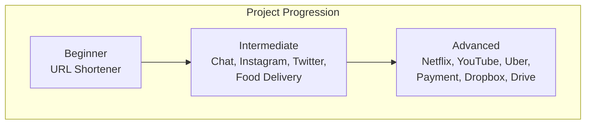

# 19 — Projects

> Build real systems. Each project includes requirements, capacity estimation, API design, database design, high/low level design, scaling strategy, and deployment.

## Capstone Guide

| # | Project | Description |
|---|---------|-------------|
| 🌟 | [End-to-End Implementation Guide](12-end-to-end-implementation-guide.md) | Complete playbook: requirements → architecture → APIs → security → Docker → K8s → Terraform → CI/CD → observability → SRE — with E-Commerce Platform as running example |

## Design Projects

| # | Project | Difficulty | Tech Stack |
|---|---------|------------|------------|
| 1 | [URL Shortener](01-url-shortener.md) | Beginner | Node.js, Redis, PostgreSQL |
| 2 | [Chat System](02-chat-system.md) | Intermediate | WebSocket, Redis Pub/Sub |
| 3 | [Netflix Clone Backend](03-netflix-clone.md) | Advanced | Microservices, CDN |
| 4 | [YouTube Backend](04-youtube-backend.md) | Advanced | Video processing, CDN |
| 5 | [Uber Backend](05-uber-backend.md) | Advanced | Geospatial, real-time |
| 6 | [Payment Gateway](06-payment-gateway.md) | Advanced | Idempotency, transactions |
| 7 | [Instagram Backend](07-instagram-backend.md) | Intermediate | Feed, media storage |
| 8 | [Twitter Backend](08-twitter-backend.md) | Intermediate | Timeline, fanout |
| 9 | [Dropbox Clone](09-dropbox-clone.md) | Advanced | File sync, CRDTs |
| 10 | [Google Drive Clone](10-google-drive-clone.md) | Advanced | File storage, sharing, OT |
| 11 | [Food Delivery System](11-food-delivery-system.md) | Intermediate | Order matching, real-time |
| 13 | [Video Conferencing](13-video-conferencing.md) | Advanced | WebRTC, SFU, signaling |
| 14 | [Real-Time Chat Platform](14-realtime-chat-platform.md) | Intermediate | WebSocket, presence, history |
| 15 | [Event Booking System](15-event-booking-system.md) | Intermediate | Ticketing, seat selection, payment |
| 16 | [Airline Reservation](16-airline-reservation.md) | Advanced | Inventory, pricing, PNR |
| 17 | [Banking Ledger](17-banking-ledger.md) | Advanced | Double-entry, reconciliation |
| 18 | [Healthcare EMR](18-healthcare-emr.md) | Advanced | FHIR, HIPAA, clinical data |

## Full Stack & End-to-End Guides

| # | Guide | Description |
|---|-------|-------------|
| | [Java Full Stack Roadmap](19-java-full-stack-roadmap.md) | Complete end-to-end Java stack: Spring Boot, React, EKS, Kafka, Terraform, CI/CD — using E-Commerce OMS as example, with system design, data model, DevOps pipeline, cloud infra, and 20 interview questions |

## Additional Projects

| # | Project | Description |
|---|---------|-------------|
| 20 | [Serverless App](20-serverless-app.md) | Lambda + API Gateway + DynamoDB + Cognito + SAM |
| 21 | [ML Model Serving](21-ml-model-serving.md) | vLLM + K8s + GPU autoscaling + A/B testing |
| 22 | [Multi-Cloud Terraform](22-multi-cloud-terraform.md) | AWS + GCP Terraform with VPN, shared state, workspaces |
| 23 | [Monitoring Stack](23-monitoring-stack.md) | Prometheus + Grafana + Loki + Tempo + AlertManager |
| 24 | [API Gateway](24-api-gateway-project.md) | Kong/APISIX with auth, rate limiting, plugins |
| 25 | [Event-Driven Microservices](25-event-driven-microservices.md) | Kafka + Kafka Streams + Avro + Schema Registry |

---

Previous: [18 — Case Studies](../18-Case-Studies/README.md)
Next: [20 — Interview Prep](../20-Interview-Prep/README.md)
