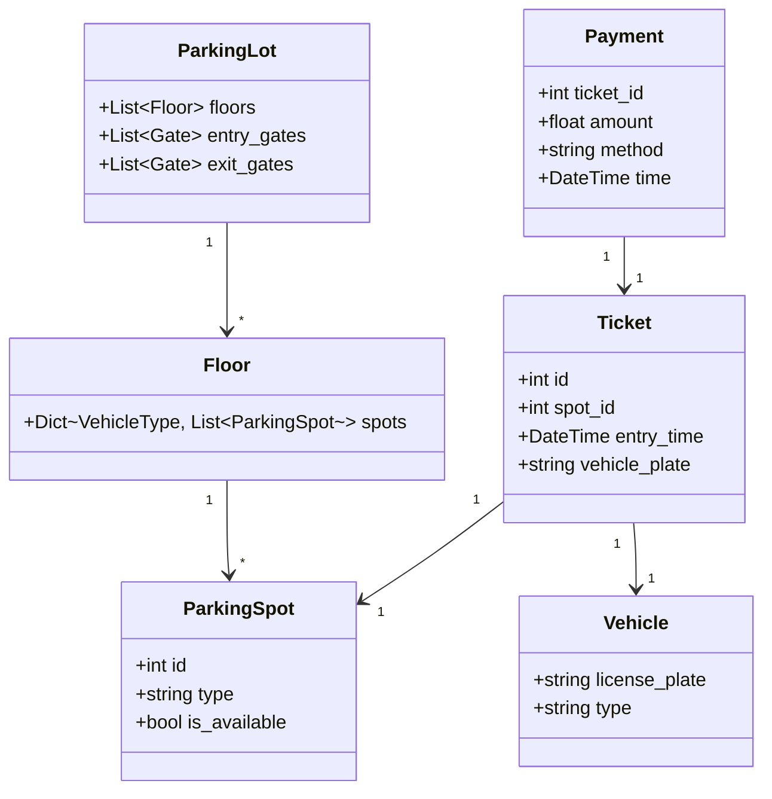

# Design Parking Lot

## Problem
Design a parking lot system with multiple floors, vehicle types, and payment.

## Key Classes



```python
class ParkingLot:
    floors: List[Floor]
    entry_gates: List[Gate]
    exit_gates: List[Gate]

class Floor:
    spots: Dict[VehicleType, List[ParkingSpot]]

class ParkingSpot:
    id, type, is_available

class Vehicle:
    license_plate, type

class Ticket:
    id, spot, entry_time, vehicle

class Payment:
    ticket, amount, method, time
```

## Key Design Points

| Aspect | Considerations |
|--------|---------------|
| Spot assignment | Nearest to entry/exit, spot type matching |
| Pricing | Per-hour, peak/off-peak, vehicle type |
| Availability | Display real-time availability |
| Reservations | Pre-booking spots (optional) |
| Payment | Cash, card, mobile, subscription |

## Interview Discussion
1. How do you find the nearest available spot efficiently?
2. How do you handle concurrency (two cars entering at same time)?
3. Design the pricing strategy
4. How do you handle electric vehicle charging spots?
