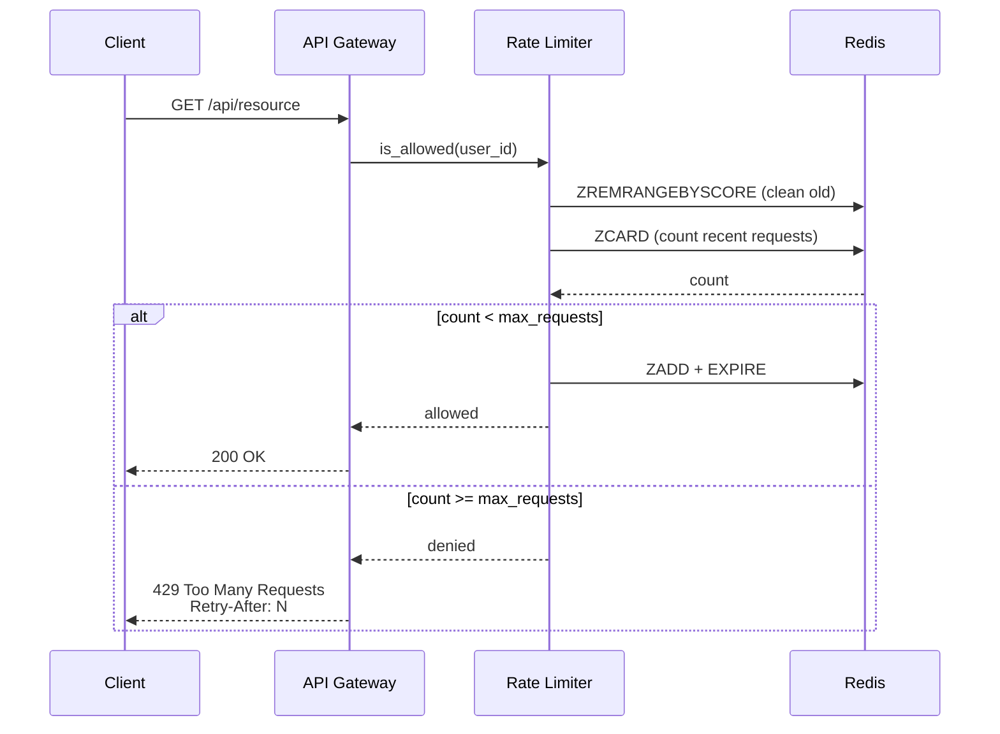

# Design Rate Limiter

## Problem
Design a rate limiter that prevents API abuse by limiting requests per user/IP.

## Requirements
- Limit 100 requests/minute per user
- Distributed rate limiting across servers
- Low latency (single digit ms)
- Configurable rules

## Algorithm: Sliding Window Log + Redis



```python
def is_allowed(user_id: str, max_requests: int, window_ms: int) -> bool:
    key = f"ratelimit:{user_id}"
    now = int(time.time() * 1000)
    
    # Use Redis Sorted Set (timestamp as score)
    # Remove entries outside window
    redis.zremrangebyscore(key, 0, now - window_ms)
    
    # Count remaining
    count = redis.zcard(key)
    
    if count >= max_requests:
        return False
    
    # Add current request
    redis.zadd(key, {str(now): now})
    redis.expire(key, window_ms // 1000)  # TTL cleanup
    return True
```

## Distributed Challenges

| Challenge | Solution |
|-----------|----------|
| Race conditions | Redis Lua script for atomicity |
| Performance | Local cache for coarse limiting, Redis for precise |
| Consistency | Eventual consistency acceptable for rate limits |
| Downtime | Fail-open (allow request) if Redis is down |

## Interview Discussion
1. Token bucket vs sliding window vs fixed window
2. How to rate limit by different dimensions (user, IP, API key)
3. How to communicate rate limits to clients (429, Retry-After header)
4. How to handle rate limit for premium vs free users
