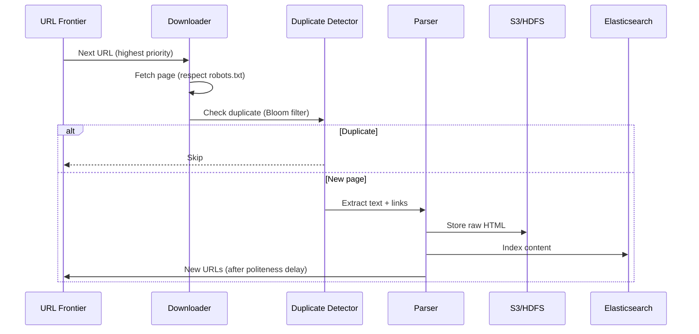

# Design a Web Crawler

## Requirements

- Crawl billions of web pages
- Respect robots.txt
- Avoid duplicate pages
- Handle dynamic content (JS-rendered)
- Re-crawl with freshness policy
- Polite crawling (rate limit per domain)

## Capacity Estimation

```
Pages:       10B pages to crawl (initial)
New pages:   100M/day (incremental)
Crawl rate:  1M pages/min ≈ 17K pages/sec
Storage:     10B × 100KB avg = 1PB raw HTML
Metadata:    10B × 256B = 2.5TB (URL, checksum, crawl time)
Links graph: 100B edges × 16B = 1.6TB
Bandwidth:   17K × 100KB = 1.7 GB/sec ≈ 14 Gbps
```

## API Design

```
// Internal APIs
POST /crawler/submit   { url, priority }       → { job_id }
GET  /crawler/status   { job_id }               → { status, pages_crawled }
POST /crawler/pause    { job_id }
POST /crawler/resume   { job_id }

// Storage (indexed pages)
GET  /pages/{url_hash}                          → { title, content, links, metadata }
GET  /pages/search     { q }                    → [{ url, title, snippet }]
```

## Database Design

```sql
-- URL frontier (prioritized queue)
CREATE TABLE url_frontier (
    id BIGSERIAL PRIMARY KEY,
    url TEXT NOT NULL UNIQUE,
    domain VARCHAR(255),
    priority INT DEFAULT 1,
    depth INT DEFAULT 0,
    discovered_at TIMESTAMP DEFAULT NOW(),
    status VARCHAR(20) DEFAULT 'pending',
    checksum VARCHAR(64),
    last_crawled TIMESTAMP,
    INDEX idx_domain_status (domain, status),
    INDEX idx_priority (priority, discovered_at)
);

-- Crawled pages
CREATE TABLE pages (
    url_hash VARCHAR(64) PRIMARY KEY,  -- SHA256 of URL
    url TEXT NOT NULL,
    domain VARCHAR(255),
    title TEXT,
    raw_html BYTEA,
    text_content TEXT,
    outgoing_links TEXT[],  -- URLs extracted from page
    content_type VARCHAR(100),
    content_length BIGINT,
    checksum VARCHAR(64),
    crawl_time_ms INT,
    http_status INT,
    robots_allowed BOOLEAN,
    crawled_at TIMESTAMP
);

-- Domain politeness
CREATE TABLE domain_policy (
    domain VARCHAR(255) PRIMARY KEY,
    crawl_delay_ms INT DEFAULT 1000,
    robots_txt TEXT,
    last_crawled TIMESTAMP,
    concurrent_reqs INT DEFAULT 1,
    max_depth INT DEFAULT 10
);
```

## High-Level Design



```
                      ┌──────────────┐
                      │ URL Frontier │
                      │ (Priority Q) │
                      └──────┬───────┘
                             │
                     ┌───────▼───────┐
                     │   Downloader  │
                     │   (distributed│
                     │    workers)   │
                     └───────┬───────┘
                             │
              ┌──────────────┼──────────────┐
              ▼              ▼              ▼
        ┌──────────┐  ┌──────────┐  ┌──────────┐
        │Duplicate  │  │ Parser   │  │Link      │
        │Detector   │  │(HTML→Text)│  │Extractor │
        └──────────┘  └──────────┘  └──────────┘
              │              │              │
              ▼              ▼              ▼
        ┌──────────┐  ┌──────────┐  ┌──────────┐
        │Storage   │  │ Indexer  │  │URL Filter│
        │(S3/HDFS) │  │(ES)      │  │          │
        └──────────┘  └──────────┘  └──────────┘
                                        │
                                        ▼
                                   ┌──────────┐
                                   │URL Frontier│
                                   │(New URLs) │
                                   └──────────┘
```

## Low-Level Design: URL Frontier

```
Priority queue organized by:
1. Domain (for politeness)
2. Priority score (PageRank-like freshness)
3. Last crawl time

Partitioning:
- Shard by domain hash → each worker responsible for N domains
- Each worker maintains its own in-memory queue
- Rebalance when workers join/leave (consistent hashing)

Politeness:
- Delay per domain: 500ms-10s based on robots.txt
- Track last_crawl_time per domain
- If < delay → hold in waiting queue
```

## Scaling Strategy

| Component | Strategy |
|-----------|----------|
| **URL Frontier** | 100+ queue partitions by domain hash |
| **Downloader** | Auto-scaled workers, each handles N domains |
| **Duplicate Detection** | Bloom filter (in-memory) + exact check on DB |
| **Storage** | S3/HDFS for raw pages; PostgreSQL for metadata |
| **Index** | Elasticsearch for full-text search |
| **Rate Limiting** | Token bucket per domain, stored in Redis |
| **Freshness** | Priority = priority_base + time_since_last_crawl |

## Interview Questions

1. How do you ensure the crawler is polite to websites?
2. How do you detect and avoid duplicate pages?
3. How does the URL frontier prioritize which URLs to crawl next?
4. How do you handle JavaScript-rendered pages?
5. Design a system to re-crawl pages with appropriate freshness policy
