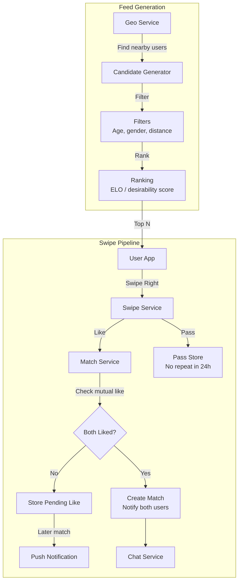

# Design Tinder

## Requirements

- Location-based matching (swipe left/right on profiles)
- Swipe flow with like/pass decision
- Match notification when both users like each other
- Real-time messaging after match
- Push notifications for new matches and messages
- 100M users, 10M daily active, 1B swipes/day

## Capacity Estimation

```
Users:         100M total, 10M DAU
Swipes:        1B/day ≈ 11,500 swipes/sec peak
Matches:       20M/day (2% match rate)
Messages:      200M/day after matching
Location:      10M DAU × 1 location ping/30s = 330K writes/sec
Profile reads: 50M/day (profiles loaded for swiping)
Geo-index:     100K active users per major city
```

## High-Level Design



## Location-Based Matching

```
Geo-indexing with H3 (Uber's hierarchical hexagonal grid):

Grid resolution:
  H3 resolution 9: Hexagon radius ~175m (dense city)
  H3 resolution 8: Hexagon radius ~460m (suburban)
  H3 resolution 7: Hexagon radius ~1.2km (rural)

Index strategy:
  1. User's location → H3 hex ID
  2. Store user_id in Redis set: active_users:{hex_id}
  3. Query: find nearby users by including ring of hexagons
  
  Redis Sorted Set: active_users
    Key: active_users:893fa23 (hex ID)
    Members: user_ids sorted by last_active_time

Query for nearby users:
  1. Get user's current H3 hex: 893fa23
  2. Get ring of hexagons: k_ring(893fa23, radius=3)
  3. Union all active_users:{hex_id} sets
  4. Apply filters (age, gender preferences)
  5. Score and rank candidates
  6. Return top N (typically 20-50 profiles)
```

## Swipe Flow (Like/Pass)

```
Swipe decision flow:

User swipes RIGHT (like):
  1. Swipe Service records: user_id liked profile_id
  2. Check if profile_id already liked user_id:
     a. Yes → Mutual match! Create match record
              Push notification to both
              Open chat channel
     b. No  → Store pending like in Redis (TTL 24h)
              User appears in "Who Liked You" (premium feature)

User swipes LEFT (pass):
  1. Swipe Service records: user_id passed profile_id
  2. Add to pass set: passed:{user_id} (TTL 24h)
  3. profile_id will not appear in feed for 24h
  4. Important: Pass is NOT stored permanently
     User may see same profile after 24h

Swipe storage:
  likes:      {user_id}:{profile_id} → boolean (Redis hash, TTL 7 days)
  passes:     {user_id}:{profile_id} → boolean (Redis hash, TTL 24h)
  matches:    match_id → {user_id_1, user_id_2, timestamp}

Analytics:
  - Swipe right rate: % of profiles liked
  - Match rate: matches / swipes
  - Response rate: messages sent / matches
  - Super like conversion: % leading to matches
```

## Matching Algorithm

```
Batch + Real-time Matching:

Real-time (on swipe):
  User A likes User B
  → Check if User B already likes User A
  → Check if in each other's preference filters
  → If yes → Instant match (push to both)
  → If no → Queue for batch matching

Batch matching (every 15 minutes):
  For each user with pending likes:
    - Score candidates by:
      * Mutual interest level
      * ELO score difference (closer = better)
      * Recency of activity
      * Boosted profiles (premium feature)
    - Top N candidates → re-check for mutual like
    - Any new matches → push notifications

Daily match limits (anti-spam):
  Free users:    100 swipes/day, 10 super likes/week
  Premium users: 500 swipes/day, 50 super likes/day
  Match limit:   100 new matches/day (both tiers)
```

## Feed (CF/ELO)

```
Profile ranking for swipe feed:

Desirability score (ELO-based):
  Each user has a desirability rating (similar to ELO/Glicko)
  
  When User A swipes right on User B:
    A's desirability increases slightly
    B's desirability increases (validation)
  
  When User A swipes left on User B:
    A's desirability decreases slightly
    B's desirability unchanged

  Starting rating: 1200
  Range: 800-2000

Feed generation:
  1. Find candidates (geo + filters)
  2. Score each candidate:
     score = 
       elo_attraction_weight × |elo_user - elo_candidate| +
       recency_weight × candidate.last_active +
       photo_score_weight × candidate.photo_quality +
       boosting_weight × candidate.is_boosted
  3. Sort by score (closer ELO = better match)
  4. Interleave boosted profiles (every 6th card)
  5. Apply diversity (no 2 same ethnicity/gender in a row)

Collaborative filtering alternative:
  - Users who liked X also liked Y
  - Matrix factorization (ALS) for implicit feedback
  - Batch recomputation nightly
```

## Push Notifications

```
Notification triggers:

Match:
  "It's a match! You and {name} liked each other"
  → Both users receive immediately

Message:
  "{name} sent you a message"
  → Push notification + in-app banner

Who Liked You (premium):
  "{count} people liked you! Swipe to find out who."
  → Daily digest for premium users

Inactive user:
  "You have {count} pending likes. Come back!"
  → After 24 hours of inactivity

New profiles:
  "New people in your area!"
  → When new users join within user's geo-radius

Notification delivery:
  - APNs (iOS) / FCM (Android) for push
  - WebSocket for in-app real-time messages
  - Queue: RabbitMQ → worker pool → APNs/FCM gateways
  - Rate limit: 10 push notifications/hour/user
```

## Scaling Strategy

| Component | Strategy |
|-----------|----------|
| **Geo-index** | Redis with H3 hexagons; TTL on user presence sets |
| **Swipe writes** | High-throughput write to Redis; async persistence to Cassandra |
| **Match detection** | Real-time check in Redis; batch confirmation via Kafka |
| **Profile storage** | PostgreSQL (user data); S3 (photos with CDN) |
| **Feed generation** | Pre-compute candidate pool; real-time sort on client |
| **Messaging** | WebSocket gateway for online; push for offline |
| **ELO rating** | Composable scoring; updated asynchronously after each swipe |

## Interview Questions

1. How does Tinder's geo-indexing work for finding nearby users?
2. Design the swipe/like/match flow with real-time mutual detection.
3. How would you implement an ELO-based desirability scoring system?
4. How do you prevent bot accounts and catfishing?
5. Design a matching algorithm that balances user engagement and fairness.
