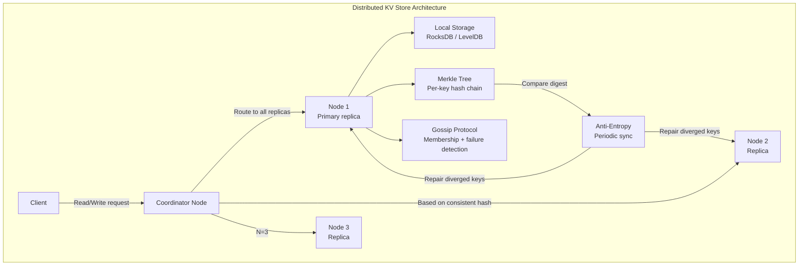
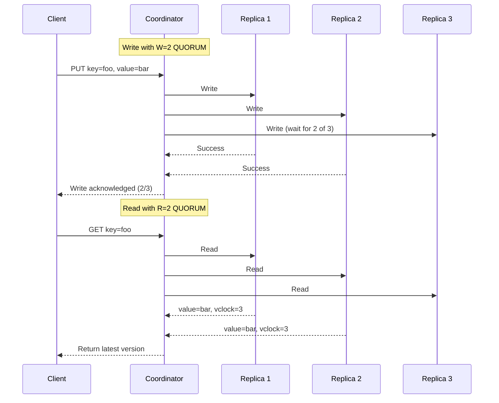
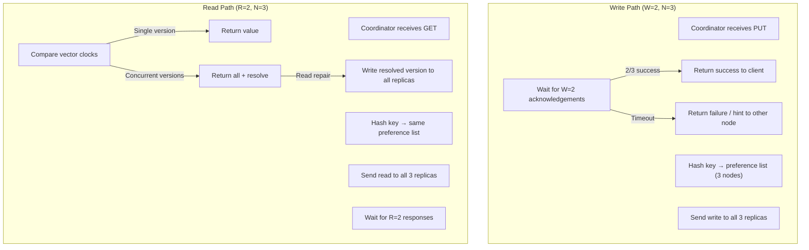

# Design a Distributed Key-Value Store

## Requirements

- Consistent hashing with virtual nodes for even distribution
- N replicas with sloppy quorum for availability
- Tunable consistency (R + W > N)
- Gossip protocol with phi-accrual failure detection
- Merkle tree anti-entropy for replica repair
- Vector clocks for causal ordering
- 100TB data, 10M ops/sec, 99.999% availability

## Capacity Estimation

```
Data:           100TB across cluster
Node count:     50 nodes (2TB SSD per node)
Replication:    N=3 (300TB raw)
Read QPS:       8M reads/sec
Write QPS:      2M writes/sec
Object size:    avg 10KB, max 10MB
Network:        10Gbps inter-node
Failure MTTR:   < 5 minutes
```

## Solution Framework



## Consistent Hashing with Virtual Nodes

```
Ring architecture:

Physical nodes:  N1, N2, N3, ... N50
Each physical node has 100-200 virtual nodes (vnodes) on the ring.

Ring: [0, 2^64 - 1] hash space
  vnodes: hash("N1:0") → position 1053
          hash("N1:1") → position 8972
          hash("N2:0") → position 4501
          ...

Key placement:
  hash(key) → position on ring
  Walk clockwise → first vnode → owns the key

Benefits:
  - Even distribution: vnodes smooth out skew
  - Load balancing: more vnodes = more even data distribution
  - Minimal redistribution: 
    * Add node: only 1/N of keys move
    * Remove node: only keys from that node's vnodes move
  - Heterogeneous clusters: more vnodes for bigger nodes

Read/write routing:
  Client → Coordinator (any node)
  Coordinator computes preference list for key:
    N unique physical nodes clockwise from key's position
  Sends read/write to all N replicas
```

## N Replicas with Sloppy Quorum

```
Replication factor N=3 (configurable per keyspace).

Tunable consistency:
  R: Number of successful reads required
  W: Number of successful writes required
  Condition: R + W > N ensures strong consistency

Consistency levels:
  ONE:          R=1, W=1    (fastest, weakest)
  QUORUM:       R=2, W=2    (balanced, R+W>N=3)
  ALL:          R=3, W=3    (slowest, strongest)
  LOCAL_QUORUM: R=2 in local DC (multi-DC)

Sloppy quorum:
  If N replicas are unavailable (node down, partition):
  - Accept writes on any N healthy nodes (hinted handoff)
  - When unavailable node returns, replica repaired
  - Consistency sacrificed for availability (AP in CAP)

Hinted handoff:
  Coordinator writes to node D (not in preference list)
  D stores hint: "key belongs to node B"
  When B is reachable, D forwards data to B
  B stores the data, D removes hint
```

## Tunable Consistency (R + W > N)



## Gossip + Phi-Accrual Failure Detection

```
Phi-accrual failure detection:
  - Each node monitors heartbeats from other nodes
  - Maintains sliding window of inter-arrival times
  - Computes suspicion level (phi) based on distribution model
  - Phi = -log10(P(likelihood of delay given history))
  
  Thresholds:
    phi = 1:     ~10% chance node is alive (weak suspicion)
    phi = 8:     ~0.01% chance node is alive (strong suspicion)
    phi = 16:    Almost certainly dead

Gossip protocol:
  Every second, each node gossips with 1 random node:
    - Exchange membership list (node_id, incarnation, state)
    - Exchange heartbeat counters
    - Phi values for suspected nodes
  
  Convergence: O(log N) rounds for cluster-wide consistency
  Properties: Eventually consistent membership

Failure handling:
  phi > threshold (e.g., 8) → mark node as SUSPECT
  If confirmed by > N/2 nodes → mark as DEAD
  DEAD node's vnodes redistributed to remaining nodes
  When node recovers → rejoins with higher incarnation number
```

## Merkle Tree Anti-Entropy

```
Anti-entropy repairs systematically diverged replicas.

Merkle tree per key range:
  Leaf:   hash(key + value) for each key
  Internal: hash(left_child + right_child)
  Root:    compact representation of replica state

Sync process:
  Node A and Node B compare their Merkle trees:
  1. Compare root hashes
  2. If different → compare children recursively
  3. Eventually identify leaf-level differences
  4. Transfer only divergent key-value pairs

Benefits:
  - Minimal data transfer (only diverged keys)
  - Logarithmic comparison time
  - Detects all forms of divergence (missed writes, corruption)

Reconciliation:
  For each divergent key:
    1. Compare vector clocks
    2. If one dominates → take that version
    3. If concurrent → store as sibling (LWW or application resolves)
    4. Propagate resolved version to all replicas

Schedule:
  Full Merkle tree comparison: every 10 minutes
  Incremental (only changed ranges): every 60 seconds
```

## Vector Clocks

```
Vector clocks track causal relationships between versions.

Format: [(node_id, counter), (node_id, counter), ...]

Example:
  Initial:         vclock = [(A, 1)]
  Write on A:      vclock = [(A, 2)]
  Write on B:      vclock = [(A, 2), (B, 1)]
  Write on A:      vclock = [(A, 3), (B, 1)]

Causal comparison:
  vclock_X ≤ vclock_Y iff for all nodes:
    X[node] ≤ Y[node]
  
  X dominates Y:  X is a causal successor → take X
  Y dominates X:  Y is a causal successor → take Y
  X || Y (concurrent): Neither dominates → store both

Last-writer-wins (LWW) alternative:
  Use wall-clock timestamp instead of vector clocks
  Less storage overhead, but relies on clock synchronization
  Acceptable for many production systems (Cassandra uses LWW)
```

## Read/Write Quorum Diagram



## Interview Questions

1. How does consistent hashing with virtual nodes improve data distribution?
2. How does tunable consistency (R + W > N) balance consistency and availability?
3. How does phi-accrual failure detection work compared to simple timeouts?
4. How do Merkle trees enable efficient anti-entropy repair?
5. Design a distributed KV store that can survive an entire datacenter failure.
