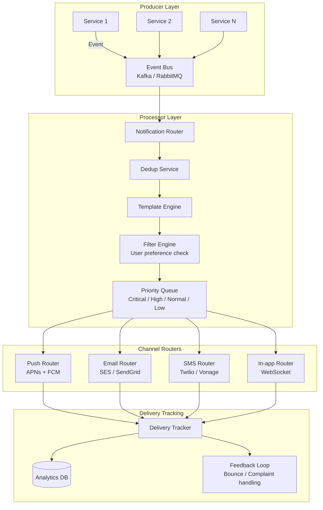

# Design a Notification System

## Requirements

- Multi-channel delivery: push (mobile), email, SMS, in-app
- Template-based rendering with dynamic variables
- Rate limiting per channel, per user, per notification type
- Deduplication to prevent duplicate notifications
- Delivery tracking (sent, delivered, read, bounced)
- 1B notifications/day, 100M users

## Capacity Estimation

```
Notifications:    1B/day ≈ 11,500/sec (peak: 50K/sec)
Push:             600M/day (60%)
Email:            300M/day (30%)
SMS:              50M/day (5%)
In-app:           50M/day (5%)
Templates:        500 unique templates
Delivery tracking: 1B events/day
User preferences: 100M user notification settings
```

## Solution Framework



## Notification Types and Templates

```
Notification types:

| Type | Channels | Priority | Volume |
|------|----------|----------|--------|
| **Transaction** (payment, order) | Push, Email, In-app | Critical | 200M/day |
| **Security** (login, password change) | Push, Email, SMS | Critical | 10M/day |
| **Social** (like, comment, follow) | Push, In-app | Normal | 400M/day |
| **Marketing** (promotions, offers) | Email, Push | Low | 300M/day |
| **System** (service updates, downtime) | Email, In-app | High | 10M/day |

Template engine:

// Template example (Handlebars/Mustache-like)
Template ID: "payment_received"
Channels:    [push, email, in_app]
Subject:     "Payment of {{amount}} received"
Push body:   "You received {{amount}} from {{sender_name}}"
Email HTML:  "<h1>Payment Received</h1><p>From: {{sender_name}}</p>..."
SMS text:    "Payment of {{amount}} received from {{sender_name}}"
In-app:      "{{sender_name}} sent you {{amount}}"

Variables:
  {{amount}}:        "$50.00"
  {{sender_name}}:   "Alice Johnson"
  {{transaction_id}}:"txn_abc123"
```

## Rate Limiting

```
Rate limiting policies per channel:

Channel           Per User         Per Channel Global
Push              5/min/user      100K/sec total
Email             10/hour/user    50K/sec total (warm up)
SMS               1/min/user      5K/sec total (carrier limits)
In-app            20/min/user     200K/sec total

Implementation (per user rate limiter):

  Key: rate_limit:{channel}:{user_id}:{notification_type}
  Window: Sliding window (Redis sorted set)
  
  Algorithm: Token bucket
    bucket_size:     max burst allowed
    refill_rate:     tokens per second
    refill_interval: continuous

  Check before sending:
    1. Get current token count for user+channel
    2. If tokens > 0 → decrement, send notification
    3. If tokens == 0 → queue for later or drop (low priority)

  Critical overrides:
    Security notifications bypass rate limits
    Transaction notifications bypass per-user limits
    System-wide limit always applies (channel capacity)
```

## Deduplication

```
Deduplication prevents sending the same notification multiple times.

Strategy:
  - Each notification has a unique group_key + dedup_id
  - Keep processed notifications in Redis with TTL
  
  Dedup key: "dedup:{channel}:{group_key}:{user_id}"
  
  Example:
    order_confirmation + user_123 + "Your order #456 has been confirmed"
    group_key = "order_confirmation" + "order_456"
    → Key: dedup:push:order_confirmation:user_123
    → TTL: 24 hours (window for duplicate prevention)

  Dedup window by priority:
    Critical: 1 hour (don't send same security alert twice)
    Normal:   24 hours (same social notification)
    Low:      7 days (same marketing campaign)

  Idempotency check:
    Before sending, check if dedup key exists
    If exists → skip (notification already sent)
    If not → create dedup key, send notification

  Edge case:
    If user gets notification about the same event 
    from different services → same group_key → dedup works
```

## Delivery Tracking

```
Tracking event lifecycle:

Notification Created
  → status: "pending"
  
Queued for delivery
  → status: "queued"
  → event: recorded_at, queue_depth

Sent to channel provider
  → status: "sent"
  → event: provider_accepted, provider_message_id

Delivered to device/inbox
  → status: "delivered"
  → event: delivered_at, device_info

Read by user
  → status: "read"
  → event: read_at, read_duration (time to open)

Bounced / Failed
  → status: "failed"
  → event: error_code, error_message, provider_reason

Bounced channels:
  - Email: Hard bounce (invalid address), soft bounce (mailbox full)
  - Push: Token expired, app uninstalled, device offline
  - SMS: Carrier blocked, invalid number, opted out
  - In-app: Connection lost, user offline

Tracking storage:
  - Hot (7 days):     Redis + PostgreSQL (real-time queries)
  - Warm (90 days):   Elasticsearch (search + analytics)
  - Cold (archive):   S3 Parquet (compliance, audits)
```

## Architecture Details

```
Producer → Event Bus Architecture:

┌──────────┐    ┌──────────┐    ┌──────────┐
│ Event    │───►│ Kafka    │───►│ Consumer │
│ Producer │    │ Topic    │    │ Worker   │
└──────────┘    └──────────┘    └──────────┘

Kafka topics:
  notification.request          → Raw notification requests
  notification.delivery.tracking→ Delivery status updates  
  notification.bounce           → Bounced/failed notifications
  notification.opt_out          → User opt-out events
  notification.analytics        → Aggregated analytics

Worker pool architecture:
  - Consumer group per channel type
  - Partition per channel (push_part_0, push_part_1, ...)
  - Message ordering guaranteed within partition
  - Backpressure via consumer lag monitoring

Channel provider abstraction:
  interface NotificationChannel {
    send(Notification): DeliveryResult
    getStatus(String providerId): DeliveryStatus
  }
```

## Scaling Strategy

| Component | Strategy |
|-----------|----------|
| **Event ingestion** | Kafka with 64 partitions; auto-scale consumers |
| **Template rendering** | Pre-compiled templates; cached in Redis |
| **Rate limiting** | Redis Cluster (sharded by user_id) |
| **Deduplication** | Redis with TTL; bloom filter for high-volume types |
| **Push delivery** | Connection pool to APNs/FCM; batch sends |
| **Email delivery** | SES / SendGrid; dedicated IP pools |
| **SMS delivery** | Twilio with failover to backup provider |
| **Delivery tracking** | Write-behind cache; batch writes to DB |

## Interview Questions

1. Design a notification system that supports push, email, SMS, and in-app channels.
2. How do you implement rate limiting per channel and per user?
3. How does deduplication work for notifications?
4. How do you track delivery status across different channels?
5. Design a template engine that supports dynamic content rendering.
