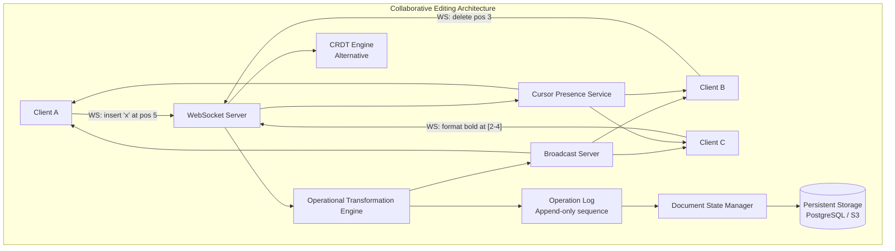

# Design a Collaborative Editor

## Requirements

- Real-time collaborative document editing (multiple users editing simultaneously)
- Operational Transformation (OT) vs CRDT approaches
- WebSocket-based communication
- Operation log for history and replay
- Document state management with conflict resolution
- Cursor presence showing other users' positions
- 10M users, 100K concurrent documents

## Capacity Estimation

```
Concurrent documents:  100K
Users per document:    avg 3, max 100
Operations/sec:        10K operations/document → 1B ops/sec peak
Operation size:        avg 100 bytes → 100GB/sec ingress
Document size:         avg 10KB text, max 10MB
History storage:       1B ops/day → 100GB/day
Presence updates:      500K/sec (cursor movements)
```

## Solution Framework



## OT vs CRDT Deep Dive

```
Operational Transformation (OT):

  Algorithm: Transform operations against concurrent ops
  State:     Single authoritative document state
  Complexity: O(n) transform per operation
  
  How it works:
    User A inserts 'x' at position 5 (opA)
    User B deletes position 3 (opB)
    
    Server receives opA, opB concurrently
    Transform opA against opB: opA' = transform(opA, opB)
    Transform opB against opA: opB' = transform(opB, opA)
    
    Apply opA' to document (position adjusted for deletion)
    Apply opB' to document (position adjusted for insertion)
    
    Result: Both users see the same final state

CRDT (Conflict-free Replicated Data Type):

  Algorithm: Commutative operations (order-independent merge)
  State:     Each replica maintains its own state
  Complexity: O(log n) index, O(1) merge
  
  How it works:
    Each character has a unique identifier (site_id + counter)
    Insert: Insert with ID at position, no transformation needed
    Delete: Tombstone the character (mark deleted)
    Merge: Union of all operations (commutative)
    
    No central server required (P2P possible)
    Eventual consistency guaranteed by math

Comparison:
  OT:        Google Docs, Microsoft Office Online
  CRDT:      Figma, Notion, Atom Teletype, CKEditor5
```

## WebSocket Server

```
WebSocket connection management:

┌──────────┐     ┌──────────┐     ┌──────────┐
│ Client A │────►│ WS       │────►│ Room:    │
│ Client B │────►│ Server   │────►│ doc_123  │
│ Client C │────►│ (Node 1) │     │          │
└──────────┘     └──────────┘     └────┬─────┘
                                       │
┌──────────┐     ┌──────────┐          │
│ Client D │────►│ WS       │──────────┤
│ Client E │────►│ Server   │──────────┤
└──────────┘     │ (Node 2) │          │
                 └──────────┘          │
                                       │
                          ┌────────────┴────────┐
                          │  Redis Pub/Sub      │
                          │  channel: doc_123   │
                          └─────────────────────┘

Room management:
  - Each document is a room
  - Clients join room via WebSocket handshake
  - Redis Pub/Sub broadcasts operations to all nodes
  - Room state stored in Redis (current users, cursor positions)

Connection lifecycle:
  1. Client connects with {doc_id, user_id, session_token}
  2. Server authenticates, authorizes document access
  3. Client joins room, server sends current document state
  4. Server sends presence info (connected users + cursors)
  5. Bidirectional operation exchange begins
  6. Disconnect → broadcast "user left" → save unsent ops
```

## Operation Log

```
Operation log structure:

{
  "doc_id": "doc_abc123",
  "op_id": "op_0000000457",
  "site_id": "user_a_device_1",
  "seq_no": 142,
  "timestamp": 1717500000000,
  "type": "insert",
  "data": {
    "text": "hello",
    "position": 5,
    "attributes": {"bold": true}
  },
  "dependencies": ["op_0000000456"],
  "hash": "sha256hash_of_previous_op"
}

Log properties:
  - Append-only (never modified)
  - Each operation references its predecessor
  - Hash chain ensures integrity
  - Sequence numbers per site (not global)

Replay:
  - Snapshot every N operations (e.g., 1000)
  - Replay from last snapshot + remaining ops
  - Used for: recovery, state transfer, history playback

Version management:
  - Document version = hash of last applied operation
  - Snapshot = (version, serialized document state)
  - New client receives snapshot + delta of ops since
```

## Document State Manager

```
State management strategies:

Server-authoritative (OT model):
  - Server processes all operations in global order
  - Server assigns sequence numbers
  - Client operations transformed against server's state
  - Server broadcasts transformed ops to all clients
  - Google Docs approach

Client-authoritative (CRDT model):
  - Each client maintains local state + replica
  - Operations merged via CRDT merge rules
  - No central ordering required
  - Peer-to-peer or server-relayed

Hybrid (most practical):
  - Server receives client operations
  - Server orders operations (total order via sequence number)
  - Server applies OT transformation if needed
  - Server broadcasts to all clients
  - Client applies transformed operations

Operation queue per document:
  ┌─────────┐    ┌─────────┐    ┌─────────┐
  │ Op 456  │───►│ Op 457  │───►│ Op 458  │───► ...
  │ insert  │    │ delete  │    │ format  │
  │ pos 5   │    │ pos 12  │    │ [2-4]   │
  └─────────┘    └─────────┘    └─────────┘

  Queue is persisted to disk for durability
  Queue is the source of truth for document state
```

## Jupiter Protocol (OT)

```
Jupiter Protocol — efficient OT for collaborative editing:

Server maintains state vector (sv_s): [op_count_site_1, op_count_site_2, ...]
Client maintains state vector (sv_c): [op_count_site_1, op_count_site_2, ...]

Operation flow:
  1. Client sends operation with sv_c
  2. Server receives: sv_c may be behind sv_s
  3. Server transforms client_op against all ops since sv_c
  4. Server applies transformed op, increments sv_s[client_site]
  5. Server sends ack + any pending ops for client
  6. Client applies server ops, increments sv_c

OT transform function requirements:
  - TP1: op_a ○ transform(op_a, op_b) == op_b ○ transform(op_b, op_a)
  - TP2: transform is associative and composable

Implementation (simplified insert/delete transform):

  transform_insert_against_insert(insA, insB):
    if insA.pos < insB.pos or (insA.pos == insB.pos and insA.site < insB.site):
      return insA (no change)
    else:
      return {type: "insert", pos: insA.pos + insB.text.length, ...}

  transform_insert_against_delete(ins, del):
    if ins.pos <= del.pos:
      return ins (no change)
    else:
      return {type: "insert", pos: ins.pos - del.length, ...}
```

## RGA (CRDT)

```
RGA (Replicated Growable Array) — a popular CRDT for text:

Data structure:
  - Linked list of nodes
  - Each node: {id, value, deleted, previous_id}
  - id = (site_id, counter) — globally unique
  - previous_id = id of the element before this one (insert order)

Insert operation:
  1. Generate new id = (site_id, next_counter)
  2. Set previous_id to the element at desired insert position
  3. Broadcast {type: "insert", id, value, previous_id}

Merge rule:
  For two concurrent inserts after the same previous_id:
    Element with larger (site_id, counter) comes first
    All sites sort identically → no conflict

Delete operation:
  1. Set node.deleted = true
  2. Broadcast {type: "delete", id}
  3. Node becomes tombstone (not actually removed — space tradeoff)

  Tombstone cleanup: periodic garbage collection
    If all replicas have seen the tombstone, remove it

Advantages of RGA:
  - No central server needed
  - Simple merge rules
  - Guaranteed convergence
  - Preserves user intention (insert at right position)
```

## Cursor Presence

```
Cursor presence system:

Client sends: {type: "cursor", doc_id, user_id, position, selection_end}
  - position: current cursor location (character offset)
  - selection_end: end of selection (null if no selection)
  - frequency: throttled to 100ms (10 updates/sec)

Server broadcasts:
  - For each connected user in the room
  - Send cursor position + selection range
  - User metadata: name, color (persistent assignment)

Remote cursor rendering:
  - Non-editing users see cursors as colored vertical bars
  - Selection ranges shown as colored highlights
  - User name tooltip on hover
  - Color assigned by hash of user_id

Performance:
  - Cursor updates are fire-and-forget (no ACK)
  - No persistence (ephemeral)
  - Redis pub/sub for cross-node broadcast
  - Client-side interpolation for smooth movement
```

## Scaling Strategy

| Component | Strategy |
|-----------|----------|
| **WebSocket servers** | Stateless; session affinity via consistent hash on doc_id |
| **OT engine** | In-memory document state per server; shard by doc_id |
| **Operation log** | Kafka for ordered persistence; replay from snapshot |
| **Document storage** | PostgreSQL (snapshots) + Kafka (operation log) |
| **Presence** | Redis with TTL (no persistence needed) |
| **Room management** | Redis sets per document_id |

## Interview Questions

1. Compare Operational Transformation (OT) vs CRDT for collaborative editing.
2. How does the Jupiter Protocol handle concurrent operations?
3. How does RGA (Replicated Growable Array) work as a CRDT?
4. Design the cursor presence system for real-time collaboration.
5. How would you implement undo/redo in a collaborative editor?
