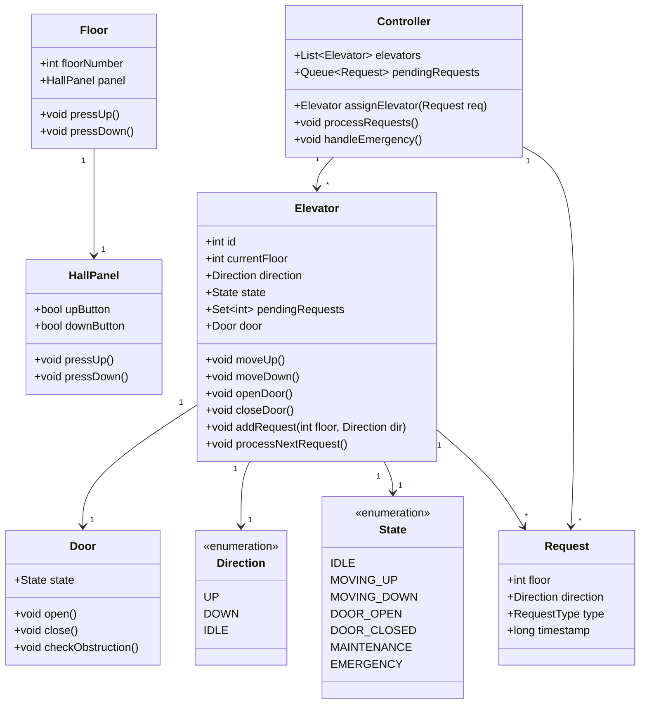
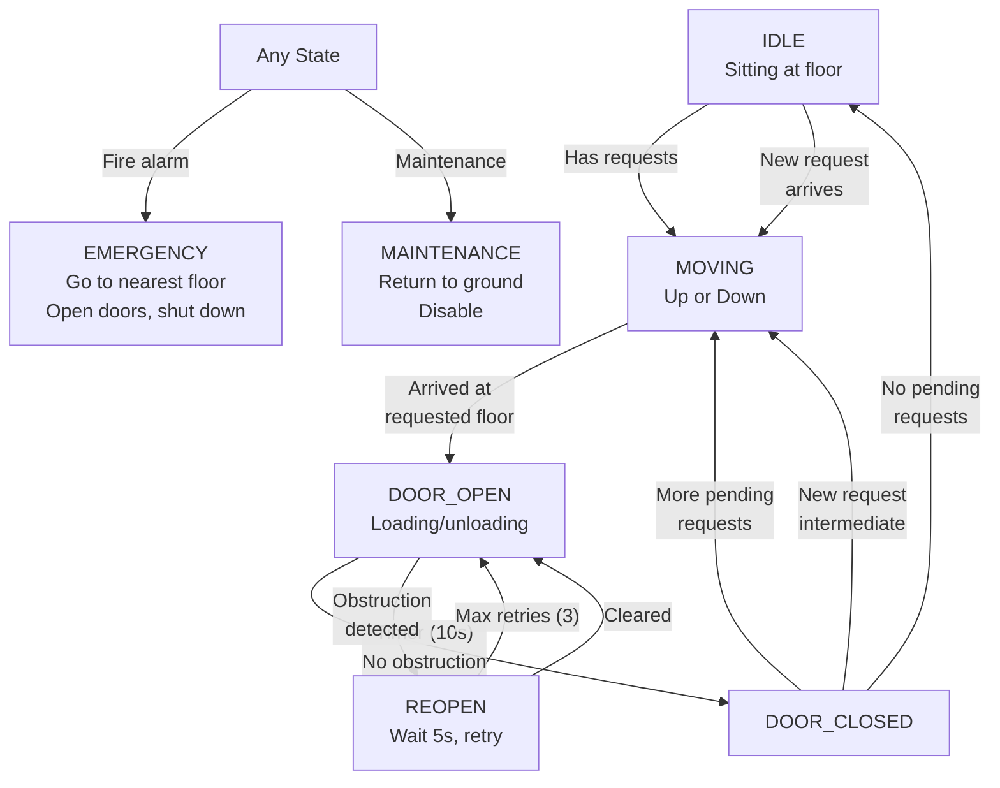

# Design an Elevator System (OOD)

## Requirements

- Object-oriented design for an elevator control system
- Multiple elevators in a building
- Request handling: floor requests (inside) and hall calls (outside)
- State machine: idle, moving_up, moving_down, door_open, door_closed
- Scheduling algorithms for efficient elevator assignment
- 20 floors, 4 elevators

## Key Classes



## State Machine



## Scheduling Algorithms

```
SCAN (Elevator Algorithm):

  Elevator moves in one direction until no more requests in that direction,
  then reverses. Reduces back-and-forth movement.

  Example:
    Elevator at floor 0, moving UP
    Requests: 3↑, 5↑, 7↓, 10↓
    
    Path: 0 → 3 (pick up 3↑) → 5 (pick up 5↑) → 7 (drop off 5↑, pick up 7↓)
          → 10 (pick up 10↓) → reverse → ... going DOWN

LOOK:
  Same as SCAN but only goes as far as the highest/lowest request
  (not to the end of the building).

C-LOOK (Circular LOOK):
  Elevator moves in one direction, serving requests. When no more requests
  in that direction, jumps to the farthest request in the other direction
  and continues.
  
  More consistent wait times than SCAN.

Assignment algorithms:

  Nearest Car:
    Assign request to nearest idle or same-direction elevator.
    Simple but can starve far-away floors.
    
  Direction-based:
    Assign to elevator that is:
      1. Already moving in same direction (toward request)
      2. If none, closest idle elevator
      3. If none, elevator that will finish its route soonest

  Time-estimate:
    Simulate each elevator's route with request added
    Pick elevator with minimum additional wait time
    Most computationally expensive but best user experience
```

## Implementation Example

```java
public class ElevatorController {
    private List<Elevator> elevators;
    private Queue<Request> requestQueue;
    
    public Elevator assignElevator(Request request) {
        Elevator best = null;
        int minScore = Integer.MAX_VALUE;
        
        for (Elevator e : elevators) {
            if (e.state == State.MAINTENANCE || e.state == State.EMERGENCY) {
                continue;
            }
            int score = calculateScore(e, request);
            // Lower score = better assignment
            if (score < minScore) {
                minScore = score;
                best = e;
            }
        }
        
        if (best != null) {
            best.addRequest(request.floor, request.direction);
        }
        return best;
    }
    
    private int calculateScore(Elevator e, Request request) {
        int floorDiff = Math.abs(e.currentFloor - request.floor);
        
        if (e.state == State.IDLE) {
            return floorDiff;  // closest idle elevator wins
        }
        
        if (isOnTheWay(e, request)) {
            return floorDiff / 2;  // bonus for same direction
        }
        
        return floorDiff + 100;  // penalty for opposite direction
    }
    
    private boolean isOnTheWay(Elevator e, Request request) {
        // Check if elevator direction matches request direction
        // AND elevator will pass through request floor
        if (e.direction == Direction.UP && request.direction == Direction.UP) {
            return e.currentFloor <= request.floor;
        }
        if (e.direction == Direction.DOWN && request.direction == Direction.DOWN) {
            return e.currentFloor >= request.floor;
        }
        return false;
    }
}
```

## Interview Questions

1. Design the class hierarchy for an elevator control system.
2. Explain the SCAN, LOOK, and C-LOOK scheduling algorithms.
3. How does the elevator state machine handle door obstruction?
4. How would you prioritize emergency vehicles or VIP floors?
5. Design a multi-elevator system that minimizes average wait time.
