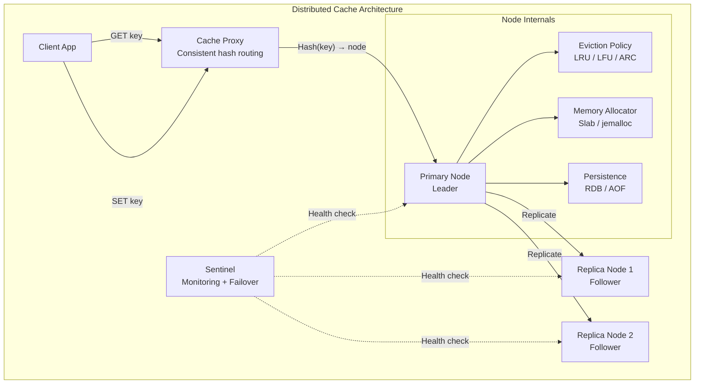
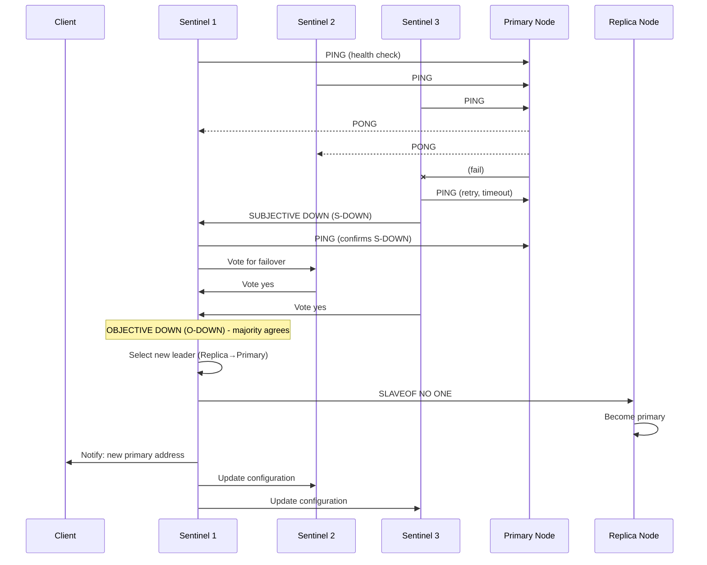

# Design a Distributed Cache

## Requirements

- Distributed caching with consistent hashing
- Leader-follower replication for fault tolerance
- Multiple eviction policies (LRU, LFU, FIFO, ARC)
- Multiple write strategies (write-through, write-back, write-around, write-ahead)
- Slab/jemalloc memory allocation for efficiency
- Sentinel-based failover for high availability
- 100GB cache, 1M ops/sec, <1ms latency

## Capacity Estimation

```
Cache size:      100GB in-memory (distributed across 10 nodes)
Objects:         100M keys, avg 1KB each
Operations:      1M reads/sec, 200K writes/sec
Hit rate target: >95%
Node count:      10 nodes (10GB RAM each)
Replication:     2 replicas per key
Network:         10Gbps inter-node
Latency target:  <1ms (p99), <100us (p50)
```

## Solution Framework



## Consistent Hashing with Virtual Nodes

```
Hash ring design:

Physical nodes: N1, N2, N3 (10 total)
Virtual nodes:  200 per physical node → 2000 vnodes on ring

Key placement:
  hash("user:12345") → position 783492
  Walk clockwise → first vnode (N2_vnode_87)
  → Key stored on N2 (primary) + next 2 nodes (replicas)

Node addition:
  Add N4 with 200 vnodes
  ~10% of keys redistribute (1/N = 1/10)
  Each existing node loses ~1% of keys

Node removal:
  N2 goes down
  Keys from N2 → redistributed to neighbors
  All replicas still serve reads (R+W>N maintains availability)

Virtual node benefits:
  - Even distribution despite heterogeneous hardware
  - Minimal key movement on topology change
  - Load balancing: hot keys distributed across vnodes
```

## N Replicas + Leader-Follower Replication

```
Replication model: Leader-follower (primary-secondary)

Write path:
  1. Client sends SET key=foo, value=bar
  2. Proxy routes to leader (from preference list)
  3. Leader stores key-value in memory
  4. Leader sends replication command to followers
  5. Follower confirms write (async: fire-and-forget, sync: wait for N)
  6. Leader responds to client

Read path:
  1. Client sends GET key=foo
  2. Proxy routes to any replica (leader or follower)
  3. Follower returns value (may be slightly stale)
  4. Staleness bound: typically microseconds

Read-from-follower stale read:
  - Weak consistency: always read from follower (fastest)
  - Strong consistency: read from leader only
  - Eventual consistency: read from follower, accept staleness

Replication factor N:
  N=2: Leader + 1 follower
  N=3: Leader + 2 followers (most common)
  N=5: Leader + 4 followers (geo-distributed)
```

## Eviction Policies

```
LRU (Least Recently Used):
  - Evicts the item accessed farthest in the past
  - Implementation: Doubly linked list + hash map
  - Access: O(1) move to front
  - Evict: O(1) remove from tail
  - Best for: General caching, temporal locality

LFU (Least Frequently Used):
  - Evicts the item with lowest access frequency
  - Implementation: Min-heap or frequency counter array
  - Access: O(log n) update frequency
  - Evict: O(1) pop min frequency
  - Best for: Stable popularity distribution

FIFO (First In, First Out):
  - Evicts the oldest inserted item
  - Implementation: Queue + hash map
  - Access: O(1) check, no reordering
  - Evict: O(1) pop from queue
  - Best for: Simple, predictable behavior

ARC (Adaptive Replacement Cache):
  - Combines LRU + LFU, adapts to workload
  - Two lists: recent and frequent (each with ghost entries)
  - Self-tuning: balances recency vs frequency
  - Best for: Dynamic workloads with shifting access patterns

Eviction overhead:
  LRU:     < 1us per operation
  LFU:     ~ 1-5us per operation  
  ARC:     ~ 2-5us per operation
  FIFO:    < 1us per operation
```

## Write Strategies

```
Write-Through:
  Write to cache + database simultaneously
  ┌──────────┐    ┌──────────┐    ┌──────────┐
  │ Client   │───►│ Cache    │───►│ Database │
  └──────────┘    └──────────┘    └──────────┘
  Pro: Cache always consistent with DB
  Con: Higher write latency (DB write on critical path)

Write-Back:
  Write to cache only, async write to DB
  ┌──────────┐    ┌──────────┐    ┌──────────┐
  │ Client   │───►│ Cache    │───►│ Database │
  └──────────┘    └──────────┘    (async)
  Pro: Very fast writes
  Con: Data loss if cache fails before DB write

Write-Around:
  Write to DB only, cache invalidated
  ┌──────────┐    ┌──────────┐    ┌──────────┐
  │ Client   │───►│ Database │    │ Cache    │
  └──────────┘    └────┬─────┘    (invalidated)
                       │
                  Read + populate cache
  Pro: Cache not polluted with write-only data

Write-Ahead (Write-Through + Async):
  Write to cache first, then async to DB
  ┌──────────┐    ┌──────────┐    ┌──────────┐
  │ Client   │───►│ Cache    │───►│ Database │
  └──────────┘    └──────────┘    (async)
  Pro: Balance of speed + consistency
  Con: Brief inconsistency window
```

## Slab / jemalloc Allocation

```
Slab allocation (memcached-style):

Memory divided into slab classes (1KB, 2KB, 4KB, 8KB, ...)
Each slab holds fixed-size items
Items allocated to smallest slab that fits

┌─────────────┐
│ Slab Class 1│  1KB pages
│ Item size: 96B│  (keys/value up to 96B)
├─────────────┤
│ Slab Class 2│  1KB pages
│ Item size: 120B│  (keys/value up to 120B)
├─────────────┤
│ Slab Class N│  1MB pages
│ Item size: 1MB│  (largest items)
└─────────────┘

jemalloc (Redis-style):
  - Arena-based allocation (per-thread arenas)
  - Minimizes fragmentation
  - Efficient for many small allocations
  - Background cleanup threads

Comparison:
  Slab:      Fixed size, no fragmentation, simple, memory waste for oversized
  jemalloc:  Variable size, less waste, higher CPU, better for small objects
```

## Sentinel Failover



## Read/Write Flow Diagram

```mermaid
graph TB
    subgraph "Read Flow"
        Read[Client GET key] --> Hash[Consistent hash → node]
        Hash --> ReadCache[Cache lookup in RAM]
        ReadCache -->|"Hit"| Return[Return value <1ms]
        ReadCache -->|"Miss"| Backend[Fetch from database]
        Backend -->|"Populate cache"| ReadCache
        Backend --> Return2[Return value ~10ms]
    end
    
    subgraph "Write Flow (Write-Through)"
        Write[Client SET key] --> Hash2[Consistent hash → node]
        Hash2 --> WriteCache[Write to cache node]
        WriteCache --> WriteDB[Write to database]
        WriteDB -->|"Ack"| Return3[Return success]
    end
    
    subgraph "Eviction Decision"
        Monitor[Memory Monitor] -->|"Memory > maxmemory"| Evict["Evict using policy<br/>(LRU/LFU/ARC)"]
        Evict -->|"Remove least valuable"| Free
    end
```



## Scaling Strategy

| Component | Strategy |
|-----------|----------|
| **Consistent hashing** | 200 vnodes/node; O(1) key lookup via hash ring |
| **Replication** | N=3; async replication; R+W>N consistency |
| **Eviction** | Adaptive (ARC) for general workloads; LRU for temporal |
| **Write strategy** | Write-through for critical data; write-back for throughput |
| **Memory allocation** | jemalloc for variable sizes; slab for fixed-size items |
| **Failover** | 3 Sentinel nodes; automatic leader election |
| **Persistence** | RDB snapshots + AOF log for recovery |

## Interview Questions

1. How does consistent hashing with virtual nodes improve cache distribution?
2. Compare LRU, LFU, and ARC eviction policies and when to use each.
3. Design a write-through vs write-back strategy for a distributed cache.
4. How does Redis Sentinel provide automatic failover?
5. How does slab allocation differ from jemalloc for cache memory management?
