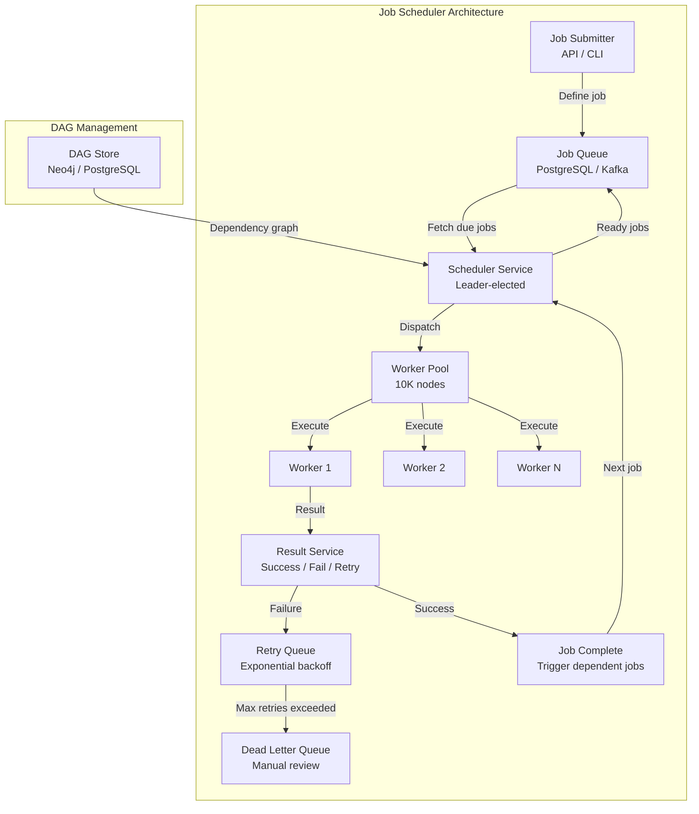

# Design a Distributed Job Scheduler

## Requirements

- Distributed cron-style scheduling at scale
- Job DAGs with dependencies (directed acyclic graph)
- Retry with exponential backoff
- Leader election for fault-tolerant coordination
- Worker pools for parallel execution
- Priority queues (critical > high > normal > low)
- Exactly-once vs at-least-once delivery semantics
- 1M scheduled jobs, 100K jobs/min execution

## Capacity Estimation

```
Scheduled jobs:   1M total, 100K active daily
Execution rate:   100K jobs/min ≈ 1,666 jobs/sec peak
Job duration:     avg 30 seconds, max 1 hour
Worker pool:      10K worker nodes
DAG complexity:   avg 5 nodes, max 100 nodes
Retry rate:       5% of jobs fail → 5K retries/min
Priority levels:  4 (critical, high, normal, low)
```

## Solution Framework



## Cron at Scale

```
Cron expression parsing and scheduling:

Expression: 0 0 */2 * * ? (every 2 hours at midnight)
            0 0 8 1 * ?   (8 AM on 1st of every month)
            */5 * * * *   (every 5 minutes)

Storage: Cron jobs stored in database with next_run_at timestamp

  CREATE TABLE cron_jobs (
      id UUID PRIMARY KEY,
      name VARCHAR(255),
      cron_expression VARCHAR(50),
      job_handler VARCHAR(255),
      params JSONB,
      next_run_at TIMESTAMP,
      last_run_at TIMESTAMP,
      status VARCHAR(20),
      created_at TIMESTAMP DEFAULT NOW()
  );

Scheduling loop (runs every 30 seconds):
  1. Query: SELECT * FROM cron_jobs 
     WHERE next_run_at <= NOW() AND status = 'active'
  2. For each due job:
     a. Create job execution record
     b. Calculate next_run_at from cron expression
     c. Update cron_job.next_run_at
     d. Enqueue job to execution queue

Distributed cron coordination:
  - Only the leader scheduler processes cron ticks
  - Non-leader schedulers are hot standby
  - Lease-based leader election (etcd / ZooKeeper)
```

## Job DAGs

```
DAG (Directed Acyclic Graph) structure:

Example: Data pipeline DAG

               ┌──────────┐
               │ Extract  │
               └────┬─────┘
                    │
         ┌──────────┼──────────┐
         ▼          ▼          ▼
   ┌─────────┐ ┌─────────┐ ┌─────────┐
   │Validate │ │Transform│ │ Enrich  │
   └────┬────┘ └────┬────┘ └────┬────┘
        │           │           │
        └───────────┼───────────┘
                    ▼
             ┌──────────┐
             │  Load    │
             └────┬─────┘
                  │
             ┌────▼─────┐
             │  Notify  │
             └──────────┘

DAG representation:
  job_dag:
    nodes:
      - id: extract
        handler: jobs.extract
        retry: 3
        timeout: 300
      - id: validate
        handler: jobs.validate
        depends_on: [extract]
      - id: transform
        handler: jobs.transform
        depends_on: [extract]
      - id: load
        handler: jobs.load
        depends_on: [validate, transform, enrich]
      - id: notify
        handler: jobs.notify
        depends_on: [load]
    
Execution:
  - When all dependencies of a node complete → node becomes ready
  - Ready nodes enqueued to worker pool
  - Failure cascades: if a node fails → downstream nodes blocked
  - DAG-level timeout: max 2 hours for entire pipeline
```

## Retry with Backoff

```
Exponential backoff strategy:

Attempt 1:  Wait 0s (immediate retry)
Attempt 2:  Wait 10s
Attempt 3:  Wait 30s
Attempt 4:  Wait 60s  
Attempt 5:  Wait 120s
Attempt 6:  Wait 240s (4 minutes)
Attempt 7:  Wait 480s (8 minutes)
Max retries: 7

Formula:
  delay = base_delay × multiplier^attempt
  with jitter: delay = random(base, base × 2^attempt)

  base_delay = 10 seconds (configurable)
  multiplier = 2

Backoff levels by priority:
  Critical: base=5s, max=300s, max_retries=10
  High:     base=10s, max=600s, max_retries=7
  Normal:   base=30s, max=1800s, max_retries=5
  Low:      base=60s, max=3600s, max_retries=3

Dead letter queue (DLQ):
  After max retries → move job to DLQ
  DLQ requires manual intervention or alert
  DLQ retention: 30 days
```

## Leader Election

```
Leader election for scheduler coordination:

Algorithm: Lease-based (etcd / ZooKeeper)

  1. All scheduler instances attempt to create a lease:
     lease_key: "/scheduler/leader"
     lease_ttl: 30 seconds
  
  2. First instance to create lease → Leader
  3. Leader renews lease every 10 seconds
  4. Other instances are Hot Standby (watch the lease)
  5. If leader crashes:
     a. Other instances detect lease expiry (via watch)
     b. All attempt to create lease
     c. First to succeed → New leader
     d. Leader transition: warm up caches, start cron loop
  6. Graceful leader shutdown: release lease

Leader responsibilities:
  - Scheduling cron jobs (cron loop)
  - Distributing jobs to workers
  - Managing retry queues
  - Heartbeat monitoring for workers

Standby responsibilities:
  - Health monitoring
  - Ready to take over
  - May process high-priority jobs if needed
```

## Worker Pools

```
Worker architecture:

┌──────────┐    Fetch job    ┌──────────┐    Execute    ┌──────────┐
│ Queue    │───────────────►│ Worker   │─────────────►│ Job      │
│ (Redis)  │                │ Pool     │              │ Handler  │
└──────────┘                └──────────┘              └──────────┘
                                │
                                │ Report status
                                ▼
                          ┌──────────┐
                          │ Result   │
                          │ Service  │
                          └──────────┘

Worker pool configuration:
  - Per scheduler: 100-500 worker threads
  - Per job type: dedicated worker pool
  - Auto-scaling: queue depth → add/remove workers

Worker lifecycle:
  1. IDLE: waiting for job assignment
  2. FETCH: pull job from queue
  3. EXECUTING: running job handler
  4. REPORTING: sending result

Job handler isolation:
  - Each job runs in separate process/container
  - Resource limits (CPU, memory, timeout)
  - Fire-and-forget: worker doesn't wait for async jobs
  - Watchdog: kill job if exceeds timeout

Priority queue implementation:
  - Redis sorted set: score = priority_value + timestamp
  - Priority levels: critical(0), high(1), normal(2), low(3)
  - Workers always fetch highest priority first
```

## Exactly-Once vs At-Least-Once

```
Delivery semantics:

At-Least-Once (recommended):
  - Job may execute more than once (rare, during failures)
  - Job handler must be idempotent
  - Retry on failure guaranteed
  - Implementation:
    * Worker fetches job, sets status = 'processing'
    * If worker crashes → job status = 'pending' after TTL
    * Re-queued for retry

Exactly-Once:
  - Guarantee: Job executes exactly one time
  - Requires distributed transactions:
    * Two-phase commit (2PC) between queue + executor
    * Consensus-based (Paxos / Raft for job ownership)
  - Much higher complexity and latency
  - Only needed for financial/audit-critical jobs

Idempotency key pattern:
  - Each job execution has unique execution_id
  - Handler checks: "Has execution_id been processed?"
  - If yes → skip (return success)
  - If no → run job, mark execution_id as done

Practical approach:
  - Use at-least-once for most jobs
  - Design all job handlers to be idempotent
  - Use exactly-once only for payment/disbursement jobs
```

## Scaling Strategy

| Component | Strategy |
|-----------|----------|
| **Job queue** | Redis (fast) + PostgreSQL (durable); Kafka for high throughput |
| **Scheduler** | Leader-elected; single active scheduler per cluster |
| **Worker pool** | Auto-scale workers based on queue depth |
| **DAG store** | PostgreSQL for persistence; Neo4j for complex dependency graphs |
| **Retry queue** | Redis sorted set with score = next_retry_at |
| **DLQ** | PostgreSQL table with alerting + manual review UI |
| **Priority** | Separate queue per priority level; weighted worker allocation |

## Interview Questions

1. How does distributed cron scheduling work at scale?
2. Design a job DAG execution engine that handles dependencies.
3. How would you implement exponential backoff with jitter for retries?
4. How does leader election work for fault-tolerant schedulers?
5. Design a worker pool with priority-based job execution.
