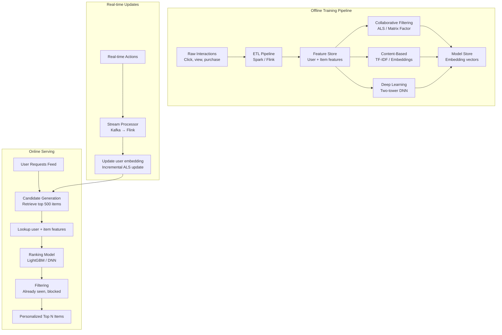
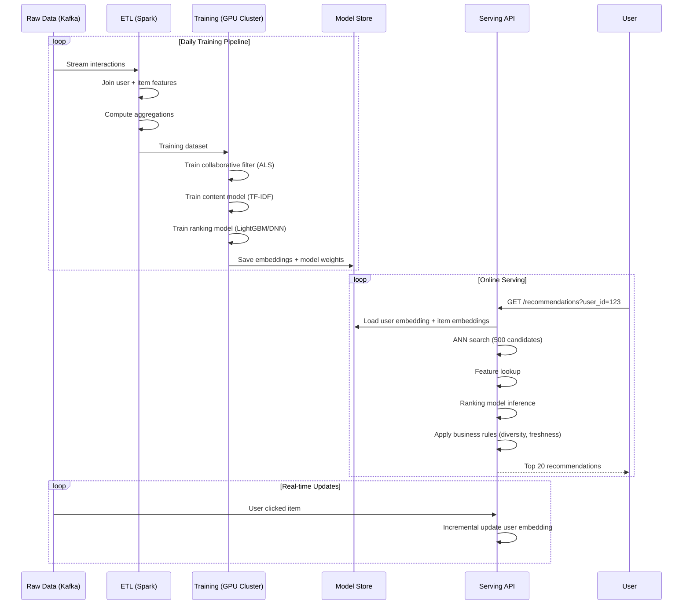
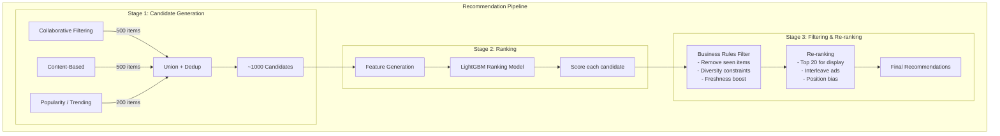

# Design a Recommendation System

## Requirements

- Collaborative filtering (user-based and item-based)
- Content-based filtering (TF-IDF, embeddings)
- Hybrid approach combining multiple methods
- Offline training pipeline + online serving
- Real-time personalization based on user actions
- 100M users, 10M items, 1B interactions/day

## Capacity Estimation

```
Users:           100M total, 50M active monthly
Items:           10M (movies, products, articles)
Interactions:    1B/day (clicks, likes, purchases, views)
Training data:   365B interactions → ~10TB (compressed)
Feature vectors: 100M users × 128-dim → 50GB (in-memory)
Model inference: 10M personalized requests/sec
Daily training:  500GB of new interaction data
```

## Solution Framework



## Collaborative Filtering

```
User-based collaborative filtering:

  "Users who are similar to you liked these items"

  1. Build user-user similarity matrix
     similarity(u, v) = cosine_similarity(interaction_vectors)
     or:               = Pearson correlation

  2. For a target user u:
     a. Find top-K most similar users
     b. Aggregate items liked by similar users
     c. Score = weighted by similarity × interaction strength
     d. Recommend highest-scored unseen items

  Cold start: No interactions for new user → fallback to popularity

Item-based collaborative filtering:

  "Users who liked this item also liked..."

  1. Build item-item similarity matrix
     similarity(i, j) = cosine_similarity(user_vectors)
     or:               = Jaccard similarity (|users_i ∩ users_j| / |users_i ∪ users_j|)

  2. For target user's recent interactions:
     a. For each interacted item, find similar items
     b. Aggregate scores
     c. Recommend highest-scored unseen items

  Advantage: More stable (items change less than users)

Matrix Factorization (SVD / ALS):

  Decompose interaction matrix R (users × items):
    R ≈ U × Σ × V^T
  
  Or: R ≈ user_factors × item_factors^T
  
  Users:     U Matrix (100M × 128-dim)
  Items:     V Matrix (10M × 128-dim)
  Prediction: score(u, i) = sum(U[u][k] × V[i][k]) for k=1..128

  ALS (Alternating Least Squares):
  - Fix user factors, optimize item factors
  - Fix item factors, optimize user factors
  - Iterate until convergence
  - Handles implicit feedback (confidence-weighted)
```

## Content-Based Filtering

```
TF-IDF for text features:

  TF-IDF score(t, d) = TF(t, d) × IDF(t)
  
  TF(t, d):  Frequency of term t in document d
  IDF(t):    log(N / DF(t)) where N = total documents, DF = docs containing t
  
  For each item: TF-IDF vector (vocabulary of 100K terms)
  For each user: aggregate TF-IDF of items they interacted with

Embedding-based:

  Item embeddings via Word2Vec / Doc2Vec:
    - Treat item interactions as "sentences"
    - Train embedding model (skip-gram / CBOW)
    - Similar items have nearby embeddings

  User embeddings:
    - Average of item embeddings user interacted with
    - Weighted by recency and interaction type

  Two-tower DNN:
    User Tower: [user features → DNN → 128-dim embedding]
    Item Tower: [item features → DNN → 128-dim embedding]
    Training: maximize dot product of positive pairs
    Serving: ANN search on item embeddings
```

## Hybrid Methods

```
Weighted Hybrid:

  final_score = w_cf × cf_score + w_cb × cb_score + w_pop × popularity_score

  Weights tuned via A/B testing or Bayesian optimization
  Simple, interpretable, effective

Switching Hybrid:

  if user has > 10 interactions:
    use collaborative filtering
  elif item has > 50 interactions:
    use content-based
  else:
    use popularity / trending

  Good for cold-start handling

Cascade Hybrid:

  1. Candidate generation: 
     - Collaborative filtering (recall high)
  2. Ranking:
     - Content-based features
     - Deep learning model
     - Business rules (diversity, freshness)

  Used by Netflix, YouTube, Spotify

Feature Combination Hybrid:

  Input features to ML model:
    - CF score (user-based similarity score)
    - CB score (content similarity score)
    - User features (age, location, device)
    - Item features (category, price, popularity)
    - Context features (time, day, session)

  Model: Gradient Boosted Trees (LightGBM) or DNN
```

## Offline Training + Online Serving Pipeline



## Recommendation Pipeline Diagram



## Scaling Strategy

| Component | Strategy |
|-----------|----------|
| **ALS training** | Spark on large cluster; partitioned by user hash |
| **ANN search** | FAISS / Annoy for nearest neighbor search on embeddings |
| **Feature store** | Redis (hot) + Cassandra (cold) for user/item features |
| **Model serving** | TensorFlow Serving / ONNX Runtime; GPU for DNN inference |
| **Real-time updates** | Kafka → Flink → incremental ALS update → Redis |
| **Cold start** | Content-based + popularity fallback for new users/items |
| **A/B testing** | Experiment framework: random bucket assignment → compare metrics |

## Interview Questions

1. How does collaborative filtering differ from content-based filtering?
2. How does matrix factorization (ALS) work for implicit feedback?
3. Design a hybrid recommendation system that handles cold start.
4. How would you build a real-time recommendation pipeline?
5. How do you evaluate recommendation quality (offline + online metrics)?
