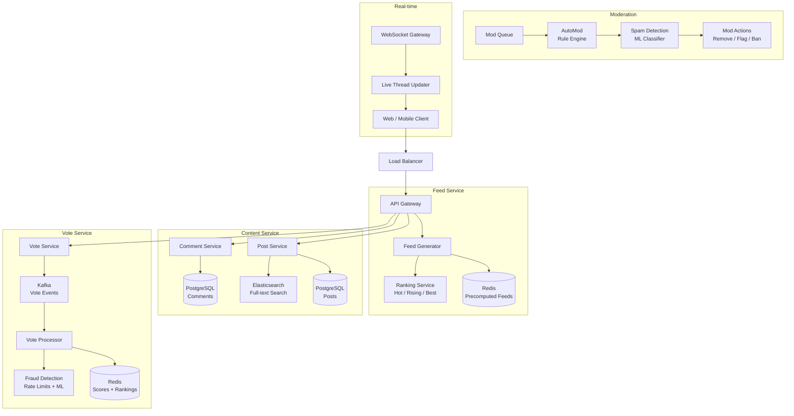

# Design Reddit / Hacker News

## Requirements

- Feed system: personalized home feed with hot/new/rising/top rankings
- Voting system: upvote/downvote, score calculation, vote fraud detection
- Comment threading: nested comments with pagination, depth limiting
- Subreddit / sub-community management
- Moderation system: auto-mod, spam detection, report queue
- Real-time updates for live threads
- 500M MAU, 50M daily posts, 2B daily votes, 100M daily comments

## Architecture Diagram



## Core Components

| Component | Description |
|-----------|-------------|
| **Feed Generator** | Precomputes personalized feeds per user; merges subscribed subreddits, applies ranking, caches in Redis |
| **Ranking Service** | Computes hot/rising/top scores using logarithmic voting formulas and time decay |
| **Post Service** | CRUD for posts; stores title, body, flair, subreddit metadata; indexes into Elasticsearch |
| **Comment Service** | Manages threaded comments using materialized path or nested set models |
| **Vote Service** | Accepts upvotes/downvotes asynchronously via Kafka; aggregates scores in Redis |
| **Fraud Detection** | Detects vote manipulation (brigading, botnets) using rate limiters + ML anomaly detection |
| **AutoMod** | Rule-based moderation engine that scans posts/comments for banned patterns before publishing |
| **Spam Detection** | ML classifier trained on reported content; scores posts for spam probability |
| **WebSocket Gateway** | Pushes real-time vote/comment updates to active viewers of a thread |
| **Subreddit Service** | Creates/manages communities; handles membership, roles, rules, and banned users |

## Data Flow

```mermaid
sequenceDiagram
    participant U as User
    participant API as API Gateway
    participant P as Post Service
    participant V as Vote Service
    participant K as Kafka
    participant VP as Vote Processor
    participant R as Redis
    participant F as Feed Generator

    U->>API: POST /post (create post)
    API->>P: Store post
    P->>F: Invalidate feed cache
    F->>F: Recompute affected feeds
    API-->>U: Post created

    U->>API: POST /vote (upvote)
    API->>V: Record vote event
    V->>K: Produce vote message
    K->>VP: Consume vote batch
    VP->>VP: Aggregate + fraud check
    VP->>R: Update score (ZINCRBY)
    VP->>F: Trigger feed re-rank

    U->>API: GET /r/sub/hot
    API->>F: Fetch feed
    F->>R: Get ranked posts
    R-->>F: Post IDs + scores
    F->>P: Hydrate post details
    P-->>F: Full post objects
    F-->>API: Feed response
    API-->>U: Rendered feed
```



## Database Schema

### Posts Table (PostgreSQL)
```sql
CREATE TABLE posts (
    id            BIGSERIAL PRIMARY KEY,
    user_id       BIGINT NOT NULL REFERENCES users(id),
    subreddit_id  BIGINT NOT NULL REFERENCES subreddits(id),
    title         TEXT NOT NULL,
    body          TEXT,
    post_type     VARCHAR(20) DEFAULT 'text',  -- text, link, image, video
    url           TEXT,
    flair         VARCHAR(50),
    status        VARCHAR(20) DEFAULT 'published',  -- published, removed, deleted, pending
    created_at    TIMESTAMP DEFAULT NOW(),
    updated_at    TIMESTAMP DEFAULT NOW()
);
CREATE INDEX idx_posts_subreddit_created ON posts(subreddit_id, created_at DESC);
CREATE INDEX idx_posts_user_id ON posts(user_id);
```

### Comments Table (PostgreSQL)
```sql
CREATE TABLE comments (
    id            BIGSERIAL PRIMARY KEY,
    post_id       BIGINT NOT NULL REFERENCES posts(id),
    parent_id     BIGINT REFERENCES comments(id),
    user_id       BIGINT NOT NULL REFERENCES users(id),
    body          TEXT NOT NULL,
    depth         INT DEFAULT 0,
    path          LTREE NOT NULL,  -- materialized path (e.g. 1.2.3.4)
    status        VARCHAR(20) DEFAULT 'published',
    created_at    TIMESTAMP DEFAULT NOW()
);
CREATE INDEX idx_comments_post_path ON comments(post_id, path);
CREATE INDEX idx_comments_user_id ON comments(user_id);
```

### Votes Table (Cassandra - high write throughput)
```sql
CREATE TABLE votes (
    user_id       BIGINT,
    post_id       BIGINT,
    vote_type     TINYINT,        -- 1 = upvote, -1 = downvote
    created_at    TIMESTAMP,
    PRIMARY KEY ((post_id), user_id)
);
CREATE TABLE comment_votes (
    user_id       BIGINT,
    comment_id    BIGINT,
    vote_type     TINYINT,
    created_at    TIMESTAMP,
    PRIMARY KEY ((comment_id), user_id)
);
```

### Subreddits Table (PostgreSQL)
```sql
CREATE TABLE subreddits (
    id            BIGSERIAL PRIMARY KEY,
    name          VARCHAR(50) UNIQUE NOT NULL,
    description   TEXT,
    creator_id    BIGINT NOT NULL REFERENCES users(id),
    rules         JSONB,
    is_private    BOOLEAN DEFAULT FALSE,
    created_at    TIMESTAMP DEFAULT NOW()
);

CREATE TABLE subreddit_members (
    subreddit_id  BIGINT REFERENCES subreddits(id),
    user_id       BIGINT REFERENCES users(id),
    role          VARCHAR(20) DEFAULT 'member',  -- member, mod, admin
    joined_at     TIMESTAMP DEFAULT NOW(),
    PRIMARY KEY (subreddit_id, user_id)
);
```

## API Design

### Posts
```
POST   /api/v1/subreddits/{subreddit}/posts        Create post
GET    /api/v1/subreddits/{subreddit}/posts        List posts (hot/new/top/rising)
GET    /api/v1/posts/{id}                          Get post details
PUT    /api/v1/posts/{id}                          Update post
DELETE /api/v1/posts/{id}                          Delete post
```

### Comments
```
POST   /api/v1/posts/{postId}/comments             Create comment
GET    /api/v1/posts/{postId}/comments             List comments (threaded, paginated)
DELETE /api/v1/comments/{id}                       Delete comment
```

### Voting
```
POST   /api/v1/posts/{postId}/vote                 Vote on post  {direction: -1/0/1}
POST   /api/v1/comments/{commentId}/vote           Vote on comment
```

### Feed
```
GET    /api/v1/feed                                Home feed (personalized)
GET    /api/v1/r/{subreddit}/hot                   Subreddit hot
GET    /api/v1/r/{subreddit}/new                   Subreddit new
GET    /api/v1/r/{subreddit}/top                   Subreddit top (day/week/month/all)
```

### Moderation
```
GET    /api/v1/r/{subreddit}/about/modqueue        Moderation queue
POST   /api/v1/mod/remove/{id}                     Remove post/comment
POST   /api/v1/mod/ban/{userId}                    Ban user from subreddit
GET    /api/v1/mod/reports                         Reported content
```

### Real-time
```
WS     /ws/v1/live/{postId}                        WebSocket connection for live thread
```

## Deep Dive Questions

1. **How does the hot ranking algorithm work?**
   Reddit hot ranking: `score = log10(upvotes - downvotes) + sign(score) * (seconds / 45000)`. Uses a logarithmic scale to prevent high-vote posts from dominating indefinitely, then adds time decay so newer posts surface.

2. **How do you handle vote fraud (brigading, bots)?**
   Track vote velocity per user IP (rate limiter: max 10 votes/min). Use ML anomaly detection on voting patterns (clusters voting together). Apply dampening: votes from accounts < 24h old count less. Run offline audit jobs to detect coordinated voting.

3. **How are nested comments paginated with depth limiting?**
   Use materialized paths (LTREE). Paginate by fetching top-level comments (depth=0) first, then lazy-load children via "show more comments" links. Default depth limit = 8 levels. Use continuation tokens for deep threads.

4. **How is the home feed personalized?**
   Precompute feed per user: merge top posts from subscribed subreddits, apply ranking, then interleave with recommendations from similar subreddits. Cache in Redis with TTL. Invalidate on new post, new subscription, or periodic refresh.

5. **How does real-time live thread work?**
   WebSocket connection to a gateway that subscribes to a Redis PubSub channel per post. Vote/comment events are published to the channel and pushed to connected clients. For large threads (e.g. AMA), use a separate WebSocket pool with backpressure.

6. **How does the moderation system detect spam?**
   Two-tier: (1) Rule-based AutoMod — regex filters, user age/karma thresholds, domain blacklists. (2) ML spam classifier trained on labeled reports using features like text embeddings, user reputation, posting frequency, URL patterns.

7. **How do you scale the vote system for 2B daily votes?**
   Votes are written to Kafka for async processing. Vote aggregator batches by second and writes to Redis (sorted set per post). Occasional full re-computation from Cassandra (immutable vote log) reconciles Redis if crashes occur.

## Tradeoffs

| Decision | Tradeoff |
|----------|----------|
| **Async voting via Kafka** | Near-real-time scores (seconds delay) vs blocking writes + synchronous DB writes |
| **Materialized paths for comments** | Simple pagination + depth limiting vs slow deep moves; use LTREE for indexing |
| **Precomputed feeds** | Fast reads at cost of staleness; feeds may not reflect newest posts for minutes |
| **Cassandra for votes** | High write throughput + availability vs lack of joins + eventual consistency |
| **WebSocket for live threads** | Real-time engagement vs high server cost for long-lived connections |
| **AutoMod rules** | Immediate, transparent moderation vs false positives; ML handles ambiguity |

## Follow-up Questions

- How would you design subreddit recommendations for new users?
- How would you implement a "controversial" sort that surfaces posts with near-equal upvotes/downvotes?
- How would you build a cross-subreddit ban system?
- How would you handle deleted posts and comments (soft vs hard delete) in the feed cache?
- How would you design an awards/gold system that transfers real revenue?
- How would you implement "saved" and "hidden" post collections?
